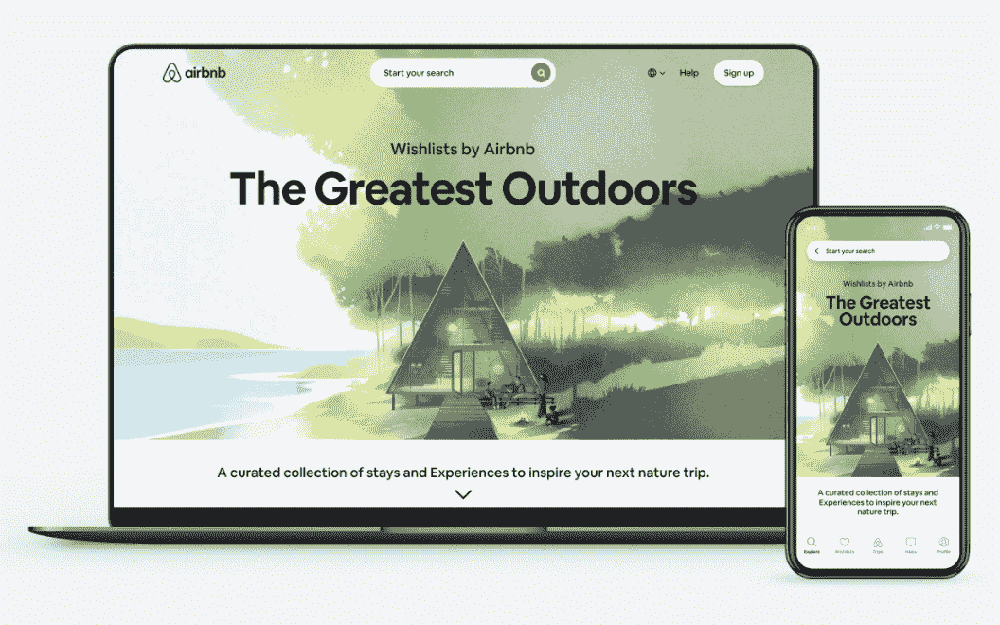
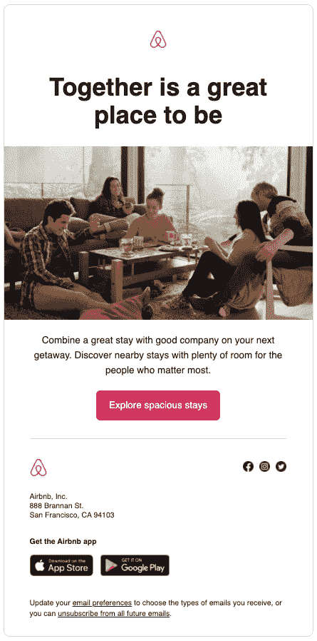
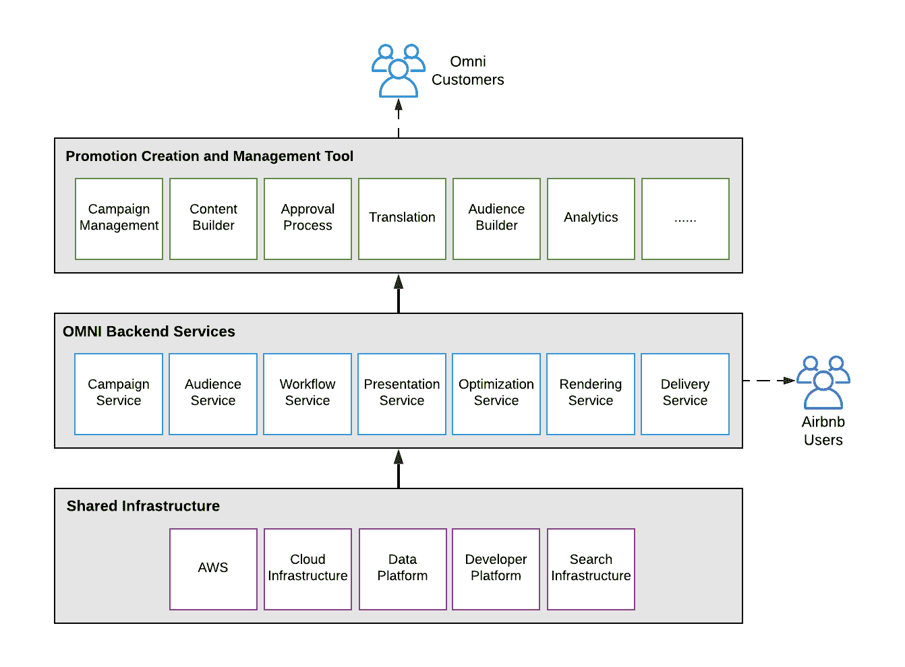
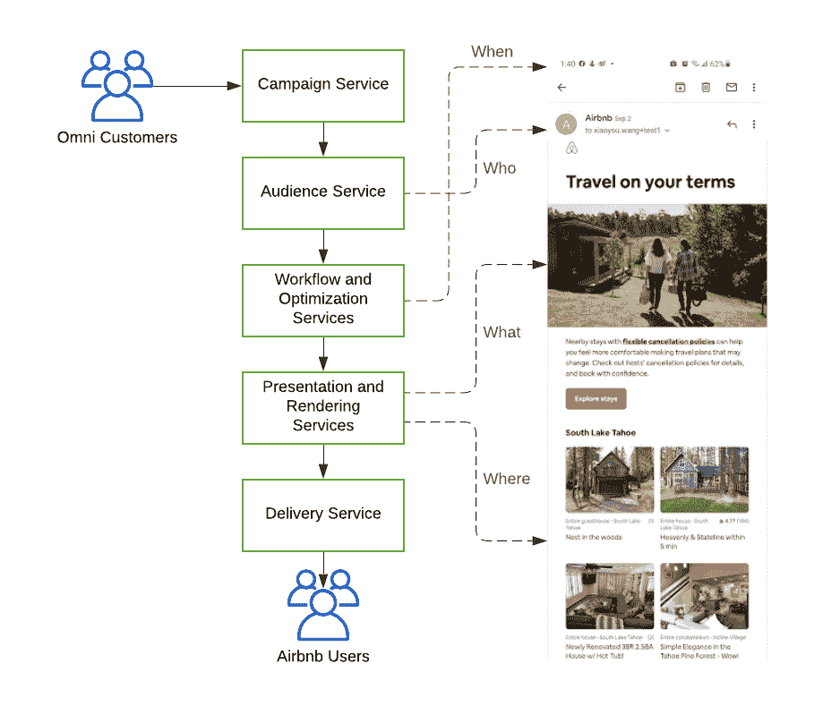
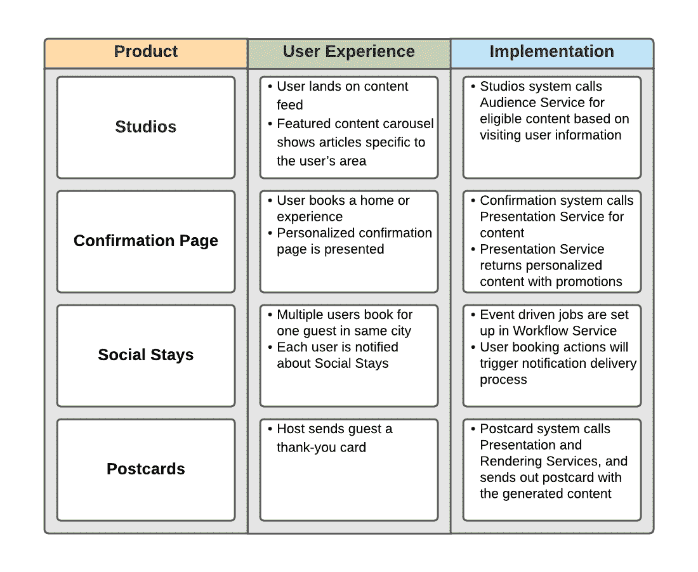
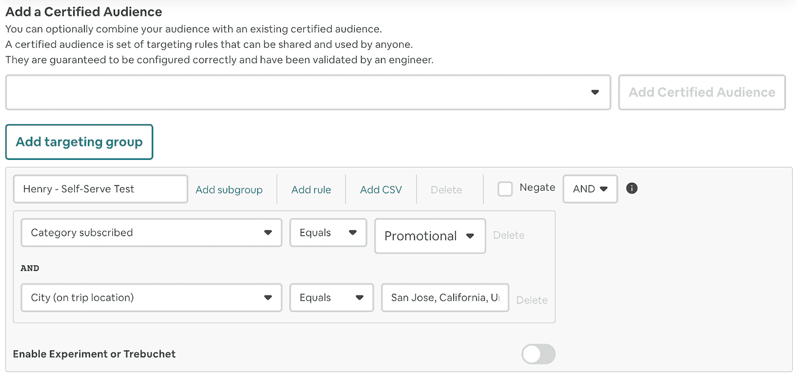
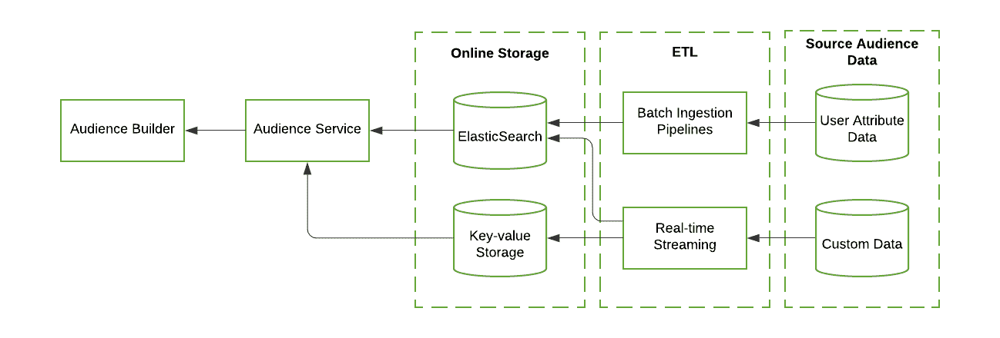
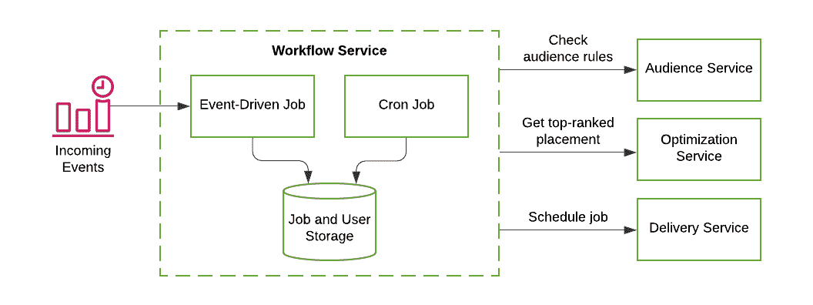
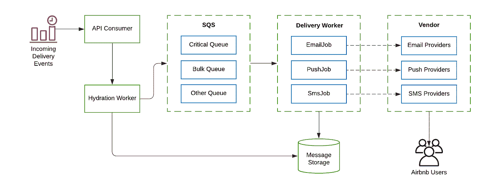

# Airbnb 的促销和沟通平台

> 原文：<https://medium.com/airbnb-engineering/airbnbs-promotions-and-communications-platform-6266f1ffe2bd?source=collection_archive---------2----------------------->

OMNI 是一个直观的、自主开发的平台，支持信息创建、处理和分发，以便在正确的时间和正确的渠道吸引我们的客人和主人。

由 [Paritosh Aggarwal](/@paritosh.aggarwal) 和 [Henry Wu](/@henry_wu)

# 介绍

Airbnb 是一个繁忙的市场，全球有数百万活跃用户。Airbnb 和我们的用户之间，以及我们的主人和客人社区之间，每年都会交换数十亿条信息。为了便于扩展这些信息，我们投资构建了一个可靠、可扩展且经济高效的通信平台。

促销和通信平台(内部称为“OMNI”)是 Airbnb 营销技术的核心支柱。营销技术旨在提供最先进的平台和测量工具，使营销和产品团队能够有效地与我们的客户互动。该平台是 Airbnb 所有宣传、营销和交易沟通的基石。我们每年为越来越多的客人和主人提供近 500 亿英镑的 T4 通信服务，同时通过促销活动带来数百万的订单。

除了提供使这些沟通成为可能的系统和 API 之外，我们还提供了创建和管理促销活动的自助工具。该工具使产品和营销团队能够向 Airbnb 社区提供内容并衡量其效果。我们的系统为多个产品和业务团队以及用例提供服务。

在过去的几年里，我们开发并测试了这一技术平台，以有效满足我们的推广和沟通需求。在这篇博文中，我们将介绍业务问题，讨论我们的整体平台架构，并分享开发过程中的一些重要经验。

# 概观

OMNI 是我们用来创建、管理和通过多种渠道向社区传播内容和信息的平台。OMNI 这个名字指的是平台提供全频道内容的能力。图 1 中列出了 OMNI 提供的一些内容和消息的例子。

*Figure 1a. Onsite channel: Homepage outdoors wishlists powered via OMNI*

*Figure 1b. Offsite channel: Email configured and delivered via OMNI*

# 高层架构

OMNI 提供两种类型的内容:

1.  **交易内容**:交易内容通常是基于客户对公司网站或应用程序的操作而触发的自动化实时消息。交易消息的示例包括订单确认通知、订单状态电子邮件、密码重置电子邮件和电子邮件收据。
2.  **促销内容**:促销内容包括发送消息(如电子邮件或推送通知)，目的只是为了传达特价或产品目录项目。它还可以包括法律或监管政策要求的消息，如服务条款更新。活动或促销通常需要一组声明性配置，这些配置指定了内容和交付时间段。

了解了这些之后，让我们更深入地了解一下我们平台的各个组件。图 2 是平台特性和依赖关系的模块图。OMNI 建立在 Airbnb 的共享基础设施之上，Airbnb 利用 AWS 作为主要的云提供商。它由两个主要的子系统组成:推广创建和管理工具，称为 OMNI UI，以及一组后端服务。

*Figure 2\. Overview of OMNI*

OMNI UI 是一个 web 应用程序，旨在为内容创建和分发提供完整的生命周期支持。它由处理活动管理、内容构建、批准流程、翻译和分析的多个组件组成。营销活动数据通过营销活动服务在后端数据库中创建、更新和删除，营销活动服务还负责管理版本、提供预制模板和实施访问控制。通过活动服务创建的内容也可以为翻译服务排队。活动启动后，该工具允许通过一套分析仪表板来可视化和了解活动绩效。这使得非技术团队很容易在同一个工具中获得可操作的见解。

为了更好地理解这些服务，让我们来看看有人会如何创建一个新的推广或沟通。为了创建内容，活动创建者需要定义“什么”、“谁”、“何时”和“何处”。这由发送给 Airbnb 客人的示例电子邮件来说明，如图 3 所示。

Figure 3\. OMNI services used when sending an email

上图中的每个功能都由以下后端服务之一提供支持:

*   **受众服务**:该服务定义了“谁”，支持诸如获取特定频道的所有合格用户或基于特定规则获取用户等功能。
*   **工作流** **服务**:该服务通过监听交付请求事件、评估交付条件并最终将适当的事件传递给交付服务来编排“时间”。
*   **优化** **服务**:该服务通过内容排名、基于用户倾向的个性化以及发送时间优化来执行消息个性化。
*   **表示** **服务**:该服务通过启用请求验证、翻译和内容生成来处理“什么”和“哪里”。
*   **呈现服务**:该服务为特定于不同渠道的内容(如电子邮件或推送通知)提供呈现。
*   **交付** **服务**:该服务通过各种供应商服务(如 SendGrid、Twilio、FCM 等)将最终确定的消息交付给 Airbnb 用户。)

我们的一个关键设计原则是构建全渠道内容交付。表 1 说明了我们如何服务于 Airbnb 产品生态系统中的一些常见用例。在接下来的部分中，我们将深入研究一些服务。

Table. 1\. Example usages of OMNI in Airbnb products

## **观众服务**

如图 4 所示，观众构建器是一个丰富的用户界面，位于 OMNI UI 中，由观众服务提供支持。我们的内部客户可以通过过滤用户属性来创建和锁定不同的用户受众。目前，我们支持 100 多个这样的用户属性(静态和机器学习衍生的)，使我们的营销团队能够创建受众细分。还可以为定制的受众上传一组预定义的用户(来自 Airbnb 的数据仓库或 CSV 文件)。对于某些政策或促销信息，用户受众的规模通常可达数千万。

Figure 4\. Audience Builder user interface

观众服务是支持观众构建器的后端服务，具有如图 5 所示的高级架构。

Figure 5\. Overview of Audience Service

ElasticSearch 用于提供旨在获得目标用户的查询—例如，一个常见的用例是查找所有有资格参加附近促销的用户。受众服务还包含附加对象信息的内置键值存储，例如基于用户 ID 的用户信息。所有用户属性通过来自离线存储系统(例如，配置单元表)的批处理管道或来自其他在线系统的实时流作业被摄取到在线存储中。在受众生成器中定义的受众规则被转换为针对 ElasticSearch 和键值存储的查询，以获取关于目标用户受众的信息。

## **工作流服务**

编排“何时”的工作流服务是一个基于队列的交付作业处理系统(参见图 6)。

Figure 6\. Overview of Workflow Service

cron 作业在工作流服务中每小时运行一次，并处理基于计划的活动。这项工作包括以下步骤:

1.  从活动存储中获取所有活动的活动
2.  从受众服务部获取每个活动的覆盖范围估计值
3.  根据范围估计大小，在活动之间划分交付配额
4.  从受众服务获取活动市场活动的用户 id
5.  遍历每个用户以检查用户状态并决定排名靠前的活动
6.  向传递服务发送事件，以便在预定时间发送消息

事件驱动的作业尝试匹配传入的实时事件(例如，新预订)以识别相应的用户，然后执行以下过程:

1.  评估和更新用户在存储中的状态
2.  呼叫受众服务以获取用户的所有合格活动
3.  对于合格的活动，确定排名靠前的活动
4.  用最新信息更新作业和用户状态存储
5.  向传递服务发布一个事件，以便向用户发送预定消息

## **送货服务**

交付服务通过离线渠道(例如，电子邮件、短信、推送通知)向 Airbnb 的用户可靠且高效地发送消息。它是 Airbnb 关键用例的关键路径，如消息传递、登录、注册和客户支持。如图 7 所示，交付服务将交付事件作为输入，处理这些事件，并最终通过适当的供应商将最终消息发送给 Airbnb 用户。事件处理利用亚马逊的简单队列服务(SQS)将作业排队到各种渠道的交付工人。通过传递服务，典型的端到端传递延迟小于 30 秒，并且所有传递的消息都被记录到数据存储中用于分析和调试目的。

Figure 7\. Overview of Delivery Service

交付服务旨在为内部用户提供一个简单的界面。它能够高效、稳健地处理与交付相关的问题，例如垃圾邮件信誉、法律合规性、用户体验、可送达性、可达性、优化和指标。虽然交付服务在支持 OMNI 方面相当有效，但仍有许多需要改进的地方。我们目前关注的领域包括:

**正常运行时间和交付能力**:我们团队的重要指标包括正常运行时间和交付成功率。目前，我们正在努力实现所有渠道 99.99%的正常运行时间和 90%的交付成功率的目标。

**成本**:每年都有数百万花费在维护系统和支付供应商 API 上，尤其是短信频道。我们正在研究一些优化机会和渠道转变的想法，以努力降低这方面的支出。

**可达性**:WhatsApp、微信等热门渠道的地域支持有限。该系统需要针对此类渠道进一步扩展，以便 Airbnb 在未来能够更好地服务于其客户。

# 学习

从头开始建立推广和交流平台的过程中，有很多东西需要学习。我们分享了一些重要的经验，以便您在促销和营销活动中加以利用。

**包含内容治理机制**:我们在构建系统时遇到的最大挑战之一是确保高质量的内容和适当的审查流程。工具使创建和向用户交付大量内容变得更加容易，但也增加了质量控制的挑战。事后看来，审批流程、调试工具和系统化的防护栏从一开始就应该是促销和沟通平台的必备部分。

**针对不可预测的流量模式进行设计**:促销内容的交付本质上往往会出现峰值，这转化为我们基础服务上不可预测的流量模式。通过在我们的设计中整合资源的弹性伸缩、速率限制和反压力机制，我们确保了推广流量与我们网站上的常规用户流量相隔离。

**扩展 ElasticSearch 需要意图:**随着平台的发展，我们了解到运营 ElasticSearch 需要专业知识。我们的存储在不断增长的属性集的负载下不堪重负。其中一些只被添加和使用一次，但是被连续处理。为了管理这种增长，我们审计了存储在 ElasticSearch 中的数据，并添加了一个 allowlist 流程来限制索引字段。我们还优化了我们的存储模式，使其变得稀疏，并主动管理实时和批量更新的字段。

# 结论

我们把 OMNI 建成了 Airbnb 的统一共享交流平台。借助 OMNI 营销活动生命周期管理、灵活的受众选择、实时流量监控和分析以及多渠道的可扩展交付，构建产品和功能有诸多优势。

开发一个沟通平台需要与整个公司的许多跨职能团队密切合作，还需要领导层的大力支持和承诺。基于分布式服务和存储的架构对于实现此类平台所需的可伸缩性和可扩展性至关重要。我们计划撰写更多帖子，深入探讨主要 OMNI 组件的相关技术细节和功能(例如，优化服务、演示服务、渲染服务)，以及在设计和实施过程中遇到的挑战。敬请关注后续帖子。

如果你热衷于构建分布式系统来解决与通信相关的技术挑战，那么[在这里申请](https://careers.airbnb.com/positions/)加入我们的团队。

# 承认

这项工作只有通过我们整个组织的大量辛勤工作和大力支持才有可能完成。特别感谢 Arjun Raman、Bita Gorjiara、、Emre Ozdemir、Ganesh Venkataraman、、Irene Kai、Jasmine Price、Laurie Jin、、Michael Endelman、Michael Kinoti、、Mukund Narasimhan、Nnenna John、Priyank Singhal、Sharvari Apte、Vidhur Vohra、Xin Tu 和 Sun。