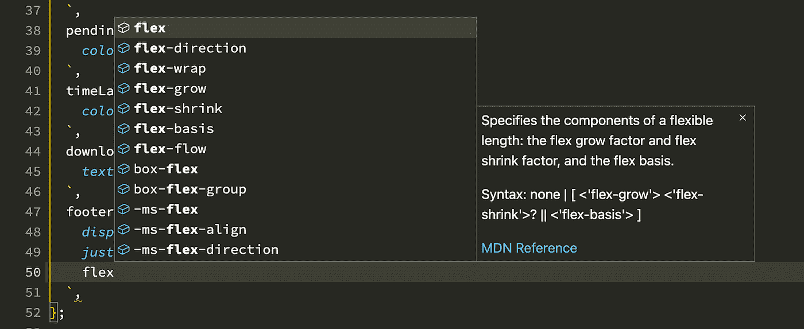

# Airbnb 的利纳里亚之旅

> 原文：<https://medium.com/airbnb-engineering/airbnbs-trip-to-linaria-dc169230bd12?source=collection_archive---------1----------------------->

## 了解 Airbnb 最新的网页设计选择 Linaria 如何改善开发者体验和网页性能

CSS 是每个 web 应用程序的关键组件，许多解决方案都是针对开发人员如何编写样式并交付给访问者而开发的。在本帖中，我们将带您了解 Airbnb 从 Sass 到 CSS-in-JS 的旅程，并向您展示我们为什么会登陆零运行时 CSS-in-JS 库 Linaria，以及它对 Airbnb web 应用程序的开发人员体验和性能的影响。

# 从 Sass 到 CSS-in-JS

2016 年，我们的 web 前端在一个单片 [Ruby on Rails](https://rubyonrails.org/) 应用中，使用了[链轮](https://github.com/rails/sprockets)、 [Browserify](https://browserify.org/) 和 [Sass](https://sass-lang.com/) 的组合。我们有一个受 [Bootstrap](https://getbootstrap.com/) 启发的内部造型工具包，但是我们没有使用任何类似 [CSS 模块](https://github.com/css-modules/css-modules)或 [BEM](http://getbem.com/) 的东西。

产品错误通常是由我们的样式造成的——有时一些页面中缺少正确的样式表，有时不同样式表的样式会意外冲突。

此外，开发人员[很少删除已经添加的样式，因为很难知道是否还需要它们](https://css-tricks.com/how-do-you-remove-unused-css-from-a-site/)。随着我们的产品表面积迅速扩大，这些问题变得更加复杂。

当我们开始在 React 中构建我们的[设计系统](https://www.youtube.com/watch?v=fHQ1WSx41CA)时，我们发现 CSS-in-JS 是一个令人兴奋的新选择。当时，CSS-in-JS 仍处于起步阶段——只有几个库存在，而且还没有发明出[风格的组件](https://styled-components.com/)。我们选择了[阿芙罗狄蒂](https://github.com/khan/aphrodite)，但是不想直接耦合到阿芙罗狄蒂的实现，原因有二:因为 CSS-in-JS 是一个新生的空间，我们希望以后能够灵活地切换实现，我们还希望有一些东西能够为人们可能不需要阿芙罗狄蒂的开源项目工作。所以我们创建了一个抽象层叫做[与样式反应](https://github.com/airbnb/react-with-styles)，这给了我们一个[高阶组件(HOC)](https://reactjs.org/docs/higher-order-components.html) 来定义可主题化的样式。

这允许组件在同一个文件中进行样式化，使得回购组织更加方便。更重要的是，**从一个全局感知的样式系统转移到一个基于组件的样式系统给了我们关于如何应用样式以及需要什么文件来正确地在每个页面上呈现每个组件的保证**。这使我们能够依靠 [Happo，我们选择的截图测试工具](https://happo.io/)，结果视觉回归直线下降(披露:我是 Happo 的共同创建者)。

尽管 react-with-styles 多年来为我们提供了很好的服务，但它带来了性能和开发者体验的权衡。样式和运行时库增加了关键路径 JS 包的大小，并且在渲染时应用样式会带来 CPU 成本(我们组件挂载时间的 10–20%)。虽然我们得到了前面提到的关于样式的保证，但实际上与常规 CSS 语法相比，用 JavaScript 对象编写样式感觉很笨拙。这些权衡让我们重新考虑如何设计 Airbnb 网站的风格。

# 考虑我们的选择

为了解决用样式反应的问题，我们成立了一个由来自不同团队的工程师组成的工作组。我们考虑了许多方向，这些方向符合以下高级类别:

*   在构建时从 react-with-styles 静态提取 CSS
*   编写我们自己的框架
*   调查并采用现有框架

我们决定在构建时不从 react-with-styles 中静态提取,因为这需要大量的工作。此外，它将是土生土长的，因此缺乏社区的好处。最后，它没有解决开发人员的人机工程学问题。

类似地，**编写我们自己的框架**会有很高的初始实现、维护和支持成本。此外，对于这个问题，我们希望利用现有的解决方案，并为之做出贡献。

Comic from [https://xkcd.com/927/](https://xkcd.com/927/) by Randall Munroe and is used under a CC-BY-NC 2.5 license.

在根据我们的需求评估了几个**现有框架**之后，我们缩小了构建概念验证的候选范围:

*   情感:CSS-in-JS，运行时成本低
*   [Linaria](https://github.com/callstack/linaria) :零运行时 CSS-in-JS(静态 CSS 提取)
*   [处理](https://github.com/seek-oss/treat):接近零运行时 CSS-in-JS(静态 CSS 提取)

概念证明工作是在一个新的 repo 中完成的，该 repo 实现了一个服务器渲染的客户端水合的 Airbnb 登录主页的无样式版本。对于每个框架，这使我们能够:

*   理解我们的构建系统需要做什么样的改变
*   试用框架 API，感受一下开发人员的人机工程学
*   评估每个框架如何支持我们的 web 样式需求
*   收集绩效指标
*   作为迁移计划的起点

根据以下标准列表对框架进行相互评估:

1.  **性能**
2.  **社区**(即支持和收养)
3.  **开发者体验**

# 技术性能分析

使用 [SpeedCurve](https://www.speedcurve.com/) 、本地基准测试和[React<Profiler/>](https://reactjs.org/docs/profiler.html)，我们为每个框架运行了性能基准测试。所有结果都是在节流的 MacBook Pro 上运行 200 次的中值，在统计上与 p 值为< = 0.05 的对照组有显著差异。

根据 [Airbnb 的页面性能得分](/airbnb-engineering/creating-airbnbs-page-performance-score-5f664be0936)(类似于 [Lighthouse 的性能得分](https://web.dev/performance-scoring/))，我们重点关注以下指标，以让我们了解每个框架的表现以及对用户体验的影响:

*   [总阻塞时间(TBT)](https://web.dev/tbt/)
*   捆绑大小
*   更新布局树计数和持续时间
*   复合层数和持续时间

很明显框架分为两组:**运行时框架** (react-with-styles，Emotion)和**构建时框架** (Linaria，Treat)。

我们主页的服务器端和客户端版本的基准测试显示，Treat 和 Linaria 在**总阻塞时间**上分别比 Emotion 高出 36%和 22%。所有框架的性能都明显优于 react-with-styles，提高幅度从 32–56%不等。*(请注意，这些数字不应用于估计预期的生产改进，因为这是一个非常具体的基准，旨在测试框架之间的差异，而不是预期的生产节约。)*

**捆绑包大小**的差异也属于这两类——Linaria/Treat 组节省了大约 80 KiB (~12%)。

CSS 度量(**更新布局树**和**复合层**)显示，平均来说，对于用样式/情感作出反应，大约还有一个布局树更新和层复合事件。这可能是由于使用 JavaScript 插入和合并样式表，而对于 Linaria 或 Treat 这样的 CSS 提取库来说，这是不必要的。

这项性能调查表明，无论是 Linaria 还是 Treat 都是很有前途的选择，并且所有考虑的框架都比使用 Aphrodite 的 react-with-styles 有显著的统计改进。

# 我们喜欢里那利亚的什么

上面的**性能**改进很大程度上归功于 Linaria 在构建时将样式从 JS 提取到静态 CSS 文件，因此没有 JS 捆绑包或运行时 CPU 开销——这使它比几乎为零的运行时处理略有优势。此外，这带来了缓存的好处，因为这些静态 CSS 文件可能会以不同于 JS 文件的节奏变化。由于样式是在构建时提取的，Linaria 有机会自动删除未使用的样式——这也为重复删除样式的可能性打开了大门(即[原子 CSS](https://css-tricks.com/lets-define-exactly-atomic-css/) )。此外，Linaria 支持为服务器端渲染注入关键的 CSS，这是我们希望从 react-with-styles 集成中保留的。

[Linaria 似乎也是一个健康的项目](https://snyk.io/advisor/npm-package/linaria)，它见证了大量的活动、**社区**的参与、文档和采用。它良好的发展轨迹给了我们信心，让我们相信它会继续进步，我们也有能力做出贡献。

我们发现 Linaria 的[标记模板文字](https://developer.mozilla.org/en-US/docs/Web/JavaScript/Reference/Template_literals#tagged_templates) API 允许开发人员使用 CSS 语法，是对我们为 react-with-styles 构建的 JS object HOC API 的一个有吸引力的改进。此外，现成的集成可用于 stylelint、CSS 自动完成和语法突出显示，这丰富了**开发人员的体验**。

Off-the-shelf integrations for stylelint, CSS autocompletion, and syntax highlighting working with Linaria in action.

我们还发现了 Linaria 与我们现有解决方案的相似之处。样式在组件文件中的共同定位是一个很大的特性，对我们来说，它有利于 Linaria 而不是 Treat，熟悉的 API 为开发人员平滑了过渡，并让我们相信自动化可以简化迁移工作。

# 迁移策略

为了推出这一巨大的变化，我们采用了增量迁移策略，这在很大程度上是由我们编写的[代码模块](/airbnb-engineering/turbocharged-javascript-refactoring-with-codemods-b0cae8b326b9)自动完成的。我们非常依赖我们的 [Happo 截图测试](https://happo.io/)来确保我们的组件在迁移后看起来是一样的。这允许我们通过运行脚本和任何必要的调整来迁移代码库的部分，类似于我们在采用 TypeScript 时采用的方法。

迁移的第一阶段由 web 样式工作组处理，目标是转换一些具有不同性能特征的精选页面上的组件子集。这个阶段是基于 A/B 测试的，这确保了我们对性能的最初理解符合我们应用程序的具体情况，并向我们保证没有隐藏的问题。

一旦我们对 Linaria 集成的性能和正确性有了信心，我们就允许团队在新代码中开始使用 Linaria。我们还鼓励团队使用我们的 codemods 迁移他们现有的代码。尽管移植进展顺利，但我们计划确保所有代码都脱离了 react-with-styles，这样我们最终就可以完全从包中移除运行时依赖。这种一致性将为我们带来额外的性能提升，并降低[决策疲劳](https://en.wikipedia.org/wiki/Decision_fatigue)的成本。

# 回馈社会

一旦我们开始使用 Linaria，我们发现自动风格重复数据删除(即原子 CSS)不仅可以提升性能，还可以修复我们遇到的一些与性能无关的问题。

Linaria 生成的选择器都具有相同的[特异性](https://developer.mozilla.org/en-US/docs/Web/CSS/Specificity)。因为相同特性的 CSS 选择器依赖于它们的声明顺序，所以捆绑器构建这些文件的顺序变得很重要。当在文件之间共享样式时，这是有问题的，因为当依赖图的形状改变时，我们不能预测或保持样式的顺序。

我们最初通过为 CSS 片段创建一个新的[标记模板文字](https://developer.mozilla.org/en-US/docs/Web/JavaScript/Reference/Template_literals#tagged_templates)来解决这个问题，它允许将样式插入到 Linaria 的 CSS 标记模板文字中。这很好地工作，但是它不直观，挫败了期望样式在 CSS 标记的模板文字中定义的[工具，并且导致样式在 CSS 包中被多次包含(这对于性能来说是次优的)。](https://github.com/prettier/prettier/blob/d13feed42b6478710bebbcd3225ab6f203a914c1/src/language-js/embed.js#L90-L121)

Josh Nelson 是我们 web 样式工作组的成员，[为 Linaria 贡献了原子 CSS 支持](https://github.com/callstack/linaria/pull/867)，Linaria 社区也非常支持。这一变化增加了一个新的 [@linaria/atomic](https://npmjs.com/@linaria/atomic) 包，当导入而不是 [@linaria/core](https://www.npmjs.com/package/@linaria/core) 时将在构建时生成原子 CSS。这意味着如果您像这样编写代码:

而不是像这样生成输出(没有原子 CSS):

生成的输出将如下所示(使用原子 CSS):

出现顺序问题通过构建时分析来解决，构建时分析根据类名传入 cx 函数的顺序来链接类名，以在必要时增加特异性。

# 接待

我们的工程师对 Linaria 反应积极。以下是一些引述:

> “Linaria 打开了一个世界，在那里我们可以像 1999 年一样进行编码，在老式的纯 CSS 上。它反对坏的模式，但是给了我们建立惊人体验的灵活性。我们不再对抗平台，而是利用它，这种感觉非常强大。”——凯丽·里金斯
> 
> “与风格反应相比，我更关心我现在正在创造的东西。Linaria 这么好。”伊恩·德玛特伊-塞尔比
> 
> “我真的很喜欢能够再次编写 CSS。它让您可以更好地控制组件中的样式。”—布里·邦吉
> 
> “再次编写真正的 CSS 真是太棒了。”—维克多·林

由于其熟悉的 CSS 语法、静态样式表中的样式提取和使用类名的样式应用，Linaria **提高了产品开发速度**和**释放了使用 react-with-styles 和 Aphrodite** 不可能实现的新样式功能。

# 性能影响

尽管我们仍处于迁移的开始阶段，但我们已经运行了一些 A/B 测试，这些测试让我们看到了切换到 Linaria 对大量野外访问者的真实性能影响。

在一个实验中，我们将 airbnb.com 主页上呈现的大约 10%的组件从 react-with-styles 转换为 Linaria，并看到主页[页面性能得分](/airbnb-engineering/creating-airbnbs-page-performance-score-5f664be0936)提高了 0.26%。[首次涂色时间(TTFCP)](https://web.dev/fcp/) 提高了 0.54%(平均 790 毫秒)，而[总阻断时间(TBT)](https://web.dev/tbt/) 也有 1.6%(平均 1200 毫秒)的显著提高。客观地说，对大多数人来说，用 React 给主页补水需要大约 200 毫秒，所以这个数量级的改进是非常重要的。我们认为 Linaria 的这些性能改进是由于不再在渲染时生成 CSS 样式，这改善了服务器和客户端的渲染时间。

假设性能改进将线性扩展(这是一个很大的假设)，转换其余 90%的组件*可能会*导致页面性能分数提高 2.6%，首次内容绘制时间(TTFCP)提高 5.4%，总阻塞时间(TBT)提高 16%。

请注意，这里与其他行业数字的直接比较有点棘手，因为我们定义页面的方式不同，尤其是在客户端路由方面。

# 这对于用样式反应意味着什么？

鉴于我们仍然有许多组件仍然依赖于 react-with-styles，并且我们需要一段时间来完成我们的迁移，**我们将把 react-with-styles 置于维护模式下**，直到我们接近迁移的终点。在那一点上，**我们打算终止对样式的反应**和相关的包。

通过从市场上删除一个选项，我们希望帮助社区联合起来，形成一个共同的解决方案，并投资于更好的框架。如果你正在寻找一个新的工具，我们认为 Linaria 是一个很好的选择！

# 结论

造型基础设施仍然是一个令人兴奋的领域，充满了机会。在 Airbnb，我们发现通过采用一个允许常规 CSS 语法与 React 组件代码一起使用的框架，对**开发者体验**进行了重大改进。通过将运行时样式库替换为在构建时编译成静态 CSS 文件的样式库，我们能够继续朝着更快的**性能**前进。感谢 Linaria **社区**和我们的合作，我们期待这个图书馆在未来许多年里继续改进。

有兴趣在 Airbnb 工作吗？查看这些开放的角色:

[前端基础架构工程师、Web 平台](https://grnh.se/ebfa55151us)
[员工软件工程师、数据治理](https://grnh.se/b5afa9151us)
[员工软件工程师、云基础架构](https://grnh.se/92c32fed1us)
[员工数据库工程师](https://grnh.se/bbe55fe81us)
[员工软件工程师— ML Ops 平台](https://grnh.se/21e5c2011us)
[高级/员工软件工程师、服务能力](https://grnh.se/ee114dfc1us)

# 感谢

我们非常感谢 [callstack](https://www.callstack.com/) 和 [Linaria 社区](https://github.com/callstack/linaria#contributors)的人们构建了这样一个伟大的工具，并与我们合作使其变得更好。也感谢可汗学院给了我们阿佛洛狄忒，它为我们服务了很多年。这是 Airbnb 付出的巨大努力，如果没有 Airbnb 这么多人的努力，这是不可能的，包括 Mars Jullian、Josh Nelson、Nora Tarano、、Jimmy Guo、Ian Demattei-Selby、Victor Lin、Nnenna John、Adrianne Soike、Garrett Berg、Andrew Huth、Austin Wood、Chris Sorenson 和 Miles Johnson。最后，感谢 Surashree Kulkarni 帮助编辑这篇博文。谢谢大家！

*所有产品名称、标识和品牌都是其各自所有者的财产。本网站中使用的所有公司、产品和服务名称仅用于识别目的。使用这些名称、标志和品牌并不意味着认可。*