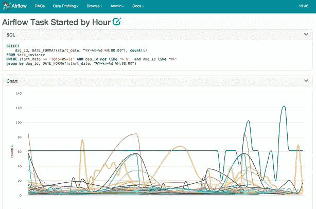

# Airflow:一个工作流管理平台

> 原文：<https://medium.com/airbnb-engineering/airflow-a-workflow-management-platform-46318b977fd8?source=collection_archive---------0----------------------->

马克西姆·博彻明

**Airbnb** 是一家快速增长的数据信息公司。我们的数据团队和数据量正在快速增长，相应地，我们所面临的挑战的复杂性也在增长。我们越来越多的数据工程师、数据科学家和分析师正在使用**气流**，这是一个我们构建的平台，让我们能够快速移动，在创作、监控和改造**数据管道**时保持我们的势头。

今天，我们自豪地宣布我们的工作流管理平台**开源**和**共享 Airflow** 。

[https://github.com/airbnb/airflow](https://github.com/airbnb/airflow)

# 狗开花了

随着处理数据的人开始自动化他们的过程，他们不可避免地要编写批处理作业。这些作业需要按计划运行，通常对其他现有数据集有一组依赖关系，并且有依赖于它们的其他作业。将几个数据工作者放在一起，即使时间很短，很快就会有一个不断增长的复杂的计算批处理作业图。现在，如果你考虑一个快节奏的中等规模的数据团队在一个不断发展的数据基础设施上工作几年，并且你手头有一个大规模复杂的计算工作网络。这种复杂性会成为数据团队管理甚至理解的一个重大负担。

这些作业网络通常是**有向无环图** ( **有向无环图**)，具有以下特性:

*   **已调度:**每个作业应该以某个预定的时间间隔运行
*   任务关键:如果一些任务没有运行，我们就有麻烦了
*   **不断发展:**随着公司和数据团队的成熟，数据处理也在不断发展
*   **异构:**现代分析的堆栈变化很快，大多数公司运行多个需要粘合在一起的系统

# 每个公司都有一个(或多个)

工作流管理已经成为一种普遍的需求，以至于大多数公司都有多种方式在内部创建和安排工作。总是有很好的 cron 调度程序可以开始使用，并且许多供应商的软件包都附带了调度功能。下一步是让脚本调用其他脚本，这在短时间内是可行的。最终出现了简单的框架来解决像存储作业状态和依赖关系这样的问题。

通常情况下，这些解决方案**会被动增长**,以响应日益增长的调度单个作业的需求，通常是因为当前的系统不允许简单的扩展。还要注意，编写数据管道的人通常不是软件工程师，他们的任务和能力主要是处理和分析数据，而不是构建工作流管理系统。

考虑到内部开发的工作流管理系统通常比公司的需求落后至少一代，围绕创作、调度和故障排除工作的**摩擦**造成了巨大的低效和挫折，使数据工作者偏离了他们的生产路径。

# 气流

在审查了开源解决方案，并利用 Airbnb 员工对他们过去使用的系统的洞察力后，我们得出结论，市场上没有任何东西可以满足我们当前和未来的需求。我们决定建立一个现代系统来妥善解决这个问题。随着项目的发展，我们意识到我们有一个极好的机会来回馈我们如此依赖的开源社区。因此，我们决定在 Apache 许可下开源这个项目。

以下是 Airbnb 中由气流推动的一些流程:

*   **数据仓库:**清理、组织、数据质量检查，并将数据发布到我们不断增长的数据仓库中
*   **增长分析:**计算客人和主人参与度以及增长核算的指标
*   **实验:**计算我们的 A/B 测试实验框架逻辑和集合
*   **电子邮件定位:**应用规则，通过电子邮件活动来定位和吸引我们的用户
*   **会话化:**计算点击流和耗时数据集
*   **搜索:**计算搜索排名相关指标
*   **数据基础架构维护:**数据库清理、文件夹清理、应用数据保留策略等

# 体系结构

就像英语是商业语言一样，Python 已经牢固地确立了自己作为数据语言的地位。气流是用 Python 语言从头开始写的。代码库是可扩展的、文档化的、一致的、经过测试的，并且具有广泛的单元测试覆盖面。

管道创作也是在 Python 中完成的，这意味着从配置文件或任何其他元数据来源生成动态管道是自然而然的事情。“**配置为代码**”是我们袖手旁观为此制定的原则。虽然 yaml 或 json 作业配置允许使用任何语言来生成气流管道，但我们觉得在翻译中会失去一些流畅性。能够自省代码(ipython！ide)子类、元程序和使用导入库来帮助编写管道增加了巨大的价值。请注意，仍然可以用任何语言或标记来创作作业，只要您编写解释这些配置的 Python。

虽然您只需几个命令就可以启动并运行 Airflow，但完整的架构包含以下组件:

*   源代码控制中的**作业定义**。
*   一个丰富的 **CLI** (命令行界面)来测试、运行、回填、描述和清除 Dag 的各个部分。
*   一个**网络应用**，探索你的 DAGs 定义，它们的依赖，进度，元数据和日志。web 服务器与 Airflow 打包在一起，构建在 Flask Python web 框架之上。
*   一个**元数据存储库**，通常是一个 MySQL 或 Postgres 数据库，Airflow 使用它来跟踪任务作业状态和其他持久信息。
*   一组**工作者**，以分布式方式运行作业任务实例。
*   **调度器**进程，启动准备运行的任务实例。

# 展开性

虽然 Airflow 完全加载了与常用系统(如 Hive、Presto、MySQL、HDFS、Postgres 和 S3)进行交互的方式，并允许您触发任意脚本，但基本模块的设计非常容易扩展。

**钩子**被定义为外部系统抽象，共享一个同质接口。钩子使用一个集中的保险库，提取主机/端口/登录/密码信息，并公开与这些系统交互的方法。

**操作符**利用钩子生成某种类型的任务，当实例化时，这些任务成为工作流中的节点。所有运算符都从 BaseOperator 派生，并继承了一组丰富的属性和方法。有 3 种主要类型的运算符:

*   执行**动作**或告诉另一个系统执行动作的操作员
*   操作员把数据从一个系统转移到另一个系统
*   **传感器**是某种类型的操作器，它会一直运行，直到满足某个标准

**执行器**实现一个接口，允许 Airflow 组件(CLI、调度程序、web 服务器)远程运行作业。Airflow 目前附带了一个 SequentialExecutor(用于测试目的)、一个线程化的 LocalExecutor 和一个利用了[芹菜](http://www.celeryproject.org/)的 CeleryExecutor，这是一个基于分布式消息传递的优秀异步任务队列。我们还计划在不久的将来共享一个 YarnExecutor。

# 闪亮的用户界面

虽然 Airflow 公开了丰富的[命令行界面](http://pythonhosted.org/airflow/cli.html)，但是监控和与工作流交互的最佳方式是通过 web 用户界面。您可以轻松地可视化您的管道依赖关系，了解它们的进展情况，轻松访问日志，查看相关代码，触发任务，修复误报/漏报，分析时间消耗，以及全面了解不同任务通常在一天中的什么时间完成。UI 也是公开一些管理功能的地方:管理连接、池和暂停特定 Dag 上的进度。

最重要的是，UI 提供了一个[数据分析](http://pythonhosted.org/airflow/profiling.html)部分，允许用户对注册的连接运行 SQL 查询，浏览结果集，并提供创建和共享简单图表的方法。图表应用程序是由 [Highcharts](http://www.highcharts.com/) 、 [Flask Admin](https://flask-admin.readthedocs.org/en/v1.0.9/) 的 CRUD 接口和 Airflow 的[钩子](http://pythonhosted.org/airflow/code.html#module-airflow.hooks)和[宏](http://pythonhosted.org/airflow/code.html#macros)库组成的混搭。URL 参数可以传递给图表中的 SQL，而 Airflow 宏可以通过 [Jinja 模板](http://jinja.pocoo.org/)获得。借助这些功能，Airflow 用户可以轻松创建和共享查询、结果集和图表。

# 催化剂

由于使用了 Airflow，Airbnb 数据处理人员的工作效率和热情得到了成倍提高。创作流程加快了，监控和故障排除的时间也大大减少了。更重要的是，这个平台允许人们在更高的抽象层次上执行，创建可重用的构建模块以及计算框架和服务。

# 说够了！

我们已经使它变得非常容易，以测试驱动气流，同时通过一个启发性的教程。几个 shell 命令就能得到令人满意的结果。查看 [Airflow 文档](http://pythonhosted.org/airflow/)的[快速入门](http://pythonhosted.org/airflow/start.html)和[教程](http://pythonhosted.org/airflow/tutorial.html)部分，你应该可以在几分钟内让你的 Airflow web 应用加载交互式示例！

[https://github.com/airbnb/airflow](https://github.com/airbnb/airflow)

## 在 [airbnb.io](http://airbnb.io) 查看我们所有的开源项目，并在 Twitter 上关注我们:[@ Airbnb eng](https://twitter.com/AirbnbEng)+[@ Airbnb data](https://twitter.com/AirbnbData)

*原载于 2015 年 6 月 2 日 nerds.airbnb.com***。**