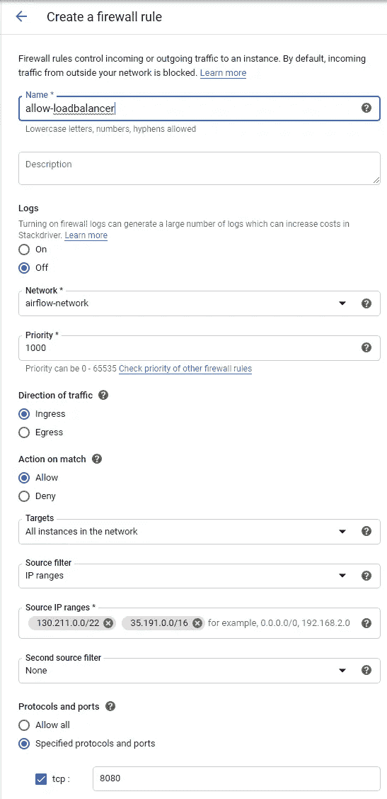
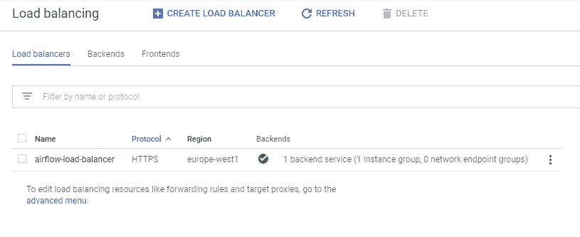

# GCP 的气流(2020 年 5 月)

> 原文：<https://medium.com/compendium/airflow-on-gcp-may-2020-cdcdfe594019?source=collection_archive---------0----------------------->

这是一个从头开始在谷歌云平台(GCP)虚拟机(VM)上安装 Apache Airflow 的完整指南。

另一种方法是使用 Google 提供的管理版本 Cloud Composer。

这是我 2019 年 4 月发表的关于在 GCP 虚拟机上安装气流[的帖子的更新版本。一年过去了，从那以后我学会了一些新的技巧。Airflow、Ubuntu、PostgreSQL 和 Python 的新版本已经到来，我决定用谷歌的负载平衡器替换 Nginx。](/grensesnittet/install-apache-airflow-on-a-google-cloud-platform-virtual-machine-f9a5b01b6c33)

# 模块

*   阿帕奇气流—版本 1.10.10
*   PostgreSQL 10 —托管云 SQL 版本
*   python 3.7—air flow 使用的最新版本。
*   Ubuntu 20.04
*   具有托管 HTTPS 证书的 Google 负载平衡器
*   Systemd 服务—自动启动

# 体系结构


系统的核心是 VM，我们在上面安装气流。我们使用一个云 SQL 实例作为我们的数据库。

负载平衡器仅用作 HTTPS 终结器，提供并自动更新证书。如果你更喜欢使用 Nginx 和 Let's Encrypt，请参见[在 GCP 虚拟机上安装气流(2019 年 4 月)](/grensesnittet/install-apache-airflow-on-a-google-cloud-platform-virtual-machine-f9a5b01b6c33)。

为了能够将云负载平衡器与我们的虚拟机连接起来，虚拟机必须驻留在一个实例组中。您只能将 GCP 负载平衡器连接到实例组，而不能直接连接到特定的虚拟机。

# 安装概述

1.  网络设置(虚拟私有云)
2.  虚拟计算机
3.  防火墙规则(允许 ssh 访问)
4.  实例组
5.  安装所需的软件包
6.  安装数据库(云 SQL)
7.  配置气流
8.  自动启动
9.  静态 IP 地址
10.  负载平衡器

# 网络安装程序

如果您已经有了自己的基础设施，或者只想使用默认网络，请跳过这一部分。

设置新的虚拟私有云(网络)来隔离我们的虚拟机的原因。


Google Cloud Console — VPC network — Create VPC Network

在 GCP 控制台中，选择 VPC 网络并+创建 VPC 网络。


Create a VPC network — Enter a name

将你的新网络命名为*气流网络*。


Create a VPC network — New subnet

我使用了名称*气流网络*和*气流子网*。名字并不重要，只要你以后能认出他们。

选择一个靠近最终用户的地区。请注意，网络层有两种类型；标准和高级。标准针对成本和速度进行了优化。标准在某些地区不可用。参见[https://cloud.google.com/network-tiers/docs/overview](https://www.google.com/url?q=https://cloud.google.com/network-tiers/docs/overview&sa=D&ust=1589539163946000)。


The new airflow-network and airflow-subnet.

# 虚拟计算机

使用以下设置，从“计算引擎”|“虚拟机实例”菜单创建新的虚拟机:

名称:air flow-VM
Region/Zone:Europe-west 1/Europe-west 1-b(与您的网络相同的区域)
机器类型:g1-small(如果您需要更大的，以后很容易更改)
启动盘:Ubuntu 20.04 LTS 最小映像
磁盘大小:10 GB(您以后可以增加磁盘，但永远不会缩小)
防火墙:允许 HTTP 流量(以后会更改)
联网:选择 airflow-network 和 airflow-subnet


Create an instance form

# 防火墙规则

对于管理和安装，我需要对新虚拟机的 ssh 访问。因为我们创建了自己的自定义 VPC，所以我们需要添加一个防火墙规则来允许访问。

选择“VPC 网络”|“防火墙规则”|“创建防火墙规则”。

使用:
名称:allow-ssh-access
网络:airflow-network
目标:网络中的所有实例
源 IP-ranges:0 . 0 . 0/0(All)
指定的协议和端口:tcp 22


点击“创建”按钮。您可以根据访问需要在以后禁用/启用此规则。

计划是在 TCP 端口 8080 上提供气流。在设置和测试期间，我修改了现有的防火墙规则*airflow-network-allow-http*，并添加了端口 8080。


Modify the existing firewall rule. Add TCP port 8080.

创建另一个防火墙规则，以允许流量从负载平衡器流向后端。负载平衡器的流量可能来自 IP 范围 130.211.0.0/22 和 35.191.0.0/16 中的地址。



您应该以下列规则结束:


Resulting firewall rules for the airflow-network.

目前，*airflow-network-allow-http*和 *allow-loadbalancer* 是重叠的，因为它们都允许流量到达虚拟机上的端口 8080。我们的想法是在完成后禁用*airflow-network-allow-http*。

# 实例组

我们创建一个非托管实例组，并添加新创建的虚拟机。在菜单元素“计算引擎”|“实例组”下选择“创建实例组”:

输入
名称:气流-实例-组
区域/分区:欧洲-西方 1/欧洲-西方 1-b
网络/子网:气流-网络/气流-子网
展开“指定端口名称映射”(见下文)
虚拟机实例:气流-虚拟机


Compute Engine | Instance groups | Create instance group

展开“指定端口名映射”并使用端口号“8080”定义端口名“http8080”:


Specify a new port name “http8080”.

负载平衡器稍后会使用这个端口名。

点击“创建”按钮。您应该得到一个包含一个实例的新实例组。


Result after creating a new instance group.

# 安装所需的软件包

下面的命令安装所需的包，在 */srv* 下创建一个 Python 虚拟环境，创建一个服务器将作为其运行的 airflow 用户，并设置所有者和权限。

```
sudo su
apt update
apt upgradeapt install software-properties-common
add-apt-repository ppa:deadsnakes/ppaapt install python3.7 python3.7-venv python3.7-devadduser airflow --disabled-login --disabled-password --gecos "Airflow system user"cd /srv
python3.7 -m venv airflow
cd airflow
source bin/activate# With an activated virtual environment
pip install --upgrade pip
pip install wheel
pip install apache-airflow[postgres,crypto]==1.10.10chown airflow.airflow . -R
chmod g+rwx . -R
```

# 安装数据库

使用没有公共 IP 地址的托管云 SQL 数据库。保持
低成本，选择所有最小资源(1 个 CPU、3.75 GB RAM、10 GB
HDD)。

我们希望最后得到:
数据库实例(服务器)，实例 ID: airflow-db
数据库名称:airflow
数据库用户名:airflow-user
气流的数据库密码-user:<d b-password>
数据库 IP 地址:< db-server-ip >

从 Google 控制台，进入“存储”|“SQL”|“创建新的
实例”，然后“选择 PostgreSQL”。

选择“私有 IP ”,并将其关联到气流网络。点击“分配和连接”，然后点击表格底部的“创建”按钮。


等待新的服务器实例被创建。


当新的数据库实例启动并运行时，您应该创建一个新的数据库 *airflow* 和一个新的用户 *airflow-user* 。进入 *airflow-db* 实例，选择“数据库”，然后选择“创建数据库”。


在弹出窗口中输入“气流”,然后点击“创建”按钮。


然后创建一个新用户。选择菜单项“用户”，然后选择“创建用户帐户”按钮。


输入用户名 *airflow-user* 并选择新密码，以下简称为< db-password >。


此时，您应该能够连接到新的数据库。您需要从数据库实例详细信息概览窗格中找到“专用 IP 地址”。

```
$ psql -h <db-server-ip> -U airflow-user -d airflow
Password for user airflow-user: <db-password>
psql (12.2 (Ubuntu 12.2-4), server 11.6)
SSL connection (protocol: TLSv1.3, cipher: TLS_AES_256_GCM_SHA384)
Type "help" for helpairflow=>
```

# 配置气流

运行 *airflow initdb* 将创建配置文件和元数据数据库。
因为我们使用 PostgreSQL 数据库，所以我们必须修改配置文件中的数据库
连接字符串，然后重新运行 *airflow
initdb* 命令。

```
sudo su airflow
cd /srv/airflow
source bin/activate
export AIRFLOW_HOME=/srv/airflowairflow initdb
```

查看*/SRV/air flow/air flow . CFG*文件并更改以下内容:

```
# This is not the complete airflow.cfg
# but only show configurations you need to change
sql_alchemy_conn = postgresql+psycopg2://airflow-user:<db-password>@<db-server-ip>/airflowdefault_impersonation = airflowload_examples = Falserbac = Trueenable_proxy_fix = True
```

编辑配置文件后，初始化 PostgreSQL 数据库(激活虚拟环境):

```
airflow initdb
```

添加新的气流管理员用户(激活的虚拟环境):

```
airflow create_user -r Admin -u jon -e jon@exampl.com -f Jon -l Snow
```

您现在可以启动 airflow 服务器:

```
airflow webserver -p 8080
```

您现在可以通过 http:// <vm external="" ip="">:8080 访问网络服务器</vm>

您可以使用以下命令启动调度程序:

```
airflow scheduler
```

# 自动启动

使用 systemd 设置 Airflow webserver 和调度程序，以便在服务器启动时自动启动
。

```
[Unit]
Description=Airflow webserver daemon
After=network.target[Service]
Environment=”PATH=/srv/airflow/bin”
Environment=”AIRFLOW_HOME=/srv/airflow”
User=airflow
Group=airflow
Type=simple
ExecStart=/srv/airflow/bin/airflow webserver -p 8080 — pid /srv/airflow/webserver.pid
Restart=on-failure
RestartSec=5s
PrivateTmp=true[Install]
WantedBy=multi-user.target
```

用上面列出的内容创建一个文件*air flow-web server . service*。然后运行以下命令:

```
sudo cp airflow-webserver.service /lib/systemd/system/
sudo systemctl daemon-reload
sudo systemctl enable airflow-webserver.service
sudo systemctl start airflow-webserver.service
sudo systemctl status airflow-webserver.service
```

对*气流调度器进行同样的操作。*

```
[Unit]
Description=Airflow scheduler daemon
After=network.target[Service]
Environment=”PATH=/srv/airflow/bin:/usr/local/sbin:/usr/local/bin:/usr/sbin:/usr/bin:/sbin:/bin:/snap/bin”
Environment=”AIRFLOW_HOME=/srv/airflow”
User=airflow
Group=airflow
Type=simple
ExecStart=/srv/airflow/bin/airflow scheduler
Restart=always
RestartSec=5s[Install]
WantedBy=multi-user.target
```

并运行命令:

```
sudo cp airflow-scheduler.service /lib/systemd/system/
sudo systemctl daemon-reload
sudo systemctl enable airflow-scheduler.service
sudo systemctl start airflow-scheduler.service
sudo systemctl status airflow-scheduler.service
```

然后，您应该能够使用 systemctl 命令启动和停止服务:

```
sudo systemctl start airflow-webserver
sudo systemctl stop airflow-webserversudo systemctl start airflow-scheduler
sudo systemctl stop airflow-scheduler
```

尝试重新启动您的服务器，并看到气流调度程序和网络服务器自动启动。

```
sudo reboot now
```

# 静态 IP 地址

保留一个外部静态 IP 地址。这将是用户从互联网连接到的地方，我们需要设置一个 DNS A 记录指向这个 IP 地址。该 IP 地址将是负载平衡器的前端，并不直接连接到服务器。

在谷歌控制台进入“VPC 网络”|“外部 IP 地址”|“保留静态地址”。输入名称(*气流-静电-ip* )和地区(欧洲-西方 1)。暂时不要将 IP 地址附加到任何东西上。稍后我们将把它连接到负载平衡器。


点击“预订”按钮。


创建一个 DNS A 记录，指向上面创建的静态 IP 地址。这是在 DNS 提供商的设置中完成的。我使用的 DNS 名称是 airflow.leira.net:


当然，您应该使用自己的 IP 地址和 DNS 名称。请注意，在我们创建 HTTPS 证书之前，DNS A 记录必须准备就绪。

通过运行以下命令检查目前一切正常:

```
ping airflow.leira.netPinging airflow.leira.net [35.206.141.120] with 32 bytes of data
```

你不应该得到任何答复，但你应该看到正确的 IP 地址。

# 负载平衡器

在 Google 控制台中，选择“网络服务”|“负载平衡”|“创建负载平衡器”。


在“HTTP(S)负载平衡”框中选择“启动配置”。

第一步选择“从互联网到我的虚拟机”:


然后给负载平衡器起一个你自己选择的名字，点击第一个项目符号“后端配置”，然后点击“后端服务”|“创建后端服务”:


进入运行状况检查下拉列表时，会显示另一个表单。

命名端口:http8080
新后端:
实例组:气流-实例-组
端口号:8080


我们不必在“主机和路径规则”中做任何事情，所以现在跳过这一步。

进入“前端配置”。


选择一个名称，然后选择:

协议:HTTPS
IP 地址:airflow-static-id(我们在上面创建的)
证书:创建一个新的证书(同样，在此之前，您的域名必须有一个指向静态 IP 地址的 A 记录)。

一个新的弹出窗口:


输入名称，然后选择“创建 Google 管理的证书”。

输入指向静态 IP 地址的 DNS 名称，然后点击“创建”按钮。


点击前端配置表单中的“完成”按钮。

然后点击“新建 HTTP(S)负载平衡器”表单中的“创建”按钮。

然后，您应该得到这样的负载平衡器:



进入新创建的负载平衡器，我们可以看到证书还没有准备好。在这种情况下，大约需要 10 分钟才能准备好。


# 结论

希望这篇帖子能帮到你。

未解决。如何自动从 HTTP(端口 80)重定向到 HTTPS(端口 443)。应该是负载均衡器里的一个设置，希望以后能来。

请给我反馈。

# 多方面的

我使用环境 systemd 配置文件来设置调度程序使用的路径。我只使用 BashOperator 和 DummyOperator，并为我的操作符设置我的 python 作业和所需 Python 版本的路径:

```
task = BashOperator(
 task_id=’my_task’,
 bash_command=f’/srv/<virtualenv>/bin/python3 src/transfer.py’,
 …
)
```

我不需要在相同的 Python 版本或虚拟环境中运行我的操作符。每个人可以使用自己的，或分享。