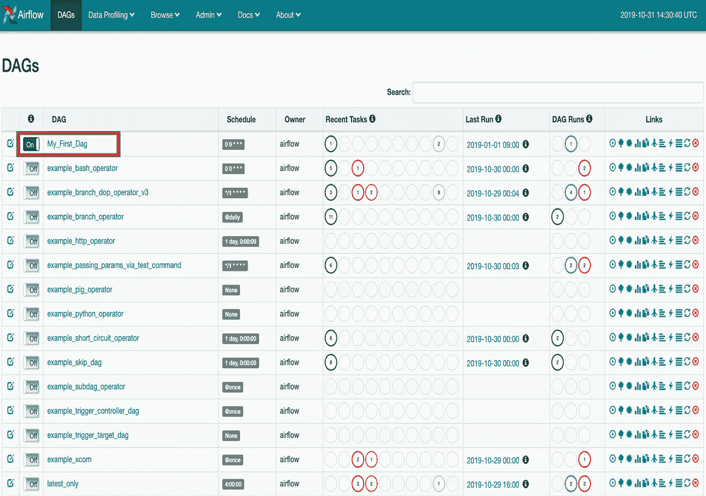
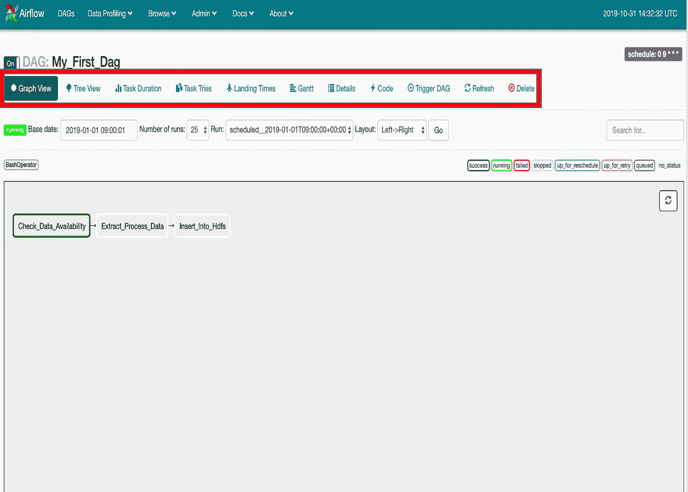

# 气流:初学者指南

> 原文：<https://medium.com/walmartglobaltech/airflow-the-beginners-guide-684fda8c87f8?source=collection_archive---------3----------------------->

Airflow 是一个开源平台，用于编程创作、调度和管理工作流。

在 Airflow 中，工作流被定义为任务的有向无环图(DAG)。Airflow 的主要组件是调度器、工作器和 web 服务器，它们的工作方式如下—

1.  调度程序在一组工作线程上执行您的任务，同时遵循指定的依赖关系。
2.  丰富的命令行应用工具使在 Dag 上执行复杂操作变得容易。
3.  Airflow Webserver 提供的丰富用户界面使得可视化管道、监控管道进度以及帮助解决问题变得非常容易。

当工作流被定义为代码时，它们变得更易于维护、版本化、可测试和协作。

在本教程(气流系列的第一部分)中，我们将通过一个例子来理解气流的基本功能，并将其与传统的 Cron 方法进行比较。

# 问题陈述-

假设我们必须自动化一个管道，其中有一组任务，这些任务在 UTC 时间每天上午 9 点运行，并按照给定的顺序执行以下操作-

*   数据可用性轮询
*   提取并处理数据
*   存储在一些数据存储中(比如 hdfs)

# **传统方法-**

在传统方法中，这可以通过创建三个脚本和一个将所有这些包装在单个单元中的脚本来实现，最后包装的脚本通过安排在 UTC 时间上午 9 点的 Cron 运行。

**传统方法的弊端-**

*   没有隐含警报
*   监控 Cron 日志是一项复杂的任务
*   没有隐式重试逻辑
*   没有观想
*   没有/复杂的分布式计算
*   复杂并行
*   没有统计数据
*   ……[列表永远不会结束]

# **气流来救援-**

Airflow 是调度+警报+监控平台的组合，可以独立工作，无需对主要工作代码进行任何修改，即实际任务不受影响。

上述任务序列可以通过在 Airflow 中编写 DAG 来实现，它是您想要运行的所有任务的集合，以反映它们的关系和依赖性的方式组织。

Sample Airflow Dag code ([https://gist.github.com/vipul007ravi](https://gist.github.com/vipul007ravi))

在这个 dag 代码(比如 my_first_dag.py)中，传统方法的包装脚本被运行相同的三个外壳脚本并创建工作流的气流 DAG 定义所取代。

上述气流 DAG 可分为气流的 3 个主要部分-

1.  默认参数—DAG 定义中的“args”字典指定了在整个 DAG 中保持不变的默认值。例如，默认参数指定重试次数，例如，对于此 DAG，该参数设置为 1。这些值可以在任务级别进行更改。
2.  操作员—airflow 中的任务由操作员创建，即任务可以由 air flow 中众多可用操作员之一定义。例如，在上面的代码中，Check_Data_Availability 是一个 shell 脚本任务，因此被指定为 BashOperator。
3.  从属关系-从属关系定义气流 DAG 的流量。它可以被指定为下游或上游。例如，在上面的代码中，Extract_Process_Data 依赖于 Check_Data_Availability，并在 Check_Data_Availability 任务完成后执行。

这些是气流的主要组成部分。一旦 DAG 被定义，它就准备好在 DAG 中指定的时间被调度程序(Cron 的替代)拾取，并被发送到工作线程以供执行。

# **气流 UI -**

DAG 在 DAGs 文件夹中可用后，它会自动被拾取，并可在 UI 中进行可视化和监控。下面是在用户界面中看到的 DAG 的快照-

Webserver UI of Airflow

我们可以看到 DAG 依赖关系，并在 DAG 的图形视图中直观显示工作流

Graph View of Dag in Airflow

上图描述了工作流程，即任务必须执行的顺序。(检查数据可用性->提取过程数据->插入 Hdfs)

# 优势-

1.  气流提供了隐含的警报。这意味着我们可以通过指定需要在重试或失败等情况下得到通知的用户的电子邮件 id 来定义 DAG 级别的警报。
2.  Airflow UI 提供正在运行的作业的实时日志。此外，它还提供了强大的功能，可以通过归档旧日志来访问它们。
3.  气流高度可扩展。任务可以分配给不同的工作人员，这使得系统具有高度的可伸缩性，也使得系统具有容错性和高可用性。
4.  Airflow UI 提供有关作业的统计信息，如过去 x 天 Dag/任务所用的时间、甘特图等。