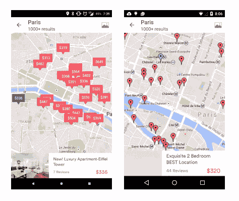

# AirMapView:Android 上地图的视图抽象

> 原文：<https://medium.com/airbnb-engineering/airmapview-a-view-abstraction-for-maps-on-android-4b7175a760ac?source=collection_archive---------2----------------------->

埃里克·佩泽尔

如今，许多 Android 应用程序需要某种形式的交互式地图作为其用户界面的一部分。谷歌提供了 Google Play 服务的原生包和体验来满足这种需求，但问题是如何为没有 Play 服务的设备创建交互式地图。

在一些国家，大多数设备出售时都没有 Google Play 服务。不提供 Play 服务的设备制造商在全球范围内越来越受欢迎。为了让我们的应用程序提供真正国际化的体验，我们不能遗漏像地图这样重要的功能。因为我们知道其他公司也有同样的问题，所以我们创建并开源了 AirMapView。

[AirMapView](https://github.com/airbnb/airmapview) 是一个视图抽象，支持带有和不带有 Google Play 服务的设备的交互式地图。有 Google Play 服务的设备将使用谷歌地图 V2，而没有的设备将使用基于网络的谷歌地图实现。这一切都是作为一个单一的 API 来实现的，它是在大多数开发者习惯的谷歌地图 V2 的基础上设计的。

默认情况下，AirMapView 将选择设备可用的最佳地图提供商。默认情况下，如果可用，它将使用原生的谷歌地图 V2，如果 Google Play 服务不可用，它将回退到 WebView 解决方案。该 API 被设计为对用户完全透明，这样开发者可以使用当前用于谷歌地图的相同 API 来获得回退功能。

原生 GoogleMap 是作为 AirMapView 内部的一个片段实现的，提供了与直接使用 Google Maps V2 完全相同的功能。将现有实现从 GoogleMap 移植到 AirMapView 非常简单，只需将对 GoogleMap 的调用替换为对 AirMapView 的调用，并为 OnCameraChanged 等操作实现正确的回调类。该 API 被设计为可插拔的，因此开发人员可以为特定设备添加自己的提供商，如亚马逊 kindle fire 设备的亚马逊地图。

回退 webview 地图在 Android WebView 中显示 Google 地图，并使用 javascript bridge 回调来实现与地图的动态交互。由于它是一个 webview，而不是本机代码，它的性能不如本机 GoogleMap，但它在 Airbnb 应用程序的实验中表现稍差。

使用 Javascript Bridge，我们能够在 web 地图中实现相同的 API，因此，一旦为本地地图实现了 AirMapView，就不需要更改客户端代码来支持 web 地图。

网络地图允许设置位置、居中、添加标记、拖动、点击地图和其他 GoogleMap 当前支持的常见操作。

我们构建 AirMapView 的方式允许我们在未来轻松添加其他地图提供商，如亚马逊地图 V2、百度、Mapbox 等。

更多信息请看我们的 Github 页面:[https://github.com/airbnb/airmapview](https://github.com/airbnb/airmapview)

## 在 [airbnb.io](http://airbnb.io) 查看我们所有的开源项目，并在 Twitter 上关注我们:[@ Airbnb eng](https://twitter.com/AirbnbEng)+[@ Airbnb data](https://twitter.com/AirbnbData)

*原载于 2015 年 4 月 20 日 nerds.airbnb.com**的* [*。*](http://nerds.airbnb.com/airmapview/)