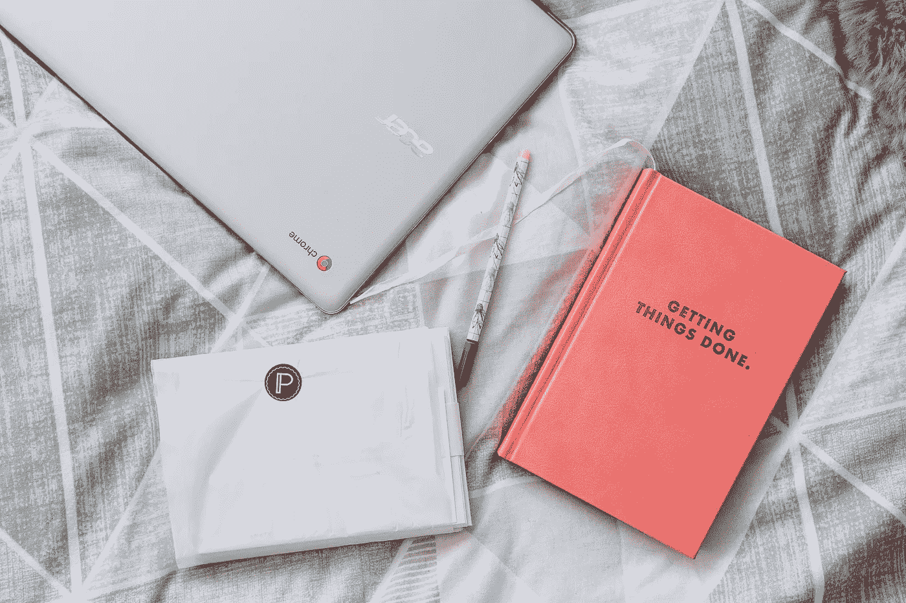

# Aktivitas Harian Product Manager

> 原文：<https://medium.easyread.co/aktivitas-harian-product-manager-337307ddd3c3?source=collection_archive---------5----------------------->

## Mengetahui apa saja yang dilakukan seorang Product Manager sehari-harinya

Ketika seseorang bertanya apa pekerjaan saya dan saya menjawab *Product Manager* (PM), banyak yang bertanya-tanya: *“ngapain sih lo sehari-harinya?”* Seorang pemrogram sehari-hari akan sibuk membuat kode program, seorang desainer antarmuka sehari-hari akan sibuk membuat desain untuk proyek yang ia tangani, tetapi apa yang sehari-hari dilakukan seorang PM?

Kalau melihat terjemahannya sih, mengelola produk, tapi apanya yang dikelola dari produk tersebut? Tentunya setiap hal yang berkaitan dengan produk tersebut: operasionalnya, inisiatif baru, pemantauan hasil proyek yang baru dirilis, dan lain-lain. Hal-hal tersebut bisa menjadi sangat berbeda satu sama lain, yang akhirnya membuat pekerjaan harian seorang PM menjadi sangat dinamis.

Buat saya, kedinamisan pekerjaan ini merupakan sebuah tantangan karena ritme pekerjaan kita kadang terganggu. Sulit untuk fokus ke satu hal karena ada banyak hal lain yang harus dipikirkan. Hal yang dikerjakan seringkali lompat kesana kemari. Belum lagi banyaknya pemangku kepentingan yang bekerja dengan kita membuat gangguan ada di kiri dan kanan setiap waktu.

Meskipun kesannya sangat tidak teratur, namun sebenarnya PM tetap mempunyai “jadwal” kerja sehari-hari. Jadwal ini tentunya tidak selalu ditepati karena memang terkadang gangguan dari pihak lain tidak bisa dihindari, namun membuat jadwal baku penting untuk menciptakan kondisi kerja yang optimal.

Setelah setahun bekerja sebagai Associate PM di Traveloka, saya pribadi merasa sudah menemukan jadwal harian saya yang menurut saya paling optimal untuk memaksimalkan produktivitas saya, yang ingin saya bagikan disini. Jadwal harian saya ini didasarkan pada natur produk saya yang bersifat semi operasional dan semi fitur; sehingga saya butuh untuk mengalokasikan waktu untuk rapat dan juga untuk berpikir kreatif. Langsung saja:

## Pukul 09.00 – 11.45: Waktu kerja personal

Pagi hari adalah waktu yang sakral untuk saya sebagai *morning person* . Biasanya saya memblok waktu pagi saya supaya tidak diganggu gugat oleh orang lain, kecuali kalau ada keperluan mendesak dan/atau tidak ada waktu lain untuk bertemu. Saya menggunakan pagi hari sebagai waktu untuk melakukan pekerjaan personal dan *deep work* karena belum ada banyak orang di kantor sehingga saya bisa bekerja dengan penuh konsentrasi. Di waktu pagi ini saya biasa melakukan hal-hal berikut:

*   Menyiapkan *product requirement* untuk proyek berikutnya. Apa yang mau kita buat berikutnya? Bagaimana seharusnya produk ini bisa dikembangkan lagi? Pertanyaan-pertanyaan seperti ini butuh kejernihan pikiran dan kreativitas tinggi, sehingga saya lebih suka melakukannya di pagi hari.
*   Menganalisa performa produk. Apakah ada anomali? Apakah ada pertumbuhan yang menggembirakan? Apakah ada yang bisa diperbaiki? Dan seterusnya. Pertanyaan-pertanyaan yang memerlukan kejelian dalam melihat data.
*   Memantau *timeline* proyek yang sedang berjalan atau menyiapkan *timeline* untuk proyek yang akan berjalan untuk memastikan semua berjalan sesuai rencana.
*   Meninjau beberapa pekerjaan kolega yang butuh di- *review* , misalnya *copy* , desain antarmuka proyek berikutnya, ataupun *testcase* yang disiapkan para *Quality Engineer* . Pastikan semuanya sudah sesuai dengan apa yang kita ingin buat.
*   Menjawab email-email masuk. Biasanya saya lakukan mendekati akhir sesi pagi. Saya juga sengaja hanya membuka *inbox* email saya sehari sekali untuk mengoptimalkan produktivitas karena kita semua tahu bagaimana “menganggunya” terlalu sering membuka email terhadap produktivitas kita.
*   Membaca informasi terkini dari industri yang saya geluti. Ini penting supaya saya mengetahui tren apa yang sedang populer dan apa yang harus tim saya lakukan untuk memanfaatkannya. Saya juga bisa membaca blog-blog yang berkaitan dengan *product management* supaya saya bisa terus menerus mengoptimalisasi performa saya.

## Pukul 11.45 – 12.00 -> Stand-up singkat dengan tim produk

Selain PM, tim saya juga mempunyai *product admin* dan *product analyst* . Setiap hari kami mempunyai sesi kumpul singkat untuk memberi *update* tentang apa yang masing-masing kerjakan di hari sebelumnya, apa yang berjalan dengan baik, dan apa yang perlu diperbaiki. Sesi ini juga digunakan untuk kita menentukan apa yang perlu dikerjakan di hari itu.

Untuk saya, sesi seperti ini diperlukan karena setiap orang perlu saling tahu apa yang sedang dikerjakan. Dengan saling tahu, kita bisa saling memberi masukkan tentang bagaimana caranya mengerjakan sesuatu. Sesi harian ini juga membuat kita menjadi lebih cepat untuk mengambil keputusan karena tidak perlu lagi menunggu rapat mingguan. Lebih *agile* kalau bahasa ala *startup* .

## Pukul 12.00 – 13.00: Makan siang dan beristirahat

Saya selalu mengalokasikan satu jam untuk makan siang dan bersantai dengan kolega. Menurut saya waktu istirahat ini penting sekali untuk menjaga motivasi kita di sisa hari yang ada dan juga untuk lebih mengenal kolega kita supaya dapat bekerjasama dengan lebih baik. Sekalipun ada rapat dadakan yang harus dilakukan di jam makan siang, saya biasanya tetap mengalokasikan satu jam setelah rapat selesai untuk istirahat.

## Pukul 13.00 – 15.00: Rapat

Kantor sudah jauh lebih berisik di siang hari karena semua sudah ada di kantor (terima kasih, sistem *open office* ) sehingga tidak lagi ideal untuk melakukan *deep work* . Oleh karena itu, waktu siang hari lebih baik digunakan untuk melakukan rapat-rapat atau pekerjaan yang tidak terlalu membutuhkan konsentrasi tinggi. Untuk soal rapat, ada beberapa rapat yang biasa saya lakukan:

*   Rapat dengan rekan seproyek untuk *update* pekerjaan masing-masing di proyek tersebut. Frekuensi rapat biasanya lebih dulu disepakati di awal dengan mempertimbangkan kompleksitas proyek, gaya bekerja masing-masing orang, dan juga apakah proyek betul-betul harus selesai di waktu yang sudah ditentukan. Di rapat kali ini dibahas apakah tugas-tugas dialokasikan untuk seminggu ke belakang sudah selesai dikerjakan, tugas apakah yang akan dikerjakan seminggu ke depan, dan juga masalah-masalah yang dihadapi saat menjalani proyek tersebut.
*   Rapat dengan rekan se-misi (misalnya semua di bawah produk tiket pesawat) untuk saling *update* perkembangan proyek masing-masing. Rapat ini biasanya hanya bersifat laporan untuk memastikan semua saling tahu dan juga tidak ada “tabrakan” antara inisiatif yang dilakukan tim yang berbeda.
*   Rapat dengan beberapa pihak eksternal yang berkepentingan dalam inisiatif yang sedang dikerjakan. Misalnya, jika fitur baru kita membuat *user* bisa melakukan pembelian, maka kita perlu memastikan kalau tim *finance* sudah mengetahui hal ini dan sudah memberi masukkan.
*   Rapat dengan para pemangku kepentingan yang relevan untuk membahas masalah yang sedang dihadapi. Ini untuk memastikan bahwa di dalam menyelesaikan masalah tersebut, semua pihak sudah melihat perspektif masing-masing dan mengurangi kemungkinan adanya miskomunikasi karena dunia digital masih belum optimal untuk menggantikan komunikasi tatap muka. Pada akhirnya, masalah dapat diselesaikan lebih cepat kalau bertemu langsung.

## Pukul 15.00 – 16.00: Brainstorm ide untuk proyek berikutnya

Selain rapat, saya meluangkan waktu untuk melakukan *brainstorm* dengan anggota tim lainnya untuk proyek yang akan datang. Bagi saya ini perlu karena kolega-kolega saya mempunyai keahlian yang berbeda-beda: *data analyst* , *product analyst* , *business analyst* , *software engineer* , *UI designer* , maupun *UX/interaction designer* . Mereka tentunya mempunyai sudut pandang tersendiri yang bisa memberikan ide baru yang tidak terpikir oleh saya.

Di sesi ini, biasanya saya memulai dengan mengajukan ide versi saya yang saya tuangkan dalam bentuk *product requirement* . Kemudian ide-ide yang saya ajukan satu persatu diiterasi bersama supaya bisa menghasilkan suatu ide yang lebih detail dan sudah mempertimbangkan berbagai aspek. Sesi ini terus menerus diadakan setiap minggunya sampai *product requirement* nya matang dan siap untuk dieksekusi.

## Pukul 16.00 – 17.00: Sesi one-on-one dengan kolega

Saya merasa bahwa koneksi dengan kolega adalah hal yang penting supaya kita bisa bekerja sama dengan optimal. Saya perlu memahami cara kerja mereka, gaya komunikasi mereka, sampai apa yang sedang mereka rasakan atau pikirkan tentang pekerjaan mereka.

Oleh karena itu, saya sengaja mengagendakan sesi reguler untuk berbicara empat mata dengan anggota tim produk saya untuk menggali informasi tersebut. Selain itu, sesi ini juga saya gunakan untuk mendapatkan *feedback* untuk diri sendiri. Dengan adanya sesi seperti ini, harapannya kedua pihak dapat saling memberikan pengaruh yang positif untuk kebaikan bersama.

## Pukul 17.00 – 18.00: Menyelesaikan hal-hal yang tersisa pasca kegiatan hari itu

Dalam 4 jam kegiatan setelah makan siang di atas, pasti ada beberapa tugas yang perlu dilakukan sebagai tindak lanjut atas apa yang dibahas selama sesi-sesi tersebut. Tugas-tugas yang perlu dilakukan ini langsung saya masukkan ke *to-do list* personal supaya tidak lupa. Jika selama 4 jam itu tidak ada sela waktu yang bisa dimanfaatkan, maka saya perlu menyelesaikannya setelah semua sesi selesai.

Sekalipun tugas-tugas ini sudah dicatat, namun karena keterbatasan waktu biasanya tugasnya hanya sekedar dicatat tanpa ada detail lebih lanjut. Oleh karena itu, sebelum ingatan menguap, saya perlu untuk paling menindaklanjuti tugas tersebut. Jika ada tugas yang bisa langsung dikerjakan (ingat [aturan dua menit](https://facilethings.com/blog/en/basics-two-minute-rule) ) atau penting untuk segera diselesaikan, maka akan langsung dikerjakan; tetapi jika belum bisa maka minimal saya tambahkan detail ke tugas-tugas yang ada.

Selain itu, waktu di sore hari itu juga saya gunakan untuk merencanakan pekerjaan di esok harinya. Saya menentukan tugas apakah yang harus saya kerjakan, bagaimana prioritasnya, dan berapa banyak waktu yang saya butuhkan untuk mengerjakan masing-masing tugas tersebut ( [menggunakan satuan pomodoro tentunya](https://en.wikipedia.org/wiki/Pomodoro_Technique) ). Ingat pepatah *if you fail to plan, you plan to fail* .

Jadi begitulah kegiatan sehari-hari saya sebagai seorang APM di Traveloka. Tentu saja pola nya mungkin ada perbedaan dengan posisi yang sama di perusahaan lainnya karena setiap perusahaan mempunyai karakter dan kebutuhan yang berbeda, namun secara garis besar akan seperti ini. Sekalipun pada awalnya saya mengatakan bahwa kedinamisan pekerjaan seorang PM adalah sebuah tantangan, namun tantangan inilah yang menarik dari posisi PM karena ada kesan “ *gak gitu-gitu aja* ” setiap harinya. Mempunyai ritme kerja yang konsisten itu baik, namun adanya sedikit variasi tentunya tidak salah juga. Semoga membantu!