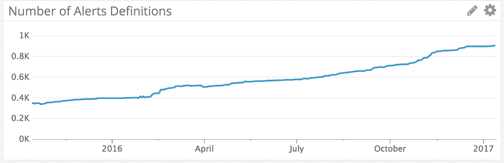

# Airbnb 的警报框架

> 原文：<https://medium.com/airbnb-engineering/alerting-framework-at-airbnb-35ba48df894f?source=collection_archive---------2----------------------->

在 Airbnb，我们没有工程运营团队(截至 2017 年)，因此各个团队负责为他们的服务配置监控和响应问题。我们使用 Datadog 来监控我们的基础设施，并对其运行状况发出警报。虽然 Datadog 运行良好并提供了许多功能，但我们对警报有一些特定的要求:

*   通用警报需要根据主机或角色向不同的人发出警报。
*   警报定义的更改是自动进行的，因此当我们的基础架构发生变化时，警报会保持最新。
*   团队能够洞察他们正在接收哪些警报，并且能够使用标准的代码审查过程来讨论创建、修改或删除警报。
*   当警报被触发时，我们希望能够轻松确定它是否是由最近的更新引起的，以及阈值被设置为某个值的原因。

这些需求意味着将警报配置从 Datadog UI 中取出，放入配置存储库中。幸运的是， [Datadog 确实提供了一个 API](http://docs.datadoghq.com/api/#monitors) ，我们可以使用它来构建工具，根据我们的基础设施轻松地模板化我们的警报，并跟踪它们的变化。

## 引入干扰素

干扰素是我们解决上述警报需求的方法。它使用一个 [Ruby DSL](https://github.com/airbnb/alerts#alerts) 来定义警报，并与诸如 Datadog 之类的警报系统进行交互。Interferon 从各种可插入的源中读取主机信息，并使 Ruby DSL 可以访问关于主机的数据。因此，您可以编写一个主机源，它将动态地读取您的基础设施数据(比如从 AWS API 查询信息)并基于您所拥有的各种属性创建警报。

此外，您可以将主机源配置为包括元数据，例如每个主机的所有权信息。这允许您编写一个通用警报并创建多个警报实例，这些实例将路由到每个主机的所有者。

例如，下面是我们的标准内存警报:

这里，我们有`@hostinfo`，它是一个 Ruby 散列，包含由一个主机源动态生成的信息(在我们的例子中，是 [Optica](https://github.com/airbnb/optica) )。散列包含主机的厨师角色的名称`:role`,以及包含所有权元数据的所有者组和`:owners`。

name 属性对应于 Datadog 监视器名称，并用作干扰素的主键。我们可以利用这里的`@hostinfo`属性为每个不同的角色创建一个内存警报。

此特定警报的`message`是通用的；但是，能够编写带有描述性消息和可操作步骤的警报是很有帮助的。这有助于第一响应者在收到警报时能够快速开始对问题进行分类，特别是对于模糊的问题或边缘情况。

只需一点点 Ruby 代码，我们就可以过滤掉不受此警报影响的主机。`applies`属性告诉干扰素只包括表达式评估为真的宿主。在此警报中，我们只希望主机连接有角色，但跳过测试主机。

使用`@hostinfo`中提供的元数据，我们在 Datadog 消息中标记`notify.people`中的用户，以便在警报响起时通知他们。干扰素也提供了一种简单的方法来定义使用 YAML 的[组。在`notify.groups`的那些组被扩展到人，也在消息中标记。](https://github.com/airbnb/alerts#groups)

最后，我们有`metric.datadog_query`属性，它对应于用于定义度量和警报参数的 Datadog 查询语法。

## 部署工作流程

警报框架由警报 gem、干扰素和警报存储库组成，其中保存了实际的警报定义以及自定义主机源、组源和自定义目的地。团队可以向警报存储库提交内容，以修改警报和添加自定义源。

该存储库提供了对警报所做更改的审计跟踪，以及恢复错误更改的快速方法。最重要的是，我们将我们的存储库配置为要求同行审查，以帮助确保新警报具有清晰的信息和合理的设置。我们在预提交检查中添加了一个[数据狗语法检查器](https://github.com/airbnb/alerts/blob/master/test/check_query.rb)，通过对格式错误的数据狗语法提供几乎即时的反馈，缩短了警报开发周期。

在我们的基础设施中，对警报存储库的提交创建了一个包含警报定义和定制代码的新构建工件。部署将工件发送到实例，并调用干扰素将最新的定义与 Datadog 同步。Interferon 从 Datadog 下载当前定义，然后将现有定义与其生成的定义进行比较。为了减少通信量，它将只修改已经改变的定义。

干扰素还计划每小时运行一次，以捕捉基础设施的变化，从而在引入新的主机和角色时保持 Datadog 的同步。

干扰素还具有模拟功能，允许团队确定将要进行什么样的改变。我们鼓励人们在部署到生产之前，将他们的分支部署到一个运行干扰素的实例中。模拟运行的输出显示了分支和 Datadog 中存储的内容之间的差值。

## 分享爱

自 2014 年末以来，我们一直在生产中使用干扰素，并对其产生的影响非常满意。干扰素和样本警报库都是开源的，可以在 Github 上获得。如果您对使用干扰素感兴趣，可以从克隆[范例库](https://github.com/airbnb/alerts)开始。示例存储库包含几个示例警报定义以及几个自定义主机源。如果您运行在 AWS 上，这尤其方便，因为干扰素包含内置的 AWS 宿主源。

如果您想要定义自定义主机源、组源或定义，则无需提交 PRs，因为您可以将它们放入您自己的自定义警报库中，以便干扰素查找。例如，我们的内部警报库包括 Airbnb 特定的主机源，如我们的 Resque 队列的名称，以及它们的所有者和它们在我们开始发出警报之前应该有多满。当编写自定义源时，我们建议通过编写静态主机源进行试验，然后根据需要重写它以提取动态信息。

如果您已经编写了有趣的通用主机源、组源或目的地，我们欢迎向上游项目投稿:【https://github.com/airbnb/interferon】。

## 感谢

[Igor Serebryany](https://medium.com/u/2ca4bb38a2d?source=post_page-----35ba48df894f--------------------------------) 为干扰素的原作者 [Willie Yao](https://medium.com/u/3f589e8091c9?source=post_page-----35ba48df894f--------------------------------) 为正在进行的维护。