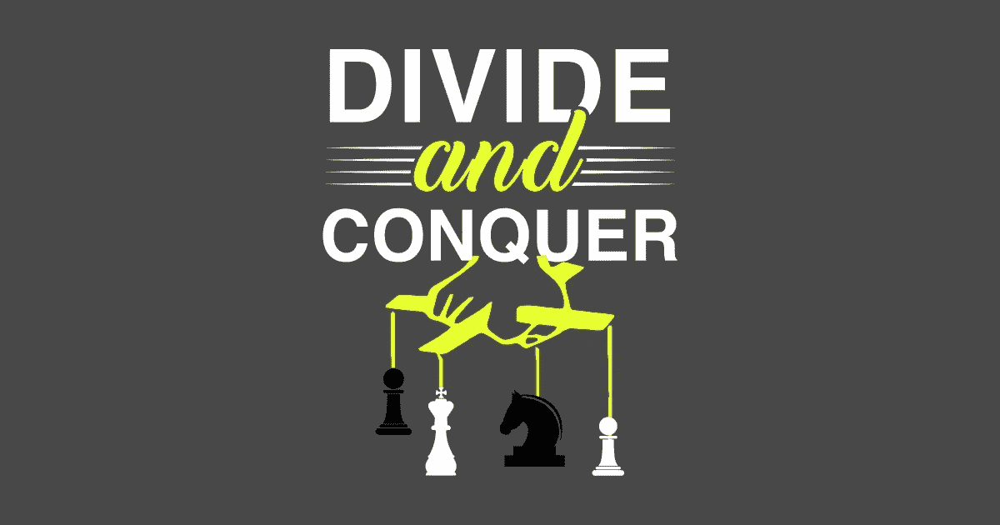
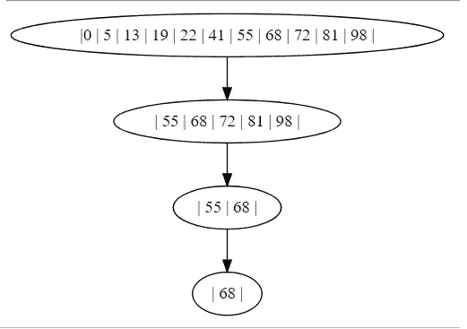
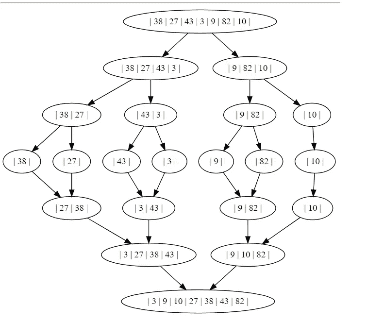

# 算法设计范例—分而治之

> 原文：<https://medium.com/quick-code/algorithm-design-paradigms-divide-and-conquer-f11e3364bc4c?source=collection_archive---------2----------------------->



解决复杂问题的最强大和最普遍的技术之一是将它们分解成更小的问题。首先，也是更自然的，小问题不那么难以应对。第二，也是更重要的一点，它们让我们在处理大问题时，能够关注那些不太明显的细节。基于将问题分解成更小问题的两种重要算法设计范式是— *动态规划*和*分而治之*。在本文中，我们将关注后者，将前者留待以后讨论。

分而治之将问题分成两半，解决每一半，然后将碎片缝合在一起，形成完整的解决方案。

> 更一般地说，要使用分而治之，我们必须将问题分成两个更小的子问题，递归地解决每个子问题，最后将两个部分解决方案合并成一个完整问题的大解决方案。每当合并步骤比解决子问题花费的时间少时，我们就得到一个有效的解决方案。

在实践中应用它可能像*二分搜索法*一样简单，也可能像*合并排序*一样复杂。让我们探索在光谱的两端分而治之的魔力。

## 二进位检索



Animation of binary search

*二分搜索法*是一种在**排序的**数组中搜索元素的高效算法。它首先将搜索关键字与数组的中间元素进行比较。如果搜索关键字小于中间的元素，数组的后半部分将被丢弃，以便进一步搜索。同样，如果 key 大于中间元素，数组的前半部分被忽略。左图显示了如何搜索 68 号钥匙。

请注意，二分搜索法的每一次比较都将进一步的搜索空间减半。因此，在到达 *1* 之前，我们可以将 *n* 减半的次数是 **log n.** 因此，在最坏的情况下，二分搜索法需要 **O(log n)** 时间。

```
def binary_search(arr, low, high, key):
    while low <= high:
        mid = low + (high - low)/2
        if arr[mid] == key:
            return mid
        elif arr[mid] < key:
            low = mid + 1
        else:
            high = mid - 1
    return -1
```

## 合并排序

像二分搜索法一样，合并排序是另一种分治算法，尽管很复杂。该算法被称为*合并排序*，认识到交错操作的重要性。

```
def merge_sort(arr[1, n]):
    merge(merge_sort(arr[1, n/2]), merge_sort(arr[n/2 + 1, n]))
```

当要排序的子数组由单个元素组成时，会发生这种递归的基本情况。



Merge sort animation

合并排序的效率取决于我们将排序后的两半合并成一个排序列表的效率。注意，两个列表中按升序排序的最小的项目必须位于其中一个列表的顶部。删除这个最小的元素后，我们得到了两个排序后的列表——其中一个比之前的稍短。同样，第二小的元素必须位于这些列表的顶部。重复相同的操作，直到两个列表都为空，将这两个列表合并成一个排序列表。

请注意，子问题中的元素数量在每个级别都减半了。因此，在到达 *1* 之前，我们可以将 *n* 减半的次数是 **log n.** 由于递归深入到 **log n** 级，并且在每一级完成线性工作量(合并两个列表)，在最坏的情况下，合并排序花费 **O(n log n)** 时间。

```
def merge_sort(arr):
    print("Splitting ", arr)
    if len(arr) > 1:
        mid = len(arr)//2
        left_half = arr[:mid]
        right_half = arr[mid:] merge_sort(left_half)
        merge_sort(right_half) merge(left_half, right_half)
```

同样，具有挑战性的部分是我们如何合并两个排序列表。唯一的问题是我们必须把合并后的数组放在某个地方。为了避免在合并时由于重写而丢失元素，我们首先将每个子数组复制到一个单独的列表中，并将这些元素安全地合并回数组中。

```
def merge(left_half, right_half):
    i = 0
    j = 0
    k = 0
    while i < len(left_half) and j < len(right_half):
        if left_half[i] < right_half[j]:
            arr[k] = left_half[i]
            i = i + 1
        else:
            arr[k] = right_half[j]
            j = j + 1
        k = k + 1 while i < len(left_half):
        arr[k] = left_half[i]
        i = i + 1
        k = k + 1 while j < len(right_half):
        arr[k] = right_half[j]
        j = j + 1
        k = k + 1
    print("Merging ",arr)
```

最后，分而治之是一种有许多重要算法的设计技术。然而，除了二分搜索法和它的变体，我发现它是很难在实践中应用的设计范例。

请通过您的评论让我知道文章中需要的任何修改/改进。