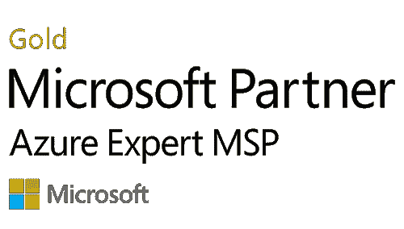

# 协调 SAM 服务和 Microsoft Azure 专家 MSP 鉴定，为客户提供更多价值

> 原文：<https://medium.com/version-1/aligning-sam-services-and-microsoft-azure-expert-msp-accreditation-to-deliver-more-value-to-1e3d5a053886?source=collection_archive---------4----------------------->

版本 1 获得了 Microsoft Azure Expert MSP 鉴定资格，这有助于展示版本 1 中可衡量的经验和专业知识水平，以及在每个客户参与过程中实践的原则和方法。

经验和专业知识的实际应用符合微软 Azure 良好架构框架的五个核心支柱:

可靠性—系统从故障中恢复并继续运行的能力。

安全性—保护应用程序和数据免受威胁。

成本优化——管理成本以最大化交付的价值。

卓越运营—保持系统在生产中运行的运营流程。

性能效率—系统适应负载变化的能力。

这五大支柱形成了一套完全相互依赖、相互依存的原则，以确保在为客户设计、交付和支持业务转型 IT 解决方案时，总和大于单个部分。

基于这些支柱的交付为客户提供了从版本 1 中获得服务级别的绝对信心。

作为一个间接的结果，获得 Azure Expert MSP 自然有助于提升和促进版本 1 的高技能和专门的软件资产管理(SAM)实践，作为一个原则，版本 1 的核心服务组件，用于在良好架构的框架内交付成本优化服务。

Version 1 的 SAM Practice 是一个历史悠久、资源丰富、技术高超的软件资产管理专家团队，为客户提供高度复杂的许可解决方案，帮助确保许可证、授权和协议的履行符合其组织的需求和目标。

Azure 专家 MSP 认证不仅仅是另一个徽章，而是向版本 1 的客户提供的可交付利益的集合，包括 Azure 服务从企业协议到版本 1 的 CSP 平台的无缝和无中断迁移。这些迁移是通过使用微软只向 Azure 专家 MSP 合作伙伴提供的专业工具和流程，以及对最合适的微软软件和许可证的专业理解和定位来实现的。

基于客户的功能、运营和业务需求，Azure 向版本 1 的供应、一线支持和计费过渡，有助于使版本 1 的托管和支持服务范围符合客户的需求，并增加了版本 1 不断发展和努力的目标，即继续提供最高水平和质量的 IT 解决方案和服务。

作为 [Microsoft Azure 专家 MSP](https://www.version1.com/news-microsoft-partner-azure-expert-msp/) 、 [Microsoft Direct CSP](https://www.version1.com/it-service/software-asset-management/microsoft-cloud-solution-provider/) 和 [Microsoft licensing](https://www.version1.com/it-service/software-asset-management/microsoft-license-optimisation/) 的专家，我们可以就 CSP 是否适合您的业务为您提供建议和指导，并提供完整的 CSP 生命周期以实现最佳成本管理和许可证合规性。[如有任何问题，请联系我们](https://www.version1.com/contact/)或访问我们的[网站](https://www.version1.com/)了解更多信息。

**关于作者** 威廉·尼尔森是微软 SAM 第 1 版的销售专员。