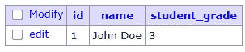
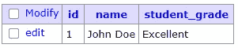
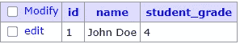

# 关于在 Hibernate 中使用枚举的所有内容

> 原文：<https://medium.com/quick-code/all-about-using-enums-in-hibernate-96b72b469836?source=collection_archive---------1----------------------->


Photo by [Luca Bravo](https://unsplash.com/@lucabravo?utm_source=medium&utm_medium=referral) on [Unsplash](https://unsplash.com?utm_source=medium&utm_medium=referral)

枚举是在 Java 5 中引入的。Hibernate 框架识别 Java enum，并随后从数据库读取或写入 enum 状态，而无需任何额外的配置。

可以通过两种方式将枚举映射到数据库。让我们看看下面学生的两种方法。

> studentRepo.save(新学生实体(" John Doe "，StudentGrade。优秀))；

# 序数值

1.  默认情况下，Hibernate 将枚举映射到序数值，序数值是枚举定义中从零开始的位置。
2.  因为这是 hibernate 采用的默认映射，所以不需要添加任何特殊的注释。

## 数据库表示



## 缺点

这种映射非常有效，但是存在很高的风险，即在枚举中添加或删除一个值会改变其余值的顺序值。这在不重构数据库的情况下添加新记录时会导致问题。

# 字符串表示

您可以将枚举值映射到一个*字符串*。这使用定义它时使用的字符串值。这可以通过在实体中的枚举上添加以下注释来实现。

> [@枚举](http://twitter.com/Enumerated) (EnumType。字符串)

## 数据库表示



## 缺点

1.  这种映射效率不高，因为考虑到下面的例子，我们存储的是视频的类型，这里我们存储的是字符串表示，每个条目大约需要 *8* *字节*。假设我们有 10 亿行，那么仅这一列就占用了 *8 GB* 的空间。
2.  您可以添加或删除枚举值而不会产生任何副作用，但是如果不进行迁移，则无法重命名条目。

上面讨论的两种方法都使用 hibernate 提供的缺省值，在很多情况下这就是 goto。当我们的应用程序使用遗留数据库或者当我们的枚举不断变化时，它们是没有帮助的。

**使用属性转换器自定义映射**

我们用一个案例来讨论这个

我们有一个需要存储的学生评级枚举

> {低于，符合，高于，优秀}

但是在将来，我们可能想要调整它们并添加另一个条目

> {低于，低于 _ 符合，符合，高于，优秀}

使用顺序值是一个很大的问题，因为条目更新了，顺序值也会更新。枚举的字符串表示可能看起来是正确的方法，但是当从枚举中移除一个条目时，这将导致问题。

自定义映射是这种情况下唯一有效的选项。为了创建自定义映射，我们实现了 AttributeConverter 接口，用 **@Converter** 注释了该类，并实现了提供实体和数据库表示之间的映射的两个方法。

> convertToDatabaseColumn(学生等级学生等级)
> 
> convertToEntityAttribute(整数 ratingVal)

我们可以将 **@Converter** 注释的 autoApply 属性设置为 true，以便将该转换器应用于所有实体中该类型的所有枚举。

这是 StudentGrade 枚举的转换器代码

为了让这个转换器与枚举一起工作，我们需要在枚举上添加以下注释

```
@Convert(converter = StudentGradeConverter.class)
private StudentGrade studentGrade;
```

## 数据库表示



最后，如果您需要完全控制枚举，您使用的 goto 选项是 AttributeConverter。但是选择完全取决于您的用例。