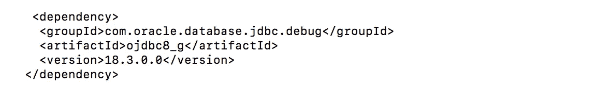

# 所有的和新的 groupid—Maven Central 上的 Oracle JDBC 驱动程序

> 原文：<https://medium.com/oracledevs/all-in-and-new-groupids-oracle-jdbc-drivers-on-maven-central-a76d545954c6?source=collection_archive---------2----------------------->

更新后添加了新发布的 19.6.0.0。

# 疲乏到极点

不仅是最新版本，所有受支持的 Oracle JDBC 驱动程序版本(包括 19.6.0.0、19.3.0.0、18.3.0.0、12.2.0.1 和 11.2.0.4)现在都可以在 Maven Central 上获得。从现在开始，Maven Central 实际上成为了 Oracle JDBC 驱动程序和配套 jar 的分发中心。

# 新组 id

除了 JDBC 驱动程序之外，我们希望将 Maven Central 上的所有 Oracle 数据库工件整合到同一个伞下[*com . Oracle . database*](https://repo1.maven.org/maven2/com/oracle/database)*。*工件已经被分派到它们特定的焦点下，即 JDBC、XML、安全性、高可用性(ha)、NLS、可观察性、SODA(即将推出)、AQJMS(即将推出)等等。

明确地说，下面是 JDBC 驱动程序和配套 jar 的新组 id 的描述:

*   ***com . Oracle . database . JDBC***对于 jdbc jars(所有版本组合):ojdbc8.jar、ojdbc10.jar、ojdbc6.jar、ojdbc5、jar、ucp.jar、ojdbc10dms.jar、ojdbc8dms.jar、ojdbc6dms.jar、ojdbcd5dms.jar
    注意: *ojdbc8dms.jar 和 ojdbc10dms.jar* 包含用于
*   ***com . Oracle . database . JDBC . debug***用于调试 jar(所有版本组合):ojdbc10_g.jar、ojdbc8_g.jar、ojdbc5_g.jar、ojdbc6_g.jar、ojdbc10dms_g.jar、ojdbc8dms_g.jar、ojdbc6dms_g.jar、ojdbc5dms_g.jar
*   ***com . Oracle . database . security***对于安全 jar:osdt _ core . jar、osdt_cert.jar、oraclepki.jar
*   ***com . Oracle . database . ha***为 ons.jar 和 simplefan.jar
*   ***com . Oracle . database . nls***for ora i18n . jar
*   ***com . Oracle . database . XML***对于 xdb.jar、xdb6.jar、xmlparserv2.jar
    注意:xdb6.jar 是旧名称，xdb.jar 是新名称。
*   ***com . Oracle . database . observability****为 dms.jar。*

*我们保留了发布在***com . Oracle . ojdbc***groupid 下的 19.3.0.0 工件；所以不要破坏现有的脚本。*

# *依赖性和 gav*

*尽管重新分派，前一篇博客中指出的工件之间的默认依赖关系保持不变。下面的 GAV 将从 19.3.0.0 版本中提取 *ojdbc10.jar、ucp.jar、oraclepki.jar、osdt_core.jar、osdt_cert.jar、ons.jar、*和 *simplefan.jar**

**

*下面的 GAV 将从 19.3.0.0 版本中提取 orai18n.jar*

**

*以下 GAV 将从 18.3.0.0 版本中提取 ojdbc8_g.jar、ojdbc8dms.jar、ojdbc8dms_g.jar 和 dms.jar*

**

# *例子*

*从 18.3.0.0 版本中提取 *ojdbc8.jar* ，它的依赖项和伴随 jar。*

# *(用于命令)等待下面发表的消息*

*当我们在驱动程序和配套 jar 中引入新功能时，我们将通过 **@kmensah** 宣布*