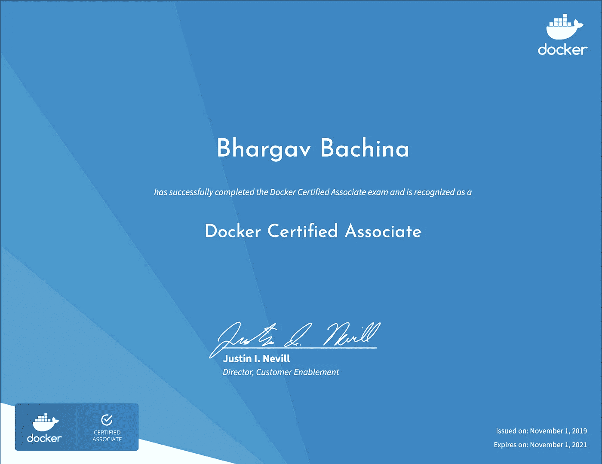

# 关于 Docker 认证助理(DCA)考试你需要知道的一切

> 原文：<https://medium.com/bb-tutorials-and-thoughts/all-you-need-to-know-about-docker-certified-associate-dca-exam-21dd2ccadbc0?source=collection_archive---------2----------------------->

## 想参加这个考试的人的完整指南

Docker 是一个企业就绪的容器平台，使组织能够在任何地方无缝地构建、共享和运行任何应用程序。几乎每个公司都在将其应用程序容器化，以实现更快的生产工作负载，这样它们就可以随时部署，并且…