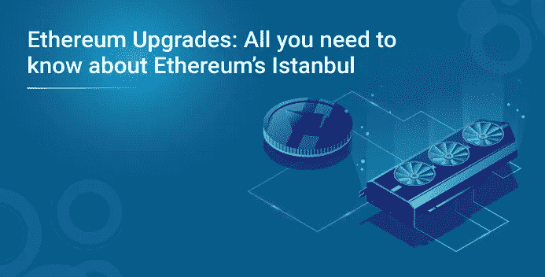
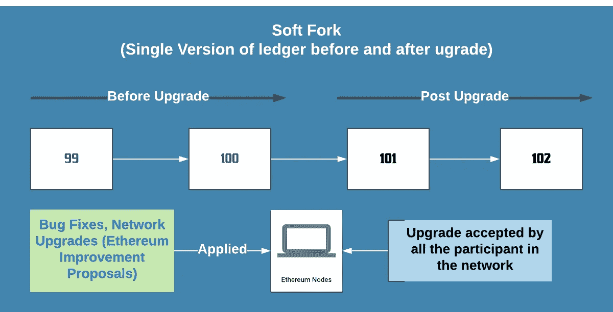
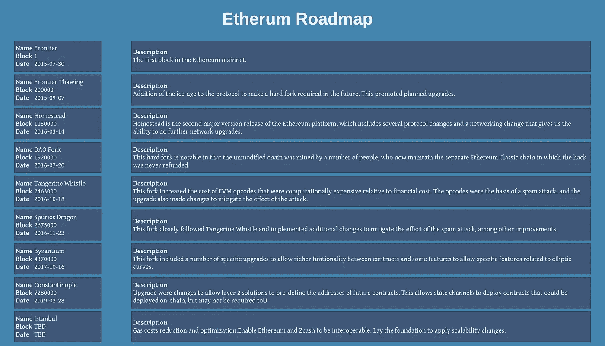
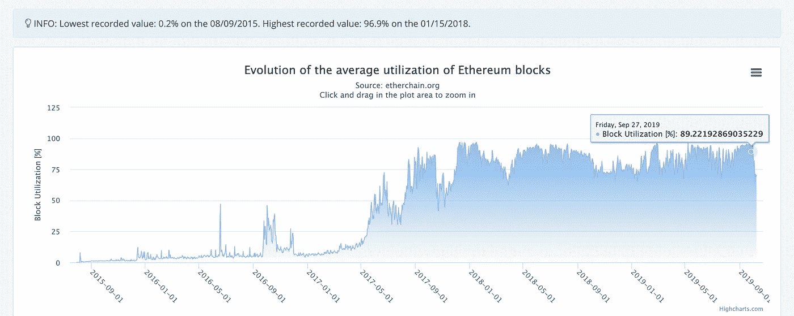
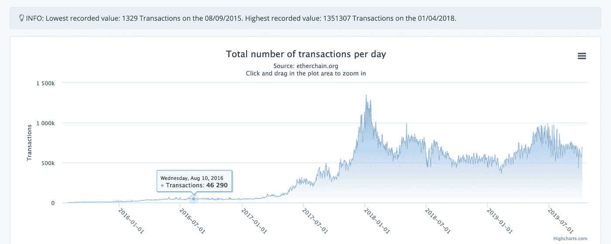

# 以太坊升级:关于以太坊的伊斯坦布尔，你需要知道的一切

> 原文：<https://medium.com/edureka/all-you-need-to-know-about-ethereums-istanbul-f09007422a7?source=collection_archive---------1----------------------->

这一直是基石声明，并且在软件世界中更加明显。还没有一个系统，没有经历过 bug 修复和升级的进化周期。对于一个集中式系统来说，推出一个改变或者一个新特性是很容易的，因为我们知道我们需要更新的服务器和系统。随着系统规模的增长，推出新的升级软件的挑战变得更加复杂。这就引出了我们今天讨论的话题。

# 我们今天要做什么？

1.  理解以太世界中“分叉”的含义。
2.  以太坊升级简史。
3.  升级的机制和细微差别。

# 外卖会是什么？

1.  了解升级的工作方式和过程。
2.  升级的影响。

这些是我们将在博客中讨论的话题:

1.  叉子是什么？
2.  为什么它们被称为“叉子”而不仅仅是“以太坊升级版”？

*   软分叉(网络升级)
*   硬叉子
*   什么是 EIP？
*   EIP 类型
*   以太坊升级周期
*   以太坊升级历史
*   驱动因素
*   以太坊伊斯坦布尔升级

## 叉子是什么？

*   本质上，对以太坊网络的规则和协议所做的任何改变都被称为分叉。
*   简而言之，这些是应用于分布式网络的错误修复和更新(主要/次要)。
*   从本质上来说，这些都是网络更新，改变了网络工作原理。

## 为什么它们被称为“分叉”，而不仅仅是“网络升级”？

这些网络升级或协议变更发生在分散的网络上，这带来了一些独特的挑战。让我们看看它们。

## 软分叉(网络升级)

*   在一个简单的场景中，如果提议的所有更改或升级都是向后兼容的，并且支持新旧规则。
*   在上面提到的场景中，所有的参与者都同意变更并升级软件。
*   这就是我们所说的软分叉，向后兼容，所有参与者都同意，并且只有一个版本的软件在所有参与者上运行。
*   软分叉更多的是一个误导性的术语，这更多的是一个网络升级，我们最终只有一个版本的软件。
*   由于这是一个分散的系统，所以所有参与者达成的共识对网络的未来状态起着重要作用。

## 硬叉子

*   在这种情况下，对网络提出的更改或升级并没有得到网络中所有参与者的同意。
*   请记住，提议的更改和升级不是向后兼容的。
*   如果让我们说 x%的参与者同意改变，他们继续升级他们的软件。
*   现在，我们得到的是软件的两个独立版本。
*   第一，x%的参与者已经升级以包含新的变化。
*   第二，其中(100-x)%的参与者没有升级。
*   在这种情况下，这两个组将具有相同版本的分类帐，直到 x%接受升级，假设该点是块号 100。
*   直到块号 100，所有的参与者将有相同版本的分类账，或者简单地说，在他们的区块链中有相同的数据。
*   发布区块编号 100，x%的参与者将拥有自己的分类帐副本，每次升级都将遵循新规则，而(100-x)%的参与者将拥有一份单独的副本，仍然遵循旧规则。
*   总之，这种类型的升级被称为分叉。因为这会导致一个区块链分裂成两个独立的版本。

## 什么是 EIP？

EIP 是以太坊改进提案(EIPs)的首字母缩写。以太坊协议、网络的任何变更或更新，或任何必须以 EIP 形式建立的变更。一个 EIP 包括

1.  EIP 将要解决的问题。
2.  定义新功能或变更的技术规范。
3.  设计和设计决策背后的基本原理。
4.  如果这种变化带来任何不相容性，应清楚地列出。

## EIP 类型

下面列出了 EIP 的分类。

1.  **标准轨道**:影响大部分或全部以太坊实现。例如网络协议的改变、块或交易有效性规则的改变。
2.  :可能与*核心*开发讨论相关的变更。例如，挖掘器/节点策略变化
3.  **联网**:对 whisper 和 swarm 网络协议规范的改进。例如通过 DNS 的节点发现
4.  **接口** : API/RPC 标准和规范变更。例如，为 JSON-RPC 创建“eth_chainId”方法
5.  **ERC** :应用层面的标准和规范。例如令牌标准、库和包格式。
6.  :流程规范和流程变更。例如程序、指南、决策过程的变更以及以太坊开发中使用的工具或环境的变更。 *EIP 233《硬分叉的正式流程》*
7.  **信息**:以太坊社区的设计问题和通用指南。例如 *EIP 1470 —智能合同弱点分类(SWC)。*

## 以太坊升级周期

最近，以太坊社区已经成熟，以太坊的升级也已经计划好了。

*   早期的分叉或升级时间由引入的 EIP 决定，升级周期没有计划。
*   现在，分叉和升级已经计划好了，并且随着 EIP 的成熟，还会添加 EIP。这更符合传统的软件升级和发布。

## 以太坊升级历史

## 驱动因素

以太坊升级背后的两个驱动因素是

1.  共识性能提升，证明工作一点效率都没有。以太坊整个路线图就是从 PoW(工作证明)走向 PoS(利益证明)。
2.  可伸缩性，如后面所讨论的，以太坊网络要大规模采用就必须进行伸缩。在过去几年中，以太坊的主要关注领域是提高可伸缩性。

## 以太坊伊斯坦布尔升级

困扰以太网的最大问题是可扩展性。以太坊网络正在满负荷运行。

*   以太坊块的平均利用率约为 90%。简单地说，如果这是一台计算机，这意味着我们使用了其 90%的容量。

*   我们目前平均每天进行 70 万笔以太坊交易。

为了扩大以太坊的规模并迎合大众的接受，建议对网络进行升级和更改。伊斯坦布尔，期待已久的升级，预计将于今年年底完成，这是朝着 2020 年目标的最终 *PoS(利益证明)* Serenity 迈出的一步。*【伊斯坦堡】*网络升级将分两个阶段完成

**第一阶段(2019 年底)**:包含以下 EIP(以太坊改善提案)152、1108、1344、1884、2028、2200。这些 EIP 旨在实现以下目标。

*   降低和优化天然气成本。
*   使以太坊和 Zcash 能够互操作
*   为应用可伸缩性更改奠定基础。

**第二阶段(2020 年初)**:挖掘算法改变，EIP 1057 将把挖掘算法从 PoW(工作证明)改为 ProgPoW(工作程序化证明)。

*   首先，这减少了 ASIC(专用集成电路)卡在采矿中的不适当的优势
*   其次，减少开采的集中化。在加密采矿中。

最后，升级一个分散的系统带来了它自己的挑战和细微差别。今天，我们了解了以太坊的升级过程。我们也观察了以太坊升级过程变得成熟的方式。了解升级背后的更大目标和关键驱动因素，有助于我们了解以太坊的发展方向。伊斯坦布尔的升级正在 TestNet [Rinkeby](https://www.rinkeby.io/#explorer) 中测试，根据我写这篇博客时的信息，将在今年年底推向 MainNet。敬请关注更多内容。

如果您希望学习区块链并在区块链技术方面建立职业生涯，那么请查看我们的 ***区块链认证培训*** ，该培训带有讲师指导的现场培训和真实项目经验。该培训将帮助您深入了解区块链，并帮助您掌握该主题。

如果你想查看更多关于人工智能、Python、道德黑客等市场最热门技术的文章，那么你可以参考 [Edureka 的官方网站。](https://www.edureka.co/blog/?utm_source=medium&utm_medium=ethereum-istanbul-upgrades)

请留意本系列中的其他文章，它们将解释区块链的其他各个方面。

> *1。* [*区块链教程*](/edureka/blockchain-tutorial-d05f9c36b62b)
> 
> *2。* [*以太坊教程*](/edureka/ethereum-tutorial-with-smart-contracts-db7f80175646)
> 
> *3。* [*以太坊专用网络*](/edureka/ethereum-private-network-tutorial-22ef4119e4c3)
> 
> *4。* [*什么是智能合约？*](/edureka/smart-contracts-301d39565b76)
> 
> *5。* [*松露以太坊教程*](/edureka/developing-ethereum-dapps-with-truffle-7533289c8b2)
> 
> *6。* [*最好的以太坊开发工具*](/edureka/ethereum-development-tools-7175503a1ac7)
> 
> *7。* [*超帐面料*](/edureka/hyperledger-fabric-184667460-edc184667460)
> 
> *8。* [*Hyperledge vs 以太坊*](/edureka/hyperledger-vs-ethereum-bdc868e10817)

*最初发表于 2020 年 7 月 21 日*[*https://www.edureka.co*](https://www.edureka.co/blog/ethereum-istanbul-upgrades/)*。*