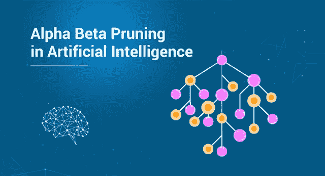
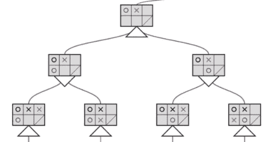
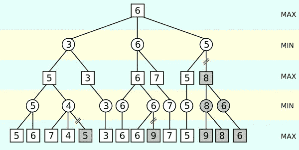

# 人工智能中的阿尔法贝塔剪枝是什么？

> 原文：<https://medium.com/edureka/alpha-beta-pruning-in-ai-b47ee5500f9a?source=collection_archive---------4----------------------->

Alpha Beta Pruning — Edureka

“修剪”这个词确实会让人想起砍掉树枝，或者对于那些熟悉数据科学的人来说，它会让人想起树的后期和前期修剪。Alpha-beta 剪枝本质上是对无用分支的剪枝。我们将讨论以下几点:

*   最小最大算法
*   阿尔法-贝塔剪枝

在这篇博客中，我们将回顾 alpha-beta 修剪，以及我们如何在多路径游戏中使用它来创建策略。这些路径中的每一条都会导致不同的结果。当我们有如此大量的棋步时(如在国际象棋或数独游戏中)，我们真的需要以一种明确的方式来制定游戏策略。这种游戏最终会进化，并产生高得不可思议的可能结果。所以我们需要考虑如何选择最好的行动。这必须在不花费猫居住在地球上的时间的情况下实现。

# 最小最大算法

就蛮力方法而言，minimax 算法更容易理解。它试图看到每一个可能的结果，然后试图优化手中的任何选项。

就像数独游戏一样，我们最终可以生成一棵由分支组成的树，其深度包含玩家在游戏中所有可能的移动。接下来，我们需要遍历这棵树。

# 阿尔法-贝塔剪枝

阿尔法贝塔修剪是所有关于减少我们的搜索树的大小(修剪)。虽然强力方法更容易使用，但这并不意味着它是最佳方法。很多时候，人们不需要访问所有可能的分支机构来提出手头的最佳解决方案。

因此，我们需要为最小-最大算法提供一些停止标准，使用这些标准，一旦找到该级别的保证最小值或最大值，它将停止搜索树的某个区域。这将防止算法使用额外的计算时间，使其响应更快。

最初的最小-最大算法以从左到右的方式执行树的遍历，同时也到达树的最深可能深度。这本质上是一种深度优先的方法。然后，它会发现必须直接分配给它上面的节点的值，而不会查看树的其他分支。

因此，停止条件的添加使得最小-最大像以前一样做出决定，但是它优化了算法的性能方面。

在下图中，我们有一个树，每个节点分配有不同的分数。一些节点用红色阴影表示，表示没有必要查看它们。

在树的左下方，minimax 遍历底部 max 层的值 5 和 6。它确定必须将 5 分配给其正上方的最小级别。

但是，在查看了右最大级别分支的 7 和 4 之后，它意识到上面的最小级别节点必须被分配最大值 4。因为正好在第一个最小级别之上的第二个最大级别将取 5 到最多 4 之间的最大值，很明显它会选择 5。接下来，它将继续遍历树，在树的其他分支中执行完全相同的一组操作。

总之，我们可以很容易地理解 alpha-beta 剪枝是如何优于 min-max 算法的，以及这些算法是如何成为状态空间搜索技术的基础的，从而为解决此类问题的更高级方法铺平了道路。

至此，我们结束了这篇人工智能文章中的 Alpha Beta 修剪。

如果你想查看更多关于人工智能、DevOps、道德黑客等市场最热门技术的文章，你可以参考 Edureka 的官方网站。

请留意本系列中的其他文章，它们将解释深度学习的各个其他方面。

> 1. [TensorFlow 教程](/edureka/tensorflow-tutorial-ba142ae96bca)
> 
> 2. [PyTorch 教程](/edureka/pytorch-tutorial-9971d66f6893)
> 
> 3.[感知器学习算法](/edureka/perceptron-learning-algorithm-d30e8b99b156)
> 
> 4.[神经网络教程](/edureka/neural-network-tutorial-2a46b22394c9)
> 
> 5.[什么是反向传播？](/edureka/backpropagation-bd2cf8fdde81)
> 
> 6.[卷积神经网络](/edureka/convolutional-neural-network-3f2c5b9c4778)
> 
> 7.[胶囊神经网络](/edureka/capsule-networks-d7acd437c9e)
> 
> 8.[递归神经网络](/edureka/recurrent-neural-networks-df945afd7441)
> 
> 9.[自动编码器教程](/edureka/autoencoders-tutorial-cfdcebdefe37)
> 
> 10.[受限玻尔兹曼机教程](/edureka/restricted-boltzmann-machine-tutorial-991ae688c154)
> 
> 11. [PyTorch vs TensorFlow](/edureka/pytorch-vs-tensorflow-252fc6675dd7)
> 
> 12.[用 Python 进行深度学习](/edureka/deep-learning-with-python-2adbf6e9437d)
> 
> 13.[人工智能教程](/edureka/artificial-intelligence-tutorial-4257c66f5bb1)
> 
> 14.[张量流图像分类](/edureka/tensorflow-image-classification-19b63b7bfd95)
> 
> 15.[人工智能应用](/edureka/artificial-intelligence-applications-7b93b91150e3)
> 
> 16.[如何成为一名人工智能工程师？](/edureka/become-artificial-intelligence-engineer-5ac2ede99907)
> 
> 17.[问学](/edureka/q-learning-592524c3ecfc)
> 
> 18. [Apriori 算法](/edureka/apriori-algorithm-d7cc648d4f1e)
> 
> 19.[用 Python 实现马尔可夫链](/edureka/introduction-to-markov-chains-c6cb4bcd5723)
> 
> 20.[人工智能算法](/edureka/artificial-intelligence-algorithms-fad283a0d8e2)
> 
> 21.[机器学习的最佳笔记本电脑](/edureka/best-laptop-for-machine-learning-a4a5f8ba5b)
> 
> 22.[12 大人工智能工具](/edureka/top-artificial-intelligence-tools-36418e47bf2a)
> 
> 23.[人工智能(AI)面试问题](/edureka/artificial-intelligence-interview-questions-872d85387b19)
> 
> 24. [Theano vs TensorFlow](/edureka/theano-vs-tensorflow-15f30216b3bc)
> 
> 25.[什么是神经网络？](/edureka/what-is-a-neural-network-56ae7338b92d)
> 
> 26.[模式识别](/edureka/pattern-recognition-5e2d30ab68b9)
> 
> 27.[tensor flow 中的对象检测](/edureka/tensorflow-object-detection-tutorial-8d6942e73adc)

*原载于 2019 年 9 月 12 日*[*www.edureka.co*](https://www.edureka.co/blog/alpha-beta-pruning-in-ai)*。*