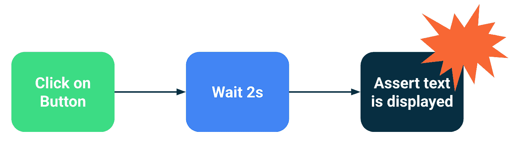

# 编写测试中空闲资源的替代方法:waitUntil APIs(更新)

> 原文：<https://medium.com/androiddevelopers/alternatives-to-idling-resources-in-compose-tests-8ae71f9fc473?source=collection_archive---------2----------------------->


在本文中，您将学习如何在 Compose 中使用`waitUntil`测试 API 来等待满足某些条件。在某些情况下，这是使用空闲资源的一个很好的替代方法。

[2023 更新] Tldr:使用[新的 wait until API](https://gist.github.com/JoseAlcerreca/c5b94db07f04b15255b1637ded3a3bbd)来同步合成测试(v1.4.0+)。

# 什么是同步？

对测试进行分类的一种方法是根据它们的范围。小测试，或称单元测试，关注于你的应用程序的小部分，而大测试，或称端到端测试，覆盖了你的应用程序的大部分。你可以在最新更新的[测试文档](https://developer.android.com/training/testing/fundamentals)中读到这种和其他类型的测试。


Different test scopes in an app

同步是让测试知道何时运行下一个操作的机制。您选择验证的代码块越大，就越难与测试同步。在单元测试中，完全控制要验证的代码的执行是很容易的。然而，随着我们将范围扩大到包括更多的类、模块和层，测试框架知道应用程序是否正在运行变得很棘手。


Correct synchronization between test and app

`androidx.test`还有，推而广之，[撰写测试](https://developer.android.com/jetpack/compose/testing)，引擎盖下用点小技巧，这样就不用太担心这个了。例如，如果主线程很忙，测试会暂停，直到它可以执行下一行。

然而，他们不可能什么都知道。例如，如果您在后台线程中加载数据，测试框架可能会过早地执行下一个操作，使您的测试失败。最糟糕的情况是这种情况只发生了很小一部分时间，使得测试[变得不稳定](https://developer.android.com/training/testing/fundamentals#flaky)。

# 选项 1:闲置资源

空闲资源是 Espresso 的一个特性，让你，开发者，决定应用什么时候忙。您有两种方法来使用它们:

**1。将它们安装在框架或库中，这些框架或库正在做测试看不到的工作。**

一个很好的例子是 [RxIdler](https://github.com/square/RxIdler) ，它包装了一个 RxJava 调度器。这是注册空闲资源的首选方式，因为它可以让您的测试设置与测试代码完全分离。

**2。修改测试中的代码，以明确公开关于应用程序是否繁忙的信息。**

例如，您可以修改您的存储库(或一个[测试 double](https://developer.android.com/training/testing/fundamentals/test-doubles) )来表明在从数据源加载数据时繁忙:

这并不理想，因为您正在污染您的生产代码，或者创建复杂的测试副本，并且在某些情况下它们很难安装。例如，如何在 Kotlin 流中使用空闲资源？*决赛*哪个更新？

相反，我们可以*等待*事情。

# 选项 2:等待事情…错误的方式

加载数据通常很快，尤其是在使用假数据的情况下，那么当您可以让测试休眠几秒钟时，为什么还要浪费时间让资源闲置呢？

该测试要么**运行速度慢于所需速度，要么**失败。当您有数百或数千个 UI 测试时，您希望测试尽可能快。

此外，有时模拟器或设备行为不当和 jank，使操作需要一点时间比那些 2000 毫秒，打破你的构建。当你有数百个测试时，这就成了一个大问题。



# 选项 3:以正确的方式等待事情的发生！

如果您不想修改测试中的代码以便在繁忙时公开，另一种选择是等待，直到满足某个条件，而不是等待任意长的时间。

在 Compose 中，您可以利用 [waitUntil](https://developer.android.com/reference/kotlin/androidx/compose/ui/test/junit4/ComposeTestRule#waitUntil(kotlin.Long,kotlin.Function0)) 函数，该函数接受另一个生成布尔值的函数。

2023/03/22 更新:从 Compose 1.4.0 开始，我们添加了一组新的 waitUntil APIs:

[1 . 4 . 0 之前:使用这些帮助器:[waituntlexists](https://gist.github.com/JoseAlcerreca/902a0c5a06e02a7411c0518c3f997dbf)， [waitUntilNodeCount](https://gist.github.com/JoseAlcerreca/ff5c1f43fe31f1a55ce462bc214cdc83)

…并像这样使用它们:

仅当您需要将测试与 UI 同步时，才使用这些 API。对每个测试语句进行同步会不必要地污染测试代码，使其更难维护。

那么你应该什么时候使用它呢？一个很好的用例是从可观察对象加载数据(使用 LiveData、Kotlin Flow 或 RxJava)。当您的 UI 需要在您认为它空闲之前接收多个更新时，您可能想要使用`waitUntil`来简化同步。

例如，当您从视图中收集流时:

你向它发射多种物品:

如果`repository`花费不确定的时间返回第一个结果，测试框架将认为“加载”是空闲状态(在`collectAsState`中分配的初始值)，并继续下一个语句。

因此，如果您确保 UI 没有显示加载指示器，您可以使测试更加可靠:

开心…等着吧…测试！

*代码片段许可证:*

```
Copyright 2022 Google LLC.
SPDX-License-Identifier: Apache-2.0
```