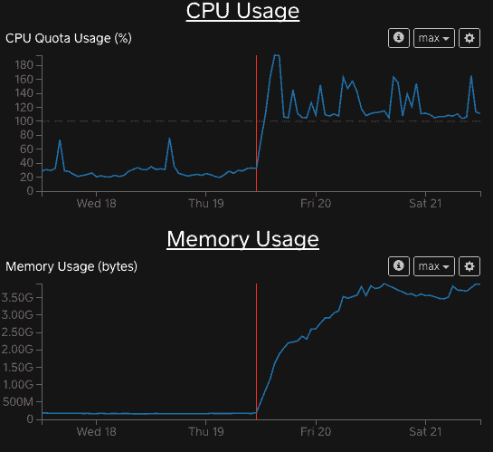
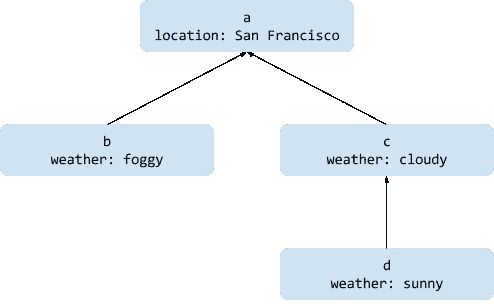
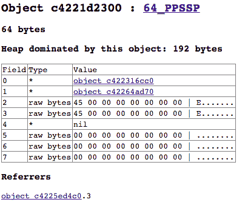

# 总是被关闭:一个 Go 资源泄漏的故事

> 原文：<https://medium.com/square-corner-blog/always-be-closing-3d5fda0e00da?source=collection_archive---------0----------------------->

> 注意，我们已经行动了！如果您想继续了解 Square 的最新技术内容，请访问我们的新家[https://developer.squareup.com/blog](https://developer.squareup.com/blog)

这是一个关于 Square 的一个 Go 服务发生资源泄漏的故事，以及发现根本原因的过程。面对尖锐而神秘的系统指标，我们使用了各种标准的和自制的工具来发现我们的一个核心内部框架中的一个微妙的错误。

今年早些时候，我们的一个 Go 服务开始使用明显更多的内存，打破了稳定的内存使用状态和可预测的垃圾收集模式。与此同时，CPU 的使用率也在上升。这个特定的服务通常使用大约 200 MB 的内存，但是这个数字很快就增长到了几 GB。



经过大量调查，发现对于大量请求，错误的组合导致服务将每个请求的元数据保留了近 17 个小时，而不是几毫秒。最终，有两个根本原因，这两个原因都被另一个服务中一个看似良性的配置错误逗乐了。虽然只有一个服务受到影响，但我们的许多其他 Go 服务都可能受到这个 bug 的影响。

这篇文章首先解释了我们遇到的错误，然后叙述了我们采取的各种调查步骤，其中一些步骤比其他步骤更有成效。

# 根本原因和经验教训

最终，根本原因是由于不正确地使用了 Go 的`[Context](https://golang.org/pkg/context/#Context)`类型。在 Square，我们有一个定制的框架来处理传入的请求并分派给处理函数。这个框架代码创建了有截止日期的`Context`，但是在请求完成后，没有取消`Context`来释放相关资源。这导致堆上每个`Context`对象的生命周期超过了其相关请求的生命周期。

这个根本原因被另一个服务中的一个配置更改所触动，该服务无意中将其客户端请求超时设置为 60，000 *秒*，而不是预期的 60，000 *毫秒*。这个客户端错误配置导致它的每个请求的`Context`被有问题的服务器保留了 60，000 秒(16.7 小时)，而不是几毫秒。

## 围棋语境:快速入门

在 Go 中，`Context`是一个接口，用作传递单个请求或操作的不可变元数据的一般方式。

一个`Context`由一个键-值对创建，可以被另一个`Context`包装以添加或覆盖数据。外部/包装/子`Context`可以访问其包装/父`Context`的数据，但反之亦然。

这里有一个简单的例子来说明`Context`是如何产生的:

```
rootCtx := context.Background() // Returns a singleton// a is a child of rootCtx
a := context.WithValue(rootCtx, "location", "San Francisco") // b is a child of a
b := context.WithValue(a, "weather", "foggy")// c is also a child of a and is unrelated to b
c := context.WithValue(a, "weather", "cloudy")// d is a child of c and overrides c's "weather" value
d := context.WithValue(c, "weather", "sunny")

fmt.Printf("location=%v weather=%v\n",
    a.Value("location"), a.Value("weather"))
fmt.Printf("location=%v weather=%v\n",
    b.Value("location"), b.Value("weather"))
fmt.Printf("location=%v weather=%v\n",
    c.Value("location"), c.Value("weather"))
fmt.Printf("location=%v weather=%v\n",
    d.Value("location"), d.Value("weather")) 

// Output:
location=San Francisco weather=<nil>
location=San Francisco weather=foggy
location=San Francisco weather=cloudy
location=San Francisco weather=sunny
```

示例中的`Context`之间的关系如下所示:



Contexts point to a parent, inheriting or overriding values.

除了存储键值数据之外，`Context`还可以创建相关的挂钟截止时间。当一个带有截止日期的`Context`被创建时，它注册一个回调函数，在截止日期过后将上下文标记为取消。这个回调函数由 Go 运行时内部调度。

```
// context.WithTimeout schedules a timer to cancel the context.
// The deadline for ctx will be the 5 seconds from the current
// wall clock time.
ctx, cancelCtx := context.WithTimeout(
    context.Background(), 5*time.Second)
defer cancelCtx()// ... some amount of time passes ...if ctx.Err() == nil {
    fmt.Println("The context is not done yet.")
    // ... do work ...
} else {
    // The context either timed out or cancelCtx() was called.
    fmt.Println("The context is done. Skipping work.")
}
```

重要的是，定时器的回调函数保持对要取消的`Context`的引用。如果应用程序代码没有显式取消`Context`，运行时定时器将保持设置，并且`Context`将保持在内存中，直到定时器触发。

这是我们的核心问题:我们的一些框架代码没有明确取消它正在创建并传递给处理程序代码的`Context`。

举例来说，框架代码本质上是这样做的:

```
func (s *Server) handleRequest(req *Request, conn *Connection) {
    // Create a context with a deadline an hour in the future.
    ctx, _ := context.WithTimeout(context.Background(), 1*time.Hour) // Attach metadata to the ctx using a helper function.
    ctx = s.contextWithMetadata(ctx, req) // Deserialize the request and delegate to a handler.
    reqProto := deserialize(req)
    if respProto, err := s.callHandler(ctx, reqProto); err != nil {
        conn.WriteError(err)
    } else {
        conn.WriteResponse(respProto)
    } // Even though this method returns quickly, ctx is retained
    // in memory for an hour since the pending deadline timer holds
    // a reference to it. Only after the timer fires can the ctx
    // be garbage collected.
}
```

使用`Context`的正确方法是，当相关操作——在我们的例子中是请求处理器——完成时，总是取消它们。根据经验，任何创建新的`Context`的代码都应该确保它被取消。

鉴于上面的错误代码片段，实际的代码修复很简单:

```
func (s *Server) handleRequest(req *Request, conn *Connection) {
    // Create a context with a deadline an hour in the future.
    ctx, cancelCtx :=
        context.WithTimeout(context.Background(), 1*time.Hour)
    // Use defer in case of panics or returning early.
    defer cancelCtx() // ... The rest of the method is the same ... // Right after this method returns, cancelCtx() is called,
    // allowing ctx to be garbage collected.
}
```

> 额外的阅读:`Context`实现使用`[timer.AfterFunc](https://golang.org/pkg/time/#AfterFunc)`来调度截止时间计时器，并使用`[timer.(*Timer).Stop](https://golang.org/pkg/time/#Timer.Stop)`方法在`Context`被取消时清除该计时器。查看一下[上下文。转到](https://golang.org/src/context/context.go#L369)源代码，看看定时器是如何创建和使用的。在内部，Go 运行时使用一个堆来管理所有未完成的计时器。其实现见 [runtime/time.go](https://golang.org/src/runtime/time.go) 源代码。

## 经验教训

**尽可能总是回滚**。这与其说是一个教训，不如说是一条被忽视的格言。当我们开始调查这个问题时，我们做的第一件事就是寻找在性能下降的同时发生的其他变化。虽然在几天内发生了一些有趣的变化，但是客户机超时配置的变化在时间方面有很好的相关性。尽管几名工程师在最初的审查中审查了配置更改，并且在这次调查中再次审查了配置更改，但每个人都认为它们无关紧要(“我们只是稍微改变了超时时间，没什么大不了的！”).

考虑到变更和事件之间的时间间隔，以及回滚客户端配置变更的成本非常低，我们应该立即回滚超时变更。这不会修复根本原因，但有助于确定进一步调查的位置。

**围棋工具上的空白让调查变得困难**。调试这个问题被 Go 工具中的一个明显的缺口所阻碍，如果我们的代码在 JVM 上运行，我们就不会面临这个问题。所有迹象都表明这个问题是一个相当典型的内存泄漏，但是 Go 并没有真正的工具来转储和分析堆。虽然 [pprof](https://golang.org/pkg/runtime/pprof/) 工具对于发现一些内存问题很有用，并且在这种情况下给出了一些有用的提示，但是它是有限的:它给出了关于对象被分配到哪里的统计信息，但是没有给出是什么在保留它们。

# 调查

这篇文章的其余部分大致按照时间顺序回顾了调查，并对事后看来是错误或误导的观察结果进行了一些评论。

总的进展如下。

1.  寻找与受影响的系统、其相关系统和硬件相关的代码和环境更改。
2.  深入研究 GC 日志。
3.  使用 pprof 分析堆。
4.  尝试使用运行时堆转储方法和自主开发的工具进行更深入的堆分析。
5.  在 canary 主机上试验不同的补丁，使用运行时 GC 挂钩来缩小保留对象的范围。
6.  搞定！

第四步和第五步需要的黑客攻击最多，但最终也是最有成效的。

## 步骤 1:寻找相关的变更

首先，我们列出了观察到的变化:

*   内存使用量突然攀升，从不到 200 MB 增加到 3–6 GB。
*   内存使用持续攀升，但似乎趋于平稳。进程没有耗尽内存，也没有被操作系统终止。*事后看来，这很有意义，因为当 17 个小时后* `*Context*` *清理计时器启动时，泄漏的对象最终被 GCed。*
*   之前可预测的 GC 运行速度显著下降。
*   持续较高的 CPU 使用率。

我们还列出了没有改变的内容:

*   对该服务的请求没有出现高峰。
*   最近没有部署该服务。
*   没有依赖关系的服务的相关部署。
*   没有调用服务的相关部署。*这一观察结果是不正确的，因为客户端超时变化最终是相互关联的。*

## 步骤 2:深入研究 GC 日志

因为我们看到了令人担忧的 GC 模式，所以我们决定从查看 GC 日志开始，找出任何奇怪的行为。阅读这些日志的主要收获是，尽管我们的堆不断增长，垃圾收集并没有花费太多的时间；每次 GC 运行都很短，并且只释放少量内存。

除此之外，这一步对于更好地理解 Go 的 GC 日志格式是一个有用的练习，所以让我们看一下我们遇到的一个片段:

```
GC forcedgc 848 @78217.082s 0%: 0.050+6819+3.3 ms clock, 0.10+0/3412/9164+6.6 ms cpu, 2474->2504->1908 MB, 3818 MB goal, 2 P
```

以下是如何解释第一行的组成部分:

*   `848`:这是进程开始以来的第 848 次垃圾收集。
*   `78217.082s`:此时进程已经运行了 78217.082 秒。
*   `0%`。大约 0%的进程总时间花在了 GC 上。
*   `0.050+6819+3.3 ms clock, 0.10+0/3412/9164+6.6 ms cpu`:三个 GC 阶段中每个阶段花费的时间:stop-the-world 扫描、并发标记和扫描以及 stop-the-world 标记终止。
*   `2474->2504->1908 MB`:GC 前和 GC 后的堆大小，以及活堆大小。Go 过度分配堆，所以在这种情况下，Go 对象只使用了分配的 2504 MB 堆中的 1908 MB。
*   `3818 MB goal`:垃圾收集器将开始下一次运行的堆大小。这是由当前 GC 运行后的堆大小和`[GOGC](https://golang.org/pkg/runtime/#hdr-Environment_Variables)`环境变量决定的，后者的默认值为 100，表示自上次 GC 以来新分配的数据与现有数据的比率。这种情况下目标背后的计算:1908 MB+(1908 MB *`GOGC`/100)≈3818 MB。
*   `2`:垃圾收集器使用的处理器数量。

垃圾收集器的清道夫也有一些额外的日志:

```
scvg521: 0 MB releasedscvg521: inuse: 2543, idle: 339, sys: 2883, released: 186, consumed: 2696 (MB)
```

清道夫将未使用的内存释放回系统，真正释放内存。

让我们来解释清道夫的输出:

*   `0 MB released`:没有内存返回系统。
*   `inuse: 2543` : Go 已经为其堆分配了 2543 MB 的内存，其中可能包括未使用的内存和死对象。
*   `idle: 339` : 339 MB 内存，以前包含可访问的对象，但现在不再包含。
*   操作系统已经请求了 2883 MB。
*   `released: 186` : 186 MB 内存被释放回操作系统。
*   `consumed: 2696` : 2696 MB 已经被操作系统分配给 Go。

## 步骤 3:用 pprof 分析堆

有了内存泄漏的证据，我们决定使用 pprof 来缩小内存泄漏代码的范围。Pprof 是一个标准的 Go 工具，用于转储、探索和可视化关于 Go 应用程序的内存和 CPU 使用的统计数据。使用 pprof，您可以分析单个转储，也可以分析两个不同转储之间的差异。后者有助于在应用程序稳定运行后发现变化。

我们的 Go 应用程序具有内部 HTTP 端点来为 pprof 检索数据，因此我们使用它来获取正在运行的进程的转储:

```
curl -sk [https://our-service:12345/debug/pprof/hea](https://our-service:12345/debug/pprof/head)p > heap.out
```

一旦我们有了一个转储，我们就能够使用 pprof 来显示哪些方法分配了最多的数据。这是我们运行的命令之一，它显示了分配最多未释放内存的函数。

```
# pprof takes both the binary of the app (service_binary in this
# case) and the dump (heap.out) as arguments.
go tool pprof -runtime --inuse_space service_binary heap.out (pprof) top1473.20MB of 1884.53MB total (78.17%)Dropped 1264 nodes (cum <= 9.42MB)Showing top 10 nodes out of 77 (cum >= 73.50MB)flat  flat%   sum%        cum   cum%
286.02MB 15.18% 15.18%   561.10MB 29.77%  context.WithDeadline
242.57MB 12.87% 28.05%   524.09MB 27.81%  square/up/xp/sakeutil.NewClientContextWithTimeout
224.52MB 11.91% 39.96%   224.52MB 11.91%  square/up/tracing.appendTiming
152.01MB  8.07% 48.03%   152.01MB  8.07%  runtime.rawstringtmp
128.54MB  6.82% 54.85%  1444.29MB 76.64%  square/up/sake/server.(*Server).handleRequest
122.02MB  6.47% 61.32%   122.02MB  6.47%  square/up/vendor/stash.corp.squareup.com/go/protobuf.git/proto.(*Buffer).DecodeRawBytes
85.51MB  4.54% 65.86%    87.07MB  4.62%  runtime.mapassign1
80MB     4.25% 70.11%    93.56MB  4.96%  time.AfterFunc
78.51MB  4.17% 74.27%   182.02MB  9.66%  context.WithCancel
73.50MB  3.90% 78.17%    73.50MB  3.90%  context.WithValue
```

这些行中的每一行都表明在特定函数中创建的对象使用了多少内存。不过，重要的是要注意，这仅表明对象是在哪里创建的，而不是仍然保留对它们的引用的内容。

仔细观察，处理所有传入请求的方法负责许多保留的对象，至少是间接的:

```
128.54MB  6.82% 54.85%  1444.29MB 76.64%  square/up/sake/server.(*Server).handleRequest
```

这一行表示`handleRequest`创建了 128 MB(堆的 6.82%)仍然可访问的对象。此外，`handleRequest` plus 方法可以从它那里获得 1.4 GB 的对象。在正常状态下，这两个数字最多只有几十 MB。

当我们第一次看到这些数据时，我们正确地假设请求处理代码正在泄漏对象。我们还注意到，尽管保留了大量的`Context`对象，但是请求消息没有被保留。然而，我们仍然不明白这一点的根本原因。事后看来，我们也可以注意到在`time.AfterFunc`内部分配 94 MB 内存是不寻常的，并进一步探究。

## 步骤 4:堆转储分析

此时，我们决定另辟蹊径。

虽然 pprof 向我们暗示了 request `Context`数据正在泄漏，但它没有指出泄漏的原因以及是什么在控制着它们。许多语言都有工具来转储应用程序的堆，分析和遍历对象图——例如，如果这是一个 Java 应用程序，我们会很高兴地启动 [Eclipse 内存分析器](http://www.eclipse.org/mat/)。不幸的是，Go 不是这些语言中的一种。

丰富的堆转储支持非常有用。通过遍历从保留对象到根对象的路径，可以更容易地找到对象没有被垃圾收集的原因。在这种情况下，我们希望找到一种保存大量请求相关数据的数据结构，我怀疑拥有一个真正的堆分析器工具会大大减少我们调试的时间。

虽然 Go 不支持探索堆，但是它在`runtime/debug`包中有一个非官方的方法，用于生成类似堆转储的东西:`[debug.WriteHeapDump](https://golang.org/pkg/runtime/debug/#WriteHeapDump)`。这个函数以二进制格式输出正在运行的进程的一些低级堆状态。Golang wiki 有[格式的不完整文档](https://github.com/golang/go/wiki/heapdump15)，所以我们最终不得不阅读`WriteHeapDump`源代码来理解它。

`WriteHeapDump`的输出有一个巨大的缺点:它实际上转储了每个对象的原始字节以及一个位集，该位集指示这些字节中的哪些字表示指向其他对象的指针。它省略了有关类型的任何数据，包括类型的名称。

在没有类型的情况下遍历一个对象图是非常乏味的，而且在大多数情况下是不可能的。我们发现找到明显的字符串并通过引用对象反向工作是推断对象类型的唯一方法。即使这样也需要知道 Go 如何在内存中表示核心数据结构，比如切片和地图。

> 旁白:Go 维护者已经参与了关于为堆分析构建适当支持的讨论，所以希望工具很快会变得更好。[这个请求](https://github.com/golang/proposal/blob/master/design/16410-heap-viewer.md)和[这个相关的讨论](https://github.com/golang/go/issues/16410)有一些脉络。

这是弃尸的样子。下面的每个字段行代表内存中的一个字，当一个字代表一个指针时，有些链接到其他对象。



A visual representation of a heap dump object, courtesy of [heapdump14](https://github.com/golang/go/wiki/heapdump14). This represents a struct of a specific Protocol Buffer message but determining that was a chore.

上面的图片来自一个开源项目， [heapdump14](https://github.com/golang/go/wiki/heapdump14) ，它大约是在 Go 1.4 版本编写的。较旧的 Go 运行时在堆中包含了更详细的类型信息，但是随着运行时在较新版本的 Go 中的发展，可用元数据的数量已经减少了。我们决定尝试使用这个工具来更好地理解堆对象图；让它运行需要将[这个补丁](https://github.com/randall77/heapdump14/compare/master...fjl:master.patch)应用到工具的源代码中，然后编写一个我们自己的额外补丁。

通过 heapdump14 遍历图形后，我们确定上图中的对象是如下所示类型的实例:

```
type SomeProtoMessage struct {
    FirstField       *string
    SomeBytes        []byte
    XXX_unrecognized []byte
}
```

图像中的“64_PPSSP”是 heapdump14 的类型名称。该数字由工具随机选择，但对于该类型是唯一的。`PPSSP`表示对象中每个词的类型:[指针，指针，标量，标量，指针]。根据上图，对象是 7 个单词，其中每个字段行代表一个单词。这不是`PPSSP`建议的 5；不清楚这个名称是如何形成的，也不清楚为什么转储类型有 7 个字，而不是预期的 3 个字(一个用于指针，两个用于切片)。

> Failed tangent:我们试图编写一个工具来遍历从我们的应用程序入口点可到达的所有类型，并为每种类型打印出一个 heapdump14 兼容的类型签名。我们无法在合理的时间内成功做到这一点，因此放弃了努力。好的一面是，我们学到了一些如何使用标准库在解析的不同阶段检查 Go 程序的源代码。

## 第四步 1/2:并不是所有的都失去了

虽然遍历堆最终是失败的，但这种努力并不完全失败。我们注意到堆中的字符串是一些类型被保留的有用提示——在我们的例子中尤其有用，因为对服务器的请求包含大量字符串。

考虑到这一点，我们编写了一个简单的工具来提取堆中常见字符串的计数。它还对 Square 的 RPC 框架用来表示请求 id 的不同格式的字符串进行计数。

以下输出示例表明，大部分保留的数据与来自单个服务的请求相关，即超时配置错误的服务。

输出的第一行显示了堆中请求 id 的计数——表明有多少请求在内存中仍有一些相关数据。

剩余的行首先输出一个计数，然后是`(p)`(如果计数是针对协议缓冲区消息中编码的字符串),最后是字符串本身，用反斜杠括起来。例如，`995090 (p) `application/x-protobuf``，意味着协议缓冲区字符串`application/x-protobuf`在堆中出现了 995090 次。

```
# Each request has a unique string ID in a uniform format.
# The following count shows lots of request ID strings in the heap.
Request ID counts: 1492947# The format of each following line is:
# count [(p) if protocol buffer string] `string in heap`995090 (p)     `application/x-protobuf`# Although the service has many different callers, only the name of
# the service with the misconfigured timeout shows up a lot.
497548         `the-misconfigured-calling-service`
497545 (p)     `Content-Length`
497545 (p)     `Accept`# The bad timeout value included in requests.
497545 (p)     `60000`497545 (p)     `X-Request-Deadline`
```

事后看来，我们真的应该在这一点上回滚违规的调用服务，但不幸的是我们没有这样做。

## 步骤 5:试验终结器

在这一点上，我们想要解决的谜团是为什么只有来自特定服务的请求会导致泄漏。我们使用了一些 hacky Go 运行时技巧来帮助，并最终解决了所有问题。

为了确定被保留的特定对象的特征，我们求助于 Go 的`[runtime.SetFinalizer](https://golang.org/pkg/runtime/#SetFinalizer)`函数。这个函数指示 Go 运行时在垃圾收集对象之前立即执行回调。设置回调很容易，尽管我不建议在实际的生产代码中使用它:

```
heapObject := new(string)runtime.SetFinalizer(heapObject, func(theObject *string) {
    // heapObject/theObject is about to be garbage collected.
    fmt.Println("bye!")
})
```

考虑到`SetFinalizer`,我们为一小组类型设置了终结器，并让我们的服务器偶尔记录每个类型被创建和被垃圾收集的次数。跟踪`Context` s 的代码大致如下:

```
var (
    contextNumber       int64
    contextsOutstanding int64
)func requestHandler(...) {
    ctx, _ := context_helper.NewContext(timeout) // To help debug, use a counter to link allocation and
    // and finalizer log messages.
    ctxNumber := atomic.AddInt64(&contextNumber, 1) // Keep a count of reachable Context objects.
    ctxOutstanding := atomic.AddInt64(&contextsOutstanding, 1) glog.Infof("gc-investigation: action=alloc type=Context " +
       "id=%d outstanding=%d",
       ctxNumber, ctxOutstanding) runtime.SetFinalizer(ctx, func(r context.Context) {
        ctxOutstanding := atomic.AddInt64(&contextsOutstanding, -1)
        glog.Infof("gc-investigation: action=finalize " +
            "type=Context id=%d outstanding=%d",
            ctxNumber, ctxOutstanding)
    }) // ...
}
```

这个日志记录的输出清楚地表明，一些`Context`没有被 GCed，但是请求对象被 GCed。未偿还债务的数量持续上升。在下面的代码片段中，在进程生命周期中分配的 162，573 个`Context`中，有 4，920 个留在内存中。

```
2017-04-21 23:42:21,919257 INFO [4] [server.go:635] gc-investigation: action=finalize type=Context id=162573 outstanding=4920
```

## 把所有的放在一起

至此，我们知道了`Context`正在泄漏，以及那些`Context`是在哪里产生的。我们重读了`Context`文档并浏览了它的源代码，以便更好地理解它是如何实现的。这让我们看到了它对`time.AfterFunc`的使用，以及它如何与运行时交互。然后，我们形成了一个假设，即这些计时器回调是泄漏的。对我们的服务器框架源代码的更彻底的阅读很快证实了这一点。

最后，修复是对我们的请求处理程序框架代码的一个非常简单的更改:

```
// Before
func requestHandler(...) {
    ctx, _ := context_helper.NewContext(timeout) // ...
}// After
func requestHandler(...) {
    ctx, cancelCtx := context_helper.NewContext(timeout)
    defer cancelCtx() // <-- Oops! // ...
}
```

这修复了我们在服务中发现的问题。由于该框架由其他内部 Go 应用程序共享，因此该修复也可以保护它们免受行为不端的客户端的攻击。

# 回首

回顾整个磨难重申了一些关键工程实践的重要性。

一个是 Go 关于不忽略返回错误和清除函数的约定是有充分理由的，不应该被随意忽略。鉴于`Context`文档清楚地说明了它释放资源，最初的框架代码不应该忽略与`Context` s 相关联的`CancelFunc`。我认为任何包含清除和错误返回值的代码都是例外，应该有清晰的文档记录。

另一种做法是，当代码与相关系统中的问题密切相关时，毫不犹豫地回滚代码。这样做的成本很低，但可能有助于缩小 bug 的触发范围。在这种特殊情况下，我们可以节省大量调试时间。

最后，除了调试之外，我们喜欢学习更多关于 Go 内部的各个部分以及围绕它们的工具生态系统。