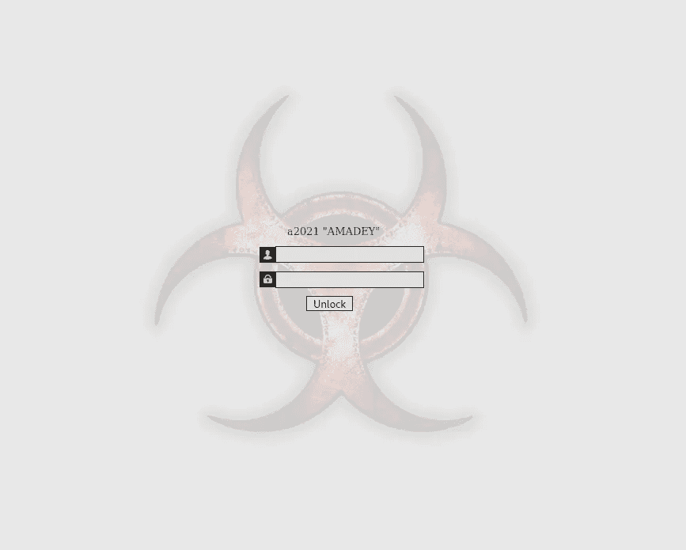
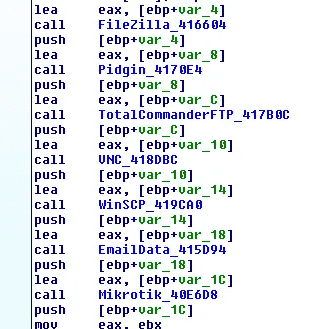
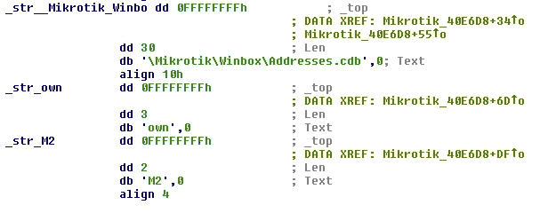
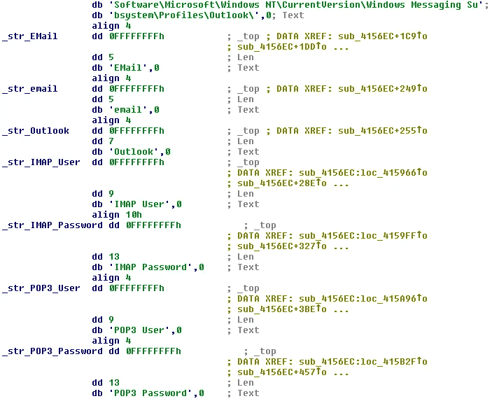

# Amadey stealer 插件增加了 Mikrotik 和 Outlook 收割功能

> 原文：<https://medium.com/walmartglobaltech/amadey-stealer-plugin-adds-mikrotik-and-outlook-harvesting-518efe724ce4?source=collection_archive---------0----------------------->

作者:杰森·里维斯和哈罗德·奥格登


去年，Zscaler[3]写了一篇文章，详细介绍了 Amadey 的新版本“a2020 Amadey”，它带有两个新插件“cred.dll”和“scr.dll”。最近，Amadey 再次更新为新版本“a2021 Amadey”这篇文章的目的是检查一些有趣的插件组件。



2021 Amadey Panel

这个新版本为“cred”stealter 插件增加了一些有趣的内容，因为它们增加了收集 Mikrotik 路由器数据和 Outlook 数据的功能:



旧版本的 Mikrotiks Winbox[1]会提供将您的数据导出到“WBX”文件的选项，该文件会存储您管理的设备的未加密的用户名和密码以及未加密的 Addresses.cdb 文件。也有一些免费的工具可以帮助解析这些文件[2]来恢复丢失的凭证。



另一个新增功能是从注册表中解析 Outlook 配置文件，以获取帐户数据:



Amadey 等装载机继续更新他们的工具集，以便在地下销售，Outlook 帐户和 Mikrotik 帐户收集的添加应该不会让任何人感到惊讶，因为这两者都可能是犯罪活动的宝贵数据集。

# IOCs

```
d860bd740863e9280761ad3162d4b135d7e8cac7a9aaf302a92496e3217beb95
b7eecf0ae1204a0301509d9dd1ad1a7329463ed5
fa07c8de6db23c1be2ee8da97c5621f7fc006469f84e2835195fc943de43d544
d8932ee7ff3b37f1f566dd70233aab7e8f388558
```

# 参考

1:[https://forum.mikrotik.com/viewtopic.php?t=111705](https://forum.mikrotik.com/viewtopic.php?t=111705)

2:【https://github.com/jabb3rd/RouterOS_Tools 

3:[https://www . z scaler . com/blogs/security-research/latest-version-amadey-introduces-screen-capture-and-pusses-remcos-rat](https://www.zscaler.com/blogs/security-research/latest-version-amadey-introduces-screen-capturing-and-pushes-remcos-rat)