# Amazon Athena——新的无服务器数据分析工具

> 原文：<https://medium.com/edureka/amazon-athena-tutorial-c7583053495f?source=collection_archive---------0----------------------->

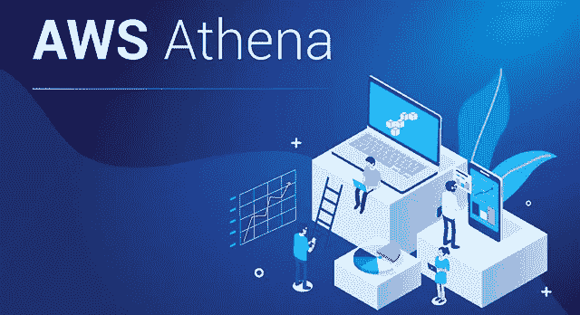

AWS Athena — Edureka

数据分析是一个非常复杂的过程，人们一直试图简化它。有许多分析工具，甚至流行的科技巨头亚马逊也提供了名为 *Amazon Athena* 的 AWS 服务。这篇 Amazon Athena 教程将指导你了解 Amazon Athena 的基础和高级用法。

Amazon Athena 是一个交互式数据分析工具，用于在相对较短的时间内处理复杂的查询。它是无服务器的，因此没有设置的麻烦，也不需要管理基础架构。这不是一个数据库服务，因此，你只需为你运行的查询付费。您只需将您的数据指向 S3，定义所需的模式，使用标准 SQL 就可以了。

本文涵盖的主题如下:

*   亚马逊雅典娜简介
*   Microsoft SQL Server 和 Amazon Athena 的区别
*   亚马逊雅典娜的使用
*   访问亚马逊雅典娜
*   雅典娜的特征
*   演示— I(在 Athena 中创建表格)
*   演示二(MySQL 和 Athena 的比较)

# 亚马逊雅典娜简介

2016 年 11 月 20 日，亚马逊推出了雅典娜作为其服务之一。如前所述，Amazon Athena 是一种无服务器查询服务，使用标准 SQL 简化了存储在亚马逊 S3 的数据分析。只需在 AWS 管理控制台中点击几下，客户就可以将 Amazon Athena 指向他们存储在亚马逊 S3 中的数据，并使用标准 SQL 运行查询，在几秒钟内获得结果。

使用 Amazon Athena，不需要设置或管理基础设施，客户只需为他们运行的查询付费。Amazon Athena 自动扩展，并行执行查询，即使是大型数据集和复杂查询，也能快速获得结果。现在，你知道什么是 Amazon Athena 了，让我带你了解一下它与 SQL Server 的区别。

# Microsoft SQL Server 和 Amazon Athena 的区别

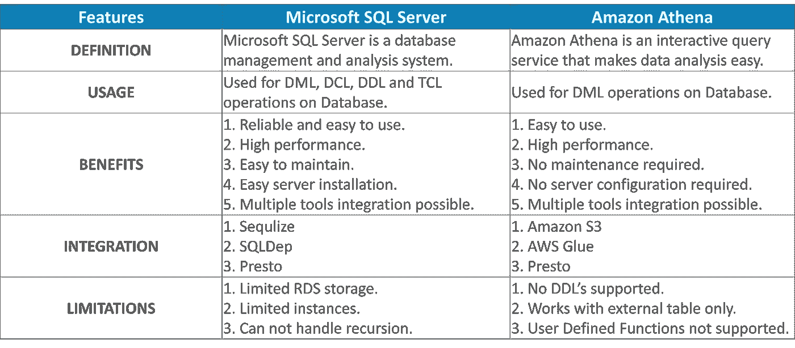

# 亚马逊雅典娜的使用

如果你是一名数据分析师，并且有分析存储在 S3 上的数据的经验，你会与此相关，

数据分析师/开发人员:你们提供存储吗？

AWS:是的。数据分析师/开发人员:你们有分析工具吗？

AWS:不确定。"

亚马逊致力于此，推出了*亚马逊雅典娜*。现在，您有了一个处理数据的工具。Athena 帮助您分析存储在亚马逊 S3 的非结构化、半结构化和结构化数据。使用 Athena，您可以为数据集创建动态查询。Athena 还与 AWS Glue 一起工作，为您提供一种在 S3 中存储元数据的更好方法。

使用 AWS CloudFormation 和 Athena，可以使用命名查询。命名查询允许您命名查询，然后使用名称调用它。

数据科学家和开发人员可以使用 AWS 的这种交互式服务来偷偷查看表，而不是运行完整的查询。它还用于从 S3 获取数据，使用雅典娜 JDBC 驱动程序将其加载到不同的数据存储，用于日志存储/分析和数据仓库事件。

现在你知道 Athena 是一个有趣的工具，让我们在这个亚马逊 Athena 教程中了解如何从亚马逊获得这个令人惊叹的服务。

# 访问亚马逊雅典娜

访问 Athena 非常简单，可以通过以下方式完成:

*   AWS 控制台
*   AWS CLI
*   雅典娜和你的 JDBC

这些是访问 Amazon Athena 的几种方式。到目前为止，您已经非常了解 Amazon Athena 的所有重要内容。让我带你了解一下雅典娜的不同特征。

# 雅典娜的特征

在亚马逊提供的众多服务中，雅典娜是其中之一。它有许多适合数据分析的特性。下面就让我们来逐一看看不同的特性。

1.  **易于实现** : Athena 不需要安装。它可以从 AWS 控制台直接访问，也可以通过 AWS CLI 直接访问。
2.  **无服务器**:它是无服务器的，因此最终用户不需要担心基础设施、配置、扩展或故障。雅典娜独自处理一切。
3.  **按查询付费** : Athena 只对你运行的查询收费，即每个查询管理的数据量。如果您能够压缩它们并相应地格式化您的数据集，您可以节省很多。
4.  快速 : Athena 是一个非常快速的分析工具。它可以在更短的时间内执行复杂的查询，方法是将复杂的查询分解成更简单的查询并并行运行，然后将结果组合起来以给出所需的输出。
5.  **安全**:借助 IAM 策略和 AWS 身份，Athena 让您能够完全控制数据集。由于数据存储在 S3 存储桶中，IAM 策略可以帮助您管理对用户的控制。
6.  **高可用**:在 AWS 的保证下，Athena 是高可用的，用户可以全天候执行查询。就像 AWS 是 99.999%可用一样，Athena 也是。
7.  **集成**:雅典娜最大的特点就是可以和 AWS 胶水集成。AWS Glue 将帮助用户创建一个更好的统一数据存储库。这有助于您创建更好的数据版本、更好的表、视图等。

很棒不是吗？Athena 同时提供了很多功能，性价比很高。

现在你一定对 AWS Athena 印象深刻。既然你对雅典娜了解很多。让我们卷起袖子，通过一个小演示来了解 Athena 的工作原理。在这个亚马逊雅典娜教程中，我们将进行两个演示，让我们看看他们是什么。

# 演示— I(在 Athena 中创建表格)

正如您对 Amazon Athena 的了解，让我们深入了解一下如何查询存储为。亚马逊 S3 使用雅典娜的 json 文件。

1.  创建多个包含条目的 JSON 文件
2.  把文件储存到 S3 桶里
3.  为存储在 S3 的文件创建一个外部表
4.  编写一个用于访问数据的查询

下面就让我们来逐一了解一下如何做好上述任务。

1.  创建 JSON 文件。(创建数据时不使用换行符)

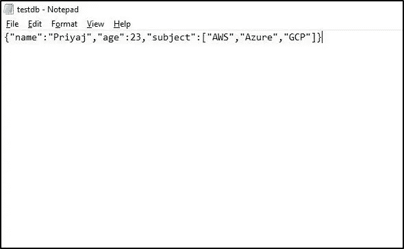

2.我们将使用 AWS CLI 访问 S3 存储桶

a.配置 IAM 用户

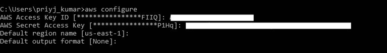

b.创建 S3 存储桶

c.将文件复制到 S3 桶

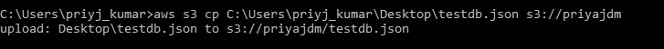

3.在 Athena 创建外部表。有两种方法可以做到这一点:

a.使用 AWS 胶水爬行器

b.用手

4.我们将手动创建它:

a.创建表格。

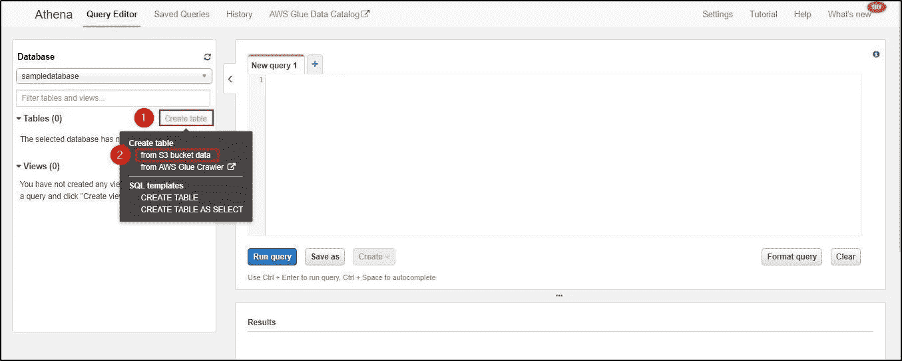

b.如果没有数据库，请创建一个新的数据库。给一个表名。给出你的文件的位置。

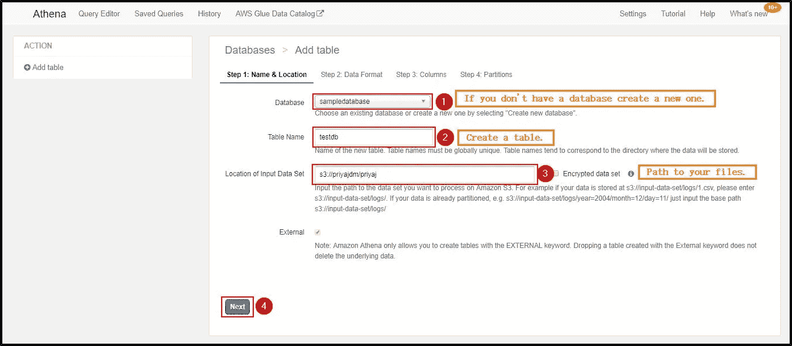

c.选择您将使用的文件类型。选择文件中数据的体系结构。

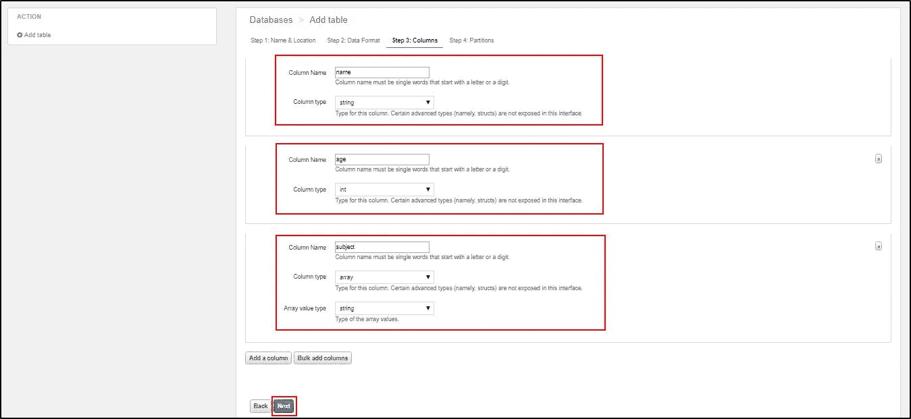

d.由于输入的数据并不复杂，我们不需要分区。点击“创建表格”。

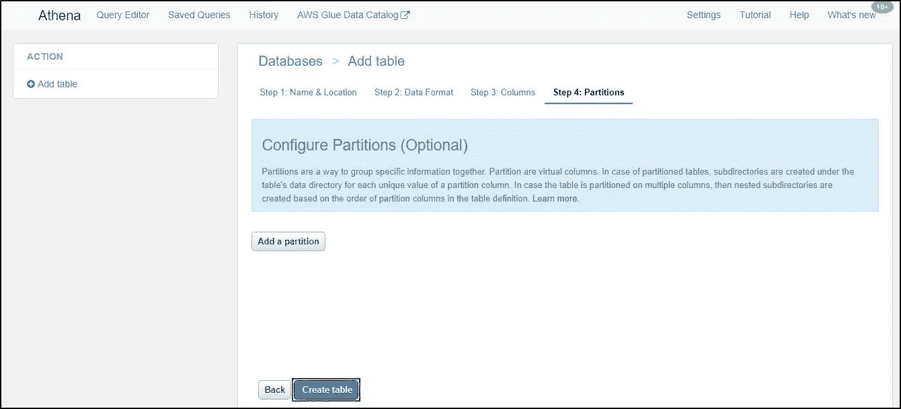

e.Athena 将自动生成用于创建外部表的查询并运行它。

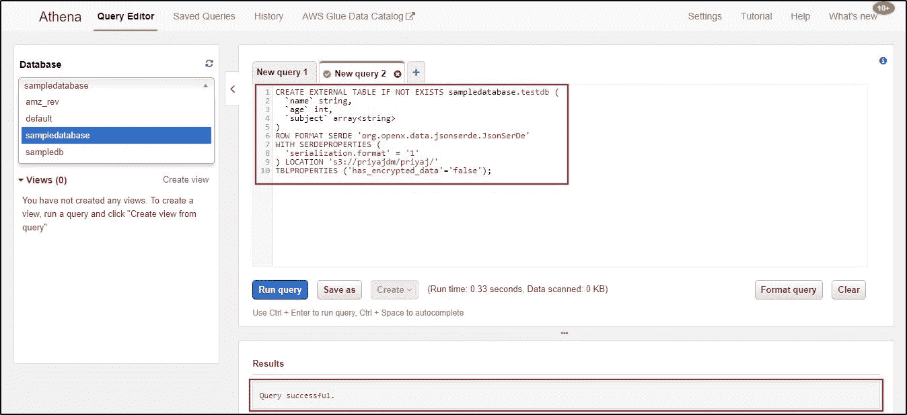

您已经准备好了外部桌子。

5.我们编写一个查询来选择表中的所有数据。

**a . select * from**testdb**；**

b.单击 Run Query，您的表中就有了所有的信息。

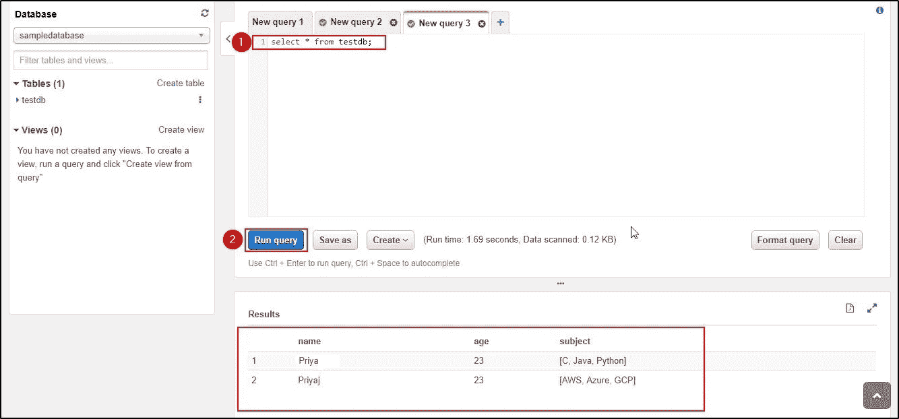

# 演示二(Amazon Athena 和 MySQL 之间的比较)

在这篇 Amazon Athena 教程中，我们将比较 MySQL 和 Athena，并了解在 Athena 中，即使是简单的查询也能花费更少的时间。

1.  将 CSV 文件加载到 MySQL 需要大约 1 个小时，但是在 Athena 中，将 CSV 文件上传到 S3 只需要 3 分钟，创建一个相同的表格只需要 0.42 秒。

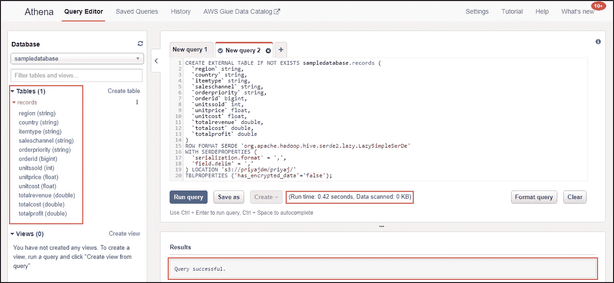

2.选择查询。select * from table。

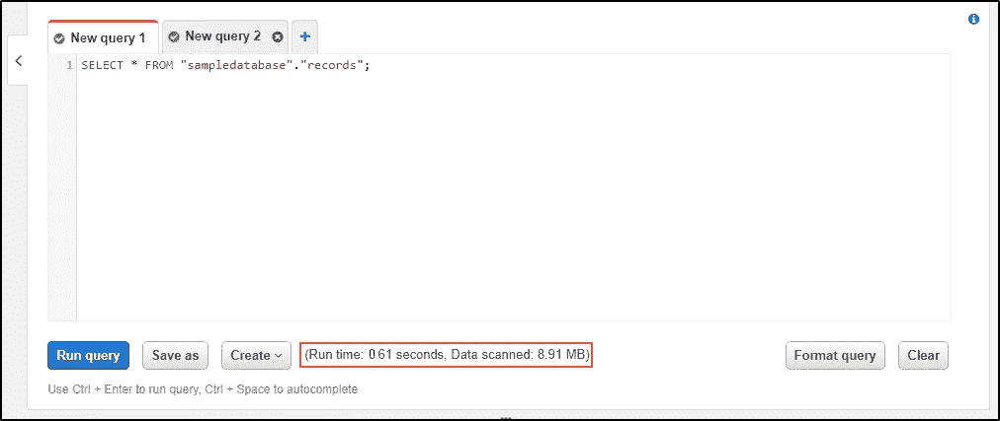

在 Athena 中选择查询。

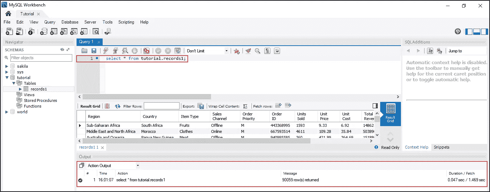

在 MySQL 中选择查询。

3.从表中选择特定的列。

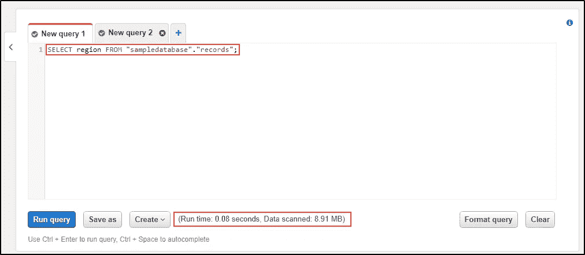

在 Athena 中选择特定的列

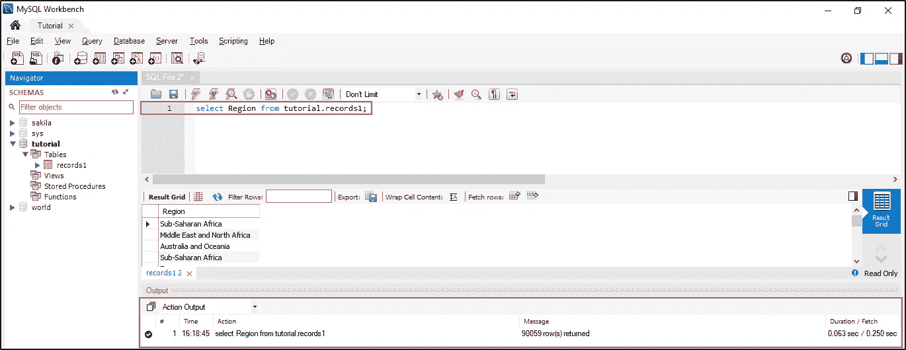

在 MySQL 中选择特定的列。

4.获取特定列的计数。

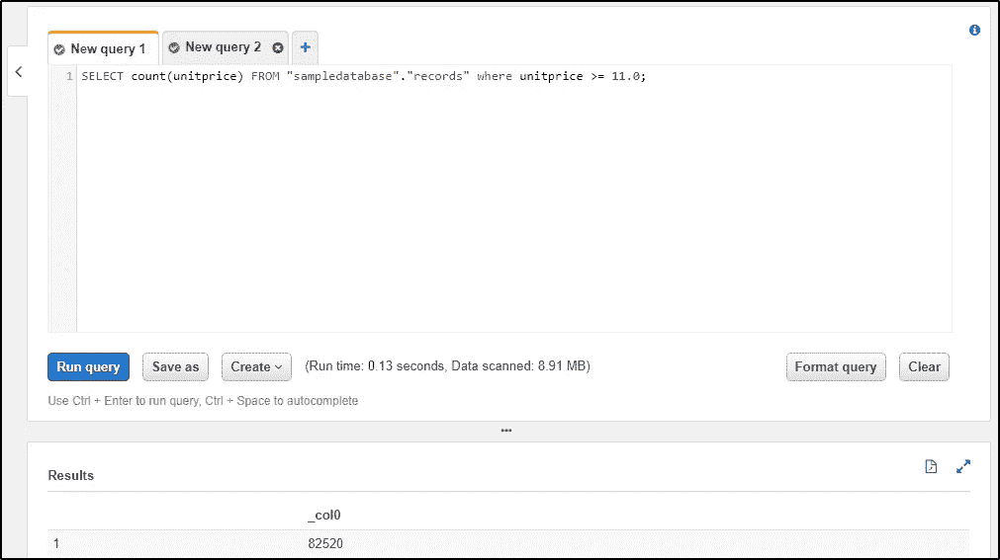

Athena 中特定列的计数。

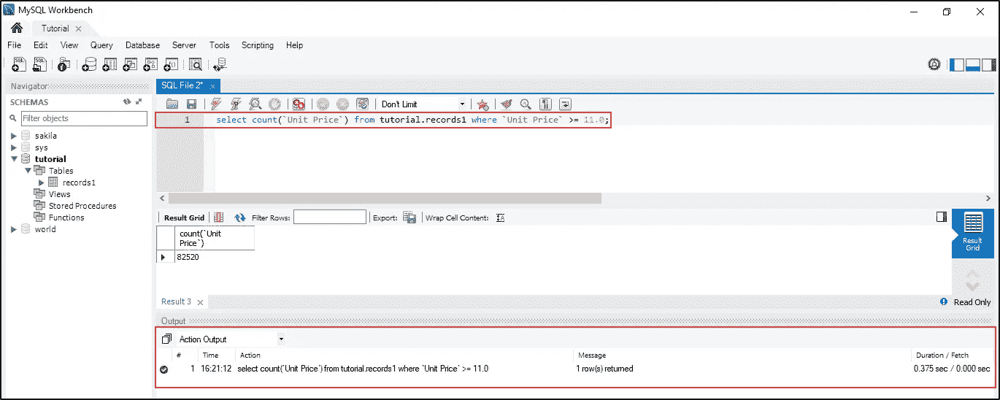

MySQL 中特定列的计数。

5.计算表中的记录数。

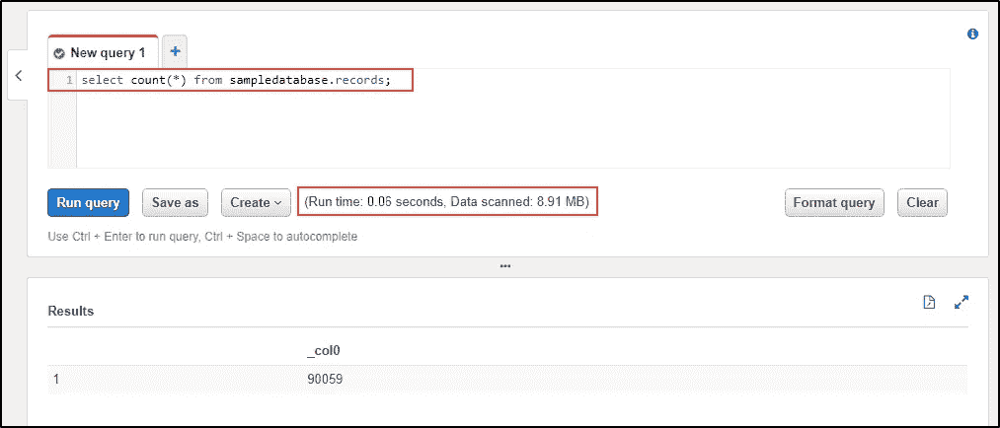

统计雅典娜中的所有记录。

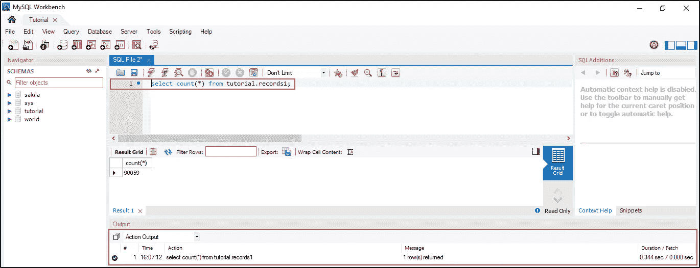

统计 MySQL 中的所有记录。

6.选择具有指定范围的查询。

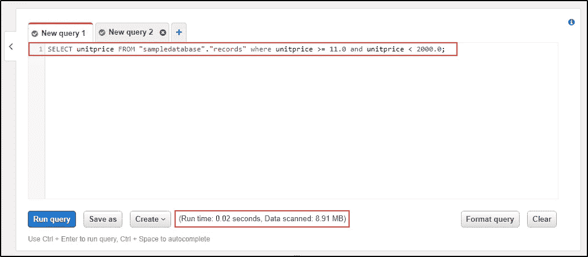

在 Athena 中选择上述范围内的查询。

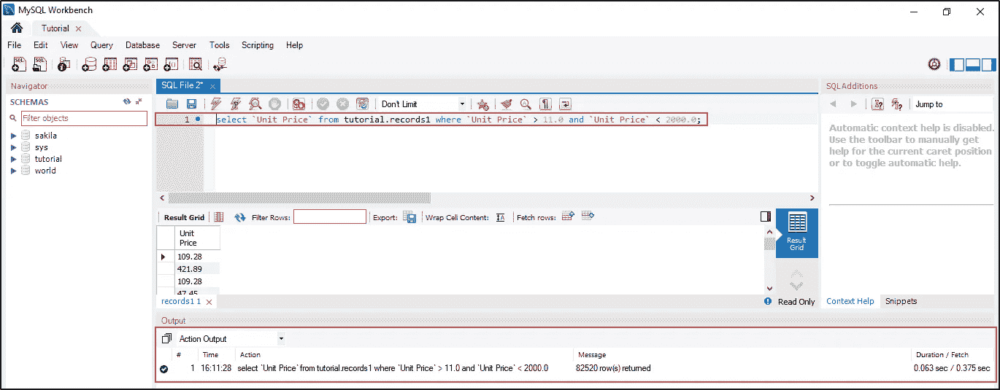

在 MySQL 中选择上述范围内的查询。

这是对 [MySQL](https://www.edureka.co/blog/mysql-tutorial?utm_source=medium&utm_medium=content-link&utm_campaign=amazon-athena-tutorial) 和亚马逊 Athena 之间基本 SQL 命令的简单比较。

如果你想查看更多关于人工智能、DevOps、道德黑客等市场最热门技术的文章，你可以参考 Edureka 的官方网站。

请留意本系列中的其他文章，它们将解释 AWS 的各个方面。

> *1。* [*AWS 教程*](/edureka/amazon-aws-tutorial-4af6fefa9941)
> 
> *2。* [*AWS EC2*](/edureka/aws-ec2-tutorial-16583cc7798e)
> 
> *3。*[*AWS Lambda*](/edureka/aws-lambda-tutorial-cadd47fbd39b)
> 
> *4。* [*AWS 弹性豆茎*](/edureka/aws-elastic-beanstalk-647ae1d35e2)
> 
> *5。*[*AWS*](/edureka/s3-aws-amazon-simple-storage-service-aa71c664b465)
> 
> *6。* [*AWS 控制台*](/edureka/aws-console-fd768626c7d4)
> 
> *7。* [*AWS RDS*](/edureka/rds-aws-tutorial-for-aws-solution-architects-eec7217774dd)
> 
> *8。* [*AWS 迁移*](/edureka/aws-migration-e701057f48fe)
> 
> 9。[*AWS Fargate*](/edureka/aws-fargate-85a0e256cb03)
> 
> *10。* [*亚马逊 Lex*](/edureka/how-to-develop-a-chat-bot-using-amazon-lex-a570beac969e)
> 
> *11。* [*亚马逊光帆*](/edureka/amazon-lightsail-tutorial-c2ccc800c4b7)
> 
> *12。* [*AWS 定价*](/edureka/aws-pricing-91e1137280a9)
> 
> *13。* [*AWS 简历*](/edureka/aws-resume-7453d9477c74)
> 
> *14。* [*AWS CLI*](/edureka/aws-cli-9614bf69292d)
> 
> *15。* [*亚马逊 VPC 教程*](/edureka/amazon-vpc-tutorial-45b7467bcf1d)
> 
> *15。*[*AWS vs Azure*](/edureka/aws-vs-azure-1a882339f127)
> 
> *17。* [*内部部署 vs 云计算*](/edureka/on-premise-vs-cloud-computing-f9aee3b05f50)
> 
> *18。* [*亚马逊迪纳摩 DB 教程*](/edureka/amazon-dynamodb-tutorial-74d032bde759)
> 
> *19。* [*如何从快照恢复 EC2？*](/edureka/restore-ec2-from-snapshot-ddf36f396a6e)
> 
> *20。* [*AWS 代码提交*](/edureka/aws-codecommit-31ef5a801fcf)
> 
> *21。* [*顶级 AWS 架构师面试问题*](/edureka/aws-architect-interview-questions-5bb705c6b660)
> 
> *22。* [*如何从快照恢复 EC2？*](/edureka/restore-ec2-from-snapshot-ddf36f396a6e)
> 
> *23。* [*使用 AWS 创建网站*](/edureka/create-websites-using-aws-1577a255ea36)
> 
> *24。* [*亚马逊路线 53*](/edureka/amazon-route-53-c22c470c22f1)
> 
> *25。* [*用 AWS WAF 保护 Web 应用*](/edureka/secure-web-applications-with-aws-waf-cf0a543fd0ab)

*原载于 2019 年 1 月 8 日*[*www.edureka.co*](https://www.edureka.co/blog/amazon-athena-tutorial)*。*