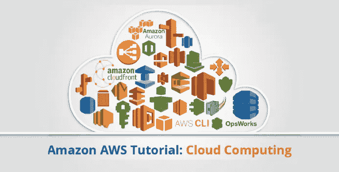

# 亚马逊网络服务综合指南

> 原文：<https://medium.com/edureka/amazon-aws-tutorial-4af6fefa9941?source=collection_archive---------1----------------------->

AWS Tutorial - Edureka

这份 AWS 教程是为所有有兴趣学习云计算的专业人士设计的，它将帮助你在职业道路上瞄准 *AWS 解决方案架构师、*、 *DevOps 工程师、*、*云架构师*等。在今天的 AWS 教程中，我们将首先尝试了解什么是 AWS，然后继续学习它的服务，最后，我还添加了一个简短的视频*进行简要总结，但首先让我们了解一下为什么我们要学习 AWS，为什么突然需要了解云技术。*

早在 2006-2007 年，公司使用自己的私有服务器来创建存储、计算等服务。但现在随着互联网速度变得更快，大大小小的公司都开始了解云的力量，因此他们将数据转移到云以提高性能，以便他们可以专注于核心竞争力。

*例如，*网飞是当今全世界都在使用的流行视频流媒体服务，早在 2008 年，网飞就遭遇了严重的数据库损坏，他们的运营中断了三天。问题在于伸缩性，这时他们意识到需要一个高度可靠的、水平可伸缩的、云中的分布式系统。从那以后，他们的增长就一落千丈。

Gartner 称，到 2020 年，企业的“无云”政策将像今天的“无互联网”政策一样罕见。 *很有趣吧？*

由于每个公司都开始以这样或那样的方式采用云服务，而且 AWS 是云服务行业的主要参与者，所以了解 AWS 云服务是有意义的。

# 什么是 AWS？

亚马逊网络服务(AWS)是 Amazon.com 的一家子公司，以非常低廉的价格提供云计算服务，因此它的客户群从 Pinterest(只有 5 名员工)这样的小公司到 D-Link 这样的大企业都很强大。

# 什么是云计算？

它使用互联网上的远程服务器来存储、管理和处理数据，而不是本地服务器或个人电脑。

云计算基本上有 3 个类别:

*   **SaaS(软件即服务)**

它允许公司使用软件，而不必购买它们，这大大减少了公司的支出，因为它们已经安装在云服务器上，可以快速部署，因此节省了时间。

*   **平台即服务**

它允许开发人员构建应用程序，在项目上进行协作，而无需购买或维护基础设施。

*   **IaaS(基础设施即服务)**

它允许公司租用服务器、存储空间等。来自云提供商。

当我们谈论 AWS 时，它更像是一个 IaaS，接下来，让我们深入了解 AWS，了解它能为我们提供什么样的服务，但在此之前，让我们了解一下为什么业界对 AWS 有如此多的讨论，从而导致了这篇精彩的 AWS 教程！

# 全球云计算预测和市场预测

以下是行业知识领袖提供的一些有趣见解，让我们清楚地了解为什么强烈建议 IT 专业人员理解和采用 AWS:

> 全球公共云服务支出将以 19.4%的复合年增长率(CAGR)增长，从 2015 年的近 700 亿美元增长到 2019 年的超过 1410 亿美元。**——福布斯**
> 
> 到 2019 年，100 家最大供应商的新软件投资中超过 30%将从云优先转向纯云。**——高德纳**
> 
> 自 2011 年以来，基础设施即服务(IaaS)市场的收入每年增长 40%以上，预计到 2019 年每年将继续增长 25%以上。 **—高德纳**

现在，让我们继续学习 AWS 教程，探索 AWS 提供服务的不同领域:

*   **Compute** 它用于利用强大的处理器在云上处理数据，这些处理器同时服务于多个实例。
*   **存储和内容交付** 顾名思义，存储是用来在云中存储数据的，这些数据可以存储在除内容交付之外的任何地方，另一方面，用来缓存离用户更近的数据，以提供低延迟。
*   **数据库** 数据库域用于提供 AWS 管理的可靠的关系和非关系数据库实例。
*   **联网** 它包括提供各种联网功能的服务，如安全性、更快的访问等。
*   **管理工具** 它包括可用于管理和监控您的 AWS 实例的服务。
*   **安全和身份** 它包括用户认证服务或限制访问您的 AWS 资源上的某一组受众。
*   应用服务包括通知、电子邮件和排队等简单服务。

为了涵盖世界上所有客户的需求，Amazon 在每个领域下进一步对服务进行了分类。让我们逐一讨论。

## 计算

1.  **AWS EC2**

这是一种在云中提供可调整计算能力的 web 服务。它旨在使开发人员更容易进行网络规模的计算。要了解更多关于这项服务的信息，你可以参考我们的 AWS EC2 博客。

**2。AWS 弹性豆茎**

Elastic Beanstalk 允许您在 AWS 中快速部署和管理应用程序，而无需担心底层基础设施。

**3。AWS 弹性负载均衡**

ELB 自动管理实例上的工作负载，并在一个实例出现故障时将它们分配给其他实例。

**4。AWSλ**

AWS Lambda 用于执行后端代码，无需担心底层架构，你只需上传代码，它就能运行，就这么简单！

**5。AWS 自动缩放**

自动缩放功能用于根据需要自动放大和缩小。

## **存储和内容交付**

1.  **S3 AWS**

S3 代表简单存储服务，它用于在 AWS 云中以对象的形式存储数据。

**2。亚马逊 CloudFront**

CloudFront 是一个内容交付网络，用于将数据缓存到边缘位置，从而减少延迟。

**3。亚马逊 EBS**

Amazon 弹性块存储是一种存储服务，其中每个存储块就像一个独立的硬盘驱动器。

**4。亚马逊冰川**

Glacier 是亚马逊提供的存档服务，提供低成本的数据存档。

**5。AWS 进出口滚雪球**

它提供用户位置和 AWS 数据中心之间的物理数据传输，用于传输数据的设备称为雪球。

**6。AWS 存储网关**

它用于在您的内部软件设备和 AWS 云之间提供与数据安全功能的无缝集成。

## 数据库ˌ资料库

1.  **亚马逊极光**

它是一个关系数据库引擎，结合了高端商业数据库的速度和可靠性以及开源数据库的成本效益和简单性。

**2。亚马逊 RDS**

Amazon RDS 是一个托管关系数据库服务，它在 6 个常见的数据库中执行常规数据库任务，如 Amazon Aurora、MySQL、MariaDB、Oracle、Microsoft SQL Server 和 PostgreSQL。

**3。亚马逊 DynamoDB**

这是一个完全托管的非 SQL 数据库服务。它以极低的延迟和可伸缩性而闻名。

**4。亚马逊弹性缓存**

它是一种 web 服务，使得在云中设置、管理和扩展分布式缓存环境变得容易。

**5。亚马逊红移**

Amazon Redshift 是云中完全托管的 Pb 级数据仓库服务。

## 建立工作关系网

1.  **VPC AWS**

亚马逊 VPC 让你在自己定义的虚拟网络中启动 AWS 资源。它非常类似于您在数据中心运行的传统网络。

**2。AWS 直接连接**

它可以帮助您在房屋和 AWS 之间建立专用连接，从而提供比基于互联网的连接更好的网络性能和吞吐量。

**3。亚马逊 53 号公路**

Route 53 是亚马逊 AWS 推出的高可扩展性、高可用的域名系统。该名称引用了 TCP 和 UDP 的端口 53，DNS 请求在该端口被寻址。

## 管理工具

**1。亚马逊云观察**

它是 AWS 的一个监控工具，用于跟踪 AWS 资源和您在 Amazon AWS 上运行的应用程序。

**2。自动气象站云形成**

这是一项帮助你建立和模拟亚马逊 AWS 资源的服务，这样你就可以花更少的时间管理这些资源，把更多的时间放在开发上。

**3。AWS CloudTrail**

AWS CloudTrail 是一个日志服务，它记录对您的 Amazon AWS 帐户的 API 调用，并将其交付给您。

**4。AWS 命令行工具**

这是一个管理所有 AWS 服务的一体化工具，只需下载和配置一个工具，就可以通过命令行管理所有 AWS 服务。

**5。AWS OpsWorks**

这是一个配置管理工具，帮助使用 Chef 配置和操作各种大小和形状的应用程序。

**6。值得信赖的顾问**

Trusted Advisor 是一款定制的云监控工具，可分析您的 AWS 环境，并提供关于费用、性能改进、安全差距和可靠性的见解。

## 安全性和身份

1.  **AWS 身份和访问管理(IAM)**

它是一项 AWS 服务，帮助您控制用户对 AWS 资源的访问。

**2。AWS 密钥管理服务**

它是一项托管服务，可帮助您创建和控制用于加密数据的加密密钥，并使用硬件安全模块来保护密钥的安全。

**3。亚马逊 SES**

这是一项经济高效的电子邮件服务，建立在 Amazon.com 可扩展且可靠的基础设施之上

**4。亚马逊社交网络**

它是 AWS 提供的一个 web 服务，管理向订阅的**端点或客户端的消息传递。**

**5。亚马逊 SQS**

它是一种快速、可靠和可扩展的消息队列服务，可用于以任何吞吐量水平传输任何数量的数据，而不会丢失任何消息或不使用任何其他服务。

# **AWS 定价**

*   AWS 遵循按使用付费模式，这意味着您只需为您使用的内容付费。例如，如果您在 AWS 上的 S3 上使用 10GB 的空间，您将只为这 10GB 付费，传统上您必须提前购买“x”量的存储空间，比如 20GB，即使您在购买的空间中使用了 10GB，您也将为整个 20GB 付费。
*   您可以免费开始使用 AWS，AWS 运行一个免费使用层，您可以在其中以非常基本的方式免费使用 AWS 服务。

# AWS 认证

现在，在您了解了所有这些 AWS 服务之后，接下来会做什么呢？
在当今的 IT 界，AWS 认证是非常受欢迎的证书。你可以计划获得认证，并从亚马逊提供的大量认证中进行选择。

最受欢迎的认证是助理解决方案架构师认证。

# **AWS 工作岗位**

## **谁是解决方案架构师？**

解决方案架构师通常是解决方案开发团队的一部分，他将功能需求转化为架构。

关于 AWS，解决方案架构师将为现有系统设计和定义 AWS 架构，将它们迁移到云架构，并为未来的 AWS 云实施制定技术路线图。

*现在，你为什么会成为 AWS 解决方案架构师？*

AWS Solution Architect job postings from Indeed.com - AWS Tutorial

您可以在上图中清楚地看到，AWS 解决方案架构师的职位空缺每年都在增加。

那么，**你**如何成为 AWS 解决方案架构师呢？

要成为解决方案架构师，您需要广泛的知识和 AWS 服务实践经验。

我希望你喜欢这个 AWS 教程。你在这个 AWS 教程博客中学到的东西是招聘人员在 AWS 解决方案架构师专业人员中寻找的最受欢迎的技能。如果你想查看更多关于人工智能、DevOps、道德黑客等市场最热门技术的文章，你可以参考 Edureka 的官方网站。

请留意本系列中的其他文章，它们将解释 AWS 的各个方面。

> *1。* [*AWS 简历*](/edureka/aws-resume-7453d9477c74)
> 
> *2。* [*AWS EC2*](/edureka/aws-ec2-tutorial-16583cc7798e)
> 
> *3。*[*AWSλ*](/edureka/aws-lambda-tutorial-cadd47fbd39b)
> 
> *4。* [*AWS 弹性豆茎*](/edureka/aws-elastic-beanstalk-647ae1d35e2)
> 
> *5。* [*AWS S3*](/edureka/s3-aws-amazon-simple-storage-service-aa71c664b465)
> 
> *6。* [*AWS 控制台*](/edureka/aws-console-fd768626c7d4)
> 
> *7。* [*AWS RDS*](/edureka/rds-aws-tutorial-for-aws-solution-architects-eec7217774dd)
> 
> *8。* [*AWS 迁移*](/edureka/aws-migration-e701057f48fe)
> 
> *9。* [*AWS Fargate*](/edureka/aws-fargate-85a0e256cb03)
> 
> 10。 [*亚马逊 Lex*](/edureka/how-to-develop-a-chat-bot-using-amazon-lex-a570beac969e)
> 
> *11。* [*亚马逊光帆*](/edureka/amazon-lightsail-tutorial-c2ccc800c4b7)
> 
> *12。* [*AWS 定价*](/edureka/aws-pricing-91e1137280a9)
> 
> 13。 [*亚马逊雅典娜*](/edureka/amazon-athena-tutorial-c7583053495f)
> 
> *14。* [*AWS CLI*](/edureka/aws-cli-9614bf69292d)
> 
> 15。 [*亚马逊 VPC 教程*](/edureka/amazon-vpc-tutorial-45b7467bcf1d)
> 
> *15。*T44*AWS vs Azure*
> 
> *17。* [*内部部署 vs 云计算*](/edureka/on-premise-vs-cloud-computing-f9aee3b05f50)
> 
> *18。* [*亚马逊迪纳摩 DB 教程*](/edureka/amazon-dynamodb-tutorial-74d032bde759)
> 
> *19。* [*如何从快照恢复 EC2？*](/edureka/restore-ec2-from-snapshot-ddf36f396a6e)
> 
> *20。* [*AWS 代码提交*](/edureka/aws-codecommit-31ef5a801fcf)
> 
> *21。* [*顶级 AWS 架构师面试问题*](/edureka/aws-architect-interview-questions-5bb705c6b660)
> 
> *22。* [*如何从快照恢复 EC2？*](/edureka/restore-ec2-from-snapshot-ddf36f396a6e)
> 
> *23。* [*使用 AWS 创建网站*](/edureka/create-websites-using-aws-1577a255ea36)
> 
> *24。* [*亚马逊路线 53*](/edureka/amazon-route-53-c22c470c22f1)
> 
> *25。* [*用 AWS WAF 保护 Web 应用*](/edureka/secure-web-applications-with-aws-waf-cf0a543fd0ab)

*原载于 2016 年 11 月 7 日*[*www.edureka.co*](https://www.edureka.co/blog/amazon-aws-tutorial/)*。*