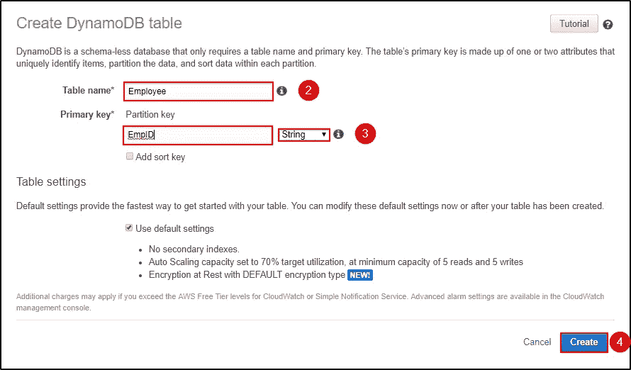

# 亚马逊 DynamoDB 教程——dynamo db 综合指南

> 原文：<https://medium.com/edureka/amazon-dynamodb-tutorial-74d032bde759?source=collection_archive---------0----------------------->

Amazon DynamoDB - Edureka

DynamoDB 是由 Amazon 提供的完全托管的 NoSQL 数据库服务。如今，数据库已经成为任何公司的支柱，不管它们有多大。最初使用的传统数据库系统，由于需求和所获取数据类型的动态变化，已不再是当今的首选解决方案。在这篇 Amazon DynamoDB 教程中，我将讨论使用 DynamoDB 存储和检索数据的新的快速方法。

在这个 Amazon DynamoDB 教程中，我将讨论以下主题:

*   什么是 DynamoDB？
*   与 DynamoDB 相关的术语
*   访问亚马逊 DynamoDB
*   DynamoDB 的特性
*   DynamoDB API
*   DynamoDB:案例研究
*   演示:在 DynamoDB 中创建、插入和查询一个表

# 什么是 DynamoDB？

Amazon DynamoDB 是一个完全托管的 NoSQL 服务，它处理由 Amazon 提供的键值对和其他数据结构文档。它只需要一个主键，不需要模式来创建表。它可以存储任意数量的数据和服务任意数量的流量。使用 DyanmoDB，即使在它扩展时，您也可以期待良好的性能。这是一个非常简单的小 API，遵循键值方法来存储、访问和执行高级数据检索。

DynamoDB 由三个基本单元组成，即表、属性和项。表包含一组项目，属性是存储数据的最简单的元素，没有进一步的划分，项目包含一组属性。

现在你知道了什么是 DynamoDB，让我们在这篇 Amazon DynamoDB 教程中继续深入，向你介绍这里使用的术语。

# 与 DynamoDB 相关的术语

在 DynamoDB 中，一切都很简单，DynamoDB 使用的术语很容易理解，这使它与其他数据库服务不同。使用的术语如下:

## 表、项目和属性

1.  一个**表**可以被可视化为一组项目。以雇员记录为例，你将拥有雇员姓名、雇员 ID、地址和电话号码，所有这些项目都将存储在一个表中。
2.  一个**项**是一个表中的一组属性。您也可以将项目理解为一组属性，它们可以唯一地定义表中的条目。例如，雇员记录中的一项将标识单个雇员。
3.  一个**属性**是附加到一个项目的单个字段。例如员工姓名。

## 主关键字

主键是创建表时必需的唯一属性，在任何给定点都不能为空。因此，在向表中插入项目时，主键属性是必需的。例如，雇员 ID 是雇员记录表的主键。两个项目不能有相似的主键。DynamoDB 支持两种类型的主键。

***简单主键***

简单主键也称为分区键，这基本上是单个属性。DynamoDB 使用分区键值来区分表中的项目。例如，员工记录表中的员工 ID。

***复合主键***

复合主键也称为分区键和排序键。这种类型的钥匙通常由两部分组成。主要组件是分区键，次要组件是排序键。例如，以品牌名称和型号作为复合主键的汽车详细信息表。

## 辅助索引

辅助索引可以理解为允许您在有或没有主键帮助的情况下查询数据的属性。DynamoDB 有这些辅助索引来帮助您实现这种额外的访问。

## DynamoDB 流

这是 DynamoDB 提供的一个附加/可选特性，用于跟踪表中的数据修改事件。在这里，每个事件由一个流记录表示，如果启用了该服务，那么每次创建新项目、更新项目或删除项目时，您都会获得一个新事件。

这些是使用的不同术语，不要再拖延了，让我们继续学习 DynamoDB 教程，看看如何访问表。

# 访问亚马逊 DynamoDB

访问 DynamoDB 非常简单，可以使用以下方法完成:

*   **控制台** 点击[这里](https://console.aws.amazon.com/dynamodb/home)就可以进入 DynamoDB。
*   **CLI(命令行界面)** 使用 CLI，您只需打开您的命令提示符，键入相关命令并访问表格。更多详情，点击[此处](https://docs.aws.amazon.com/amazondynamodb/latest/developerguide/Tools.CLI.html)。
*   **使用 API** 使用 AWS SDKs 你可以充分利用 DynamoDB。AWS SDK 支持多种语言，如 Java、JavaScript、.NET、Python、PHP 等。更多详情，点击[此处](https://docs.aws.amazon.com/amazondynamodb/latest/developerguide/Using.API.html)。

# **DynamoDB 的特点**

DynamoDB 是一个 NoSQL 数据库服务。DynamoDB 的设计方式使得用户可以获得高性能、运行可伸缩的应用程序，而这在传统的数据库系统中是不可能的。DynamoDB 的这些附加功能可以在以下类别中看到:

1.  **按需容量模式**:使用按需服务的应用程序，DynamoDB 自动伸缩以适应流量。
2.  **对 ACID 事务的内置支持** : DynamoDB 为事务提供本机/服务器端支持。
3.  **按需备份**:此功能允许您在任何给定时间点创建工作的完整备份。
4.  **时间点恢复**:此功能有助于在发生意外读/写操作时保护您的数据。
5.  **静态加密**:即使表不在使用中，它也保持数据加密。这借助于加密密钥增强了安全性。

# DynamoDB API

DynamoDB 是一个数据库工具，要与应用程序交互，它需要 API。DynamoDB 中的 API 有:

## 制导机

控制平面由负责"*创建*和"*管理*DynamoDB 表的操作组成。可以使用的 API 操作如下:

*   **创建表格**:创建一个新表格。
*   **描述表**:提供关于表格的信息。
*   **ListTable** :返回列表中所有的表名。
*   **DeleteTable** :从 DynamoDB 中删除表及其所有依赖项。

## 数据平面

数据平面由“ **CRUD** ”操作组成，即“*创建*”、“*读取*”、“*更新*”、“*删除*”选项在你的表上执行不同的动作。在数据平面中，可以对一个表执行多种操作。这里的操作如下:

***创建数据***

1.  **PutItem** :你可以借助主键将单个数据项写入你的表中。
2.  BatchWriteItem :它是 PutItem 的一个更好的版本，用它你可以向你的表中写入多达 25 个条目。

***读取数据***

1.  **GetItem** :它在主键的帮助下从表中检索单个项目。
2.  **BatchGetItem**:GetItem 的更好版本，它可以从多个表中检索多达 100 个条目。
3.  **查询**:这基本上是一个检索具有特定分区键的项目的命令。
4.  **扫描**:工作方式与查询类似，但不需要分区键，因为它在特定的表上工作。

***更新数据***

1.  **UpdateItem** :借助主键修改表中的单个或多个数据项。

***删除数据***

1.  **DeleteItem** :在主键的帮助下，从表中删除单个项目。
2.  BatchWriteItem:delete item 的更好版本，它可以在一个表中删除多达 25 个项目。

# DynamoDB 流

DynamoDB Stream 只不过是一个服务，用于跟踪加载到表中以及从表中检索的数据流。要修改流，用户可以使用以下命令:

*   ListStream :给出所有流的列表。
*   **DescribeStream** :它给出了关于流和所用资源的细节。
*   **GetShardIterator** :它给出了一个 Shard 迭代器，这是一个存储流信息的数据结构。
*   **GetRecords** :使用分片迭代器 GetRecords 检索流的信息。

现在，您已经对 DynamoDB 支持的不同 API 有了一个不错的想法。让我们来看看客户从 DynamoDB 中获益的不同案例研究。

# DynamoDB:案例研究

我已经列出了一些大公司和初创公司的案例研究，关于他们如何从使用 DynamoDB 中受益。

## **MLB 高级媒体**

MLBAM 在他们关于 Amazon DynamoDB 的一篇评论中说，它帮助他们在一天内扩大了对游戏的支持，DynamoDB 还帮助他们支持查询和快速数据检索。

## **Expedia**

Expedia 的实时分析应用程序为测试和学习实验收集数据。该实验每天处理近 2 亿条消息，他们表示 DynamoDB 易于设置，监控更容易，扩展更顺畅，这就是他们转向使用 DynamoDB 的原因。

## **Nexon**

Nexon 表示，他们使用 Amazon DynamoDB 作为轰动一时的手机游戏 **HIT 的主要数据库。**他们表示，Nexon 的成功利用 DynamoDB 提供了稳定的延迟，从而提供了出色的移动游戏体验。

这就是趋势 NoSQL 数据库“ *Amazon DynamoDB* ”如何帮助公司达到用户体验的顶峰。让我们在 Amazon DynamoDB 教程中继续深入，看看如何实现不同的查询。

# 演示:在 DynamoDB 中创建、插入和查询一个表

让我们看看如何在 DynamoDB 中创建一个表。

**步骤 1:** 导航至 AWS 中的 DynamoDB 部分或点击[此处](https://console.aws.amazon.com/dynamodb)。选择*创建表格*。

**第二步:**填写必要的详细信息，然后点击“*创建*”。

第三步:您可以查看正在创建的表格。点击*概览*了解您的表格，点击*条目*对表格进行编辑、插入和查询。您可以使用更多选项来更好地理解您的表。

现在您已经创建了一个表，让我们继续插入一些项目，并了解 NoSQL 是如何工作的。

**第四步:**导航到*项目*，点击*创建项目*。

第五步:它将打开一个 JSON 文件，您可以在其中添加不同的项目。点击“+”符号，选择“*追加*”，并选择您想要输入的数据类型。

**第 6 步:**这是向表中添加多个列后的样子。点击*保存*。

**第七步:**因为这是一个 NoSQL 建筑，你可以随意摆弄你添加到桌子上的柱子。例如“*位置*”。

**第 8 步:**这是插入数据后表格的外观。

现在我们已经准备好了一个表，让我们继续看一些基本的查询。

**第九步:**在这里你可以框定你的查询，点击“*开始搜索*”得到想要的结果。

例如，我正在搜索所有大于或等于“ *1234* ”的手机号码。

**步骤 10:** 在这里，我正在搜索具有 *EmpId* 为“ *ED4* ”的记录。

这是一个关于如何使用 DynamoDB 来满足你的需求的小教程。我希望你发现这个亚马逊 DynamoDB 教程信息丰富。

如果你想查看更多关于人工智能、DevOps、道德黑客等市场最热门技术的文章，那么你可以参考 [Edureka 的官方网站。](https://www.edureka.co/blog/?utm_source=medium&utm_medium=content-link&utm_campaign=amazon-dynamodb-tutorial)

请留意本系列中的其他文章，它们将解释 AWS 的各个方面。

> *1。* [*AWS 教程*](/edureka/amazon-aws-tutorial-4af6fefa9941)
> 
> *2。* [*AWS EC2*](/edureka/aws-ec2-tutorial-16583cc7798e)
> 
> *3。*[*AWS Lambda*](/edureka/aws-lambda-tutorial-cadd47fbd39b)
> 
> *4。* [*AWS 弹性豆茎*](/edureka/aws-elastic-beanstalk-647ae1d35e2)
> 
> *5。* [*AWS S3*](/edureka/s3-aws-amazon-simple-storage-service-aa71c664b465)
> 
> *6。* [*AWS 控制台*](/edureka/aws-console-fd768626c7d4)
> 
> *7。* [*AWS RDS*](/edureka/rds-aws-tutorial-for-aws-solution-architects-eec7217774dd)
> 
> *8。* [*AWS 迁移*](/edureka/aws-migration-e701057f48fe)
> 
> *9。* [*AWS Fargate*](/edureka/aws-fargate-85a0e256cb03)
> 
> 10。 [*亚马逊 Lex*](/edureka/how-to-develop-a-chat-bot-using-amazon-lex-a570beac969e)
> 
> *11。* [*亚马逊光帆*](/edureka/amazon-lightsail-tutorial-c2ccc800c4b7)
> 
> *12。* [*AWS 定价*](/edureka/aws-pricing-91e1137280a9)
> 
> 13。 [*亚马逊雅典娜*](/edureka/amazon-athena-tutorial-c7583053495f)
> 
> *14。* [*AWS CLI*](/edureka/aws-cli-9614bf69292d)
> 
> 15。 [*亚马逊 VPC 教程*](/edureka/amazon-vpc-tutorial-45b7467bcf1d)
> 
> *15。*T44*AWS vs Azure*
> 
> *17。* [*内部部署 vs 云计算*](/edureka/on-premise-vs-cloud-computing-f9aee3b05f50)
> 
> *18。*T56*AWS 简历*
> 
> *19。* [*如何从快照恢复 EC2？*](/edureka/restore-ec2-from-snapshot-ddf36f396a6e)
> 
> *20。* [*AWS 代码提交*](/edureka/aws-codecommit-31ef5a801fcf)
> 
> *21。* [*顶级 AWS 架构师面试问题*](/edureka/aws-architect-interview-questions-5bb705c6b660)
> 
> *22。* [*如何从快照恢复 EC2？*](/edureka/restore-ec2-from-snapshot-ddf36f396a6e)
> 
> *23。* [*使用 AWS 创建网站*](/edureka/create-websites-using-aws-1577a255ea36)
> 
> *24。* [*亚马逊路线 53*](/edureka/amazon-route-53-c22c470c22f1)
> 
> *25。* [*用 AWS WAF 保护 Web 应用*](/edureka/secure-web-applications-with-aws-waf-cf0a543fd0ab)

*原载于 2019 年 3 月 27 日*[*www.edureka.co*](https://www.edureka.co/blog/amazon-dynamodb-tutorial)*。*