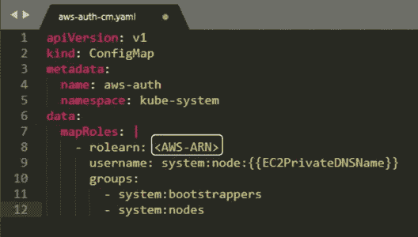

# 使用亚马逊 EKS 构建 Kubernetes 应用程序

> 原文：<https://medium.com/edureka/amazon-eks-ac646c23abf8?source=collection_archive---------0----------------------->

Amazon EKS - Edureka

众所周知， ***亚马逊网络服务(AWS)*** 是一家知名的云服务提供商，而 Kubernetes 正在迅速成为生产环境中管理应用程序容器的标准方式。虽然许多开发人员会很乐意使用 ***Kubernetes*** ，但是耗时的集群管理过程可能会令人倒胃口。作为一种解决方案，开发人员可以为 Kubernetes(亚马逊 EKS)使用亚马逊弹性容器服务，这允许他们非常快速和轻松地在云中创建 Kubernetes 集群。

让我们来看看本文涉及的主题:

1.  亚马逊 EKS 及其优势
2.  亚马逊 EKS 是如何工作的？
3.  使用亚马逊 EKS 构建 Kubernetes 应用程序

我们开始吧！

# 亚马逊 EKS

尽管容器在 Linux 早期就已经存在，但 Docker 引入了这种技术的现代版本。Kubernetes 是一款开源软件，允许您大规模部署和管理容器化的应用程序。它还提供了可移植性和可扩展性，使您能够无缝地扩展容器。但是，Kubernetes 的缺点是，用主节点和工作节点部署集群需要花费大量时间。一转身就是亚马逊 EKS。

# 针对 Kubernetes 的亚马逊弹性容器服务(亚马逊 EKS)

Amazon Elastic Container Service for Kubernetes(Amazon EKS)是一项托管服务，使用户可以轻松地在 AWS 上运行 Kubernetes，而无需建立或维护自己的 Kubernetes 控制面板。由于亚马逊 EKS 是一个托管服务，它处理的任务，如供应，升级和修补。

抛开定义不谈，让我们来看看亚马逊 EKS 的好处:

*   亚马逊 EKS 在多个 AWS 可用性区域运行 Kubernetes 管理基础设施，从而使用户不必维护 Kubernetes 控制平面。
*   默认情况下，运行在亚马逊 EKS 上的基础设施是安全的，它在工作节点和 Kubernetes 端点之间建立了安全和加密的通信通道。
*   AWS 积极与 Kubernetes 社区合作，并为 Kubernetes 代码库做出贡献。
*   亚马逊 EKS 管理的应用程序与任何标准 Kubernetes 环境管理的应用程序完全兼容。

所以，以上理由足以令人信服，可以开始使用亚马逊 EKS。现在，让我们看看亚马逊 EKS 实际上是如何工作的。

# 亚马逊 EKS 是如何工作的？

Representation of Workflow of Amazon EKS - Amazon EKS

开始使用亚马逊 EKS 非常简单:

1.  首先，在 AWS 管理控制台中或使用 AWS CLI 或 AWS SDKs 之一创建一个 Amazon EKS 集群
2.  然后，启动 worker 节点，并使它们能够加入您之前创建的 Amazon EKS 集群
3.  当您的集群准备就绪时，您可以配置您喜欢的 Kubernetes 工具来与您的集群通信
4.  在亚马逊 EKS 集群上部署和管理应用程序，就像在任何其他 Kubernetes 环境中一样

现在，让我们看看如何使用 Amazon Elastic Container Service for Kubernetes 将容器化的应用程序部署到 Kubernetes 集群上。

# 使用亚马逊 EKS 部署 Kubernetes 应用程序

**演示:**在这个演示中，我们将看到如何使用亚马逊 EKS 在 Kubernetes 集群上启动一个简单的 nginx 应用程序。以下是您将遵循的步骤:

*   创建一个 AWS IAM 服务角色和一个 AWS VPC
*   创建亚马逊 EKS 集群
*   为亚马逊 EKS 集群配置 kubectl
*   启动和配置亚马逊 EKS 工作节点
*   启动简单的 nginx 应用程序
*   清理应用程序和分配的资源

本节将带您详细了解这些步骤。

# 假设和前提条件

*   您应该拥有一个有效订阅的 AWS 帐户，并且能够使用 AWS IAM 帐户凭据登录。如果您没有这两者之一，请创建一个 AWS 帐户&在您的 AWS 帐户中创建一个 IAM 用户。
*   您应该将最新版本的 AWS 命令行界面(CLI)安装到系统路径中的某个位置。如果您还没有安装，请按照以下说明进行安装。

# 步骤 1:创建 AWS IAM 服务角色和 VPC

第一步是创建一个 IAM 角色，Kubernetes 可以承担这个角色来创建 AWS 资源。为此:

*   导航到 AWS IAM 控制台&在“**角色**”部分，单击“**创建角色**”按钮
*   选择“ **AWS 服务**”作为实体类型，选择“ **EKS** ”作为服务
*   输入服务角色的名称，然后单击“**创建角色**创建角色

亚马逊 EKS 也需要虚拟私有云(VPC)来部署集群。要创建这个 VPC:

*   导航到 *AWS CloudFormation* 控制台，点击“**创建堆栈**
*   在“**选择模板**页面，选择“**指定亚马逊 S3 模板 URL** ”选项，并输入 URL
*   指定所有细节后，检查并确认它们。然后点击**创建**继续

# 步骤 2:创建一个亚马逊 EKS 集群

至此，您已经准备好创建一个新的亚马逊 EKS 集群了。为此:

*   导航到亚马逊 EKS 控制台，点击“**创建集群**”按钮
*   在 EKS 集群创建表单中输入详细信息，如集群名称、角色 ARN、VPC、子网和安全组
*   点击**创建**创建亚马逊 EKS 集群

# 步骤 3:为亚马逊 EKS 集群配置 kubectl

Kubernetes 使用一个名为 ***Kubectl*** 的命令行实用程序与 Kubernetes 集群进行通信。亚马逊 EKS 集群还需要用于 Kubernetes 的 AWS IAM 身份验证器，以允许对您的 Kubernetes 集群进行 IAM 身份验证。因此，安装这两个二进制文件。亚马逊 EKS 文档中有下载和设置的说明。

**注意:**确保您至少安装了版本的 AWS CLI，并且您系统的 Python 版本必须是 Python 2.7.9 或更高版本。

接下来，您必须使用 AWS CLI **update-kubeconfig** 命令为集群创建一个 ***kubeconfig*** 文件，如下所示:

*   使用 AWS CLI**update-kubeconfig**命令为集群创建或更新 kube config
*   测试您的配置

# 步骤 4:启动并配置亚马逊 EKS 工作节点

**注意:**等待集群状态显示为**活动** `.`如果在集群活动之前启动工作节点，工作节点将无法向集群注册，您必须重新启动它们。

激活集群的控制平面后，下一步是向其添加节点。为此:

*   导航到 AWS CloudFormation 控制台，点击“**创建堆栈**”选项
*   在“**选择模板**”页面上，选择选项“**指定亚马逊 S3 模板 URL** ，并输入 URL
*   在**指定详细信息**页面，输入如下图所示的详细信息。查看详细信息并点击“**创建**
*   堆栈创建完成后，在可用堆栈列表中选择堆栈名称，并在左下窗格中选择“**输出**部分。记下角色 ARN

现在，要让工作节点加入 Kubernetes 集群，请执行以下步骤:

*   在您的本地系统上，创建一个名为****AWS-auth-cm . YAML***的文件，并用下面的内容填充它。用之前从堆栈输出中复制的节点实例角色替换 AWS-ARN*

**

*   *应用配置。此命令可能需要几分钟才能完成。*
*   *观察节点的状态，等待它们达到`Ready`状态*

**

# *步骤 5:启动一个简单的 nginx 应用程序*

*要创建应用程序，您需要创建一个类型为***Deployment****的 Kubernetes 对象。O* 在你的本地系统中，创建一个名为 ***nginx.yaml*** 的文件，并用下面的内容填充它。*

*现在，作为应用程序的备份，您还需要创建一个 Kubernetes 服务类型的对象。Kubernetes 服务是一个抽象概念，它定义了在集群中某个地方运行的一组逻辑单元，这些单元都提供与您之前创建的单元相同的功能。在您的本地系统上，创建一个名为 **nginx *的文件。yaml*** 并填入以下内容。*

**

*   *创建 nginx 应用程序和 nginx 服务*
*   *列出正在运行的服务并捕获外部 IP 地址和端口*
*   *当您的外部 IP 地址可用后，将 web 浏览器指向相应端口的那个地址，以查看您的 nginx 应用程序*

****

*恭喜你！现在您知道了如何使用亚马逊弹性容器服务(亚马逊 EKS)将容器化的应用程序部署到 Kubernetes 集群上。*

# *步骤 6:清理应用程序和分配的资源*

*当您完成应用程序的试验后，您应该清理为它创建的资源，以避免产生不必要的成本。您可以使用以下命令来完成此操作:*

**

*我希望现在您对什么是亚马逊 EKS 以及如何使用它在 Kubernetes 集群上创建和启动容器化的应用程序有了一个基本的概念。*

*原来就是这样！我希望这篇博客能给你提供信息，增加你的知识。如果你想查看更多关于人工智能、Python、道德黑客等市场最热门技术的文章，你可以参考 Edureka 的官方网站。*

*请留意本系列中的其他文章，它们将解释 Kubernetes 的各个方面。*

> *1.[什么是 Kubernetes？](/edureka/what-is-kubernetes-container-orchestration-tool-d972741550f6)*
> 
> *2.[在 Ubuntu 上安装 Kubernetes](/edureka/install-kubernetes-on-ubuntu-5cd1f770c9e4)*
> 
> *3. [Kubernetes 教程](/edureka/kubernetes-tutorial-fe6de6a20325)*
> 
> *4. [Kubernetes 仪表板安装&视图](/edureka/kubernetes-dashboard-d909b8b6579c)*
> 
> *5. [Kubernetes 建筑](/edureka/kubernetes-architecture-c43531593ca5)*
> 
> *6. [*Kubernetes 网络*](/edureka/kubernetes-networking-a46d9f994bab)*
> 
> *7.[Kubernetes vs Docker Swarm](/edureka/kubernetes-vs-docker-45231abeeaf1)*
> 
> *8. [Kubernetes 面试问题](/edureka/kubernetes-interview-questions-c9790e5abddb)*
> 
> *9.[在 AWS 上设置 Kubernetes 入口控制器](/edureka/kubernetes-ingress-controller-nginx-c5cf9e8ff031)*
> 
> *10.[如何用 Elasticsearch 和 Kibana 可视化 Kubernetes 集群](/edureka/logging-monitoring-elasticsearch-fluentd-kibana-e2cd477a576b)*

**原载于 2018 年 11 月 20 日*[*www.edureka.co*](https://www.edureka.co/blog/amazon-eks/)*。**