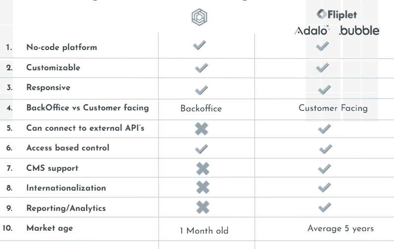

# 亚马逊蜜码——初步证据

> 原文：<https://medium.com/globant/amazon-honeycode-a-prima-facie-39d486599e8f?source=collection_archive---------1----------------------->

当您在工作表中工作时，您有时会迷失在工作表的海洋中，并且忘记如何与您的团队成员共享这些数据！

***“建立一种更好的工作方式***”——这就是亚马逊试图用 Honeycode 来解决你所面临的这个问题。2020 年 6 月上线的无代码平台。这使得 AWS 与 Google Cloud Appsheet、Bubble、Microsoft Power Apps 和许多其他已经存在很长时间的应用一起进入了无代码领域。

*亚马逊 Honeycode 是 AWS 托管服务，提供无代码平台来构建移动和网络应用。它使用熟悉的电子表格格式来存储数据，并提供工具来构建基于它的定制应用程序。*

在我们进入 Amazon Honeycode 提供的好东西之前，让我们详细阐述一下当前我们在使用电子表格时面临的问题。

**分享**

虽然您可以在同事之间共享电子表格，但当许多团队成员同时开始编辑工作表时，这将变得非常具有挑战性。

我们都求助于“好吧，你先走，我稍后再做”的协议。

**大数据**

任何使用过电子表格的人都知道，当大量数据跨越多个电子表格时，这是多么困难。

**自动化**

当前电子表格不支持的另一件事是自动化。

*很多时候我们会想——如果某些单元格或表格发生了变化，我能收到某种通知该多好。*

虽然如果您是编码向导，您可以实现这一点，但是没有简单的方法可以绕过它。

**学习曲线**

如果您只处理非常简单的任务，使用电子表格可能很简单，但是高级用户可能知道在维护良好的电子表格背后有一组庞大的函数和过滤器。

听起来很熟悉，不是吗？你在想，亚马逊 Honeycode 在这里对我有什么帮助？让我们开始吧！

**恢复**

Honeycode 知道您的数据有多重要，因此它会在您使用工作簿时不断创建检查点。如果您在某个地方迷路了，这些检查点可以用来恢复工作簿以前的状态。

**可扩展**

用 Honeycode 构建的应用程序在每个工作簿中可以扩展到 100，000 行。

**预建模板**

Honeycode 附带了一组预定义的模板，您可以重用这些模板来构建您的应用程序，也可以从头开始创建一个。

> 让我们来看看一些更酷的功能吧！

**无代码**

亚马逊 Honeycode 构建你的应用不需要任何编码背景。你应该知道的就是如何使用电子表格。

**响应迅速且易于访问**

用 Honeycode 构建的应用程序具有充分的响应性和可访问性，因此它可以自动管理您的应用程序在各种设备上的外观。

**桌面&移动视图**

虽然 Honeycode 自动管理 web 和移动视图，但您仍然可以选择“*解除链接”*这种行为，并为您的移动应用提供一个与 web 应用完全不同的 UI。

**单页应用**

通过 Honeycode 构建的应用程序是一个单页面应用程序，这意味着应用程序是爽快的，没有丑陋的重载(ughh…这个世纪谁会做丑陋的重载！)

**自动化**

Amazon Honeycode 的一个很好的特性是，您可以通过设置某些动作的触发器来实现自动化。比如说-

假设您有一个库存电子表格，其中管理各种对象的库存。如果这个电子表格被不同的用户用来更新当前的库存，您可能希望在某个特定对象从库存中耗尽时收到某种通知。

Amazon Honeycode 通过允许您基于数据状态创建自定义自动化，使这变得更加容易。

> 渴望把手弄脏！！！你可以按照这个简单的教程[在这里](https://aws.amazon.com/blogs/aws/introducing-amazon-honeycode-build-web-mobile-apps-without-writing-code/)自己试试。

尽管 Honeycode 提供了许多现成的功能，而且非常容易使用，但是在选择 Honeycode 时，仍然有一些限制需要记住。

**限量造型**

Honeycode 让你可以灵活地选择页面的字体大小、颜色和背景，以及内容的布局，但除此之外，你不能做太多。您可能找不到 web 应用程序所需的调色板。

**浏览器兼容性**

浏览器的官方兼容性被列为——“最好与 chrome 兼容，可能与其他浏览器有问题”。但是随着我花时间使用 Honeycode，我发现它可以在大多数最新的浏览器上运行。

**本地化**

目前，还没有本地化的官方支持，但是，你可以有不同的本地化数据的不同地区的不同应用程序。

**无图像**

我发现的一个主要限制是，我们不能在 Honeycode 上使用图像，所以如果你想拥有一个漂亮的图像背景，或者想用你的产品展示图像，那么这可能不适合你。但是，您仍然可以在应用程序中使用图标。

**没有外部 API**

Amazon Honeycode 目前没有为您的应用程序提供任何集成点。

**价格昂贵**

Amazon Honeycode 的所有功能都是有代价的。现在有三种不同的计划

> 基本$ 0/月

2，500 行/工作簿

无限工作簿

包括 20 名成员

> 外加 19.99 美元/月

10，000 行/工作簿

无限工作簿

包括 20 名成员

每个额外成员每月 9.99 美元

> 大约 29.99 美元/月

100，000 行/工作簿

无限工作簿

包括 20 名成员

每个额外成员每月 19.99 美元

虽然有一个基本计划是免费的，但资源有限，如果你想要更多，那么你将不得不付出更多，这也是每月！！！

已经有一些替代方案基于类似的概念，使用电子表格进行数据存储。

1.  **Fliplet**
2.  **泡沫**
3.  **阿达洛**
4.  **造波器**

**与竞争对手的比较**

**结论**

Amazon Honeycode 在这个无代码软件开发平台的世界中相对来说是一个相当新的东西，仍然处于测试版本，因此缺少其他竞争对手拥有的多种功能。话虽如此，它绝对值得关注，因为它有 AWS 后端的支持，因此具有可伸缩性和高性能。一旦它出了测试版，我很想回顾一下，看看它是如何成长的。