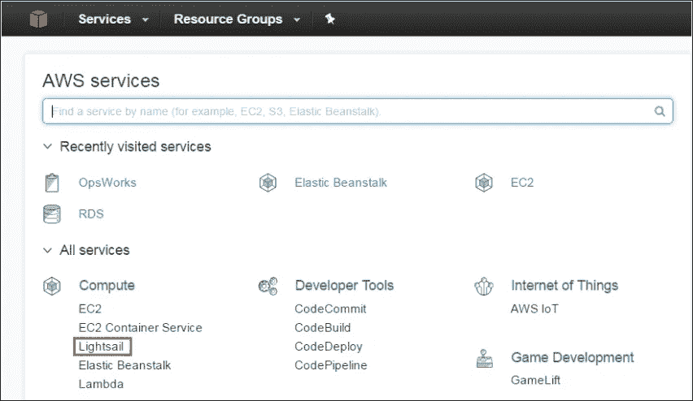

# 亚马逊 Lightsail 教程——亚马逊 VPS 简介

> 原文：<https://medium.com/edureka/amazon-lightsail-tutorial-c2ccc800c4b7?source=collection_archive---------4----------------------->

AWS Lightsail - Edureka

在这个 Amazon Lightsail 教程中，我们将讨论一个名为 Amazon Lightsail 的新虚拟私人服务，但在此之前，让我们先做一个抽象的概述。

每个企业背后都有一个想法，这是任何企业成功的关键因素。而且，你越快实现这个想法，你的事业就会越成功。

看看云计算的领头羊 AWS。当然，他们是领导者，因为他们很棒，但您知道他们早在 2000 年就开始了他们的云之旅，当时没有竞争对手，实际上没有竞争对手来解决他们的问题。

今天我们有几十个云提供商可供选择，但 AWS 仍然处于领先地位，这是为什么？因为他们领先了一步。

你，让我们现在来谈谈你，你有一个惊人的想法，但你不具备实现它所需的所有知识和工具。

假设你是一个博客写手，你想开始你自己的博客事业。但是当你开始探索的时候，你会知道有一个叫 MySQL 的东西必须用你的 WordPress 来安装和配置，它必须安装在一个网络服务器上，这要花一大笔钱！

等等！你租了一台服务器，干得好！

酷，所以你现在只需要配置它。你开始学习一些东西，配置 WordPress，把它连接到 MySQL，配置 DNS，在这个过程中你失去了兴趣，因为你真正想做的是写博客，你被管理服务器所困！

但是，嘿，振作起来！我们的云计算领导者来拯救您了！

他们提出了一项名为 AWS Lightsail 的服务。

# 亚马逊 Lightsail 是什么？

因此，Amazon Lightsail 是一项 VPS(虚拟专用服务器)服务，它为您提供了可供选择的模板，您可以选择普通操作系统，也可以选择预装应用程序的操作系统，只需点击一个按钮即可使用。

想要更多吗？价格从每月 5 美元起！

因此，无需担心底层基础设施，只需启动您的应用程序，并开始构建您的想法，就这么简单！

# 谁将使用这项服务？

让我们举个例子，你是一个博客作者，记得吗？所以，你需要一个配置了 WordPress 的系统，为此你只需要从创建实例面板中选择 WordPress 图标，选择想要的计划，你就可以开始了！

因此，基本上，如果您希望从技术方面自动安装和配置所有东西，并且如果您的系统不需要自动扩展，这应该是适合您的东西！

AWS 还有什么预配置或者照顾的？

因此，当您单击“创建实例”按钮时，将执行以下步骤:

*   启动虚拟机
*   连接 SSD(固态硬盘)
*   管理 IAM
*   创建安全组
*   设置 DNS
*   创建静态 IP

# Amazon Lightsail 与 AWS 的其他自动服务(如 OpsWorks、Lambda 或 Beanstalk)有何不同？

让我们来看看:

*   **自动缩放:**首先，Lightsail 的容量是固定的，增加容量的唯一方法是改变计划，因此 lightsail 没有自动缩放功能。而在豆茎、OpsWorks 等中。您可以自动调整资源，并相应地向您收费。
*   **固定价格:**在 LightSail 中，你有一个固定的价格，在其他服务中，因为支持自动缩放，所以根据你的使用情况向你收费。
*   **配置:**在 OpsWorks 中你可以完全控制你系统的配置，你可以配置层，你可以创建栈。Lightsail 没那么复杂，你得到一个系统，没什么好配置的。另一方面，Beanstalk 完全是关于代码的，你上传你的应用程序代码，它为你部署应用程序。你不使用底层操作系统。AWS Lambda 只是后台任务，你上传你的代码，它就会开始为你执行。

所以在某种程度上，Lightsail 是完全不同的。

# 那么它是亚马逊想出来的东西吗？

不，不像 AWS 的其他服务都是原创的，AWS 从它的一个竞争对手那里抄袭了这项服务。

DigitalOcean 只提供 VPS 服务，在过去的几年里他们有了巨大的增长。

AWS 看到了这一点，并在自己的平台上推出了确切的服务。

# 数字海洋 vs 亚马逊光帆

在定价和配置方面没有区别，两者以相同的价格提供完全相同的系统配置。

也许，唯一的区别是，亚马逊 Lightsail 可以与你的其他 AWS 资源一起使用，如果你使用 DigitalOcean，这是不可能的。

让我们转到这项服务最吸引人的部分，即定价。

# AWS 定价

基本上有 5 种不同的系统配置可供选择，每种都有不同的价格。

以上配置是按小时计费的，因此根据您的需要，您可以启动和停止一个实例，您将按小时数计费。

是的，你注意到了，AWS 也在 Amazon Lightsail 中扩展了免费层的使用。

您可以在第一个月免费使用 5$ config，即 720 小时！去玩吧！

现在你已经为你的 Lightsail 之旅做好了准备，让我们简单介绍一下如何启动你的第一个 Lightsail 实例。

# 演示

继续这个 Amazon Lightsail 教程，让我们在 Amazon Lightsail 中启动一个 WordPress 配置实例

**第一步:**登录 AWS 管理控制台，选择 Amazon Lightsail。

**步骤 2:** 单击创建实例按钮

**步骤 3:** 您现在可以选择所需的选项了，因为我们正在启动一个 WordPress 服务器，我们将在模板中选择 WordPress 选项。

**步骤 4:** 您可以将 SSH 密钥对保留为默认值，然后根据您的需要选择一个实例计划，我们将选择自由层配置。

**第五步**:默认情况下，会为你选择 N. Virginia 地区，因为 Amazon Lightsail 只在该地区可用，不过你可以选择想要的可用区域。

**第六步**:你可以将你的实例重命名为一个更合适的名字，最后点击创建。

机器启动并运行需要一些时间，完成所有工作后，在主实例页面上，单击您的实例，并将您实例的公共 IP 复制粘贴到一个新选项卡中。

一旦您访问此 IP，将出现以下页面。

***恭喜恭喜！！你有一台 WordPress 机器为你服务。***

就这样了，伙计们！我希望你喜欢这个亚马逊 Lightsail 教程。亚马逊 Lightsail 是 AWS 的一项全新服务，因此你今天在亚马逊 Lightsail 教程中学到的东西肯定会成为任何 AWS 相关面试的热门话题。如果你想查看更多关于人工智能、DevOps、道德黑客等市场最热门技术的文章，你可以参考 Edureka 的官方网站。

请留意本系列中的其他文章，它们将解释 AWS 的各个方面。

> *1。* [*AWS 教程*](/edureka/amazon-aws-tutorial-4af6fefa9941)
> 
> *2。* [*AWS EC2*](/edureka/aws-ec2-tutorial-16583cc7798e)
> 
> *3。*[*AWSλ*](/edureka/aws-lambda-tutorial-cadd47fbd39b)
> 
> *4。* [*AWS 弹性豆茎*](/edureka/aws-elastic-beanstalk-647ae1d35e2)
> 
> *5。* [*AWS S3*](/edureka/s3-aws-amazon-simple-storage-service-aa71c664b465)
> 
> *6。* [*AWS 控制台*](/edureka/aws-console-fd768626c7d4)
> 
> *7。* [*AWS RDS*](/edureka/rds-aws-tutorial-for-aws-solution-architects-eec7217774dd)
> 
> *8。* [*AWS 迁移*](/edureka/aws-migration-e701057f48fe)
> 
> *9。*[*AWS Fargate*](/edureka/aws-fargate-85a0e256cb03)
> 
> *10。* [*亚马逊 Lex*](/edureka/how-to-develop-a-chat-bot-using-amazon-lex-a570beac969e)
> 
> *11。* [*AWS 简历*](/edureka/aws-resume-7453d9477c74)
> 
> 12。 [*AWS 定价*](/edureka/aws-pricing-91e1137280a9)
> 
> *13。* [*亚马逊雅典娜*](/edureka/amazon-athena-tutorial-c7583053495f)
> 
> *14。* [*AWS CLI*](/edureka/aws-cli-9614bf69292d)
> 
> 15。 [*亚马逊 VPC 教程*](/edureka/amazon-vpc-tutorial-45b7467bcf1d)
> 
> 15。T32*AWS vs Azure*
> 
> 17。 [*内部部署 vs 云计算*](/edureka/on-premise-vs-cloud-computing-f9aee3b05f50)
> 
> *18。* [*亚马逊迪纳摩 DB 教程*](/edureka/amazon-dynamodb-tutorial-74d032bde759)
> 
> *19。* [*如何从快照恢复 EC2？*](/edureka/restore-ec2-from-snapshot-ddf36f396a6e)
> 
> 20。[*AWS code commit*](/edureka/aws-codecommit-31ef5a801fcf)
> 
> *21。* [*顶级 AWS 架构师面试问题*](/edureka/aws-architect-interview-questions-5bb705c6b660)
> 
> *22。* [*如何从快照恢复 EC2？*](/edureka/restore-ec2-from-snapshot-ddf36f396a6e)
> 
> *23。* [*使用 AWS 创建网站*](/edureka/create-websites-using-aws-1577a255ea36)
> 
> *24。* [*亚马逊路线 53*](/edureka/amazon-route-53-c22c470c22f1)
> 
> *25。* [*用 AWS WAF 保护 Web 应用*](/edureka/secure-web-applications-with-aws-waf-cf0a543fd0ab)

*原载于 2016 年 12 月 16 日*[*www.edureka.co*](https://www.edureka.co/blog/amazon-lightsail-tutorial/)*。*