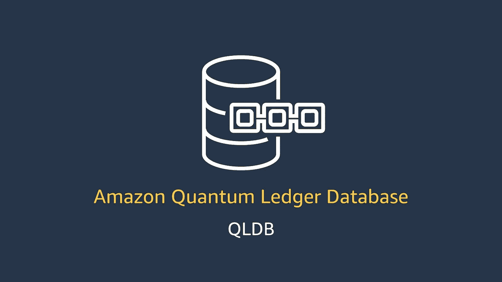
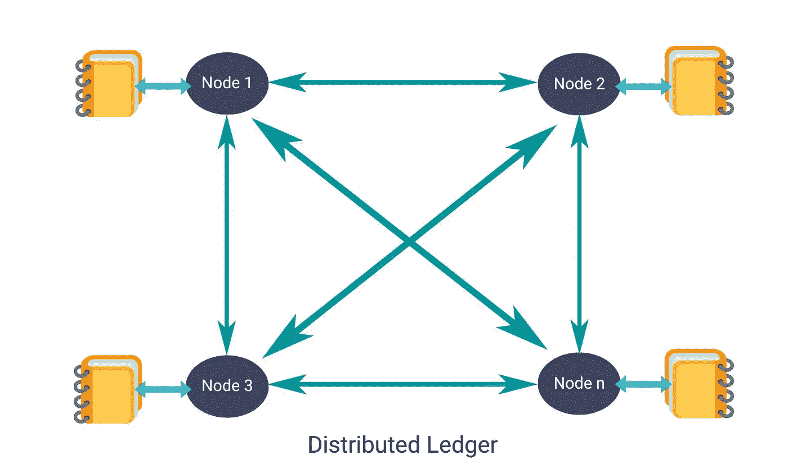
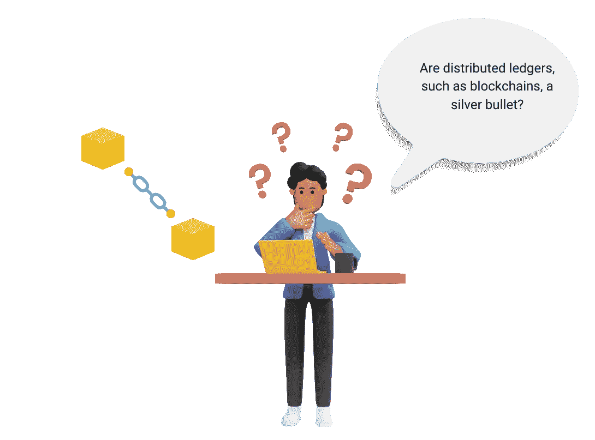
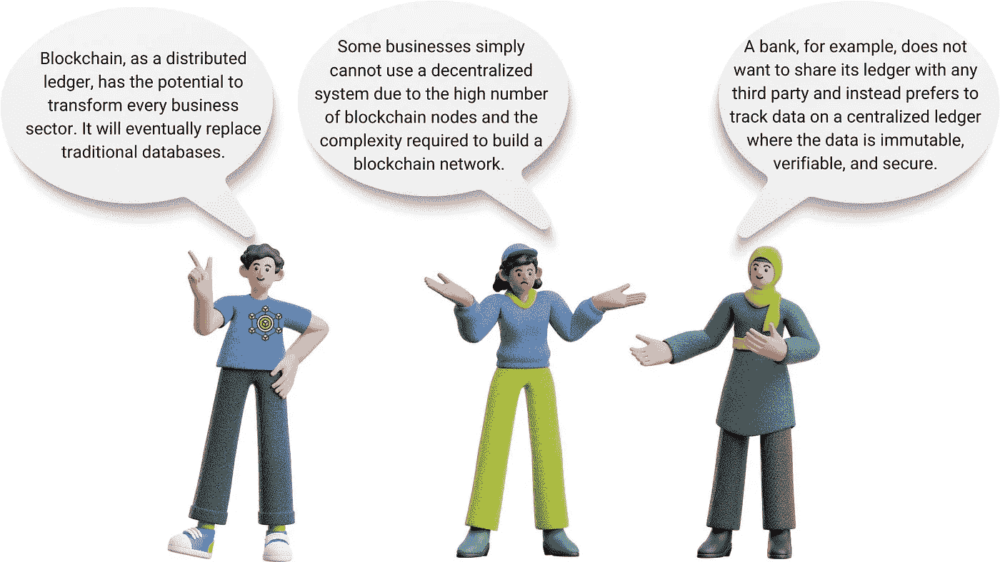
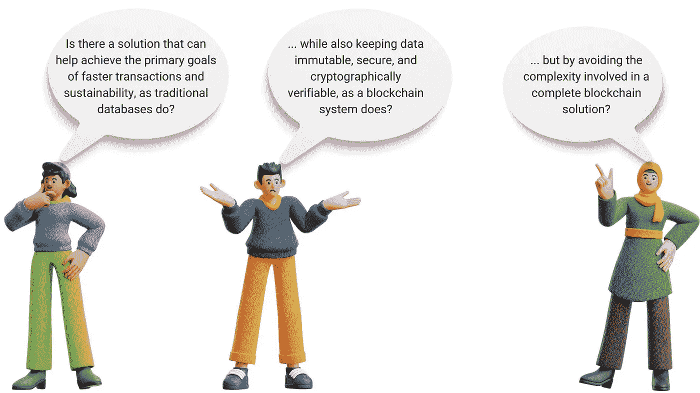
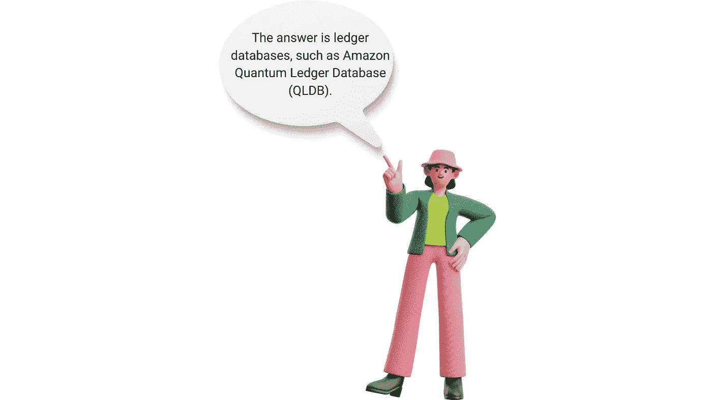
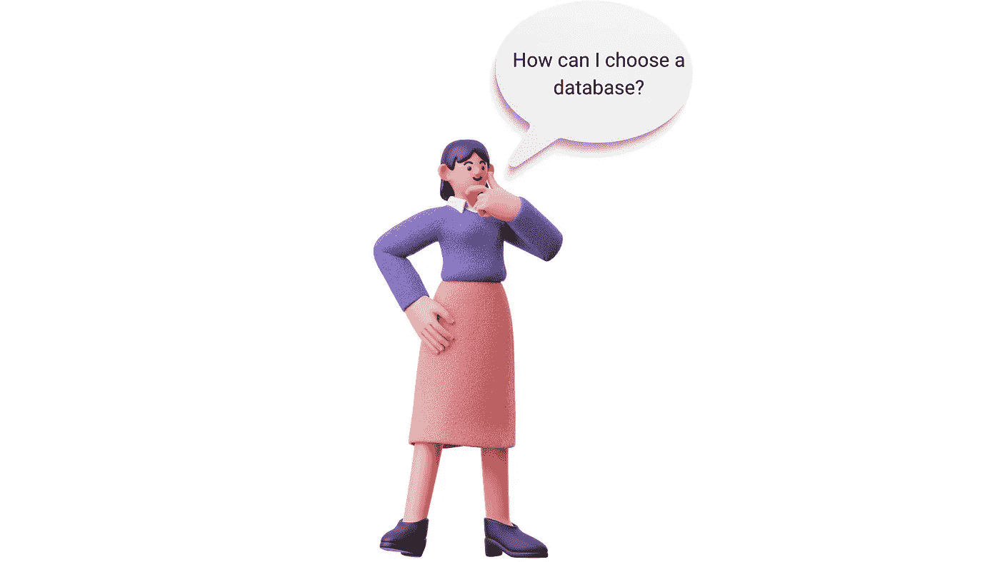
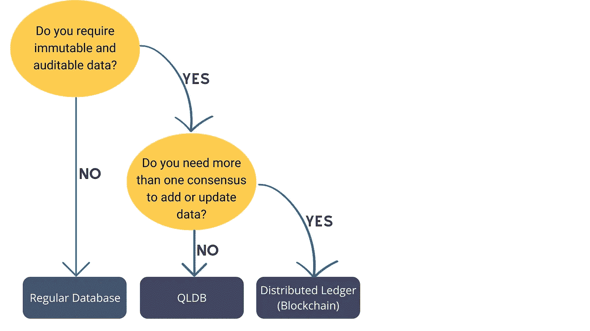

# Amazon QLDB:为您的数据库带来区块链的力量

> 原文：<https://medium.com/globant/amazon-qldb-bringing-the-power-of-blockchain-to-your-databases-7979c28e857f?source=collection_archive---------0----------------------->

**合著:** [里泰什·梅农](/@riteshmenon)
领英 : [马扬克·沃拉](https://www.linkedin.com/in/mayank-vora/)，[里泰什·梅农](https://www.linkedin.com/in/riteshmmenon/)

**分类账**通常用于记录一个组织的经济和财务活动的历史。许多组织创建具有类似分类帐功能的应用程序，因为他们希望维护数据的准确历史记录。例如，他们可能希望跟踪供应链网络中某个项目的移动，或者跟踪银行交易中的借贷历史。在关系数据库中创建的自定义审计表或审计跟踪经常用于实现分类帐应用程序。此外，定制审计表和跟踪需要定制开发，这需要更多的时间和资金投入。此外，在定制开发中，人为错误是常见的。

近年来，我们看到[分布式账本技术(DLT)](https://en.wikipedia.org/wiki/Distributed_ledger) 被广泛采用，如[区块链](https://en.wikipedia.org/wiki/Blockchain)用于记录保存。这些分布式分类账是分散的，因为没有中央管理员或数据库，并且使用[共识算法](https://www.geeksforgeeks.org/consensus-algorithms-in-blockchain/)通过对等网络建立认证。这些记录是不可变的，通过使用[哈希算法](https://www.onlinehashcrack.com/how-to-hashing-in-blockchain-explained.php)如 SHA-256、SHA-512 和其他算法，可以进行密码验证。

上图描述了一个分布式账本，它是一个由 n 个节点组成的对等网络。网络节点是独立的计算机，用于同步分布式分类帐中的交易。
共识协议确保了添加到分布式网络中的每个新块都是网络中所有节点都同意的唯一版本的真相。一旦建立了信任，对分类帐的任何改变或添加都会立即反映并复制给所有参与者。

分布式分类帐大致有两种类型:

1.  当需要一个透明的、分布式的、安全的、为更大的社区服务的开放网络时，就需要一个公共分布式分类帐。

例如，加密货币([比特币(BTC)](https://bitcoin.org/en/) 和[以太坊](https://ethereum.org/) (ETH))基于公共区块链技术，交易是透明的、不可变的和分布式的。这些交易由网络参与者验证，这些参与者拥有所需的硬件，被称为“矿工”任何人都可以作为矿工加入网络，并通过验证交易和向区块链添加新区块来获得奖励。

公共分类账变得更加安全，因为它变得更加分散和活跃。随着越来越多的人使用网络，任何类型的攻击都变得更加难以得逞。

2.**当组织希望利用分布式分类帐功能，同时限制封闭分布式网络中特定用户的访问权限时，私有分布式分类帐**是一个不错的选择。例如，在专用分类账中维护员工工资、销售、采购、租金、文具、保险等记录。Hyperledger 和 [Ripple](https://ripple.com/) 是私人区块链的两个流行例子。

分布式分类帐在某些情况下是有效的，但不是在所有情况下都有效。这种系统有一些缺点，如下所列:

*   网络需要更多时间来达成共识并验证交易。
*   高能耗。
*   增加了应用程序的复杂性。

此外，在某些情况下，组织(如金融机构)不希望与任何其他方共享分类账，而是更喜欢在集中式系统上跟踪数据。

一些需要思考的问题:

# **亚马逊 QLDB 是什么？**

Amazon QLDB 是一种新的集中式分类帐数据库，它可以更容易地避免开发自己的类似分类帐的应用程序的耗时过程。

其突出特点如下:

*   **不变性&透明性:**传统数据库(SQL 和 No-SQL)将数据存储为表或 JSON 文档模型。这些传统数据库中的数据可以被任何能够访问该数据库的人修改，从而导致数据冲突和操纵。
    Amazon QLDB 包含一个以不可变方式存储数据的日志。日志是仅追加的，这意味着数据只能添加到其中，不能修改或删除。即使从分类帐中删除数据，您也可以从不可变的日记帐中读取数据，以查看数据的更改历史。
*   **可密码验证:**由于传统数据库缺乏自动数据加密，数据文件容易被黑客直接读取或修改。其中一些数据库与加密技术不兼容。
    亚马逊 QLDB 使用加密来创建你的变化的简要历史。加密哈希函数(SHA-256)用于生成这一安全摘要，也称为摘要。您可以使用摘要作为数据更改历史的证据，及时返回并验证数据修改的准确性。
*   **高度可扩展:** Amazon QLDB 是一个无服务器数据库，它提供无缝、自动的扩展来满足应用程序的需求，无需提供容量或配置读写限制。Amazon QLDB 使 Amazon CloudWatch 指标可用于分类帐。我们可以使用 QLDB 查看读写 io 的关键操作指标。
*   **审计日志&历史:**传统数据库不跟踪文档历史，只存储文档的当前状态。因此，这些数据库无法提供现成的审计试验。市场上的许多 SQL Server 审计解决方案缺乏确保防篡改审计的能力。
    QLDB 无需额外配置即可提供审计跟踪。我们可以通过使用 Amazon QLDB 查询历史变化的摘要来获得事务历史细节。
*   **part QL 支持**:它使用开源的、类似 SQL 的查询语言[part QL](https://partiql.org/)，允许我们使用熟悉的 SQL 操作符查询、管理和更新数据。 [Amazon Ion](https://amzn.github.io/ion-docs/) 是 QLDB 使用的面向文档的数据模型。Amazon Ion 是 JSON 的超集。Ion 是一种开源的、基于文档的数据格式，提供了存储和处理结构化、半结构化和嵌套数据的灵活性。
*   **流功能:**亚马逊 QLDB 的流功能使[亚马逊 Kinesis](https://aws.amazon.com/kinesis/) 数据流能够对存储在 QLDB 中的数据进行近乎实时的更新。这使我们能够对新事件(如银行分类账应用程序中的账户余额变化)做出快速反应，并轻松与下游服务(如 AWS Lambda、Amazon Redshift、Amazon Elasticsearch)集成。
*   **易于使用:** Amazon QLDB 使用面向文档的数据模型存储数据，该模型提供了存储结构化和半结构化数据的灵活性。

# QLDB 特性的快速浏览

**Amazon QLDB Walkthrough**

我们在 QLDB 上编译了以下演练视频，以便您快速了解以下概念:

*   QLDB 入门
*   创建一个分类帐并执行基本的 CRUD 操作。
*   如何以编程方式将 QLDB 与 Node JS 应用程序连接起来？
*   QLDB 如何以不可变的方式存储数据？
*   怎么才能看到交易历史？
*   如何用密码验证这些记录？

Amazon QLDB Demo

# 哪些组织已经采用了 QLDB？

有关已经成功使用 QLDB 的组织的详细列表，请查看此 [**链接**](https://aws.amazon.com/qldb/customers/) 。

# QLDB 有什么限制吗？

每种技术都会有局限性，QLDB 也是如此。下面列出了 QLDB 的一些限制:

*   **是否可以对分类帐进行快照或备份？** —目前，Amazon QLDB 不支持备份和恢复。目前具备向 S3 出口的能力。我们可以使用此功能将 QLDB 分类帐的内容导出到 S3。
*   **是否可以将总账恢复到某个特定的时间点？** —截至目前，亚马逊 QLDB 不支持时间点恢复功能。
*   **可以对数据进行排序吗？** —不支持使用 ORDER BY 子句进行排序。因此，查询结果的排序没有保证。
*   **QLDB 支持分页吗？**-使用 LIMIT 子句不支持分页。

QLDB 仍处于起步阶段，但前景看好。上述限制有望在未来的版本中得到解决。

现在我想你心里也会有一个类似的问题:

让这个简单的工作流程指导您做出决定…

# **结论**

区块链和其他分布式账本技术越来越受欢迎，因为它们以不可变、安全和密码可验证的方式保存记录。因此，传统数据库可能会让位于更强大的基于区块链的数据库，这些数据库以集中的方式存储数据，以实现更快的操作、可伸缩性和可持续性。分类账数据库，如 Amazon QLDB 或 ImmuDB 似乎是可行的选择，在未来可能会被广泛采用。