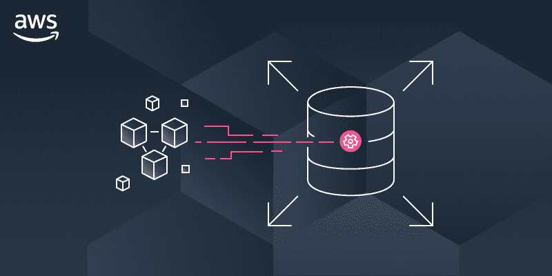

# Amazon RDS 代理——在 RDS 中管理数据库连接的好方法

> 原文：<https://medium.com/globant/amazon-rds-proxy-great-way-to-manage-database-connections-in-rds-d6f03e30d597?source=collection_archive---------0----------------------->

Source: Amazon Web Services

如今，微服务已经成为开发应用程序的标准和首选方式。具有微服务架构的应用程序可以有许多开放式数据库连接。它们可能会以很高的速度打开和关闭数据库连接，这会导致数据库计算和内存资源的额外消耗。将 Amazon RDS 与微服务一起使用有一个限制，因为 Amazon RDS 只允许有限数量的打开连接。亚马逊 RDS 代理可以是一个解决方案。

在本文中，我们将讨论以下几点:

1.  介绍
2.  没有亚马逊 RDS 代理的挑战
3.  使用 Amazon RDS 代理的好处
4.  Amazon RDS 代理的局限性
5.  亚马逊 RDS 代理概念和术语
6.  创建和配置 Amazon RDS 代理
7.  结论
8.  参考

# **1。简介**

[亚马逊 RDS 代理](https://docs.aws.amazon.com/AmazonRDS/latest/AuroraUserGuide/rds-proxy.html)是亚马逊 RDS 的一个完全托管的数据库代理。Amazon RDS 代理创建了一个数据库连接池&与应用程序的不同请求共享它们。

Amazon RDS 代理通过自动连接到备用数据库实例，同时保留应用程序连接，使应用程序对数据库故障更具弹性和可伸缩性。

使用 Amazon RDS 代理，您可以处理不可预测的数据库流量激增，这将快速创建新的连接。

代理是位于数据库和应用程序之间的中间层。应用程序建立到代理的连接，然后代理将连接路由到数据库。

Amazon RDS Proxy

对于经常打开和关闭数据库连接的应用程序来说，这是一个很大的优势，因为它们有许多打开的数据库连接。现在，这些应用程序只需通过 Amazon RDS 代理维护较少的数据库连接。

Amazon RDS 代理创建一个数据库连接池，并重用该池中的连接，以避免每次创建新数据库连接时的内存和 CPU 开销。

Amazon RDS 代理对连接池中不能立即提供服务的连接进行限制或排队。Amazon RDS 代理拒绝超过您指定的阈值的连接请求(也就是说，它会卸载负载)。此外，它还保持了可用容量可以处理的负载的可预测性能。即使延迟可能会增加，您的应用程序也可以扩展，而不会突然出现故障或使数据库过载。

# **2。没有亚马逊 RDS 代理的挑战**

Amazon RDS 附带了一组特定的数据库连接。最大并行数据库连接数因数据库引擎类型和数据库实例的内存分配而异。Amazon RDS 在处理数据库连接时面临以下挑战:

*   管理应用程序的几个连接会影响数据库的性能。
*   RDS 具有有限的数据库连接。您可能会得到“太多连接”错误。
*   频繁地打开和关闭数据库连接。

# **3。使用亚马逊 RDS 代理的优势**

Amazon RDS 代理负责数据库连接管理。以下是使用 Amazon RDS 代理的好处:

*   它是 RDS 的完全托管和高度可用的数据库代理，提高了可伸缩性、数据库故障恢复能力和应用程序的安全性。
*   Amazon RDS Proxy 通过自动建立到替换数据库实例的连接，同时保持现有连接，减少了因影响数据库可用性的停机而导致的应用程序中断。Amazon RDS 代理在故障转移期间将查询定向到替换数据库实例。因此，Aurora 和 RDS 数据库的故障转移时间可以减少 66%。
*   它允许应用程序池化和共享与数据库建立的连接，从而提高了数据库效率和应用程序的可伸缩性。
*   它完全兼容 MySQL 和 PostgreSQL。
*   此外，它允许用户通过控制打开的数据库连接的总数来保持可预测的数据库性能。
*   它是完全无服务器的，可以自动适应工作负载。
*   它允许您对数据库应用 AWS IAM 身份验证，并在 AWS Secrets Manager 中安全地存储凭证。
*   用户可以使用 Amazon RDS 代理来保持应用程序的连接空闲，同时根据需要建立数据库连接来为他们提供最佳服务。
*   它在 Amazon RDS 代理和数据库之间应用传输层安全性。
*   您可以将几个代理分配给同一个数据库实例或集群。
*   清理非活动连接和管理连接池不再需要代码。

# **4。亚马逊 RDS 代理的局限性**

Amazon RDS 代理克服了 DB 连接管理的缺点，但是它有一些限制。

*   即使数据库实例是公开可用的，Amazon RDS 代理也不能公开可用。
*   Amazon RDS 代理仅适用于 RDS 集群/实例，而不是基于 EC2 实例的自管理数据库。
*   亚马逊 RDS 代理支持 Aurora 无服务器 V2，不支持 Aurora 无服务器 V1。
*   Amazon RDS 代理只能与一个数据库实例相关联。
*   Aurora 集群中使用默认代理端点的所有连接都通过 Aurora writer 实例进行管理。您可以为代理创建只读端点，以便为读取密集型工作负载执行负载平衡。
*   Amazon RDS 代理目前不支持 Aurora 全球数据库。
*   您不能将 Amazon RDS 代理与具有专用租赁的 VPC 配合使用。
*   您不能将 Amazon RDS 代理与群集的自定 DNS 一起使用。

# **5。亚马逊 RDS 代理概念和术语**

以下是一些与 Amazon RDS 代理相关的术语:

## **连接池/多路复用/重用**

连接池是一种优化，允许应用程序共享和重用数据库连接。

## **借款**

当 Amazon RDS 代理临时从池中删除一个现有连接并重用它时。使用后，它会将连接返回到原始池。

## **牵制**

如果 Amazon RDS 代理不确定是否重用某个连接，它会在会话中保持该连接，直到它结束。

## **交易**

同一事务中的所有指令仍然使用相同的底层数据库连接。在事务结束时，该连接可供不同的会话使用。Amazon RDS 代理通过数据库客户端应用程序使用的网络协议检测事务何时结束。事务检测不基于 SQL 语句文本中出现的关键字，如 COMMIT 或 ROLLBACK。

# **6。创建和配置亚马逊 RDS 代理**

在本节中，我们将介绍 Amazon RDS 代理的创建和配置步骤。

## **先决条件**

以下是亚马逊 RDS 代理的先决条件。

*   创建 Aurora RDS 集群。
*   为 Amazon RDS 代理创建两个或更多专用子网。
*   为 Amazon RDS 代理创建一个安全组。
*   在秘密管理器中创建数据库秘密。

## **创建 Amazon RDS 代理的步骤**

1.  登录 AWS 帐户，转到 RDS 控制台，然后单击代理
2.  点击“创建代理”

2.1 根据 Aurora 集群引擎系列选择数据库引擎系列。
2.2 输入代理的名称。
2.3 根据您的要求，在“空闲客户端连接超时”下输入一个值(来自您的应用程序的空闲连接将在指定时间后关闭)。

3.进入【目标组配置】
3.1 从下拉列表中选择现有的 Aurora 集群。
3.2 在“连接池最大连接数”部分输入一个值(指定最大允许连接数占数据库最大连接限制的百分比)。
3.3 如果您在 Aurora 集群中创建了读取副本，请选择“添加读取器端点”。
3.4 暂时不保留“会话锁定过滤器”。
3.5 输入“连接借用超时”(从池中借用数据库连接的超时)

4.进入“附加目标组配置”
4.1 保持“会话锁定过滤器”暂时无。
4.2 输入“连接借用超时”(从池中借用数据库连接的超时)

5.配置连接设置
5.1 从先决条件步骤中创建的机密管理器中选择 Aurora 集群机密。
5.2 如果启用了 IAM 认证，则选择 IAM 角色。
5.3 如果要使用 IAM 角色而不是 DB 身份证明来连接数据库，请在“IAM 身份验证”中选择“必需”。
5.4 选择在先决条件部分创建的子网。
5.5 选择在先决条件部分创建的安全组。

6.选择附加连接选项
6.1 选择在先决条件部分创建的安全组。

7.配置“高级配置”选项
7.1 如果您想在 CloudWatch 日志中查看代理处理的查询，请选择“激活增强日志记录”。
7.2 点击【创建代理】按钮。

7.3 您将看到代理处于“正在创建”状态。

7.4 几分钟后，代理将处于“可用”状态。

您可以通过使用代理端点连接到数据库来验证 Amazon RDS 代理是否在工作。您可以在代理详细信息页面获取代理端点。

# **7。结论**

在本教程中，我们学习了亚马逊 RDS 代理。这对于具有许多开放连接的微服务和大型应用非常有益。它大大减少了 Amazon Aurora 和 Amazon RDS 的连接管理工作。它可以很容易地集成到应用程序中，而不需要更改代码。

# **8。参考文献**

[https://aws.amazon.com/rds/proxy/](https://aws.amazon.com/rds/proxy/)

[https://docs . AWS . Amazon . com/Amazon rds/latest/user guide/rds-proxy . html](https://docs.aws.amazon.com/AmazonRDS/latest/UserGuide/rds-proxy.html)