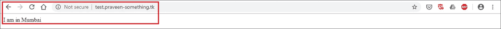

# Amazon Route 53 —关于基于延迟的路由，您需要知道的一切

> 原文：<https://medium.com/edureka/amazon-route-53-c22c470c22f1?source=collection_archive---------0----------------------->

Amazon Route 53 Tutorial — Edureka

在这个互联网和数字数据时代，我们看到大量在线数据被生成和消费。它带来了巨大的在线流量。因此，对于在线平台来说，管理这种流量并更好更快地为客户服务变得非常重要。这篇亚马逊 Route 53 (AWS Route 53)教程将帮助你理解并实现上述做法。

本文主要关注以下几点:

*   亚马逊 53 号公路
*   路由类型
*   延迟路由策略
*   演示:路由一个示例网站

所以让我们用下面的服务来学习亚马逊 53 号路线教程，

# 亚马逊 53 号公路

它是一种可扩展的(DNS)服务，提供了一种将流量重定向到应用程序的可靠方法。为了实现这一点，域名被转换成 IP 地址，以帮助计算机更好地连接。使用 Amazon Route 53 可以将查询连接到 AWS 中的弹性负载平衡器之类的实体。因此，开发者可以将域名映射到 S3 桶或其他资源。有了亚马逊，Route 53 企业可以轻松监控和路由全球数据流量。简单来说，53 号干线主要有三个用途

*   DNS 注册
*   路由互联网流量
*   检查健康状况

现在让我们继续这个亚马逊路线 53 教程，看看下一个主题，

# 路由类型

Amazon Route 53 使用不同的路由策略来路由全球通行的流量。这是相同的列表，

*   简单路由
*   基于延迟的路由
*   故障转移路由
*   地理定位路由
*   地理邻近路径(仅交通流量)
*   多值应答路由
*   加权路由

在这篇关于 Amazon Route 53 教程的文章中，我们将重点关注延迟路由策略

# 延迟路由策略

性能在一个网站的成功中起着重要的作用。一个网站的响应时间和它的流量有直接的关系。根据谷歌的说法，

*   当 Pinterest 减少了 40%的感知等待时间后，搜索引擎的流量和注册人数增加了 15%
*   BBC 发现，他们的网站加载每多花一秒钟，就会多损失 10%的用户

如果一个网站或 CRM 应用程序有来自多个位置的客户，那么该网站可以跨多个 AWS 区域安装或托管。对网站的任何请求都可以从 AWS 区域得到服务，这提供了最低的延迟以提高整体客户满意度。此功能由“延迟路由策略”提供，它是 AWS Route53 服务的一部分。

让我们继续这个亚马逊路线 53 教程的最后一章，

# 演示路由一个样本网站

在本教程中，我们将在两个不同的地区(比如北弗吉尼亚和孟买)建立一个简单的静态网站，然后使用域名访问该网站，注意我们会被自动重定向到最近的 AWS 地区。选择地区时的模式是，其中一个地区应该是离你最近的，另一个地区应该像对跖地一样朝向世界的另一端。

下面是一系列高级步骤。此外，整个演示可以在 AWS 免费层中完成。

1.  从 Freenom 创建一个自由域
2.  在不同的 AWS 区域创建两个 Ubuntu EC2 实例
3.  安装 Apache web 服务器并创建一个简单的静态网站
4.  为“延迟路由策略”配置 Route53
5.  将 Route53 中的名称服务器添加到 Freenom
6.  测试整个设置。

**先决条件是什么？**

*   在北弗吉尼亚和孟买地区访问两个正在运行的 Ubuntu EC2 实例(在一个地区选择可用区域并不重要)。t2.micro 类型的 EC2 实例应该足够好，因为我们将安装一个简单的静态网站，好的方面是 t2.micro 也属于 AWS 免费层。Edureka 教程 Amazon Elastic Compute Cloud 中提到了创建 EC2 实例的过程以及如何连接它们。
*   确保为 AMI 选择最新的 Ubuntu。另外，确保端口 80 (HTTP)和端口 22 (ssh)在安全组中是打开的
*   官方文档[中提到的 Freenom 的自由域名](https://my.freenom.com/knowledgebase.php?action=displayarticle&id=28)必须被创建。任何域提供商提供的现有域名也可以在本教程中使用，但是本教程中的步骤适用于从 Freenom 创建的域。

## 步骤 1:安装网络服务器，在 Ubuntu 上创建一个简单的静态网站

使用 Putty 或其他软件登录到两个 Ubuntu 服务器，发出以下命令来安装 web 服务器并创建一个静态网站。

**步骤 1.1:** 成为 root 用户执行后续命令。

`*sudo su*`

**步骤 1.2:** 获取软件列表

`*apt-get update*`

**步骤 1.3:** 安装 Apache web 服务器及其依赖项，并启动它。

`*apt-get install apache2
service apache2 start*`

**步骤 1.4:** 在/var/www/html 文件夹中创建一个静态网页“index.html”。

`*cd /var/www/html
echo “I am in Mumbai” > index.html*`

就这样，你几乎有了一个可以使用的网站，

对于北弗吉尼亚服务器，将字符串更改为“我在北弗吉尼亚”。通常，同一组网页将被部署在所有区域。但是，为了区分 Route53 重定向到哪个 AWS 区域，有必要在每个服务器上有不同的网页。

**步骤 1.5:** 在浏览器中键入 EC2 服务器的 IP 地址，确保网站启动并运行。

## 步骤 2:为基于延迟的路由策略配置 Route 53(Amazon Route 53 教程)

根据关于托管区域定价的 AWS 文档，创建托管区域不需要额外的成本。如果在创建后 12 小时内将其删除。

**步骤 2.1:** 进入 AWS 管理控制台，查找 Route53 服务，点击 DNS 管理下的“立即开始”。

**步骤 2.2:** 点击“创建托管区域”，输入在 Freenom 中创建的域名，然后点击“创建”。

托管区域应已创建，名称服务器应如下所示。我们稍后将在 Freenom 控制台中使用相同的方法。

**步骤 2.3:** 为每个 Ubuntu 服务器点击一次“创建记录集”，并指定如下所示的详细信息。请注意，值字段中提到的 IP 地址是 EC2 实例的 IP 地址。此外，两个记录的名称应该相同(在本例中为 test ),两个记录的“SET ID”应该不同。

最后，名称记录应该如下所示。

## 步骤 3:将 Route53 中的名称服务器添加到 Freenom (Amazon Route 53 教程)

Route53 托管区域的名称服务器详细信息应添加到之前创建的 Freenom 域中，这将使 Freenom 能够将域名解析为 IP 地址。

**第 3.1 步:**在浏览器中导航至 [Freenom](https://my.freenom.com/clientarea.php) ，然后进入“服务- >我的域名”。将显示所有当前拥有的域。点击“管理域”进行更改。

**步骤 3.2:** 转到“管理工具- >名称服务器”并选择“使用自定义名称服务器”。

**步骤 3.3:** 输入从 AWS Route53 托管区域接收的名称服务器，并点击“更改名称服务器”以完成 Freenom 中的设置。

如果该域名已经在 GoDaddy 注册，那么请按照[官方说明](https://in.godaddy.com/help/set-custom-nameservers-for-domains-registered-with-godaddy-12317)设置自定义域名服务器。以上步骤是针对 Freenom 的。

**步骤 4:测试整个设置**

现在整个设置已经完成。在浏览器中输入域名的 URL，Route53“延迟路由策略”应根据最佳延迟自动重定向到网页。由于本教程是在印度编写的，我们会自动重定向到孟买 AWS 地区，如下图所示。

在本教程中，我们注意到“延迟路由策略”将根据延迟时间将用户重定向到该区域，最终为客户提供最佳体验。这种方法的唯一问题是 web 服务器必须跨多个区域复制，这导致了额外的成本。

在接下来的教程中，我们将了解“加权路由策略”，它允许流量根据 EC2 实例的大小按比例重新路由。现在，在您离开之前，请确保删除作为本教程的一部分而创建的资源，因为免费层之外的资源是有相关成本的。

所以这是它的家伙，这使我们对亚马逊路线 53 教程这篇文章的结尾。

如果你想查看更多关于人工智能、DevOps、道德黑客等市场最热门技术的文章，你可以参考 Edureka 的官方网站。

请留意本系列中的其他文章，它们将解释 AWS 的各个方面。

> *1。* [*AWS 教程*](/edureka/amazon-aws-tutorial-4af6fefa9941)
> 
> *2。* [*AWS EC2*](/edureka/aws-ec2-tutorial-16583cc7798e)
> 
> *3。*[*AWS Lambda*](/edureka/aws-lambda-tutorial-cadd47fbd39b)
> 
> *4。* [*AWS 弹性豆茎*](/edureka/aws-elastic-beanstalk-647ae1d35e2)
> 
> *5。* [*AWS S3*](/edureka/s3-aws-amazon-simple-storage-service-aa71c664b465)
> 
> *6。* [*AWS 控制台*](/edureka/aws-console-fd768626c7d4)
> 
> *7。* [*AWS RDS*](/edureka/rds-aws-tutorial-for-aws-solution-architects-eec7217774dd)
> 
> *8。* [*AWS 迁移*](/edureka/aws-migration-e701057f48fe)
> 
> *9。*[*AWS Fargate*](/edureka/aws-fargate-85a0e256cb03)
> 
> *10。* [*亚马逊 Lex*](/edureka/how-to-develop-a-chat-bot-using-amazon-lex-a570beac969e)
> 
> *11。* [*亚马逊光帆*](/edureka/amazon-lightsail-tutorial-c2ccc800c4b7)
> 
> 12。 [*AWS 定价*](/edureka/aws-pricing-91e1137280a9)
> 
> *13。* [*亚马逊雅典娜*](/edureka/amazon-athena-tutorial-c7583053495f)
> 
> *14。* [*AWS CLI*](/edureka/aws-cli-9614bf69292d)
> 
> 15。 [*亚马逊 VPC 教程*](/edureka/amazon-vpc-tutorial-45b7467bcf1d)
> 
> 15。T32*AWS vs Azure*
> 
> 17。 [*内部部署 vs 云计算*](/edureka/on-premise-vs-cloud-computing-f9aee3b05f50)
> 
> *18。* [*亚马逊迪纳摩 DB 教程*](/edureka/amazon-dynamodb-tutorial-74d032bde759)
> 
> *19。* [*如何从快照恢复 EC2？*](/edureka/restore-ec2-from-snapshot-ddf36f396a6e)
> 
> 20。[*AWS code commit*](/edureka/aws-codecommit-31ef5a801fcf)
> 
> *21。* [*使用亚马逊 ECS*](/edureka/docker-container-in-production-amazon-ecs-19857ce96f25) 在生产中运行 Docker

*原载于 2019 年 6 月 26 日*[*www.edureka.co*](https://www.edureka.co/blog/amazon-route-53/)*。*