# 从 Oracle JET 访问 Amazon SageMaker 模型端点

> 原文：<https://medium.com/oracledevs/amazon-sagemaker-model-endpoint-access-from-oracle-jet-e4ca9370cfab?source=collection_archive---------0----------------------->

如果你用亚马逊 SageMaker 实现机器学习模型，显然你会想知道如何从外部访问训练好的模型。AWS 机器学习博客上有一篇很好的文章与这个主题相关 [—使用亚马逊 API 网关和 AWS Lambda](https://aws.amazon.com/blogs/machine-learning/call-an-amazon-sagemaker-model-endpoint-using-amazon-api-gateway-and-aws-lambda/) 调用亚马逊 SageMaker 模型端点。我完成了描述的步骤，并为自己的模块实现了 REST API。我更进一步，测试了用 [Oracle JET](https://www.oracle.com/webfolder/technetwork/jet/index.html) JavaScript 免费开源工具包实现的 JavaScript 应用程序的 API 调用。

在这篇文章中，我不会深入研究机器学习部分。我将专门关注 AWS SageMaker 端点。我用的是本书第二章的 Jupyter 笔记本— [商业机器学习](https://www.manning.com/books/machine-learning-for-business)。在笔记本的最后，当机器学习模型被创建时，我们初始化 AWS 端点(名称:*订单批准*)。把它想象成某种接入点。通过这个端点我们可以调用预测函数:

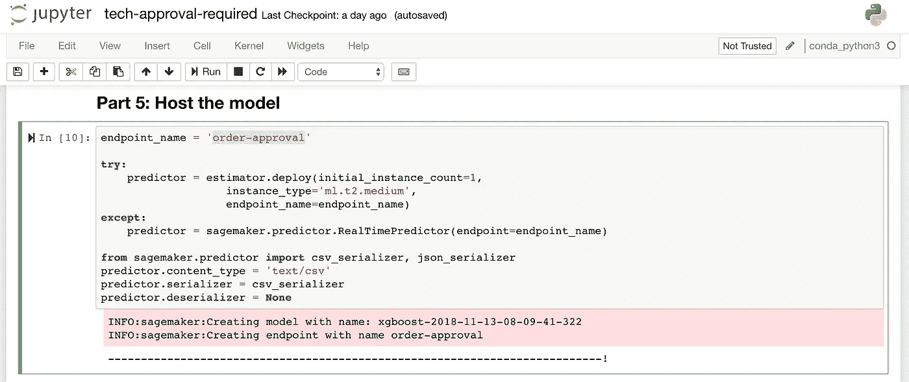

等待大约 5 分钟，直到终点开始。然后，您应该在 SageMaker 中看到端点条目:

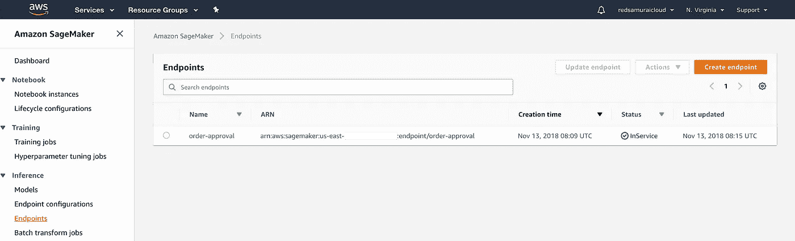

如何公开端点以供外部访问？通过 AWS Lambda 和 AWS API 网关。

自动气象站λ

转到 AWS Lambda 服务并创建新功能。我已经有了函数，Python 3.6 设置为运行时。AWS Lambda 充当端点和 API 之间的代理函数。在将输入数据返回给 API 之前，我们可以在这里准备输入数据并解析响应:

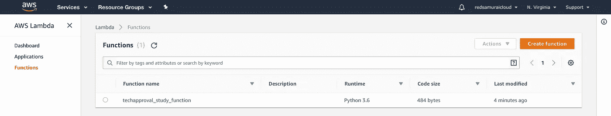

必须授予函数角色才能访问 SageMaker 资源:

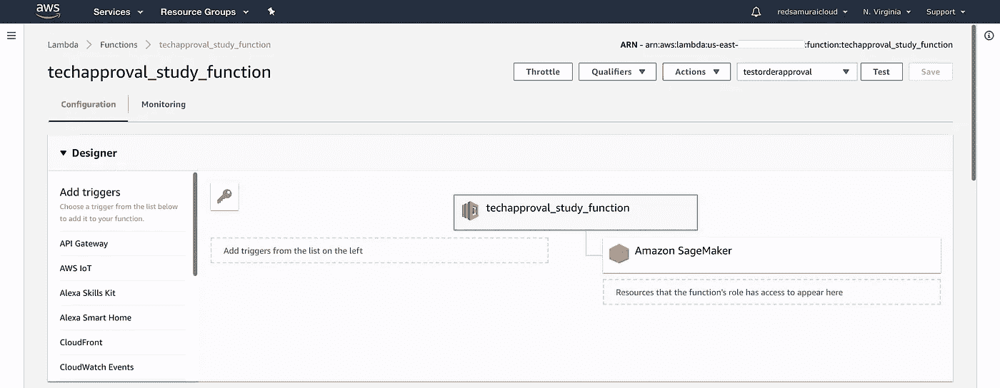

这是函数实现。端点名称被移出到环境变量中。函数获取输入，调用 SageMaker 端点，并对响应做一些最小的处理:

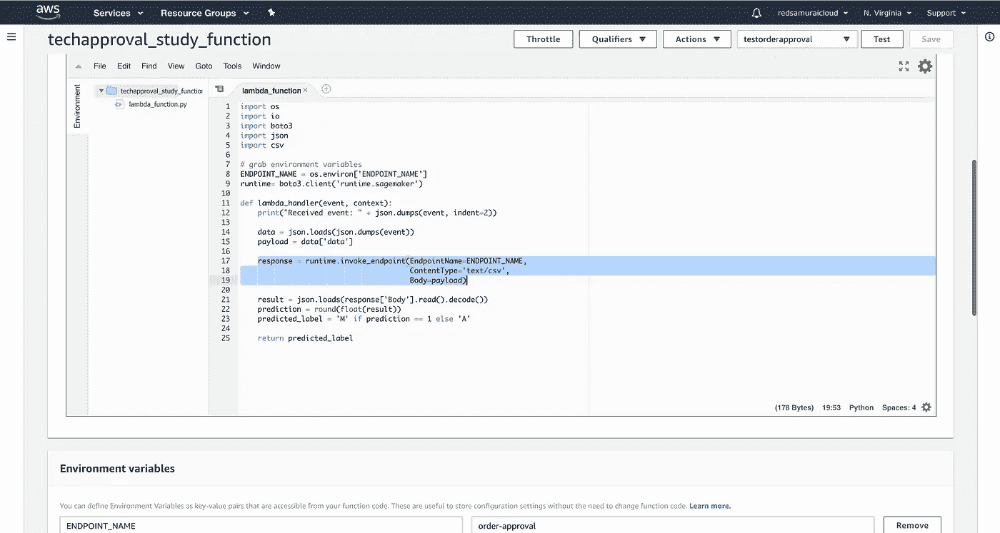

我们可以测试 lambda 函数并提供测试有效载荷。这是我正在使用的测试载荷。这是机器学习模型的编码参数列表。描述采购订单的参数。模型决定是否需要人工批准。决策规则—如果采购订单由非 IT 部门的人员提出，但他们订购了 IT 产品，则需要人工批准。在上面提到的书中可以读到更多关于它的内容。测试有效载荷数据:

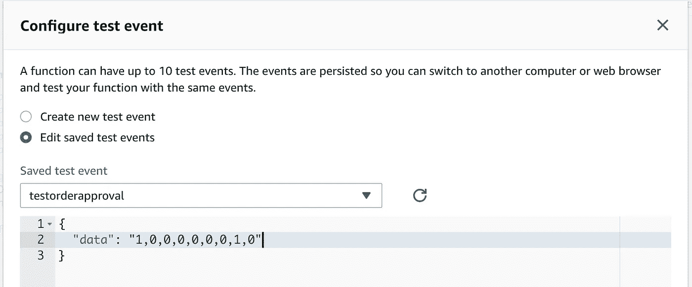

运行测试执行，模型响应—需要手动批准采购订单:

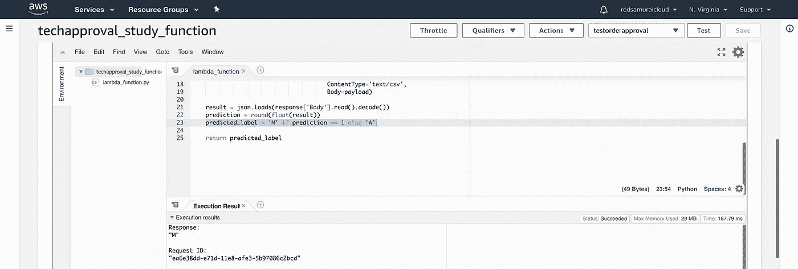

AWS API 网关

最后一步是定义 API 网关。客户端将通过 API 调用 Lambda 函数:

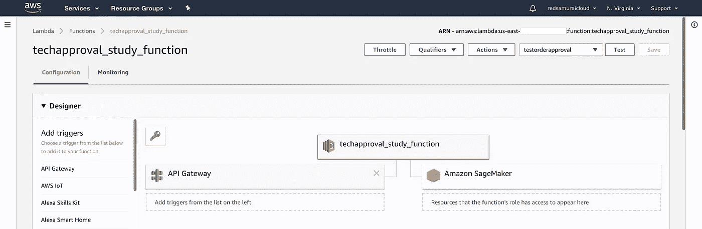

我已经为 API 网关定义了 REST 资源和 POST 方法。客户端请求将通过 API 调用，然后被定向到 Lambda 函数，该函数将根据客户端输入数据调用 SageMaker 预测:

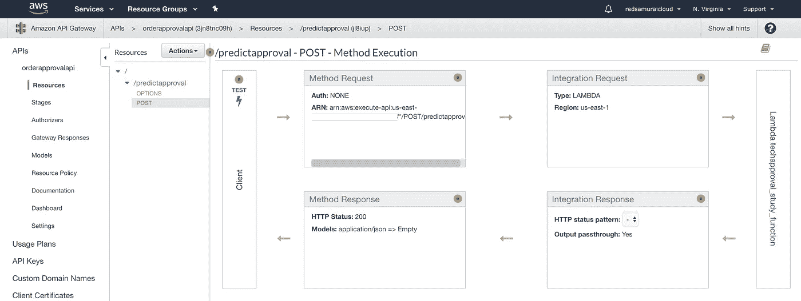

POST 方法被设置为调用 Lambda 函数(上面创建了具有此名称的函数):

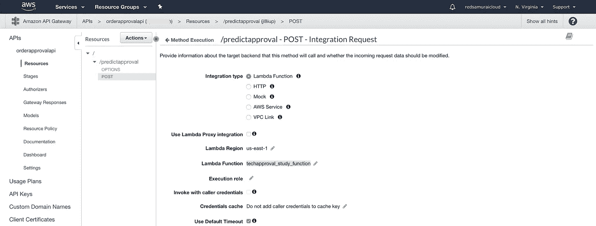

一旦部署了 API，我们就获得了 URL。确保在末尾添加 REST 资源名称。在 Oracle JET 中，我们可以使用简单的 JQuery 调用来执行 POST 方法。一旦收到异步响应，我们将显示通知消息:

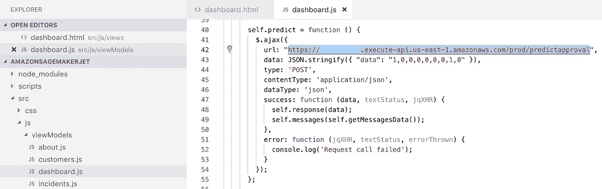

Oracle JET 显示从 SageMaker 收到的预测—当前 PO 需要人工审核:

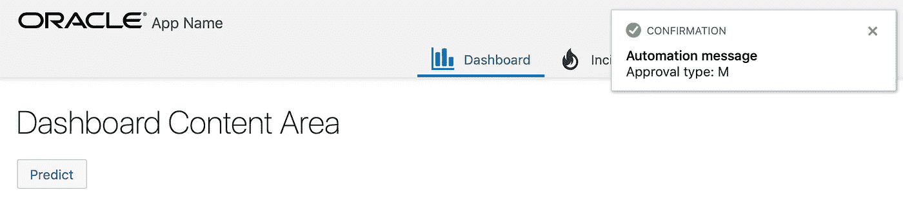

从 my [GitHub](https://github.com/abaranovskis-redsamurai/amazonsagemakerjet) repo 下载带有 AWS SageMaker API 调用的 Oracle JET 示例应用程序。

*原载于 2018 年 11 月 13 日*[*【andrejusb.blogspot.com*](https://andrejusb.blogspot.com/2018/11/amazon-sagemaker-model-endpoint-access.html)*。*