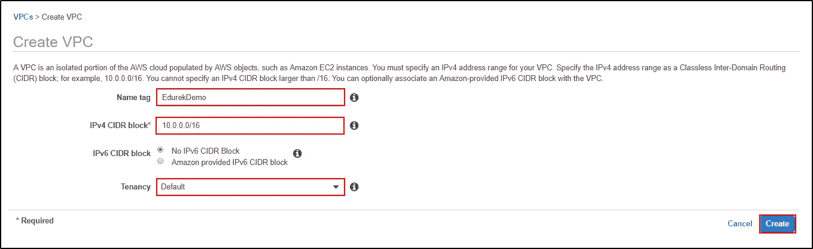

# 使用亚马逊 VPC 保护您的 AWS 环境

> 原文：<https://medium.com/edureka/amazon-vpc-tutorial-45b7467bcf1d?source=collection_archive---------1----------------------->

> 安全是创新的前沿

AWS 集中了大量精力来确保他们的客户不会成为数据泄露的受害者。当某些资源需要与合同工或第三方公司共享时，安全性变得更加重要，因为您面临着将敏感数据暴露给他们的风险。在这篇亚马逊 VPC 教程中，我将解释如何在 AWS 上创建一个隔离空间，并为这些用户提供访问权限。

亚马逊 VPC 也可以被视为你在 AWS 云基础设施中的私有网络。安全性是顶尖的，因为有亚马逊照顾。在这篇文章中，我将讨论 AWS 作为亚马逊 VPC 的一部分所提供的以下服务。

*   亚马逊 VPC 及其类型
*   子网及其效用
*   什么是路由表？
*   什么是互联网网关？
*   演示:使用 AWS 控制台创建 VPC。
*   演示:创建一个非默认 VPC，并在 VPC 内创建一个私有和公有子网。

让我们详细讨论这个亚马逊 VPC 教程中的每个组件。

# 亚马逊 VPC 及其类型

AWS 提供了很多服务，这些服务足以运行你的架构。该架构的安全基础是 VPC(虚拟私有云)。VPC 基本上是 AWS 环境中的一个私有云，帮助您在您定义的私有空间中使用 AWS 的所有服务。您可以控制虚拟网络，还可以使用安全组限制传入流量。

总的来说，VPC 帮助您保护您的环境，并给你一个完整的权限传入流量。有两种类型的 VPC，默认情况下由 Amazon 创建的默认 VPC 和由您创建的满足您的安全需求的非默认 VPC。

现在你已经了解了 VPC 是如何运作的，我将带你了解亚马逊 VPC 提供的不同服务。

# 子网及其效用

子网就像是将一个大型网络分成多个子网。与维护大型网络相比，维护小型网络更容易。

以一个组织为例。有不同的团队，如财务、支持、运营、技术、人力资源、销售和营销。技术团队可以访问的数据不能提供给销售和营销团队，人力资源团队的数据不能提供给运营团队，反之亦然。在这里，您可以创建子网络，从而使访问和维护网络变得更加容易。

现在，我将向你们展示这种隔离是如何进行的。有不同的组件用于授权和限制访问。让我带你看一下每一个。

# 什么是路由表？

路由表可以理解为包含子网内外流量路由规则的表。路由表也用于将互联网网关添加到子网中。一个 VPC 中可以有多个路由表。

现在您已经了解了路由表的工作原理。让我们继续亚马逊 VPC 教程，了解互联网网关，看看它如何帮助管理流量。

# 什么是互联网网关？

Internet Gateway 是一个非常重要的组件，它允许您的实例连接到 Internet。它允许用户通过提供到 internet 的路由来公开子网。借助 Internet Gateway，实例可以访问 Internet，实例外部的资源也可以访问实例。

总的来说，互联网门户是 VPC 非常重要的组成部分。现在，您已经了解了 VPC 的所有不同组成部分，让我们看看如何为自己创建一个。

现在你已经了解了亚马逊 VPC 的组件，让我们继续学习亚马逊 VPC 教程，了解如何使用默认设置和公共子网创建 VPC。

# 演示:使用 AWS 控制台创建 VPC

使用 AWS 控制台创建 VPC 非常简单。只需点击几下鼠标。让我向您介绍一下这个过程:

**步骤 1:** 导航至 VPC 仪表盘。在这里你会看到一个“**启动 VPC 向导**”点击它。

**第二步:**这是 *VPC 创作*向导。在这里，您可以找到 4 种不同的选项:

1.  我们将选择具有单个公共子网的 VPC。
2.  带有公有子网和私有子网的 VPC。
3.  具有公共和私有子网以及硬件 VPN 访问的 VPC。
4.  只有专用子网和硬件 VPN 访问的 VPC。

让我们首先创建一个带有单个公共子网的 VPC。点击*选择*。

**第三步:**这里你需要提到一些创建 VPC 的细节。

*   IPv4 CIDR 块
*   VPC 名字
*   公共子网的 IPv4 CIDR
*   要在其中创建 VPC 的可用性区域
*   子网名称
*   硬件租赁

提及所有细节后，点击“*创建 VPC* ”。

**第 4 步:**您将收到一条消息，提示“*您的 VPC 已成功创建*”。点击*确定*。

**第五步:**在“你的 VPC”部分，你可以看到一个名为“ *EdurekaDemo* ”的新 VPC 被创建。

**第 6 步:**现在我们来验证一下公有子网。您可以看到创建了一个名为“Public Subnet”的子网。该子网附有一个路由表，其中包含带有互联网网关的本地和公共访问。

这样，VPC 就创建了一个公共子网。很容易不是吗？

现在，让我们转到亚马逊 VPC 教程的另一个演示，并找出从头开始创建 VPC 的另一种方法。在这里，我将向您展示如何手动创建一切。

# 演示:创建非默认 VPC，并在 VPC 内部创建私有和公有子网

让我们走一条长路，创建一个有两个子网的非默认 VPC，一个公有，一个私有。

**第一步:**导航到 [*你的 VPC*](https://console.aws.amazon.com/vpc/home?region=us-east-1) ，点击*创建 VPC* 。

**第 2 步:**为您的 VPC 命名，提及 IPv4 CIDR 块。点击“创建”。

**第三步:**你得到一条消息“*下面的 VPC 是用你的“ *VPC ID* ”创建的*。点击*关闭*。

**步骤 4:** 现在，创建子网。为此，导航到“*子网*，在“*VPC 过滤*”中，选择您的 VPC，然后您将看到没有子网。

**步骤 5:** 创建一个名为 Private 的子网。选择您的 VPC、可用性区域和 IPv4 CIDR 块。点击*创建*。

您将收到一条消息，显示“*以下子网已创建*”以及“*子网 ID* ”。点击*关闭*。

**第 6 步:**创建一个公共子网，按照我创建私有子网时所做的那样，填写所有相关的详细信息。点击*创建*。

您将收到一条消息，提示“*以下子网是使用“*子网 ID* 创建的”*。点击*关闭*。

**第 7 步:**现在，我们必须创建一个 Internet 网关来公开子网。

导航至互联网网关，点击创建“*互联网网关*”。

为您的互联网网关命名。点击*创建*。

您将收到一条消息，显示“*以下互联网网关已创建”*和“*互联网网关 ID* ”。点击*关闭*。

第八步:仅仅创建一个互联网网关是不够的。你必须将互联网网关连接到 VPC 上。

选择您要为其连接 Internet 网关的 VPC。点击*附上*。

**步骤 9:** 现在，您已经将互联网网关连接到了 VPC，是时候制定使用路由表管理流量的规则了。导航到路由表，点击“*创建路由表*”。

为您的路由表命名，并选择路由表适用的 VPC。点击*创建*。

您将得到一条消息“*以下路由表已创建*”和“*路由表 ID* ”。点击*关闭*。

步骤 10: 现在你已经创建了一个路由表。添加用于管理流量的路由。导航至“*路线*，点击“*编辑路线*”。

点击“*添加路线*并提及目的地 **0.0.0.0/0** ，因为您希望它对公众开放，然后选择目标作为您之前创建的互联网网关。点击*保存路线*。

**步骤 11:** 现在规则已经添加到路由表中，是时候将它附加到公共子网了。选择公共子网并导航到路由表，然后单击“*编辑路由表关联*”。

选择路由表，点击*保存*。

您已经成功地公开了子网。

这样，您可以走很长的路来创建一个有两个子网的亚马逊 VPC，一个公共子网和一个私有子网。

我希望你对亚马逊 VPC 及其组件有一个简要的了解。如果你想查看更多关于人工智能、DevOps、道德黑客等市场最热门技术的文章，你可以参考 [Edureka 的官方网站。](https://www.edureka.co/blog/?utm_source=medium&utm_medium=content-link&utm_campaign=amazon-vpc-tutorial)

请留意本系列中的其他文章，它们将解释 AWS 的各个方面。

> *1。* [*AWS 教程*](/edureka/amazon-aws-tutorial-4af6fefa9941)
> 
> *2。*[*AWS EC2*](/edureka/aws-ec2-tutorial-16583cc7798e)
> 
> *3。*[*AWS Lambda*](/edureka/aws-lambda-tutorial-cadd47fbd39b)
> 
> *4。* [*AWS 弹性豆茎*](/edureka/aws-elastic-beanstalk-647ae1d35e2)
> 
> *5。* [*AWS S3*](/edureka/s3-aws-amazon-simple-storage-service-aa71c664b465)
> 
> *6。* [*AWS 控制台*](/edureka/aws-console-fd768626c7d4)
> 
> *7。* [*AWS RDS*](/edureka/rds-aws-tutorial-for-aws-solution-architects-eec7217774dd)
> 
> *8。* [*AWS 迁移*](/edureka/aws-migration-e701057f48fe)
> 
> *9。*[*AWS Fargate*](/edureka/aws-fargate-85a0e256cb03)
> 
> *10。* [*亚马逊 Lex*](/edureka/how-to-develop-a-chat-bot-using-amazon-lex-a570beac969e)
> 
> *11。* [*亚马逊*](/edureka/amazon-lightsail-tutorial-c2ccc800c4b7)
> 
> *12。* [*AWS 定价*](/edureka/aws-pricing-91e1137280a9)
> 
> 13。 [*亚马逊雅典娜*](/edureka/amazon-athena-tutorial-c7583053495f)
> 
> 14。 [*AWS CLI*](/edureka/aws-cli-9614bf69292d)
> 
> *15。* [*AWS 简历*](/edureka/aws-resume-7453d9477c74)
> 
> *15。*[*AWS vs Azure*](/edureka/aws-vs-azure-1a882339f127)
> 
> 17。 [*内部部署 vs 云计算*](/edureka/on-premise-vs-cloud-computing-f9aee3b05f50)
> 
> 18。 [*亚马逊迪纳摩 DB 教程*](/edureka/amazon-dynamodb-tutorial-74d032bde759)
> 
> 19。 [*如何从快照恢复 EC2？*](/edureka/restore-ec2-from-snapshot-ddf36f396a6e)
> 
> *20。* [*AWS 代码提交*](/edureka/aws-codecommit-31ef5a801fcf)
> 
> *21。* [*顶级 AWS 架构师面试问题*](/edureka/aws-architect-interview-questions-5bb705c6b660)
> 
> *22。* [*如何从快照恢复 EC2？*](/edureka/restore-ec2-from-snapshot-ddf36f396a6e)
> 
> *23。* [*使用 AWS 创建网站*](/edureka/create-websites-using-aws-1577a255ea36)
> 
> *24。* [*亚马逊路线 53*](/edureka/amazon-route-53-c22c470c22f1)
> 
> *25。* [*用 AWS WAF 保护 Web 应用*](/edureka/secure-web-applications-with-aws-waf-cf0a543fd0ab)

*原载于 2019 年 3 月 11 日*[*www.edureka.co*](https://www.edureka.co/blog/amazon-vpc-tutorial/)*。*