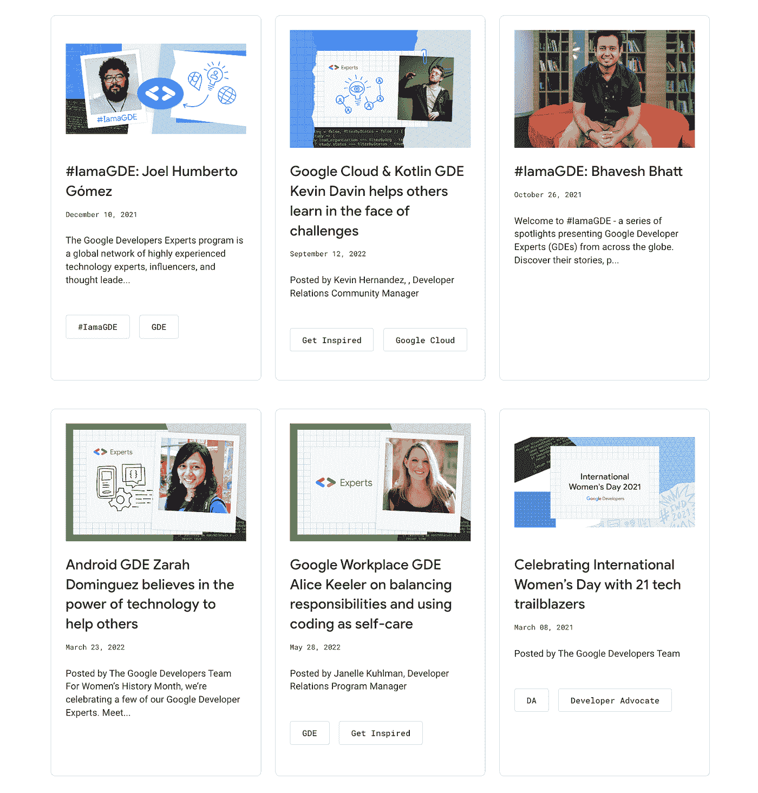
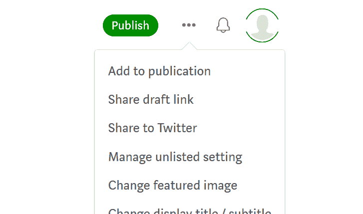

# 放大 GDE 的影响力:我们如何在谷歌寻找故事来源

> 原文：<https://medium.com/google-developer-experts/amplifying-gde-impact-how-we-source-stories-at-google-1a0c594fe08b?source=collection_archive---------2----------------------->

*GDE stories featured on the* [*Google Developers Blog*](https://developers.googleblog.com/)

作为一名谷歌开发者专家，你可能已经看到了我们的[谷歌开发者博客](https://developers.googleblog.com/)、[媒体出版物](https://medium.com/google-developer-experts)、[推特](https://twitter.com/GoogleDevExpert)或 [LinkedIn](https://www.linkedin.com/showcase/experts-program/?viewAsMember=true) 页面，并读到了你的 gde 同事参与的一些重大项目。GDE 社区很幸运有一个活跃的开发者社区，他们致力于有意义的项目，这些项目创造了真正的影响，激发了协作，或者仅仅是有趣的项目。社区中的例子包括 gastón saillén(Android&Firebase)在疫情期间开发的[送餐应用](https://developers.googleblog.com/2021/12/creating-app-to-help-your-community.html)，大学生 Liza Goldberg (Google Earth)利用她的专业知识[应对气候变化](https://developers.googleblog.com/2022/08/google-earth-engine-gde-liza-goldberg-uses-tech-to-fight-climate-change.html)，以及 Danielle Monteiro (Google Cloud)在她的祖国巴西打破壁垒并为女性开发人员开辟道路[。](https://developers.googleblog.com/2022/03/gde-profile-danielle-monteiro-cloud-gde.html)所有这些故事都强调了 GDEs 如何利用谷歌技术创造有意义的影响。谷歌团队通过各种平台监测 GDE 的故事，并一直在寻求放大令人难以置信的贡献。如果你曾经发现自己想知道我们如何寻找故事来源并放大你的辛勤工作，这是给你的帖子，我们带你到幕后，概述我们如何通过谷歌的镜头处理和审查故事。让我们来看看我们找到故事的几种方法。

**社区平台提交内容**

GDEs 在社区平台上提交他们的活动。提交的内容可能包括书面内容、视频或播客、讲座、研讨会等。项目团队每周审查提交的内容，并分享符合[提交指南](https://docs.google.com/document/d/1h69fshN18rM8qsg0Km05rZ-Q3blGzn90RizyOBUlaao/edit)的故事。有时，该团队会接触到 GDE，以了解更多的活动，并以博客帖子或视频的形式开发一个故事。让我们看一个最近的例子，我们如何在 Carlos Azaustre 的 YouTube 里程碑上为[写了一篇博文](https://developers.googleblog.com/2022/11/from-personal-notebook-to-100k-youtube-subscriptions-carlos-azaustre.html)。

1.  卡洛斯在社区平台上提交了他的故事。
2.  我们的团队审查并批准提交的内容，然后将其标记为博客帖子的潜在故事。
3.  一旦我们的团队决定追踪这个故事，我们就联系卡洛斯安排一次 30 分钟的采访。
4.  我们对 Carlos 进行了采访，并询问了与他的开发背景、GDE 经验以及产品专业知识相关的问题。
5.  我们起草故事，发布故事，并通过社交媒体渠道扩大影响。

**推特和领英**

我们还发现了 GDE 在 Twitter 和 LinkedIn 上的活动。以下行动可以确保我们不会错过想要分享的重要 GDE 活动。

1.  提到 Twitter 账号 [@GoogleDevExpert](https://twitter.com/GoogleDevExpert) 或者 Google 开发者账号 [@GoogleDevs](https://twitter.com/googledevs) 。
2.  使用#谷歌专家或#GDE 标签。

**中等提交量**

GDEs 可以利用的另一个平台是我们的 [GDE 媒体出版物](https://medium.com/google-developer-experts)。这份出版物由 Google 和 GDEs 的产品专家自己撰写的故事组成。发布故事的例子包括分享开发者的旅程、Google 技术更新、GDEs 协作等等。提交要发布的故事有几个简单的步骤。

1.  联系团队，作为作家加入 GDE 媒体出版物。请参考 GDE 欢迎指南了解这一流程。
2.  起草一个故事或确定一个你想提交的故事。
3.  进入故事，点击右上角的三个点:

4.点击“添加到出版物”，然后选择 GDE 媒体出版物。

5.如果故事符合我们的投稿指南，它将被审核并发表。

6.如果团队对故事有疑问，我们会主动联系。

**结论**

我们喜欢展示我们全球 GDE 社区的惊人工作！我们鼓励社区利用这些平台分享他们的故事，我们感谢您的影响！