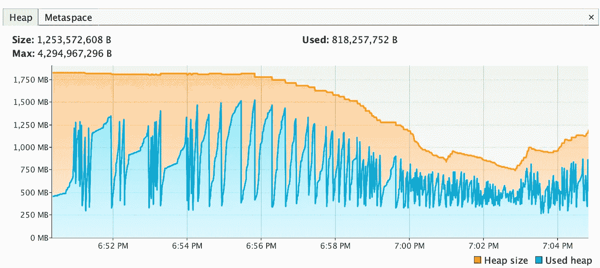
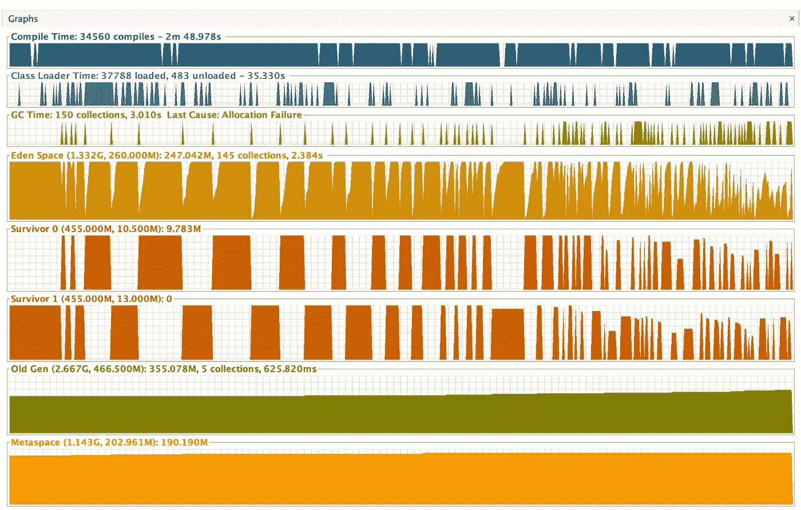

# 一种应用程序性能优化方法

> 原文：<https://medium.com/walmartglobaltech/an-approach-to-application-performance-optimisation-cdb8ea192cdf?source=collection_archive---------0----------------------->

在当今微服务架构、不断增加的服务数量和严格的服务 SLA 的世界中，应用性能对于确保客户的 E2E 无缝体验至关重要。

本文提供了对应用程序性能评估的见解，并设计了关于如何使用特定的 **Azure 服务**和其他代码优化来提高应用程序性能的解决方案。

## 了解应用程序的组件

构建的大多数应用程序都使用目前可用的依赖注入框架。一个应用程序嵌入了多个组件。对它们中的每一个进行优化对于拥有一个高性能的应用程序是至关重要的。

一个应用程序可以包括—

*   RDBMS 和非 SQL 数据库的 CRUD 操作
*   使用不同种类的设计模式处理业务逻辑的 API。
*   缓存。
*   异步处理。
*   批量处理。
*   预定数据处理。

还有更多..

# **性能优化方法**

性能优化是一个迭代的过程，包括对应用程序运行多个负载测试，以了解每个组件的行为。我们将研究最常用的组件，以及如何寻找相同的优化。

**SQL DB 优化**
大多数云提供商都有性能监控工具来衡量与组件性能相关的不同指标。Microsoft Azure 提供了智能性能工具，该工具可以洞察查询性能，并通过提供不同的建议来帮助优化查询。很少有人-

*   根据需要添加或删除索引。
*   减少资源使用的缓存执行计划的参数化查询。

**内存使用审查** 在应用程序准备好投入生产之前，有必要分析内存使用情况，以确保没有内存泄漏阻碍性能。当应用程序在高负载下运行时，使用以下命令拍摄堆快照—

```
jmap -dump:format=b,file=<filename.hprof> <pid>pid - process id of the java process running on the server.
```

我们还可以连接到远程应用程序，并使用 VisualVM 等工具了解正在运行的应用程序的内存使用情况。这将需要在服务器端进行一些防火墙更改，以确保您可以连接到远程服务器上的应用程序。

*   **堆利用率查看**
    可以使用 VisualVM 上的 VisualGC 插件查看 JVM 堆利用率。这提供了在将对象移动到 old gen 之前每个 GC 如何影响 Eden 和 Survivor 空间的见解。图中向上的斜率和向下的斜率表示内存利用率如何随时间增加和减少。这两个斜率都表示内存利用率是健康的。



Heap Utilization



Heap Graphs

上面的完全 Eden 空间利用率表明对象分配更好，堆得到了最大程度的利用。

*   **内存泄漏**
    内存泄漏是降低应用程序性能的主要原因之一，最终会导致应用程序崩溃。
    VisualVM 提供内存和 CPU 分析器和采样器。内存分析器中对象的生成计数提供了存活时间最长的对象的数据，可以指示内存泄漏。我们可以肯定，它需要更多的分析来解释为什么对象能够在垃圾收集周期中存活，但是任何存活时间更长的对象，如果不是为了在垃圾收集周期中存活而特别需要的，都很可能导致内存泄漏。
*   **使用 IntelliJ 进行代码检查**
    IntelliJ 提供了一种漂亮的方式来分析代码，并提供与内存和性能相关的问题。大多数时候，我们没有意识到集合有默认的内存分配，并且过度使用集合中数据较少的集合会导致更高的内存利用率。通过 IntelliJ 的 Inspect Code 实用程序，它为我们提供了改进性能的建议。我们几乎总是无法初始化集合的大小。由于内存分配失败，这可能会导致更高的 GC。
    另一个需要解决的问题是匿名类的使用。匿名类有悬挂引用的危险，这些引用永远不会被垃圾收集，会导致内存泄漏。所有这些性能和内存问题的建议都应该在每次代码提交之前考虑。
*   **垃圾收集日志** 垃圾收集日志有助于识别 JVM 堆利用率、与内存相关的问题，并可能指示内存泄漏。
    在构建应用程序时，我们无法识别 JVM 的年轻一代和老一代内存分配。这是 JVM 的默认设置。但是 JVM 提供了一种使用-XX:NewSize 和-XX:MaxNewSize 标志来调整新旧代内存分配比例的方法。当我们意识到由于数据处理中固有的应用复杂性，应用需要比老一代空间更大的年轻一代空间时，这些标志可以帮助更好地利用年轻一代和老一代空间。
    可以使用许多开源网站来分析 GCLogs，例如:[https://www.gceasy.io/](https://www.gceasy.io/)

可以通过将下面的命令附加到 catalina opts 来获得 GC 日志。

```
-verbose:gc -XX:+PrintGCDetails -XX:+PrintGCTimeStamps -XX:+PrintGCDateStamps -XX:+PrintGCCause -Xloggc:<folderName>\<filename>.log
```

*   **线程软引用** 对象映射器和异步线程处理使用软引用在请求处理期间更快地检索对象。软引用对象可以在内存中停留更长的时间，而不会受到大规模 GC 的影响。只有当内存需求达到阈值时，才会对它们进行 GC。当您使用对象映射器处理大型 json 文档或进行大量异步处理时，这会导致应用程序崩溃。有两种方法可以缓解这个问题—
    —在对象映射器的 JsonFactory 中禁用特性*USE _ THREAD _ LOCAL _ FOR _ BUFFER _ RECYCLING*。
    —调整 JVM 标志的值:-XX:SoftRefLRUPolicyMSPerMB。
*   **缓存** 缓存是应用程序中广泛使用的概念之一，它可以帮助存储更快检索所需的静态数据。虽然我们有多个可用的缓存库，或者我们可以简单地使用静态对象，但重要的是要注意它们之间的权衡，并使用最佳方式在应用程序中缓存数据。
    使用从不刷新且不断增长的静态缓存的一个主要缺点是会导致内存泄漏。缓存应该总是有一个刷新/驱逐标准的设置，这样我们就永远不会保留那些对象的引用，这些引用可能会超出应用程序处理时间的上下文。

**CPU 利用率审查**

在任何应用程序中，编译后的每一行代码都会占用 CPU。因此，应该最佳地利用 CPU 资源。应用程序使用 CPU 处理来创建资源，如线程/执行器、GC、计算等。

下面是构建应用程序或分析 CPU 性能时需要考虑的一些事情:

*   **异步处理**
    当我们创建或使用算法来解决任何用例时，我们应该知道何时在应用中应用异步处理和异步并行处理逻辑。
    理想情况下，异步处理应该保持在事务上下文之外，因为它在用于事务处理时会产生数据不一致。任何 IO 密集型操作，如调用依赖服务或从 SQL 获取数据，都可以在事务上下文之外通过异步处理来完成。
    我们应该总是在应用程序启动时创建资源，如执行器，并使用相同的资源进行异步处理。创建执行器是一项 CPU 密集型的工作，为每个请求创建执行器是不可取的，因为这会严重降低 CPU 性能。
    在 Spring boot 应用程序中创建执行器的一种方法如下:

```
@Bean(ServiceConstants.***TEST_EXECUTOR***)
**public** ExecutorService getTestExecutorService() {
  **return** MDCRetainingExecutor.*wrap*(
      Executors.*newFixedThreadPool*(
         ConfigService.*getIntegerValue*(ConfigConstants.***TEST_EXECUTOR_POOL_SIZE***)));
}
```

我们使用一种可以保留 MDC 的 executor 服务，这样我们可以将跟踪 id 和 MDC 上下文从主线程传递给 Executor 线程。
在异步中使用线程之后，MDC 应该总是被清除，以便对象变得适合 GC。

*   **批处理/批量处理** 批处理用于多种环境，如批量请求处理、数据库(SQL 和 NoSQL)的数据插入等。给我们带来丰硕成果的一个实验是，当我们在请求中获得数据集合时，在请求处理期间使用批量处理。我们使用集合批量处理所有数据，并将它们批量/批量保存到数据库中。
    如果您在 DAO 层使用 JDBC 预处理语句执行查询，最好使用批量处理来保存数据，因为按顺序处理可以节省大量处理时间。Spring JPA 还为 SQL DB 的批量持久化数据提供了接口。
    **微软 Azure Cosmos** 提供了批量执行器库，该库提供了一种跨多个分区将文档导入到 Cosmos DB 的高效方法，具有多主机设置。
*   **每个 API 步骤的处理时间分析** 虽然我们为每个用例都准备了一个算法，但我们总是希望分析每个处理步骤中每个请求所花费的时间。这提供了对每个相关服务调用、数据源调用和内存计算时间所用时间的洞察。这些数据将有助于分析代码的细微细节，并使代码达到所需的 SLA。此活动还有助于设计处理请求的新策略，如以异步方式进行独立的服务调用，比要求的顺序高得多，这有助于提高 CPU 利用率和加快处理时间。

**其他绩效指标**

*   **诊断工具**
    微软 Azure 提供诊断工具来衡量一个 WebApp 的内存和 CPU 性能。这提供了关于应用程序在较长时间内的运行情况的数据，这在浸泡测试运行期间很有帮助。
*   **成本优化措施** 成本是构建应用程序的一个固有方面。所使用的每个部件都增加了成本。所有绩效改进措施都直接有助于更好地利用成本。
    应对平台组件进行成本核算，以了解资源供应情况，从而与生产环境中的预期 TPS 和 SLA 相匹配。
*   **监控工具** 每个云服务为每个 PaaS 组件提供多个监控工具，可以帮助了解性能指标，如给定时间范围内的 p95、p90、p99 请求、垃圾收集指标、堆指标等。我们还可以集成 Prometheus、Grafana 等工具和 OpenZipkin 等分布式跟踪工具。
*   **负载测试&浸泡测试** 需要对应用程序进行负载/压力测试，以分析高压力下的性能。如上所述，这有助于确定差距和需要改进的地方，从而优化应用程序。
    浸泡测试允许我们对应用程序进行更长时间的性能/压力测试。这是另一种方式来发掘任何未知的，可能导致长期性能下降。
    负载和浸泡测试都是应用程序生产就绪前的强制性要求。
    可以使用 Jmeter 等工具来执行测试，这些工具允许我们为应用程序编写测试脚本，以满足预期的 TPS。
*   **分布式性能测试** 衡量性能的一个重要指标是客户端和服务器之间的网络延迟。在万维网时代，对我们来说，重要的是部署我们的服务时，地理边界不应该决定最终用户的体验。因此，建议始终运行分布式性能测试，以便我们了解客户端分布，并在需要时优化请求的网络跳数，拥有分布式部署策略，从而将网络延迟降至最低，并且不会影响全球客户体验。
*   **SLA/响应时间要求** 在微服务领域，每项服务的响应时间决定了端到端系统的行为，并最终决定了客户体验。因此，为每个服务接口定义 SLA 响应时间需求是至关重要的。
    在我们的系统中，我们通过 p95 来衡量 SLA，在压力测试和浸泡测试期间，每个接口的响应时间应低于***500 毫秒*** 。这确保了用户界面的编排服务期望在 500 毫秒内得到所有响应，以便它们能够在不到一秒的时间内提供所需的数据。
*   **吞吐量计算** 吞吐量或 TPS(TransactionsPerSecond)/RPS(requests second)是给定应用服务器在 1 秒钟内可以处理的请求数量的度量。吞吐量可以通过两种方式计算或实现。
    首先，如果我们已经知道一个系统在给定的时间框架内需要处理的事务总数，我们可以回溯以获得每个接口的 TPS。
    其次，如果我们不知道一个系统在给定的时间框架内需要处理的事务总数，我们可以根据应用程序的实际需求来假设数据，然后回溯以获得每个接口的 TPS。
    在这两种情况下，都需要做出峰值流量假设，并根据该假设改变请求数量，然后得出最坏情况下的 TPS 要求。性能测试应该总是在考虑请求的最坏情况的情况下进行，然后将其分摊以匹配平均 TPS 要求。
*   **资源供应**
    PaaS 组件的资源供应与性能测试密切相关。随着 TPS 需求的逐渐增加，资源供应也会增加。任何应用程序在经过一定的优化后都会达到一个极限，然后应该进行水平扩展以满足 SLA 和 TPS 要求。CPU 和内存是水平扩展的主要决定因素。理想情况下，一个实例不应超过 70%的内存和 60%的 CPU 利用率。这个数字是有争议的，但这可以确保在自动扩展资源之前，可以处理由于请求高峰而导致的任何 CPU 和内存使用高峰，并且在资源可用之前，可以处理额外的负载，而不会影响客户体验。

# 结论

总之，可以采取很多步骤来优化应用程序的性能。上述性能评估仅提供了优化代码和资源消耗以及降低性能影响风险的方法。作为一名应用程序开发人员，我们应该始终牢记可接受和不可接受的权衡，并采取相应的行动。