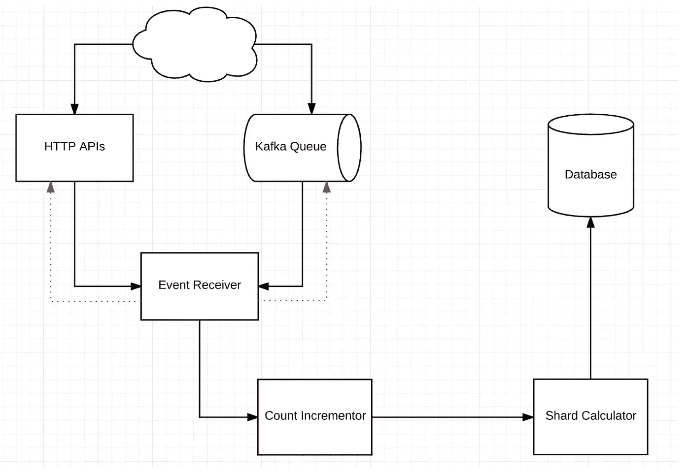
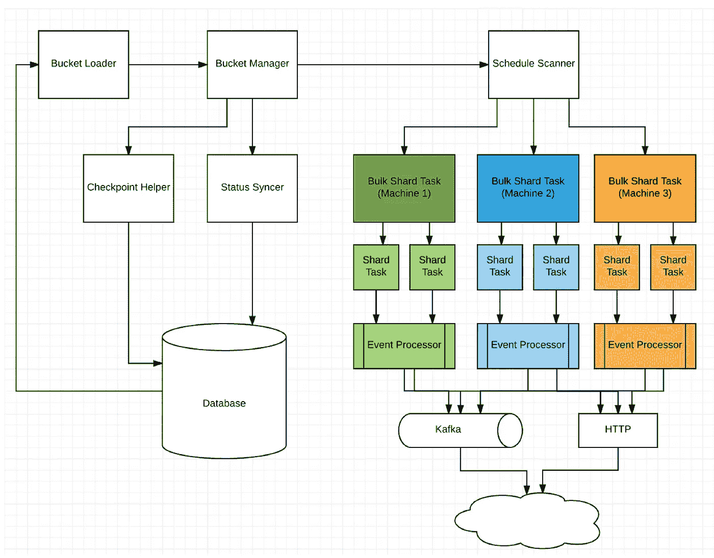
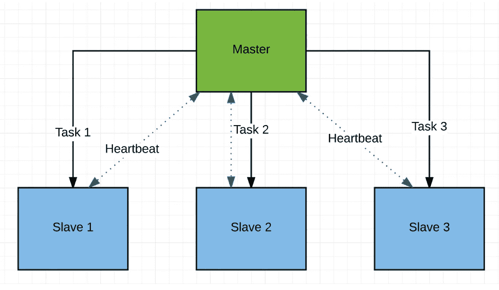
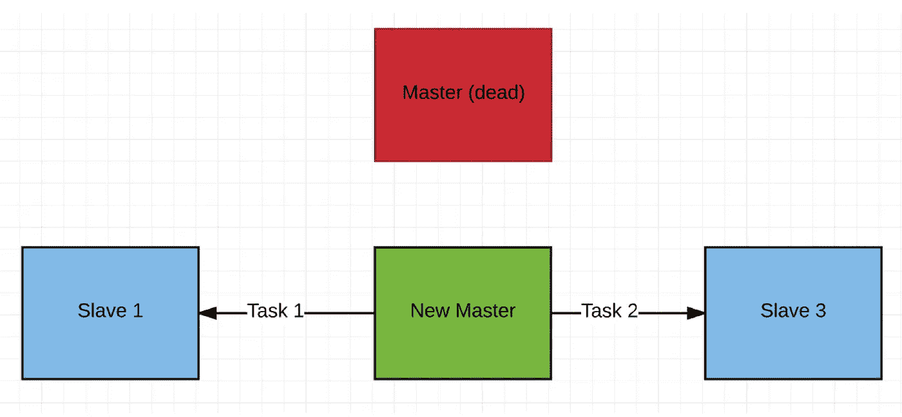

# 一种设计分布式、容错、可水平扩展的事件调度器的方法

> 原文：<https://medium.com/walmartglobaltech/an-approach-to-designing-distributed-fault-tolerant-horizontally-scalable-event-scheduler-278c9c380637?source=collection_archive---------0----------------------->

Photo Credit [annca](https://pixabay.com/en/pocket-watch-time-of-sand-1637396/)

## **简介**

设计一个基于时间的事件调度器总是一个有趣的问题。大规模这样做更具挑战性。首先，让我们定义什么是基于时间的事件调度程序？

时基事件调度器是一个系统，服务可以使用它来调度需要在*未来*处理的请求。该服务在调度器中注册一个*事件*，并暂停当前请求的处理。

当规定的时间到达时，调度器通知请求服务，并且前者可以继续处理暂停的请求。这种系统在许多情况下都是有用的。下面列出了一些用例，但并不详尽

## 异步请求超时

随着越来越多的系统转向基于消息的架构，如 Kafka、JMS 等。最常见的场景之一是使用消息传递层作为异步请求/响应总线。一个系统产生一个“*消息请求*给另一个系统，当后者返回响应时，它继续进行剩余的处理。在某些情况下，让打电话的人有“**最终回应**”是很重要的。可能是另一个系统有滞后，或关闭，或只是错过了返回响应。在具有无状态微服务范例的分布式环境中，很难跟踪这种*丢失的*请求。一种解决方案是安排一个“超时”事件，它可以在请求的规定 SLA 时触发。

当事件被触发时，可以检查请求的当前状态，如果响应丢失，则可以将请求标记为超时。

## 系统重试次数

即使在通过同步通道(如 HTTP)进行交互的系统中，服务器也有可能出现故障，无法满足请求。客户端可以选择重试，但是，如果重试间隔非常短，则不太可能有任何净正面效果。例如，如果是系统范围的中断，它可能会持续几秒钟以上。在这种情况下，可能需要进行更长时间的指数重试，因为请求数据可能不会保存在内存中。

在这些情况下，重试的有效负载可以发送到事件调度程序，并且可以根据客户端的重试策略在以后重试。

## 协调作业

有时，在基于批处理的分布式系统中，数据流被分割并由多个集群作为微批处理进行处理。在失败的情况下，可能需要协调响应，以便可以为初始批次向客户端返回一致的响应。

在这种情况下，可以在批处理开始时安排协调事件，以便可以在批处理或 SLA 处理时间结束时协调数据。

## 与价格相关的触发器

在电子商务世界中，价格变化通常是为了使产品保持有竞争力的价格。触发这样的价格变化可能是一项巨大的人工工作，容易出错，并且可能不会在预期的时间精确发生。例如，在黑色星期五这样的假日高峰时段，即使价格变化有一分钟的滞后，也可能影响全年的销售。

在这种情况下，可以提前将价格变化设置为“促销”，这可以由活动调度程序在所需的时间触发，从而节省手动价格同步工作。

所有上述提到的问题都是[沃尔玛](https://www.walmart.com/)在某个时候面临的，我们清楚地认识到，我们需要投资一个能够跟踪*暂停请求*的系统。由于沃尔玛的经营规模巨大，调度程序必须具有容错性和水平可伸缩性。

## 现有选项

我们开始寻找各种现有的开源解决方案，比如 Quartz。虽然 Quartz 是基于时间的调度的成熟解决方案，功能丰富，但我们的问题陈述有所不同

*   我们的许多应用程序都使用 [Cassandra](https://www.youtube.com/watch?v=KMHua4LUvQ0) 作为 NoSql 数据存储。随着时间的推移，我们在 Cassandra 及其细微差别方面积累了丰富的专业知识。Quartz 似乎没有卡珊德拉的 JobStore(或者至少我们找不到)
*   我们希望事件具有可调的一致性。对于一些事件，如系统重试等，可以将它们写入一个节点(LOCAL_ONE ),但对于其他事件，如升级触发器，则需要使用 EACH_QUORUM，这样就不会丢失任何事件。
*   横向扩展集群更加困难。我们需要扩展到每小时数百万个事件。

我们还研究了 Quartz 的基于 Hazelcast 的 JobStore 实现，但是延长的垃圾收集周期会导致内存中数据的错误。

## 介绍 BigBen

我们开始实施我们自己的解决方案，它被称为 BigBen，灵感来自非常著名的[伦敦钟楼](https://en.wikipedia.org/wiki/Big_Ben)。BigBen 提供了以下功能

*   主从设计，这样主服务器可以决定在集群中分配负载的最佳策略
*   极强的容错设计，这样，如果一个给定的主机发生故障，几乎可以立即选择另一个主机
*   对数据库中的事件数据进行统一分区，以便在 Cassandra 中没有胖分区方面的热点
*   在集群上统一执行事件，以便所有节点共享*几乎*相等的负载
*   维护检查点，以便跟踪未被触发或执行失败(误触发)的事件
*   与 HTTP 和 Kafka 集成，作为事件的*默认*通道
*   多租户。每个事件属于一个租户，每个租户可以定义如何存储(一致性保证)和/或处理事件的策略。

## 设计和建筑

BigBen 基于“微批处理”架构。事件被一起存储在一个窗口中，这些存储桶作为分区存储在数据库中。

当集群启动时，选择一个主服务器，它开始以定义的粒度扫描存储桶。支持的最小粒度是一分钟，这意味着主服务器将每分钟扫描一次事件。

## 事件摄入

由于不知道每分钟将调度多少个事件，因此基于存储桶宽度(在本例中为一分钟)对数据进行分区可能会导致数据库负载不均衡。因此，事件被分片*处理*，只有 1000 个(可配置值)事件存储在一个分片中。

例如，假设在上午 10:00，收到了 2030 个事件，那么这些事件将被分配到三个分片。碎片 1 将包含 1000 个事件，碎片 2 将包含另外 1000 个事件，碎片 3 将包含 30 个事件。这样，系统保证每个分片不超过 1000 个事件。

要知道一个给定的事件将被分配到哪个碎片，取决于该桶的事件总数。使用下面的公式计算该事件的碎片指数非常简单:

> 碎片索引=(总事件数/碎片大小)

例如，当在 2030 个事件之后接收到下一个事件时，它将转到

> 2030/1000 =第二个索引(或第三个碎片)

对于快速查找，这需要维护每个存储桶的运行事件总数。BigBen 使用嵌入式 Hazelcast 网格在分布式地图中维护这些计数，尽管其他解决方案如 memcache、 [Couchbase](https://t.co/CSDgqm6MP9) 等。其提供对原子计数的支持。地图数据每隔几秒钟就会与 Cassandra 同步一次。

下图捕获了事件接收流。可以通过 HTTP 或 Kafka 接收事件。无效事件被拒绝并立即返回(由*红色虚线*显示)。对于其他人，计算相应的桶(假设事件安排在上午 10:21:55，那么桶是上午 10:21:00)，计数递增，并计算碎片索引。该事件然后被存储在对应的分区中，该分区是桶和碎片索引的组合(例如 10:21:00/1)

Fig 1 — Event Receive Flow

## 事件处理

对于处理部分，在集群成员中选出一个主机。Zookeeper 可以用于领导者/主人选举，但是由于 BigBen 已经使用了 Hazelcast，我们使用了分布式锁特性来实现一个*集群单例。*然后，主机调度下一个时段并读取事件计数。知道了事件计数和碎片大小，它可以很容易地计算出总共有多少碎片。然后，主服务器创建(bucket，shard_index)对，并在集群成员之间平均分配它们**，包括它自己。在不相等划分的情况下，主设备试图在自身上承担最小的负载。例如，对于上午 10:21 时段，假设有 6000 个事件和 4 个节点的集群，划分如下:**

> **distribution => (bucket，shard 索引数组，node IP) => (10:21，[1，5]，node1)，(10:21，[2，6]，node2)，(10:21，[3]，node3)，(10:21，[4]，node4)**

**主服务器还检查是否有任何先前的存储桶已经失败，并对这些存储桶进行调度。完成存储桶后，该存储桶将被标记为已处理，并且状态将在检查点中更新。下图显示了处理阶段(*调度扫描仪是主*)**

****

**Fig 2 — Event Processing Flow**

**处理工作流程中的各种组件包括:**

*   **存储桶管理器:在内存中维护加载的存储桶的快照**
*   **Bucket Loader:以速率受限/节流的方式将以前的存储桶加载到内存中**
*   **检查点助手:每几秒钟同步一次检查点**
*   **状态同步:一旦完成，就同步存储桶的状态**

## **容错设计**

**与任何其他分布式系统一样，可能会有多个故障点。其中一些是:**

*   **主设备变得不可用**
*   **事件处理失败**
*   **数据库关闭了**

**BigBen 使用不同的技术来处理故障。对于 master 的容错，我们在 Hazelcast 中使用了分布式锁。注意，这个锁*在节点的生命周期中从来没有释放过*。只有当节点关闭时，另一个成员才会尝试获取锁。这提供了非常健壮的容错能力，我们在混沌猴子测试中验证了这一点。下图显示了主故障切换场景**

****

**Fig 3 — Master (Cluster Singleton) distributing tasks among slaves**

****

**Fig 4 — Master down, new slave promoted to master, and starts distributing tasks**

**在事件处理失败或数据库关闭的情况下，用这些失败的存储桶标记检查点。在每次新的存储桶扫描时，主服务器也会扫描检查点，以查看是否有任何先前的存储桶处于失败状态。如果找到，那么这些存储桶也会被调度。**

**BigBen 使用一个可配置的'*回看*'参数，该参数关于它必须走多远才能继续尝试失败的桶/事件。默认情况下，该值为 1 天。**

## **绩效基准**

**我们使用以下参数对集群的性能进行了基准测试:**

*   **4 台机器，Cent OS 6+，8 个内核，16 GB 内存，最小堆 2 GB，最大堆 8 GB**
*   **事件有效负载大小:500 字节**
*   **Cassandra 6+6 裸机集群**
*   **写入一致性:本地仲裁**
*   **读取一致性:本地仲裁**
*   **摄入率:52 秒内摄入 100 万个事件。=> **每小时 7000 万个事件****
*   **处理速度:60 秒 100 万事件=> **每小时 6000 万事件****

## **后续步骤**

**我希望你发现这篇文章内容丰富。k̶e̶e̶p̶̶a̶n̶̶e̶y̶e̶̶o̶u̶t̶,̶̶a̶s̶̶w̶e̶̶w̶i̶l̶l̶̶b̶e̶̶o̶p̶e̶n̶s̶o̶u̶r̶c̶i̶n̶g̶̶b̶i̶g̶b̶e̶n̶̶v̶e̶r̶y̶̶s̶o̶o̶n̶.我们有开源的[大本](https://github.com/walmartlabs/bigben)。如果有任何问题，请告诉我们。感谢阅读！**