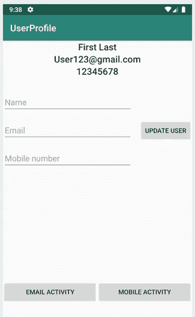

# 使用单向流的有效方法

> 原文：<https://blog.kotlin-academy.com/an-efficient-way-to-use-uniflow-2b41a9785a05?source=collection_archive---------0----------------------->

Photo from [Max Bender](https://unsplash.com/photos/8FdEwlxP3oU/download?force=true)

# TL；速度三角形定位法(dead reckoning)

这篇文章是关于我们如何使用 uniflow，使用这个库的好处是什么，以及使用它有多简单。别担心，我们会支付测试费用。我们将看到测试我们的视图模型是多么容易

# 单向流动的

[Uniflow](https://github.com/uniflow-kt/uniflow-kt) 帮助您使用简单的单向数据流方法编写应用程序，确保始终保持一致性，这与 Kotlin 协程是一致的。

# 让我们使用 Uniflow 创建一个示例应用程序

大多数应用程序都有一个配置文件屏幕，让我们来关注一下这个用例。在我们的使用案例中，uniflow 将给我们带来哪些好处？好处很多，我来指出来:

*   简单的测试方法
*   我们只需要写状态和事件
*   真理的单一来源
*   我们可以使用协程
*   用纯 Kotlin 编写数据流的聪明方法

[Click Me](https://github.com/MarcinChrapowicz/Uniflow-User-Profile)

# 状态

让我们编写一个类，在应用程序中用来表示一个状态。我们称之为`UserProfileState`。我们只需要一个数据类。我们只需要定义这个数据类，因为我们将使用通用的加载/重试状态

什么是状态:状态是我们需要保持的 UI 逻辑数据。这就是为什么我们的州只有一个名字，一个电子邮件和一个手机，来支持我们的用户界面。

# 事件

什么是事件:事件是“一次性的”动作，我们不需要保留它。

我们将有几个活动:

*   `RetryView`当我们没有数据时，它会出现在用户面前——在本例中，当我们没有任何东西可显示时
*   `Loading`它会在我们等待结果的时候出现在用户面前
*   `OpenEmail`它将打开另一个带有电子邮件活动的活动
*   `OpenMobileNumber`它会用 is MobileNumberActivity 打开另一个活动

# 视图模型

现在让我们创建扩展`AndroidDataFlow`的 ViewModel 类

当我们创建`UserProfileViewModel`时，我们想要设置初始状态，因为当我们打开屏幕时，我们还没有数据要设置。这就是我们发送事件来设置加载状态的原因。

让我们关注下一个方法，因为它很重要。如果没有这种状态，我们可能没有可能做出另一个动作。

嗯，这很重要，因为我们正在设置我们的状态，主要是因为它允许用户采取行动。没有这种状态，我们无法采取类似`OpenEmail`或`OpenMobileNumber` **，**的行动，让我们来看看那些方法

可能现在你在想`actionOn`。如果状态与`UserProfileState`不同，这种方法将阻止您运行块内的逻辑。这样做会给我们一个简单的方法来控制国家。保证我们在开始下一个之前总是处于期望的状态

不过不用担心在`actionOn` **中也很容易抓错。**Uniflow 提供的一种方法是通过提供一个回退 lambda 函数为您创建这个“try/catch”块，让您在出错时处理您的操作

# 活动

到目前为止，我们几乎完成了所有的逻辑，所以让我们看看如何实现我们的 UI。活动中的函数`onStates`允许我们使用传入状态。

如您所见，该事件将触发一个名为`openFragment`的方法。该方法将检查当前显示给用户的片段是否与我们想要设置的片段不同。如果为真，我们要为`UserProfileFragment`替换当前片段。我们为什么要这样做，让我们看看下面的例子

# 碎片

片段允许我们有一个更灵活的用户界面，并清晰地封装逻辑。如你所见，这与我们的 Activity plus 中的逻辑非常相似。我们不需要担心获取这个片段的最后状态和更新 UI，因为 Uniflow 会处理剩下的事情。

# 测试

不要忘记测试这一重要部分，让我们专注于此。

在运行测试之前，我们需要设置:

*   `[Mockk](https://mockk.io/)`
*   `MockedViewObserver`
*   `TestDispatchersRule`
*   `[InstantTaskExecutorRule](https://developer.android.com/reference/android/arch/core/executor/testing/InstantTaskExecutorRule)`
*   `UniFlowLogger.init(DebugMessageLogger())`

当一切都准备好了，我们就可以开始写测试了

用 Uniflow 测试就是这么简单。您的视图模型一次只有一个状态。测试将侧重于检查状态/事件序列，你可以重放任何状态和模拟任何场景！

# 感谢阅读和快乐编码！🙏

如果您对实现感兴趣，可以看看这个示例

 [## MarcinChrapowicz/Uniflow-用户配置文件

### 在 GitHub 上创建一个帐户，为 MarcinChrapowicz/Uniflow 用户配置文件的开发做出贡献。

github.com](https://github.com/MarcinChrapowicz/Uniflow-User-Profile) 

# 单击👏说“谢谢！”并帮助他人找到这篇文章。

了解卡帕头最新的重大新闻。学院，[订阅时事通讯](https://kotlin-academy.us17.list-manage.com/subscribe?u=5d3a48e1893758cb5be5c2919&id=d2ba84960a)，[观察推特](https://twitter.com/ktdotacademy)并在媒体上关注我们。

如果你需要一个科特林工作室，看看我们如何能帮助你: [kt.academy](https://kt.academy/) 。

