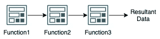

# 利用 OCI 函数的探索

> 原文：<https://medium.com/oracledevs/an-exploration-using-oci-functions-4c5d4e70d00c?source=collection_archive---------1----------------------->

# 概观

OCI 提供的服务之一是功能——无服务器计算。Oracle OCI 函数基于 Fn 项目。Fn project 是一个开源的无服务器容器原生平台，兼容在任何地方运行。OCI 功能是 OCI 的无服务器解决方案。OCI 函数通常是短期运行的、无状态的，并且被定义为运行单一目的的逻辑。这些非常适合许多微服务执行模型以及与 OCI 其他服务的集成。
OCI 功能的主要优势在于:

1.  通过 DevOps 持续交付
2.  可攀登的
3.  高度可用
4.  弹回的
5.  灵活的
6.  自治的
7.  故障隔离

无服务器计算与 FaaS(功能即服务)和基于事件的编程同义。应用程序将仅在必要时执行，而不是一直执行，这意味着一个事件可以同时触发一个或多个功能的执行。

# **OCI 函数概念**

OCI 函数被逻辑地分组到应用程序中。OCI 应用程序绑定到 OCI 虚拟云网络(VCN)资源，其中包含的功能在启动时附加到其 VCN 网络。
OCI 应用程序是:

*   功能的逻辑分组
*   为应用程序中的所有功能分配和配置资源的方法
*   存储配置变量的通用上下文，这些变量可用于应用程序中的所有功能
*   一种确保函数运行时隔离的方法

OCI Application & OCI Functions

OCI 功能包括:

*   小而强大的代码块通常只做一件简单的事情
*   分组成应用程序
*   作为 Docker 映像存储在指定的 Docker 注册表中
*   为响应 CLI 命令或签名的 HTTP 请求而调用

可以从下面不同的方式调用 OCI 函数:

Triggering OCI Functions

1.  Fn 项目 CLI。(fn 调用)
2.  OCI CLI (oci fn 函数调用)
3.  对 oci 函数调用端点的签名 HTTP 请求(OCI 原始请求-HTTP 方法发布)
4.  由 OCI 事件引发
5.  OCI API 网关服务
6.  OCI 通知服务

OCI 函数本身支持多种运行时，如 Ruby、Python、Java、Kotlin、Go、NodeJS。我们需要为函数定义编程运行时语言&它为程序的开始分配内存。这些存储在 func.yaml 文件中。我们还可以将定制的 docker 图像带到 OCI 功能中。

Supported Runtime Programming Languages

# OCI 函数使用模型

使用 OCI 函数可以将复杂的问题分解成几个部分来解决。

OCI 功能在区域层绑定，并通过应用程序附加到 OCI VCN。因此，如果您有多个环境(如开发、UAT、生产)，您可以定义多个应用程序(每个环境一个)并在单独的环境中跟踪每个功能的单独代码行，或者您可以让一个应用程序根据环境请求进行功能切换。真正基于您的业务/发展需求，OCI 功能可灵活支持。请确保规划好要在其中运行调用 OCI 资源的函数的子网。

## 顺序(Fn1-> Fn2-> Fn3…等等。)

Sequential flow

*方法:Fn1->Fn2->Fn3…等。*
这种方法通常用于处理数据的一系列操作。此外，在微服务开发中使用函数也是很基本的。

## 扇入/扇出(Fn1、Fn2 → Fn3…Fn15 →Fn16)

Fan-in/Fan-out

*方法:Fn1，Fn2→Fn3…Fn15→Fn16*这种方法大量部署在大数据集到来时要处理的海量数据中。第一组函数可以将其分解为更小的可用数据，供下一组函数使用，并最终生成结果数据。

## 投票/监控

Poll/Monitor

*方法:事件→ Fn1*
主要针对运营效率，以确保服务受到监控，并采取所需的措施。根据需要，这种方法有可能变得复杂。稍后将讨论一些用例。

# **OCI 函数集成**

OCI Services integration with OCI Functions

OCI 函数通常由 OCI 事件、OCI 通知服务、OCI API 网关调用。Oracle 集成服务、Service Connector Hub 服务和流服务也可以与功能集成。

OCI 函数身份验证首选通过资源主体提供程序进行。

## 一些示例用例包括:

根据指标警报调用一个函数来调整虚拟机的大小—通过 OCI 通知服务完成，并定义警报来报告指标。

调用 API Gateway 来响应数据库中一个表的前 10 行。

导致正在进行的处理失败的抢占动作事件可以通过 OCI 函数来捕获，并通过更新的可抢占容量虚拟机或按需计算来恢复处理。

容量编目具有网络事件触发的计算机的 IP 使用 OCI 功能和 OCI 功能立即获取 IP 以更新自治数据库容量编目或 CMDB/服务。

当文件进入存储桶时对其进行处理/转换，并将结果内容上传到另一个存储桶或自治数据库。

基于条件启动/终止虚拟机(相当于自动扩展)；然而，无论应用程序状态如何，自动扩展技术都会破坏计算。我们可以在启动/终止之前/之后检查应用程序的状态。

# OCI 函数的局限性

定义一个成功的软件架构的好方法是了解技术的局限性。OCI 功能也有受技术原因、商业原因或安全原因约束的限制。充分理解它们将有助于 OCI 函数的成功实现。

1.  /tmp 是唯一可写的目录，有时先前调用的 OCI 函数的残余文件会在下次运行时存在。因此，确保根据处理逻辑的一些参数来捕获具有唯一名称的逻辑。在我的例子中，我通常喜欢将 event_id 附加到跟踪文件中，以保持它的唯一性。

2.此外，基于 OCI 函数的形状，限制也有所不同。

OCI Functions Shapes

然而，以下是任何 OCI 函数的极限。

**时间 300 秒**
OCI 功能不能运行超过 300 秒。如果你的程序正在执行大规模的处理，并且不能在 300 秒内完成，那么这个函数就在这一点上终止。您需要确保捕捉到完成特定任务的功能，以便有效且高效地工作。

**有效负载 6Mb**OCI 功能无法接受超过 6Mb 的有效负载进行处理。因此，您可能希望将数据与对象存储集成在一起，并传递数据位置的细节，而不是数据本身。

**Mem max 2048** OCI 函数将程序执行的内存利用率限制为 2GB。如果程序溢出了这个内存，试着通过创建另一个函数把它分成更小的内存。

# **OCI 功能故障排除**

可以通过日志记录和跟踪功能启用 OCI 功能。OCI 功能使用 OCI 日志服务，通过 OCI 应用程序性能监控(APM)进行日志和跟踪。向 OCI 日志服务发送功能调试和日志消息是故障排除的第一步。详细级别或下一级别是在 OCI 中启用应用程序性能监控(APM)域并启用跟踪。

OCI 函数有如下格式的日志，包括时间戳、函数动作和日志消息。

如果您已经缩小了某个特定故障的范围，那么您可以查看之前和之后的事件，以便更深入地了解函数内部的流程(上下文故障排除)

下面的日志条目显示，有一个函数定期执行，有时，巨大的操作也在进行。因此，调用函数时要注意登录。有时，当调用许多函数时，日志可能会令人困惑，这就是 APM 可以发挥作用的时候。

应用程序性能监控(APM)可以帮助确定函数的计时、状态(成功/错误)、SQLs 等。

APM 操作显示了高级别的执行时间和执行的次数。

服务视图提供了 OCI 函数的平均持续时间以及 Apdex 评分。

# **OCI 功能性能**

OCI 函数的可伸缩性和隔离性使其在性能上遥遥领先。确定和调整性能的一个好方法是理解和监控 OCI 函数流。APM 也是一个方便的性能监控工具。

以下是部署 OCI 函数以提高性能的最佳方法。

1.  在业务逻辑中保持功能的简单明了。
2.  确保函数运行到特定的任务。
3.  监控 OCI 功能级别指标。
4.  为您的业务逻辑选择正确的运行时/依赖关系。
5.  保持最小的内存分配以获得更快的响应。

对不同编程语言运行时(python、go、ruby、kotlin、java)的 OCI 函数的自我比较研究表明，几乎所有的函数都在几秒钟内开始执行。我相信在我的测试运行中抑制 OCI 函数，仍然可以在运行时获得良好的响应。值得注意的是，“go”运行时是最快的，即使它是在长时间的休息(冷期)后被调用的。

我当然不是所有编程语言的专家。我可能忽略了一些有助于更有效实现的语言特性。此外，稍后我将测试 GraalVM 映像，并查看执行时间的差异。

## `OCI Functions Code Samples`

大多数 OCI 函数样本都可以在[这里](https://github.com/oracle/oracle-functions-samples)找到。

`Inserting new row to OCI NoSQL table from OCI Functions Code Sample`

`Launch/terminate VM from OCI Functions code Sample`

`Oracle Autonomous ORDS POST from OCI Functions code sample`

`OCI Functions invoking another OCI Functions code sample`

`OCI Functions fetching Object Code sample`

# 结论

无服务器计算是软件设计和基础设施中的一个不同维度，它随着创新而快速发展。OCI 函数提供了一个将解决方案与微服务集成的好方法。当与更大规模的 OCI 服务捆绑在一起时，使用 OCI 功能的 OCI 应用程序性能监控的便利性提供了更深入的见解。

## 解决方案亮点:

 [## 使用 Oracle 函数将文件加载到自治数据库中

### 注意:本教程需要访问 Oracle 云。要注册免费帐户，请参阅 Oracle 云免费层。它使用…

docs.oracle.com](https://docs.oracle.com/en/learn/functions_adw/index.html#introduction)  [## 使用无服务器功能将物联网数据传输到自治数据库

### 支持物联网的工作负载需要实时高效扩展。随着您部署更多设备和…

docs.oracle.com](https://docs.oracle.com/en/solutions/iot-streaming-oci/index.html)  [## 使用 Oracle 云基础设施开发运维服务构建持续部署渠道

### 快速交付软件对于在云中高效运行您的应用程序至关重要。Oracle DevOps 服务…

docs.oracle.com](https://docs.oracle.com/en/solutions/build-pipeline-using-devops/index.html) 

## 其他参考:

 [## 功能概述

### Oracle Functions 是一个全面管理、多租户、高度可扩展的按需功能即服务平台。这是…

docs.oracle.com](https://docs.oracle.com/en-us/iaas/Content/Functions/Concepts/functionsoverview.htm)  [## 应用程序性能监控

### 应用程序性能监控提供了一套全面的功能来监控应用程序并识别和…

docs.oracle.com](https://docs.oracle.com/en-us/iaas/application-performance-monitoring/index.html)  [## Fn 项目

### 开源。原生容器。无服务器平台。Fn 项目是一个开源容器——原生无服务器…

fnproject.io](https://fnproject.io/)  [## 哪种编程语言最快？

### 不同编程语言实现的计算机程序的测量和比较。

benchmarksgame-team.pages.debian.net](https://benchmarksgame-team.pages.debian.net/benchmarksgame/index.html)