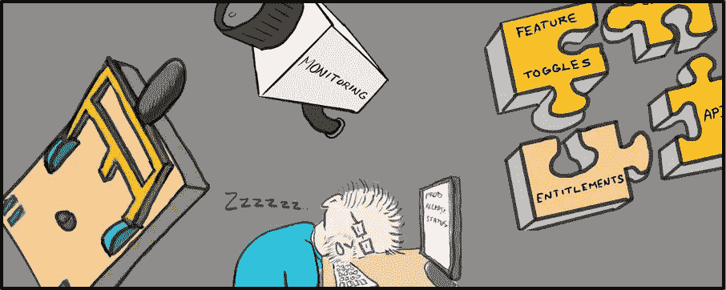

# 应用程序的图解企业发布清单

> 原文：<https://medium.com/capital-one-tech/an-illustrated-enterprise-release-checklist-for-applications-3ff1e6353a3e?source=collection_archive---------1----------------------->

## 通过更好地管理预发布、发布和监控，让您睡得更香、玩得更开心并创造价值

***文字作者诺亚·曼德尔鲍姆，杰出工程师***
***插图作者麦克·丹拉特，高级经理***

开发应用程序需要大量的工作。

我们站起来，然后坐下。我们花了数周的时间来编写干净的代码并创建代码覆盖率。我们努力思考如何使我们的应用程序可维护(使用 Santhi Sridharan 在她关于开发可维护软件的文章中提出的想法)。有时候，我们会重构，直到我们的视觉变得有些模糊。

很少有事情比在发布时发现自己精心创建的应用程序在某些方面有缺陷或损坏更令人沮丧的了。

这种损坏的软件会产生负面的客户体验，会导致业务风险，并且会给团队带来大量的额外工作。那么，我们如何帮助确保我们的发布更加成功呢？

该清单试图在没有正式流程和[发布的全面性之间找到平衡！](https://www.amazon.com/Release-Design-Deploy-Production-Ready-Software-ebook-dp-B079YWMY2V/dp/B079YWMY2V/ref=mt_other?_encoding=UTF8&me=&qid=)回答这个清单上的问题可以帮助你的团队实现成功的发布——此外，你甚至可以在阅读它或看我们的手绘草图时微笑(即使你讨厌下班时间发布)。

*注意:我们是两名软件工程师，负责对 Capital One 的客户和员工都非常重要的系统。我们开发了这个发布清单来帮助我们的团队为他们的发布做更好的准备。我们知道这并不适合所有的用例，你可能需要为你的团队修改它——但是我们希望它也能帮助你。*

# 图解企业应用程序发布清单

1735 年，本杰明·富兰克林在向费城市民解释预防房屋火灾的最佳方法时，创造了短语“一盎司的预防抵得上一磅的治疗”。

为了帮助防止你的释放成为它自己的房子(或垃圾箱)火灾，我们把这个清单分成三个部分:

*   预发布
*   放
*   监视

## 预发布清单

当我们准备发布的商业意图时，我们试图遵循两个一般规则:

1.  限制发布中的项目数量以限制风险:并计划频繁发布。
2.  确保我们已经完成了所有工作的[完成](https://www.agilealliance.org/glossary/definition-of-done/#q=~(infinite~false~filters~(postType~(~'page~'post~'aa_book~'aa_event_session~'aa_experience_report~'aa_glossary~'aa_research_paper~'aa_video))~searchTerm~'~sort~false~sortDirection~'asc~page~1))定义:

*   具有适当代码覆盖率的书面单元测试。
*   执行自动化功能测试来验证新功能，并确保旧功能不会退化。
*   完成可用性/可访问性测试。
*   执行性能测试(这一点尤其重要)。
*   扫描我们代码的安全漏洞，特别是那些在 [OWASP 十大](https://owasp.org/www-project-top-ten/)列表中发现的漏洞。
*   记录下我们欠下的所有技术债务。

除此之外，在准备发布时，我们还会关注一些技术项目:

*   我们希望部署的代码是否被签入版本控制:并被适当地标记？
*   我们是否正确地更新了我们的生产配置？
*   如果我们的代码有依赖关系(比如[微服务](https://martinfowler.com/articles/microservices.html)，数据库等等)——那些依赖关系是否已经部署在生产环境中并准备好接受流量了？
*   我们是否已确保我们需要的基础设施在生产中配备了正确的网络配置，包括 DNS、负载平衡器和(在我们的案例中)其他 AWS 资源？
*   我们是否测试过当我们的应用程序经历高负载时会发生什么——它是伸缩还是崩溃？
*   当我们在中午部署新版本时，我们是否测试过用户体验会发生什么——我们的用户会遇到任何错误吗？

*   我们是否设置了 canary 或 A/B 测试所需的任何[功能切换](https://martinfowler.com/articles/feature-toggles.html)？
*   我们是否考虑过[对任何需要访问控制的应用程序的访问控制](https://en.wikipedia.org/wiki/Computer_access_control)？
*   我们是否已经验证了[可观察性](https://theagileadmin.com/2018/02/16/monitoring-and-observability/)我们需要在生产中调试的信息是否可用——我们是否能够捕获和分析指标、跟踪和日志(注意——在这个领域有很多商业和开源工具可以帮助您)？
*   是否有回滚计划？如果需要，可以关闭该功能吗？如果需要，我们可以恢复到以前的代码版本吗？如果版本出了问题，用户能解决问题吗？

我们努力确保我们有 B 计划和 C 计划！

当准备发布时，人也变得很重要:

*   我们是否有一份关键技术联系人的名单，万一我们的发布不像我们希望的那样，我们可以快速联系到他们？
*   我们知道我们的改变会对哪些用户产生什么影响吗？→我们是否测试过我们启用的功能切换包括正确的人和排除正确的人？我们测试过访问控制包括正确的人，排除了正确的人吗？我们有没有安排人来证实我们的释放？*(人们喜欢:产品经理、意图所有者、支持工程师、应该看到我们的变更的人:以及不应该看到它们的人)*
*   我们是否完成了可能使我们的首次展示成功的其他发布准备工作？例如→更新我们的培训和文档？公开宣布即将发布的版本？向可能对这些变化感兴趣的人发送信息？

很多大企业需要更正式的[变更控制](https://en.wikipedia.org/wiki/Change_control)流程。我们碰巧在其中一个地方工作，所以有时我们可能必须创建一个[变更请求](https://en.wikipedia.org/wiki/Change_request)，包括:

*   确保我们的变更请求被输入变更控制系统。
*   确保我们的变更请求不与变更控制系统中的其他关键项目相冲突，比如无发布期。

## 发布清单

在我们早期经历了无数次手动部署之后，没有什么比一个好的[持续集成](https://www.martinfowler.com/articles/continuousIntegration.html) / [持续交付](https://continuousdelivery.com/) (CI/CD)管道更好的了。如果你没有一本，我们建议你买一本:否则，你可能会被一本手册和随之而来的巨大麻烦所困扰。

我们很幸运有一个 CI/CD 管道，因此，当发布发生时，我们:

*   通过查看我们的部署日志，验证我们的部署作业是否已成功完成。
*   检查所有代码更改(以及相关的依赖项更改)是否以预期的方式发生。
*   确认旧代码中的所有活动都已完全耗尽，新代码现在正在处理您的流量。
*   分析指标和日志(可能还有跟踪),以确保在部署过程中不会出现中断或错误。

对我们来说，同样重要的是用户体验，因此，我们问自己以下问题:

*   我们排队等待验证的人是否提供了他们可以看到他们应该看到的内容的确认？同样，人们有没有证实他们看不到他们不应该看到的东西？
*   验证我们系统的人是否注意到任何其他异常——错误屏幕、异常延迟、意外导航流？有时，这提供了一个几乎察觉不到的信号，表明出了问题。

不幸的是，如果我们的部署不成功，我们将执行回滚计划。

## 监控(非清单)

有时候，一个发布最初看起来是健康的，但是后来遇到了问题——如果它与一个数据库或 REST API 变更相关联，情况可能尤其如此。

我们发现，如果我们很好地设置了我们的可观察性，我们就可以设置警报，在出现错误或其他异常时主动通知我们。如果我们从基础设施、代码和系统的关键事务中发现意外行为，这些警报会提醒我们。对于需要更精细验证的版本，我们也可能会扫描日志以发现意外行为。

也就是说，我们也特别关注发布后的前 24 小时——尤其是如果我们的发布发生在交通流量低的时候。

如果是这种情况，有时我们会要求适当的用户重新验证发布功能，并提供口头/书面的成功确认。

# 结论

虽然这个发布清单不一定对所有的团队和用例都是全面的，但是希望它能让你开心。希望它能帮助你把你的工作部署给你的用户。

*披露声明:2021 资本一。观点是作者个人的观点。除非本帖中另有说明，否则 Capital One 不隶属于所提及的任何公司，也不被这些公司认可。使用或展示的所有商标和其他知识产权是其各自所有者的财产。*

*最初发表于*[T5【https://www.capitalone.com】](https://www.capitalone.com/tech/software-engineering/illustrated-release-checklist/)*。*