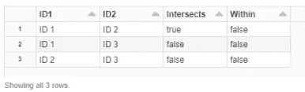

# Spark 地理空间处理简介

> 原文：<https://medium.com/version-1/an-introduction-geospatial-processing-with-spark-d78dffd0ff1e?source=collection_archive---------1----------------------->

在这个新的信息时代，地理空间数据在数据工程和数据分析工作中变得越来越重要…但是当我们谈论地理空间数据时，我们指的是什么？


Photo by [Hunter Harritt](https://unsplash.com/@hharritt?utm_source=medium&utm_medium=referral) on [Unsplash](https://unsplash.com?utm_source=medium&utm_medium=referral)

在这篇文章中，我想介绍一些关于使用 Spark 进行地理空间处理的基本概念，Spark 是 2020 年最流行的数据处理框架之一。

先说基础，什么是地理空间数据？

```
**Geospatial data** is about objects, events or phenomena that have a location on the surface of the Earth (let’s not worry about other planets yet… Sorry, Mars Rover)
```

这在数据上意味着什么？嗯……我们可以只用一个字符串来表示地理空间数据，这样做的两种最流行的格式是:

*   **geo JSON**:{ " geometry ":{ " type ":" Polygon "，" coordinates ":[[100.0，0.0]，[101.0，0.0]，[101.0，1.0]，[100.0，1.0]，[100.0，0.0]]} }
*   **众所周知的文字(WKT)** :多边形((100.0 0.0，101.0 0.0，101.0 1.0，100.0 1.0，100.0 0.0))

上面的例子代表了这个多边形:


Polygon representation

但是作为一个**字符串**的数据不是很有用，因为我们想对它们使用一些空间操作符，而用一个字符串来做这些真的很难…因此我们使用了一种叫做**几何类型**的东西。这种数据类型并非在每个系统中都可用，它允许使用空间操作符，如**contains**、**insect、**等等:


Examples of Geospatial operators

当然，我们可以在没有任何几何类型的情况下做到这一点，但是做(多边形 A 和多边形 B)的**交集、**比编写该操作背后的所有数学代码要容易得多。

# 那么…我如何在 Spark 中完成所有这些呢？

Spark 没有嵌入**几何类型**，但幸运的是，有些人已经并继续为我们工作(感谢开源社区！)…因此，如何做到这一点有几个选择:

- **使用第三方库**:有几个选项可用，比如 **GeoSpark** 、**GeoMesa**……如果你能在那里找到你需要的转换，这是合适的……所以不要重新发明轮子，使用其他人已经开发和测试的。

- **包装现有的核心库**:如果可用的 Spark 库不符合您的要求，您可以更进一步，在 Spark 中包装一个现有的地理空间实现。通常情况下，JTS 是你能找到的最低级的库。所有其他人都以此为起点。它只提供几何图形之间的数据类型和一些基本操作。这是一个 java 库，所以如果你想在 Spark 中使用它，你需要自己修改它。

- **从头开始实现一切**:这可能需要多年的工作…

# 在这篇介绍中，我将展示 GeoSpark 的基础知识

## …我们可能会在下一篇文章中更深入地探讨:)

假设您在 Databricks 环境中工作，使用 GeoSpark 非常简单。您只需要向集群添加两个 Maven 库，就这样:


GeoSpark libraries in Databricks Cluster

一旦安装了这些库，您就可以打开笔记本，开始使用这些地理空间功能！就这么简单。

让我们首先定义一个包含一些地理空间数据的表:(我将在这里复制单元格的代码，并添加结果的截图)

这些行代表一些多边形:


为了使用 GeoSpark 提供的 UDF，我们可以运行以下命令:

我们需要将字符串转换为正确的几何类型，为此我们需要执行以下操作:

所以现在我们的几何列是几何类型**几何类型**:


我们已经准备好运行一些空间操作…但为了使这更容易，让我们创建一个临时表，以便我们可以运行 SQL 查询。

让我们得到每个多边形的面积:

```
SELECT *, ST_Area(geometry) AS area FROM GeoTable
```


让我们得到每个多边形的质心:

```
SELECT *, ST_Centroid (geometry) AS centroid FROM GeoTable
```


那些函数，那些你直接应用到几何列的函数，叫做 just 函数。

还有其他类型，如谓词，允许您检查不同多边形之间的条件。

要使用它们，您需要至少有两个几何图形，因此让我们通过创建一个新表来实现这种情况:


有了这个新的数据框架，我们可以运行一些空间查询来检查某些条件，例如:

*   检查两个几何图形是否相交。
*   检查几何图形是否在其他内。

```
SELECT ID1, 
       ID2, 
       ST_Intersects(geometry1, geometry2)AS Intersects,
       ST_Within(geometry1, geometry2)AS Within
FROM GeoTable2
```



你可以看到，使用 **Geospark** 真的很容易，这要感谢它的 **SQL API** 。

在以后的文章中，我将更深入地研究更多的地理空间处理。

感谢阅读！

**关于作者**

[*Daniel gonzález pérez*](/@dangp)*是版本 1 的大数据开发人员，目前从事版本 1 的数据分析实践。*