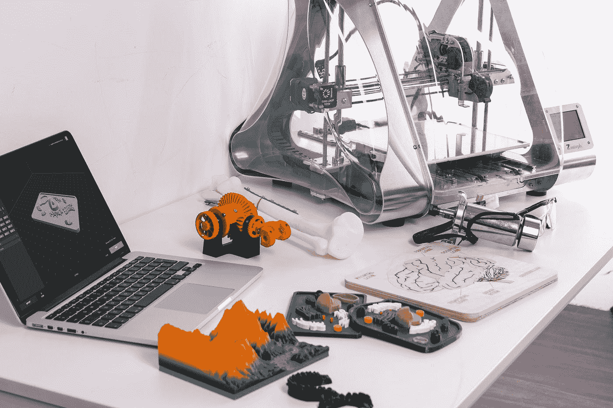

# 3D 打印简介

> 原文：<https://medium.com/version-1/an-introduction-to-3d-printing-8b0b3598e94b?source=collection_archive---------5----------------------->

最近偶然看到一本关于工业 4.0 的小书，**《4 punto 0》**作者 Temporelli，Colorni，Gamucci，2017。正如许多关于工业 4.0 的书籍和文章一样，作者认识到以下技术在未来工业发展中的核心作用:物联网(IoT)、云、人工智能和机器学习、机器人过程自动化等等。这些都是我们以前听过的术语，但根据作者的说法，另一项技术将严重影响制造业的未来: **3D 打印。**

Photo by [ZMorph Multitool 3D Printer](https://unsplash.com/@zmorph3d?utm_source=medium&utm_medium=referral) on [Unsplash](https://unsplash.com?utm_source=medium&utm_medium=referral)

与前面提到的技术相比，很少有人意识到 3D 打印可能对行业、人们的生活和环境产生的影响。因此，我决定写这篇文章来阐明 3D 打印；它是什么，为什么我们应该关心它，它将对日常生活产生什么影响。

# 那么，什么是 3D 打印呢？

3D 打印的想法并不新鲜。第一台 3D 打印机是在 1986 年由查克·w·赫尔(Chuck W. Hull)实现的，他创造了一种通过添加紫外光谱中的光激活树脂(光聚合物)层来打印物理对象的方法。自那以后，这项技术已经有了很大的改进，许多公司现在都在制造过程的某个阶段使用 3D 打印。

目标是从数字文件开始创建物理对象，通过添加后续的物质层来创建对象。因此，3D 打印也被称为添加制造，这是传统生产流程(如车削或铣削)的根本区别，传统生产流程通常从库存项目中减去材料。

# 它是如何工作的？

这个过程从一个文件开始，一个用计算机辅助绘图(CAD)软件绘制的三维模型。这成为另一个软件的输入，一个计算机辅助制造(CAM)软件，它根据文件塑造物质，逐渐从物质中分离出水平线。这些线具有可变的高度(从 10 到 100 微米)；高度越小，打印结果就越精确。

3D 打印的技术有很多。对于那些对技术感兴趣的人，这些技术总结如下，其他不感兴趣的人可以跳到下一节。

***【SLA】***

这是一种令人上瘾的技术，它利用激光将光聚合物树脂交联成三维固体。流程如下图所示。

Stereolithography Apparatus (Kim et al., 2016)

优点:

*   精度:最终产品将具有最高的质量和最高水平的细节
*   良好的功能表面质量
*   树脂可以回收并重新用于建造下一个物体

**缺点:**

*   易碎性:物体在压力下很容易破碎
*   昂贵的机器
*   印刷时间长:不适合工业化生产
*   需要支撑结构

***【选择性激光烧结】***

*这是另一种添加技术，使用激光将粉末状尼龙制成固体材料。下图描述了该过程。*

**

**Selective Laser Sintering* (SPI LASERS LIMITED, 2020)*

***优点:***

*   *最终产品非常耐-*
*   *高质量*
*   *不需要支撑结构*

***缺点:***

*   *不适合家庭使用或办公环境的大型设备*
*   *粉不能重复使用*
*   *成品零件上的粒状表面:需要后处理*
*   *设备和材料都很昂贵，需要后处理和电力回收站*

****【FFF】电熔灯丝制造****

*这种技术使用塑料材料的连续细丝，该细丝被加热并沉积在水平面上，在该水平面上成形，一次一层，并垂直移动。通过查看下图，这个过程更容易理解。*

**

**Fused Filament Fabrication* (Travieso-Rodriguez et al., 2016)*

***优点:***

*   *不需要任何刺激性化学物质的清洁工艺*
*   *小尺寸*
*   *易操作的*
*   *低成本*
*   *前面列出的所有功能也使它适合家庭使用*

***缺点:***

*   *低质量:层线经常可见*
*   *因为它必须在水平面上操作，所以层之间的角度必须小于 45 度*
*   *由于上述原因，可能需要支撑结构*

# *最好的技术是什么？*

*没有确切的答案。最好的 3D 打印技术取决于公司以及它需要通过添加制造来解决什么问题。*

*如前所述，每种技术都有其优点和缺点。下图有助于将它们形象化——应该选择最适合组织需求的技术。*

**

*Main 3D printing technologies: a comparison*

# *为什么行业应该关注*

*3d 打印直接适用于添加制造，这可能会彻底改变一些行业的运营方式。以下是一些例子:*

*   ***大规模定制:** 3D 打印可以将定制生产和大规模生产结合起来，让各行各业对任何数量的商品进行个性化定制*
*   ***上市时间和快速原型制作:**不再浪费时间定制供应链，任何想法都可以轻松、快速地实施，而无需改变底层制造设备*
*   *新形式和新设计:物体可以被设计得更轻，使用更少的原材料，因为它们不再需要更多的内部结构，但它们将直接用以前无法想象的形式来塑造*
*   *新的分发模式:一些公司可以出售文件，用户可以购买、下载并最终打印出来，而不是经销店和商店*

# *为什么人们应该关心*

*最后一点与每个人的生活特别相关。就像视频和音乐流媒体服务取代街角和视频租赁店一样，在未来，人们将能够在楼下的街角商店或者几年后在家里支付一个文件的费用并进行打印。*

*同样，任何人只要有合适的软件和技能，都可以设计出 100%个性化的商品，而不需要额外的费用！忘记现成组装家具的墨守成规吧: **3D 打印有望激发人们的创造力，塑造我们生活的世界！***

***参考文献***

*赫雷斯-梅萨、拉蒙&特拉维索-罗德里格斯、J.A. &科尔贝拉、x &布斯奎、拉克尔&戈麦斯-格拉斯、乔瓦尼。(2016).*RepRap 3D 打印机液化器热行为的有限元分析*。机电一体化。36.10.1016/j .机电一体化. 2016.04.007【在线】。可从以下网址获得:[https://www . research gate . net/figure/Schematic-re presentation-of-a-Fused-Filament-Fabrication-process _ fig 1 _ 301761967](https://www.researchgate.net/figure/Schematic-representation-of-a-Fused-Filament-Fabrication-process_fig1_301761967)*

*Kim，Guk & Lee，Sangwook & Kim，Haekang & Yang，Dong & Kim，Young-Hak & Kyung，Yoon & Kim，chong-Soo & Choi，Se & Kim，Bum Joon & Ha，Hojin & Kwon，Sun & Kim，Namkug (2016)。*三维打印:基本原理及在医学和放射学中的应用。*韩国放射学杂志。17.182.10.3348/kjr . 2016 . 17 . 2 . 182[在线]。可从以下网址获得:[https://www . research gate . net/figure/Basic-principle-of-stereo lithography-apparatus-method _ fig 3 _ 297605485](https://www.researchgate.net/figure/Basic-principle-of-stereolithography-apparatus-method_fig3_297605485)*

*SPI 激光有限公司(2020 年)，*直接金属激光烧结&选择性激光熔化*。【在线】。可从以下网址获得:[https://www . research gate . net/figure/Basic-principle-of-stereo lithography-apparatus-method _ fig 3 _ 297605485](https://www.spilasers.com/application-additive-manufacturing/selective-laser-sintering-and-melting/)*

*Temporelli Massimo，Colorni Francesco，Bernardo Gamucci (2017)。 *4 punto 0* 。米兰:乌尔里克·赫普利。*