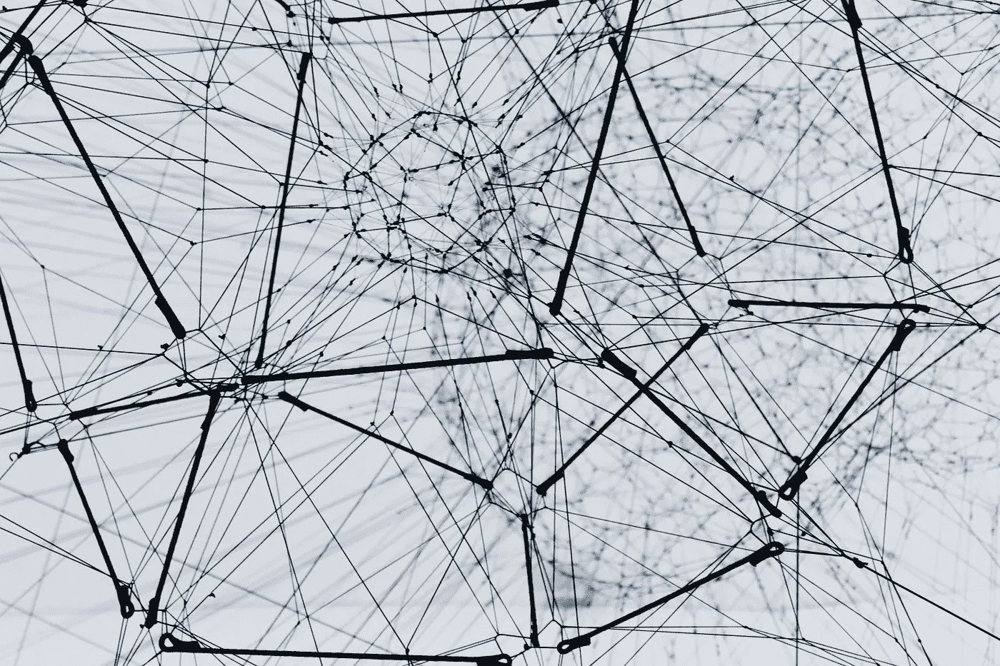
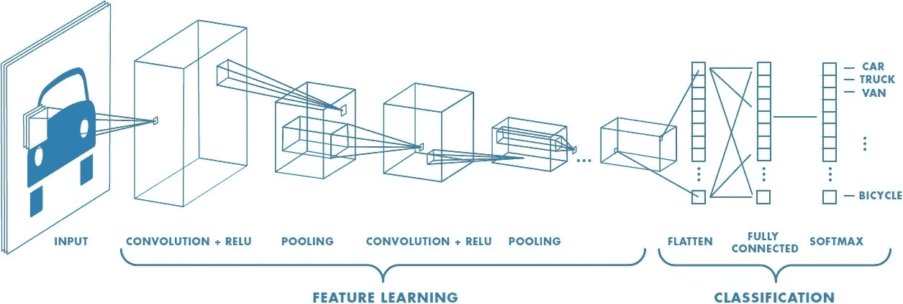
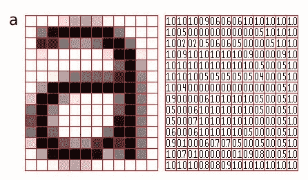
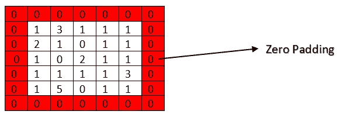
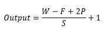
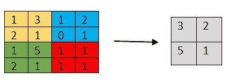
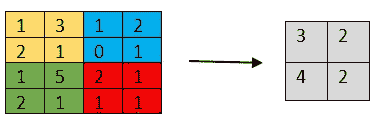
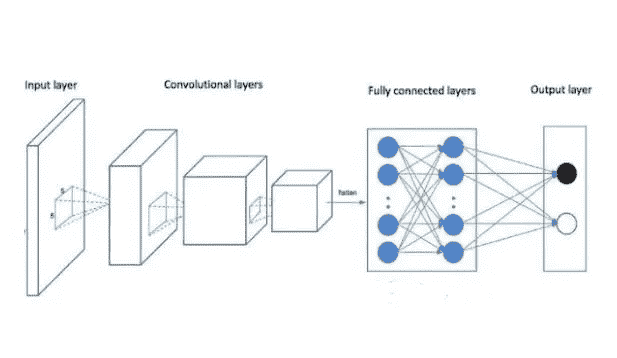

# 面向初学者的卷积神经网络介绍

> 原文：<https://medium.easyread.co/an-introduction-to-convolution-neural-network-cnn-for-a-beginner-88548e4b2a84?source=collection_archive---------4----------------------->

Photo by [Alina Grubnyak](https://unsplash.com/@alinnnaaaa?utm_source=unsplash&utm_medium=referral&utm_content=creditCopyText) on [Unsplash](https://unsplash.com/s/photos/network?utm_source=unsplash&utm_medium=referral&utm_content=creditCopyText)

*卷积神经网络【CNN】是深度学习中的一种算法，它是多层感知器(MLP)的发展，设计用于处理网格形式的数据，其中一种是二维图像，如图像或声音。*

*MLP 是效果较好的图像分类方法之一。但是它也有不足之处，即只能识别图像中间的物体，而图像中心以外的物体不能被正确识别。所以解决 MLP 不足的最佳方案是卷积神经网络(CNN 或 ConvNet)。CNN 不仅能识别图像中间的物体，还能识别图像右角或左角的物体。*

# ***卷积神经网络***

*你们中的一些人可能对什么是卷积神经网络(CNN)有很多疑问，不是吗？所以让我试着解释给你听。*

*如前所述，CNN 是深度学习的一部分。CNN 主要用于使用监督学习方法对标记数据进行分类。监督学习是机器学习中的一种学习方法，它通过训练数据来获得目标变量，从而对已经标记过的数据进行分类。CNN 通常用于进行图像识别、图像分类、对象检测、人脸识别、尝试进行对象或场景检测、对象分割等。*

*深度学习的应用实例利用卷积神经网络对 R 软件的斜视或正常眼图像进行分类。或者脸书使用 CNN 的简单案例，即如何识别某人的脸并进行自动标记？*

*CNN 由具有权重、偏置和激活功能的神经元组成。卷积的体系结构分为三层，即卷积层、池层和全连接层。由这三层 CNN 构成，因此在处理图像时，该网络分为两大部分，即 ***特征提取层*** 和 ***全连接层*** 。*

*特征提取层由 ***卷积层*** 和 ***汇聚层*** 组成。全连通层仅由 ***全连通层*** 组成。*

**

*Types of layers in Convolution Neural Network*

# ***特征提取层***

*这部分发生的过程是对由计算机从一幅图像翻译成数字形式的特征图像进行编码处理。当一幅图像给计算机时，它不能像我们一样看东西，但计算机会把那幅图像变成一个矩阵。现在，考虑下面的图像，计算机如何将图像处理成矩阵。*

**

*How computer translate image to be a matrix (image from [this](https://medium.com/nybles/a-brief-guide-to-convolutional-neural-network-cnn-642f47e88ed4))*

*特征提取层分为两部分，即卷积层 ReLu(激活函数)和池层。那么，这两层有什么区别呢？下面继续下一部分。*

## ***卷积层***

*卷积层是 CNN 的第一层，它由神经元组成，神经元以这样的方式排列，以形成具有长度和高度(像素)的过滤器。例如，给计算机的原始 RGB 图像的大小是 5×5 像素，因此在卷积层中作为特征提取层的第一层，大小是 5×5×3。长度为 5 个像素，高度为 5 个像素，通道或滤镜数量为 3(从 RGB 的颜色:红绿蓝)。*

****卷积神经网络中使用的参数有三个:****

*   ***填充(零填充)***

*零填充是一个参数，用于确定值为 0 的像素的数量，这些像素将添加到已转换为矩阵的输入图像的每一侧。*

*做零填充的目的是操纵卷积层的维度(做一个特征图)。通过执行补零步骤，我们可以将输出维度设置为与输入维度保持相同，或者至少输出维度不会显著降低。所以当使用更深的卷积层时，越来越多的特征被成功提取。*

*此外，零填充能够提高模型的性能，因为卷积的过滤器将集中于零填充之间的真实信息。下面是如何在图像矩阵中应用零填充。*

*例如给定尺寸为 5×5 像素的输入图像。*

**

*Application of zero paddings in the matrix of the input image*

*下面是用于计算卷积层输出特征图的公式:*

**

*Equation of Convolutional Layer*

*   ***跨步***

*步幅是一个确定滤波器移动次数的参数。跨距的最小值是 1。如果 stride = 1，则意味着卷积滤波器将水平移动 1 个像素，然后垂直移动。*

*步幅值越小，从输入中获得的信息越详细，但是与步幅值越大相比，需要更多的计算。*

*如果我们使用小步幅值，这并不意味着总能获得相当好的性能。*

*   ***过滤器***

*滤波器是指卷积过程中的输入层数。在具有红、绿、蓝(RGB)颜色值的图像中，这意味着有 3 个滤镜，那么使用的内核也将达到 3 个通道。滤镜滤镜的值是从原始颜色 RGB 颜色中得到的，所以滤镜的值是 3。*

## ***汇集层***

*汇集层通常在卷积层之后。原则上，池图层由一个具有一定大小的过滤器组成，跨距将在所有要素地图区域内移动。*

*常用的池层有最大池和平均池。例如，我们使用跨度= 2 的最大池 2 x 2 像素，然后在所有过滤器的移动中，将选择 2 x 2 像素区域中的最大池值，而在平均池中。下面是最大池和平均池的应用。*

**

*Max Pooling*

**

*Average Pooling*

*池层的目的是降低特征图的维数(下采样),这样可以快速增加计算量，因为更新的参数变得更小并克服过拟合。*

# ***全连通层***

*全连接层(FC 层)是用于确定哪个特征与某个类更协作的层，并且该层还具有将特征图变成一维向量的功能。*

*全连通层有许多隐藏层、激活函数、输出层和损失函数。下图是 CNN 全连接层的架构。*

**

*Image of Fully Connected Layer in CNN*

*有**“展平**”过程或重塑特征地图成为一个矢量，以便我们可以使用它作为下一个完全连接层的输入。它的发生是因为从特征提取层(卷积层和池层)得到的特征图仍然以多维数组的形式存在。*

*完全连接的层的目的是使用作为来自特征提取层的结果的特征来将输入图像分类到最具协作性的类别中。*

*更多关于卷积神经网络的优秀论文讲解，建议大家访问 CNN 上斯坦福教程的这个 [**链接**](http://cs231n.github.io/convolutional-networks/#overview) 。*

*希望你理解 CNN 的架构，并喜欢这个概述。如果你有任何疑问或建议或反馈，我感到自由，你可以在下面评论，以便我将来的文章取得更好的效果。*

*你也可以关注我来阅读我的文章！*

*最后，我真的希望你喜欢阅读这篇文章，并请点击小按钮鼓掌家伙。**非常感谢！***