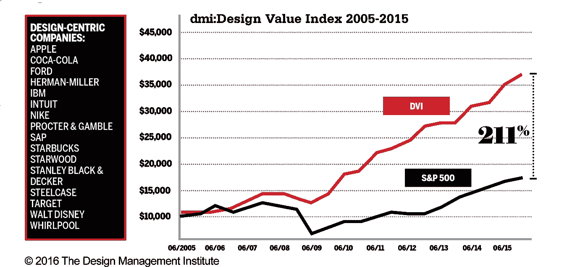
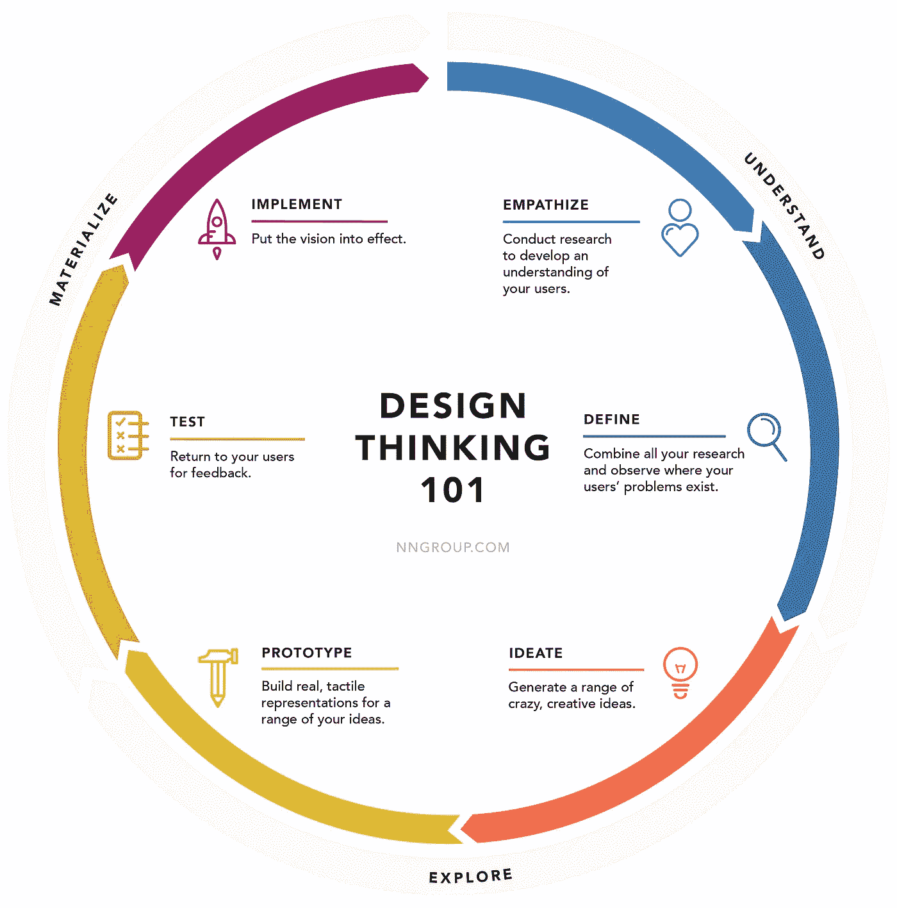

# 设计思维导论

> 原文：<https://medium.com/version-1/an-introduction-to-design-thinking-aed99f8c0be0?source=collection_archive---------2----------------------->

设计思维的核心是通过探索用户如何与产品和服务互动来改进我们开发的产品和服务。设计思维包括深入挖掘这一点，以了解我们为其开发解决方案的人以及使用这些解决方案的环境。

Photo by [You X Ventures](https://unsplash.com/@youxventures?utm_source=medium&utm_medium=referral) on [Unsplash](https://unsplash.com?utm_source=medium&utm_medium=referral)

解决问题需要一个迭代的过程，在这个过程中，我们的假设不断受到质疑，以帮助我们更好地定义问题。通过这个过程，我们试图找出在我们最初的理解中可能不明显的替代方法。公司使用设计思维过程来引导见解和制造真正与用户联系的产品的能力可能是一个关键的差异化因素。

# 简史

设计思维的实践并不新鲜。好的设计总是使用以人为中心的流程来构建有效的解决方案。现代版的设计思维起源于 20 世纪 60 年代，作为一种教授工程师如何创造性地解决问题的方法。斯坦福大学机械工程教授约翰·e·阿诺德是该课题的第一批作者之一。他写了“[创意工程](https://www.inist.org/library/1959.John%20E%20Arnold.Creative%20Engineering.pdf)”这本书，确立了设计过程的四个领域。

然而，商业在历史上将设计视为事后的想法，在开发周期结束时用于润色产品的美学。

> "[一个解决错误问题的精彩界面会失败](https://www.nngroup.com/articles/the-myth-of-the-genius-designer/)"

雅各布·尼尔森

一些软件公司开始将设计放在产品旅程的最开始。这从第一天起就允许了以人为中心的设计方法，并被证明是投资者在成功结果和财务回报方面的主要优势。

设计管理研究所进行的一项研究发现，在 10 年时间里，将设计置于组织核心的公司比标准普尔 500 增长快 211%。

为了让这种新方法被大公司接受，它需要标准化。虽然“设计思维”这个术语已经发展了很多年，但它是在 20 世纪 90 年代由蒂姆·布朗和 T4 IDEO 公司的团队提出的。他们将几种方法和想法整合到一个单一的集成过程中。这个更加正式的过程成为了一个框架，为传统的商业问题提供以人为中心的设计。

# 设计思维不仅仅是设计师的专利

在实践中，设计并不局限于设计师，它是一种自然的人类实践，我们每天都在做，从你最新的酸奶配方到规划你闪亮的新家庭办公室布局。所以“设计思维”是我们都能做到的。问题是，在我们自己的小世界里，我们倾向于在头脑中设计自己。对我们大多数人来说，为他人设计并不是自然而然的事。当我们被赋予为他人设计和开发解决方案的任务时，我们面临着一个重大的问题！这将我们带到设计思维过程的第一步…

# 设计思维的 6 个阶段

**换位思考:**设计思维过程始于换位思考**。**为了创造出令人满意、切实可行的产品和服务，你需要了解你的用户是谁，他们需要什么。他们对你的产品或服务有什么期望？他们面临哪些挑战和痛点？这一步骤基于用户研究，收集的信息对于在项目的时间限制内尽可能最好地理解用户是至关重要的。

设计思维的阶段。计算机输出缩微胶片

**定义**:通过结合对用户及其问题的研究和观察，我们确定了用户需求最大的领域，并定义了问题陈述。有了这个，我们就可以开始关注创新的机会。

现在有了扎实的背景知识和明确的问题陈述，我们可以确定问题的可能解决方案，我们开始寻找看待问题的替代方法。

**原型:**我们构建原型是为了更清楚地了解真实用户在与最终产品交互时的行为。

**测试:**测试阶段产生的结果经常被用来重新定义问题。即使在这个阶段，也会进行修改，用户反馈可以排除解决方案，并对产品-解决方案的适合性有更深的理解。

**实现:**这是设计思维中最重要的部分，但却经常被遗忘。尽管设计思维对一个公司来说很有影响力，但真正的创新只有在过程被执行的时候才会发生。

# 关于作者

*Robert Harte 是 Version 1 的 UX 顾问，与众多客户合作解决他们的用户体验需求。最近，Robert 在创新实验室工作，在那里他帮助为我们的客户提供设计思维实践和服务设计。*