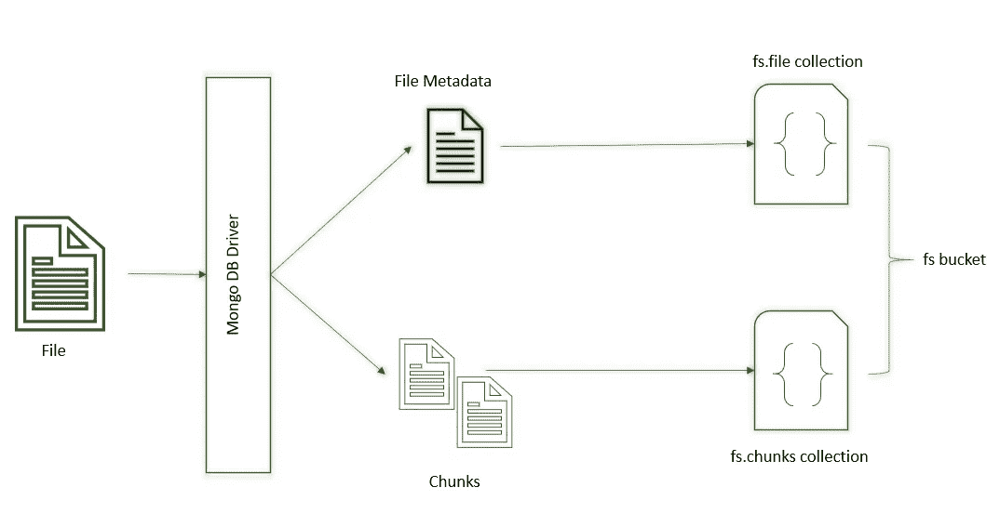

# GridFS 简介

> 原文：<https://medium.com/version-1/an-introduction-to-gridfs-e8de4537cd4?source=collection_archive---------1----------------------->

Photo by [Campaign Creators](https://unsplash.com/es/@campaign_creators?utm_source=unsplash&utm_medium=referral&utm_content=creditCopyText) on [Unsplash](https://unsplash.com/?utm_source=unsplash&utm_medium=referral&utm_content=creditCopyText)

MongoDB 是一个领先的 NoSQL、开源、面向文档的数据库平台。然而，[BSON 文件的最大容量是 16 兆字节。](https://www.mongodb.com/docs/manual/reference/limits/#bson-documents)您会如何处理大于这个长度的文件？这就是 GridFS 的作用所在。

**grid fs 到底是什么？**

[**GridFS**](https://www.mongodb.com/docs/manual/core/gridfs/#gridfs) 是一个 MongoDB 文件系统抽象，用于存储和检索巨大的图像、音频或视频文件。这不是 MongoDB 的一个特性，而是一个规范，驱动程序为用户提供了一个端点来存储/检索文件。GridFS 与 MongoDB 中的 BinData 存储的不同之处在于，它可以存储大于 16MB 文档大小限制的文件。

**grid fs 中的数据是如何存储的？**

GridFS 获取一个文件，并将其分割成称为块的部分。默认情况下，每个块大小为 255 KB(这是一个可配置的参数)。

GridFS 创建两个集合，即 **chunk** 集合和 **file** 集合，并通过在每个集合前面加上 bucket 名称(默认名称为 FS)将它们放入一个公共的 **bucket** 中，即 fs.chunks 和 fs.files。

拆分的块作为文档存储在块集合中，而附加的元数据保存在文件集合中。

为了提高效率和方便起见，最初上载数据时，会自动在集合上创建索引。还可以根据需要创建额外的索引。

**How does GridFS store data**

**如何获取数据？**

当你想读取 GridFS 中存储的文件时，[驱动程序](https://www.mongodb.com/docs/drivers/)/客户端从文件集合中获取元数据，并根据需要定位和合并所有的块。该文件可以读入内存或输出到流中。您还可以从文件的任何部分检索数据。

**优点**

1.  分块的主要优势之一是 GridFS 可以检索文件的各个部分，而无需将整个文件加载到内存中。
2.  将文件元数据与文件本身一起保存。
3.  地理复制和可用性—借助 GridFS 和 MongoDB [分片](https://www.mongodb.com/docs/manual/sharding/)，文件和元数据可以自动同步和部署。
4.  可以将它与其他数据库内容一起存储，从而简化架构。
5.  使用 MongoDB 内置的认证和安全机制。
6.  不需要担心文件系统的限制。

**缺点**

1.  与文件系统或从服务器提供文件相比，性能较慢。
2.  对文件进行原子性更改是不可行的。另一种方法是创建文件的多个版本，丢弃不需要的版本。

阅读下一篇文章，学习如何使用 GridFS 来[存储和检索文件！](/version-1/file-storage-and-retrieval-using-gridfs-30169630e75a)

**关于作者:** Geethu Suresh 是微软的一员。Net 顾问在这里的版本 1。