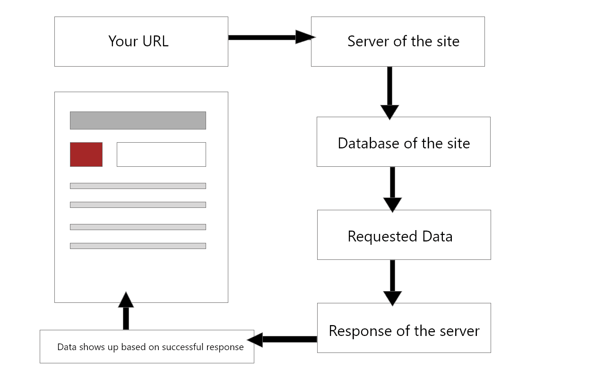

# REST API 简介

> 原文：<https://medium.com/quick-code/an-introduction-to-rest-api-931380178619?source=collection_archive---------5----------------------->

如果您是前端开发人员或 web 开发初学者，并且希望了解 REST API，那么这篇文章就是为您准备的。我将使用 NodeJS 和 Express 来演示如何使用 REST API。我在这里有一个关于如何设置 NodeJS Express 服务器的教程。以防你不知道如何设置 NodeJS 服务器；首先按照这个步骤设置您的服务器，然后再回来。

为了澄清一些事情，您可以使用 REST API 与任何外部第三方 API 进行通信，并构建一些很酷的前端项目。一天结束时，它们就像你每天在浏览器的 URL 栏上发送的任何其他 http 请求一样，无论是脸书、Twitter 还是任何其他连接到数据库的网站。

流程是这样的。



首先，REST API 有四个常见的操作可以用来与另一个应用程序进行交互。他们是

*   **发布**请求
*   **得到**的请求
*   **放**请求
*   **删除**请求

也称为 CRUD 操作。创建、读取、更新和删除。

# 发布请求

用最简单的术语来说， **POST** 请求是指某人发送一个向数据库添加新数据的请求，或者为了得到某样东西而需要对数据进行验证。比如注册或登录网站。

让我们看看如何使用 NodeJS 和 Express 实现这一点。现在，您应该有一个节点服务器在运行。出于演示的目的，我将使用一些模拟数据来模拟数据库。

```
const express = require('express')
​
const app = express()
​
app.listen(5000, () => {
    console.log('Server started on PORT 5000')
})
​
const mockData = [
    {
        id: '1',
        name: 'Chelsea',
        country: 'England',
        league: 'EPL'
    },
    {
        id: '2',
        name : 'Real Madrid',
        country: 'Spain',
        league: 'La Liga'
    }
​
] 
app.post('/add_team', (req, res) => {
    // Our Request
    mockData.push({
        id: '3',             // equivalent to (req.body.id)
        name : 'Barcelona',  // equivalent to (req.body.name)
        country: 'Spain',    // equivalent to (req.body.country)
        league: 'La Liga'    // equivalent to (req.body.league)
    })
    // this is the response from our request
    res.send(mockData) 

})
```

Express 附带了方便的实用方法，如 post、get、put、delete 等等。您可以查看他们的[文档](https://expressjs.com/)以获得支持方法的完整列表。在 app.post()中，第一个参数是我们必须包含在 URL 末尾的路由路径，在本例中是[http://localhost:5000/add _ team](http://localhost:5000/add_team)，第二个参数是一个回调函数，它接受两个参数 request 和 response。缩短版(请求，请求)。这个回调函数是我们编写所有逻辑的地方。比如在请求中发送什么，以及当我们得到响应时做什么。如何处理错误。我不打算在这篇文章中讨论错误处理，因为我试图在这里保持介绍性的东西，但请记住这一点。

现在回调函数有了自己的方法，并附带了 req，res。正如我前面说过的，您可以向请求体添加数据。这里我向我的 mockData 数组添加了一个新对象。在 real app 中，这个 **POST** 请求会将这些数据添加到包含这些字段(id、姓名、国家、联赛)的数据库中。

您可以通过发送 POST 请求来测试上面的代码。现在，您无法在浏览器 URL 中发送 **POST** 请求。但是你可以使用像 postman 或者 RESTED 这样的 API 测试扩展。我没有解释如何使用这些扩展，它们是不言自明的。安装其中一个并从扩展的请求标签中选择 POST，在 URL 标签中粘贴这个[http://localhost:5000/add _ team](http://localhost:5000/add_team)并点击发送，你会看到它返回一个包含 3 个条目的新数组。最后一个是我们放在 **POST** 请求中的对象。

在上面代码的最后一行，“res.send(mockData)”负责返回 3 个数组。这也是我们期待从这一请求中得到的回应。

所有这些 http 方法基本上都是这样工作的。我们用(app.name_of_the_request)调用 http 方法，给它我们的路由路径，用(req，res)设置我们的回调函数，并在其中编写我们的逻辑。最后，在“res.send()”中，我们放入了预期的结果。

让我们看看这些方法的其余部分。

# 获取请求

HTTP **GET** 请求就像它从数据库中获取数据一样。您不能使用 **GET** 请求添加新数据。您可以根据您的特定查询获取数据。让我们从上面的 mockData 中获取 id 为 2 的团队的信息。这是该请求的外观。

```
app.get('/:id', (req, res) => {
    mockData.map(team => {
        if (team.id === req.params.id) { // confused??
            res.send(team)
        }
    })
})
```

所有这些请求都带有“req.params”。有三种常见的请求方法，你可能会经常用到。我们在**POST**req 中看到的“req.body”，另外两个“req.params”和“req.query”。

如果我们想要使用 req.params，我们必须在我们的路由路径的末尾添加参数，我们是通过用冒号作为前缀来添加的，然后访问我们使用的参数(req.params.name_of_parameter)。在下一个例子中，我们将看到“req.query”的用法。除此之外，其他一切都与您在 **POST** 请求示例中看到的一样。现在，您可以像以前一样进行测试，或者这次您可以实际使用您的浏览器 URL。因为浏览器 URL 接受 **GET** 请求，所以不会有任何问题。

到目前为止，您已经注意到除了请求参数之外，我们的路由路径有所不同。这一次我们只是放了一个“/”而不是描述性的东西。/'这表示您的根路径，因此如果您只输入[http://localhost:5000/1](http://localhost:5000/1)，我们将在浏览器中看到预期的结果。试试看。

在任何时候，如果您遇到任何错误，请确保您的节点服务器正在运行。

# 上传请求

每当我们想要更新数据库中的现有数据时，我们发送 HTTP **PUT** 请求。现在这也可以通过 **POST** 请求来完成。但这是更新现有数据的首选方法。让我们看看这一次用“req.query”在代码中是什么样子。

```
app.put('/update_team', (req, res) => {
    mockData.map(team => {
        if (team.id === req.query.id) { // req.query
            team.name = 'Liverpool'
        }
    })
    res.send(mockData)
})
```

几乎一切都是相似的。我们只需更改路由路径，并使用“req.query”来更新团队名称。我们如何使用“req.query”呢？在“req.params”中，我们在路由路径中传递参数。这里我们做了一些几乎类似的事情，但这次是在我们的主 URL[http://localhost:5000/update _ team？id=1](http://localhost:5000/update_team?id=1) 在查询(id)前面加上问号，然后在等号后面加上值。

到目前为止，您应该已经看到这是一种模式。对于 **POST** 请求我们的方法是 app.post()，对于 **GET** 请求 app.get()等等。

在我们结束之前，让我们也使用 **Delete** 请求从数组中删除一个项目。

# 删除请求

```
app.delete('/delete_team/:id', (req, res) => {
    var teamIndex = mockData.findIndex(team => team.id === req.params.id)
    mockData.splice(teamIndex, 1)
    res.send(mockData)
})
```

如你所见，没有太大的区别。我们只是使用 app.delete()和“req.params”来选择要删除的项目。以及从数组中删除一项的几行 JavaScript 代码。运行这个 URL[http://localhost:5000/delete _ team/1](http://localhost:5000/delete_team/1)，在 API 测试扩展上将您的请求选项卡设置为 delete，您应该看到它在删除后只返回一个项目，这是预期的。

仅此而已。在此之后，您应该对 REST API 有一个基本的了解。这是完整的代码。

```
const express = require('express')
​
const app = express()
​
app.listen(5000, () => {
    console.log('Server started on PORT 5000')
})
​
const mockData = [
    {
        id: '1',
        name: 'Chelsea',
        country: 'England',
        league: 'EPL'
    },
    {
        id: '2',
        name : 'Real Madrid',
        country: 'Spain',
        league: 'La Liga'
    }
] 
app.get('/:id', (req, res) => {

    mockData.map(team => {
        if (team.id === req.params.id) {
            res.send(team)
        }
    })
})
​
app.post('/add_team', (req, res) => {

    mockData.push({
        id: '3',
        name : 'Barcelona',
        country: 'Spain',
        league: 'La Liga'
    })
    res.send(mockData)
})
​
app.put('/update_team', (req, res) => {
    mockData.map(team => {
        if (team.id === req.query.id) {
            team.name = 'Liverpool'
        }
    })
    res.send(mockData)
})
​
app.delete('/delete_team/:id', (req, res) => {
    var teamIndex = mockData.findIndex(team => team.id === req.params.id)
    mockData.splice(teamIndex, 1)
    res.send(mockData)
})
```