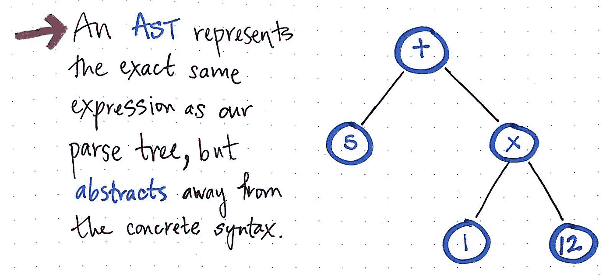

# Scala 宏介绍

> 原文：<https://medium.com/walmartglobaltech/an-introduction-to-scala-macros-908ee8752bd5?source=collection_archive---------2----------------------->

source: [google-images](https://lh5.googleusercontent.com/proxy/J1ugkRNuJj_VvBZPsQVKvrQlTitOxZqqPEJkYhCy5qZh_IJycO8fbNAM89kL6_X1_t350aqjjz7XN7o73qlJPnTHcRMfUl90c6ak_cushTvXD5fWn8ZnIDYV=w1684-h1069-p-k-no-nu)

嘿，伙计们，自从我上次发帖已经有一段时间了。因此，继续我们的函数式编程之旅，今天我计划介绍 Scala 中“编译时代码操作”的一个稍微高级的概念。对于介绍，我会保持简单，因为它涉及一些 Scala 编译器的工作知识。

**什么是 Scala 宏？**