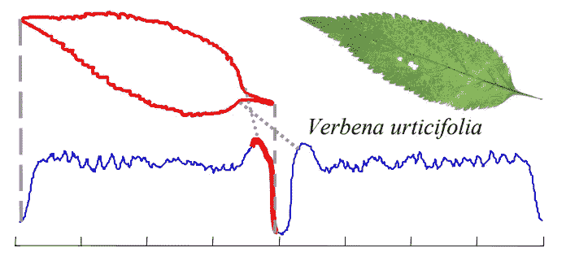

# 形状简介:时间序列中的形状

> 原文：<https://medium.com/version-1/an-introduction-to-shapelets-the-shapes-in-time-series-c55b94205614?source=collection_archive---------0----------------------->

## 有没有想过 Fitbit 或任何小工具如何在您行走或跑步时进行检测，并在您每次锻炼时自动检测？这只是时间序列数据的众多应用之一。


Photo by Yan Krukov from Pexels

时间序列数据是随着时间获得的记录的集合。这些数据总是有顺序的，改变顺序会产生或描述一个完全不同的情况。

目前，在现实世界中，时间序列的应用无止境，从医疗保健、人类活动识别、网络安全、金融、营销、自动疾病检测、异常检测等。由于时态数据的丰富性，基于时间序列的应用受到了极大的关注，并且提出了许多分类算法。

**我们如何对时间序列进行分类？**


Photo by [Anna Nekrashevich](https://www.pexels.com/@anna-nekrashevich?utm_content=attributionCopyText&utm_medium=referral&utm_source=pexels) from [Pexels](https://www.pexels.com/photo/magnifying-glass-on-top-of-document-6801648/?utm_content=attributionCopyText&utm_medium=referral&utm_source=pexels)

对时间序列数据进行分类的方法有很多。一些众所周知的标准技术使用具有不同弹性距离度量的 K-最近邻来识别数据中的类，如动态时间扭曲(DTW)、时间扭曲编辑(TWE)或复杂度不变距离(CID)。

我们也有深度学习方法，通过时间相关性的自动学习等方法在时间序列预测中显示出潜力。然而，由于时间序列数据的高维数，这些技术在训练时间和内存需求方面被证明是昂贵的。考虑到传统算法的高计算负担，叶和提出了一个被称为 Shapelets 的概念。

**什么是小形状？**

由于大多数时间序列数据在子序列内而不是在完整序列上表现出类间差异，因此小形状意味着代表时间序列数据的这些区别性子序列。简单地说，我们在系列中确定了一个形状，使其区别于该领域中的其他类。Shapelet 的示例如下所示。



Photo by Ye and Keogh from [Time series shapelets: a new primitive for data mining](https://www.cs.ucr.edu/~eamonn/shaplet.pdf)

上图显示了叶子的时间序列一维表示。突出显示的部分显示了最能代表该叶子的子序列。使用优化发现和分类时间的技术识别小形状有多种方式。一些著名的小形状算法是[快速小形状](https://www.cs.ucr.edu/~eamonn/SDM_FastShapelets.pdf)和[学习时间序列小形状](https://www.ismll.uni-hildesheim.de/pub/pdfs/grabocka2014e-kdd.pdf)。

**Shapelet 实现**

大多数 shapelet 实现是用 C++或 Java 完成的，Python 标准库中没有这些算法的官方实现。我目前还在用 python 开发一个 GitHub 库,用来识别 shapelets 并对它们进行分类。下面提到了目前可用的 shapelets 的一些开源 python 实现:


Photo by [Luis Gomes](https://www.pexels.com/@luis-gomes-166706?utm_content=attributionCopyText&utm_medium=referral&utm_source=pexels) from [Pexels](https://www.pexels.com/photo/close-up-photo-of-programming-of-codes-546819/?utm_content=attributionCopyText&utm_medium=referral&utm_source=pexels)

## **学习时间序列 Shapelets 由 mohaseeb**

*来源:*[*shaplets-python*](https://github.com/mohaseeb/shaplets-python)

**安装**

```
git clone git@github.com:mohaseeb/shaplets-python.git
cd shaplets-python
pip install .
```

**用途**

```
from shapelets_lts.classification import LtsShapeletClassifier

# create an LtsShapeletClassifier instance
classifier = LtsShapeletClassifier(
    K=20,
    R=3,
    L_min=30,
    epocs=50,
    lamda=0.01,
    eta=0.01,
    shapelet_initialization='segments_centroids',
    plot_loss=True
)

# train the classifier. 
# train_data.shape -> (# train samples X time-series length) 
# train_label.shape -> (# train samples)
classifier.fit(train_data, train_label, plot_loss=True)

# evaluate on test data. 
# test_data.shape -> (# test samples X time-series length)
prediction = classifier.predict(test_data)

# retrieve the learnt shapelets
shapelets = classifier.get_shapelets()

# and plot sample shapelets
from shapelets_lts.util import plot_sample_shapelets
plot_sample_shapelets(shapelets=shapelets, sample_size=36)
```

## 艾伦·图灵研究所的 Sktime

*来源:* [*sktime*](https://github.com/alan-turing-institute)

Sktime 是艾伦图灵研究所开发的一个统一框架，用于时间序列数据的机器学习。此包包含一个 shapelet 转换，可用于从数据中提取 shapelet。

**安装**

```
pip install sktime
```

或者

```
conda install -c conda-forge sktime
```

**用法**

```
from sktime.transformers.series_as_features.shapelets import ContractedShapeletTransform*# How long (in minutes) to extract shapelets for.*
time_contract_in_mins = <time to search>

*# The initial number of shapelet candidates to assess per training series.* 
initial_num_shapelets_per_case = <no of shapelets>

ShapeletTransformer = ContractedShapeletTransform(     time_contract_in_mins=time_contract_in_mins,
num_candidates_to_sample_per_case=initial_num_shapelets_per_case)ShapeletTransformer.fit(train_x, train_y)*#Plot the shapelets*
**for** i **in** range(0,min(len(ShapeletTransformer.shapelets),5)):
    s = ShapeletTransformer.shapelets[i]
    *# summary info about the shapelet*
    print("#"+str(i)+": "+str(s))

    *# overlay shapelets*
    plt.plot(
        list(range(s.start_pos,(s.start_pos+s.length))),
        train_x.iloc[s.series_id,0][s.start_pos:s.start_pos+s.length]
    )

plt.show()
```

**结论**


Photo by [luis gomes](https://www.pexels.com/@luis-gomes-166706?utm_content=attributionCopyText&utm_medium=referral&utm_source=pexels) from [Pexels](https://www.pexels.com/photo/close-up-photo-of-programming-of-codes-546819/?utm_content=attributionCopyText&utm_medium=referral&utm_source=pexels)

在本文中，我介绍了时间序列中的 shapelets 以及它们相对于传统方法的优势。我打算在下一篇文章中提供提取 shapelets 的算法的深入观点，以及它们如何用于分类问题。

非常感谢您的阅读！如果你有任何问题或意见，请告诉我。

**关于作者:**

Rohit Vincent 是 Version 1 的数据分析顾问。