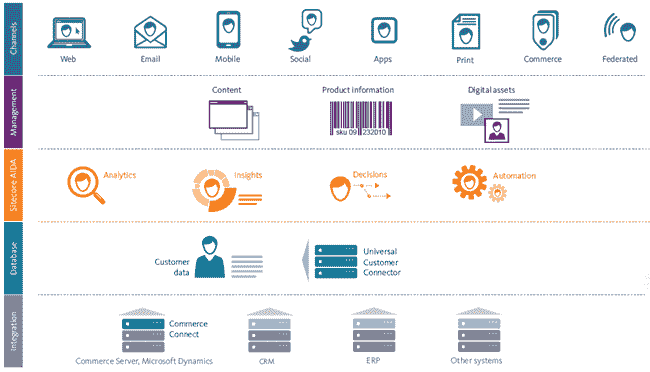
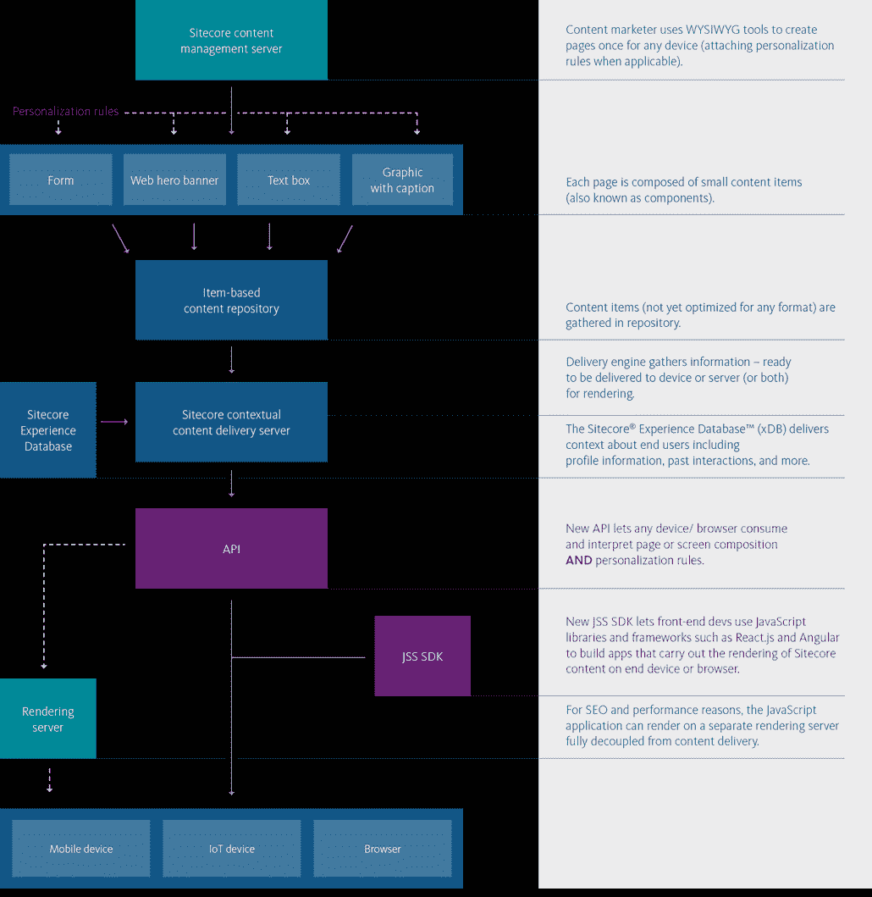
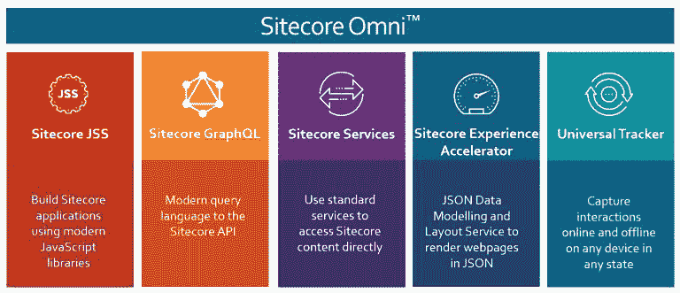
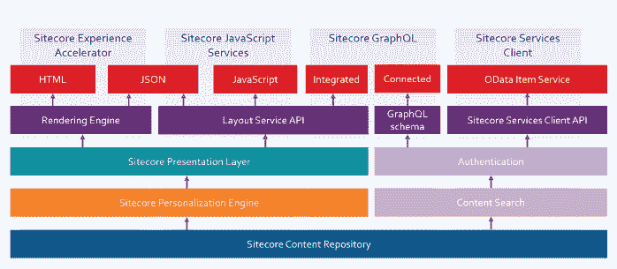

# CMS 无头体系结构概述

> 原文：<https://medium.com/globant/an-overview-of-a-cms-headless-architecture-b6b4b0d12de2?source=collection_archive---------0----------------------->

内容管理系统(CMS)是基础数字软件，提供工具来管理和交付网站或应用程序上的内容，本质上，CMS 涉及编辑、工作流、报告和安全性等关键功能。

随着新兴设备的出现和人工智能技术的新用途(例如，失读症和 Siri)，无头架构已经成为 CMS 系统最受欢迎的趋势概念之一，作为对智能手机、可穿戴设备、人工智能语音辅助和虚拟现实(VR)耳机等新兴设备的网络发展的回应。

***Sitecore*** 是数字体验平台领导者(DXP ),作为最重要的 a .NET CMS 套件不断被 Gartner 和 Forrest 授予，该套件包括集成的工具包，如工作流、测试、分析、个性化体验、营销自动化功能。Sitecore 在第 9 版中引入了 Healdes，它有一些惊人的特性，我们将在本文中讨论。

Sitecore headless 架构通过保持大部分功能不变，不需要依赖传统的后端代码(后端“头”)。Sitecore CMS headless 使我们能够在移动应用和物联网设备上快速提供丰富的体验。当您引入 CMS 时，一个陷阱是相关的后端学习曲线，如果前端开发人员没有经验，这可能对他们没有吸引力。在某些情况下，这意味着采用新的框架或不同的操作系统。使用不同的 IDE 可能非常耗时，尤其是当您需要在敏捷开发过程中交付早期原型时。有了 Sitecore headless，你可以避免处理那些缺点，并且你可以保留所有*酷的*特性(比如分析和个性化)。传统的 CMS 不能处理新兴设备，如物联网、VR 耳机或由语音而不是屏幕控制的智能设备。Sitecore CMS headless 是一项利用消费者对现代化需求的投资。

**有什么好处？你可以使用现代的 javascript 库工具。你可以自由选择你想在一个断开的应用程序下使用的任何 IDE 或 OS。完全控制内容呈现和演示。支持个性化&多变量和 AB 测试。**

开发人员可以自由选择最新的 javascript 框架，而不必担心典型的渲染系统及其隐含的技术，如。NET、JAVA、PHP 和其他语言，加速开发过程并专注于创新产品。快乐的开发人员意味着更高的生产力！

Sitecore Headless 不仅仅是面向开发者的。营销人员从 Sitecore-hybrid 解决方案中受益，该解决方案具有营销人员所见即所得的特性。营销团队可以在同一平台下统一所有渠道和设备的内容制作，并解决不同工具的内容重复带来的问题。

**Sitecore 无头架构**

Sitecore 9 在其传统架构上引入了两个组件:Sitecore 体验加速器和 JavaScript 服务(JSS ),后者在表示层提供了一个新的 REST API。

*改编自:*[*https://www . sitecore . com/products/sitecore-experience-platform/headless/developers-jss*](https://www.sitecore.com/products/sitecore-experience-platform/headless/developers-jss)

JSS 允许前端开发者使用现代 javascript 库(React.js、Angular、View)和框架(VS Code、NPM、Sublime)来开发内容在任何设备或浏览器上的呈现。

**JSS 库**:一系列的 npm 包有助于在 JavaScript 中使用 Sitecore 数据和布局。特定于框架的 SDK 提供了 Sitecore 的动态占位符布局系统和助手，用于呈现 Sitecore 字段，以便作者可以编辑它们。

**Sitecore 布局服务**:这似乎是让无头成为可能的重要特性。它提供了路线/页面的组成，以及每个组件所需的数据。客户端 SDK 使得消费这些数据和呈现数据驱动(即 Sitecore 驱动)的布局变得容易。它是一个服务层，工作在 Sitecore 表示层之上。当 Sitecore 构建一个网页时，它请求并组合多个表示组件来呈现一个页面。对于这些组件中的每一个，它使用请求进入的上下文(地理位置、设备、时间、用户等。)并检索内容和演示。一旦这些被加载，它检查是否有任何个性化规则适用于特定的访问者。最后，它将组成网页的所有组件组合起来。布局服务通过将所有的表示组件转换为 JSON，在呈现 web 页面之前插入自己。这样，JSON 格式的内容应用了个性化和测试规则。布局服务传递跟踪访问者信息所需的上下文。

**JavaScript 视图引擎**:允许 Sitecore 执行 JavaScript 应用的服务器端渲染(SSR)，支持使用 Sitec ore 体验编辑器。

**应用程序导入**:开发者在通过应用程序导入服务使用 JSS 时，可以采取代码优先的方法，该服务基于数据和 JavaScript 定义的 Sitecore 实体(如渲染和数据模型)生成 Sitecore 渲染、模板和/或内容。

**Sitecore 模式**

开发者在开发 Sitecore 时有两种方式。

**代码优先:**前端开发者可以在没有 Sitecore 知识的情况下，先创建 JavaScript 应用(无论是 js 框架还是 OS)。与 Sitecore 断开连接后，它们可以通过代码内组件、定义和路由数据来定义 Sitecore 结构。导入过程会生成一些传统的 Sitecore 结构作为模板和渲染。从代理的角度来看，当你需要用有限的人员交付早期的原型而又不影响发布时间时，代码优先的能力可能是一个成功的因素。

**Sitecore-first:** 开发人员创建 Sitecore 组件和核心数据，不使用导入流程。可以首先定义合同以允许并发工作。

**无头权衡(灵活性与可访问性)**

当我们可以考虑分析和个性化功能时，无头架构通常会带来一些缺点。

失去所见即所得(WYSIWYG)的功能:所见即所得被禁用，只有非技术营销人员可以创建和编辑内容，因为开发人员解决了演示文稿。这需要付出额外的努力来学习如何以不友好的方式管理营销团队。

失去个性化:另一个缺点是无法将数据实时发送到前台，因此您无法个性化体验或运行内容分析活动。这也是客户最重要的功能之一。

那么，Sitecore 是否提供了一种解决个性化缺失的方法？

混合无头 CMS 架构:理想的场景应该将灵活性和可扩展性与传统 CMS 通常提供的个性化和分析功能相结合。

前端开发人员使用他们首选的 JS 库为任何设备或浏览器构建解决方案和应用程序。他们可以通过 API 连接到 Sitecore 的体验数据库中的交付内容数据(个人资料信息、交互等)，以支持设备和浏览器实时运行个性化规则。这是 Sitecore OMNI 出现的地方。

**OMNI Sitecore**

Sitecore Omni 是一套工具，通过利用 Sitecore JSS、*通用追踪器*和其他工具提供全面定制，支持无头实施和营销功能:(内嵌编辑(WYSIWYG)、分析、个性化、A/B 测试、Sitecore Cortex(机器学习))。

***Universal Tracke****r*是一个高度可扩展的跟踪服务，可以实时收集事件和交互。它建立在 Sitecore 的新功能之上。NET 核心，独立于应用程序平台(可穿戴设备、移动应用程序、浏览器等)运行。

***Sitecore Experience Accelerato****r*提供无头内容，允许编辑将内容作为 JSON 而不是 HTML 来管理。

***Sitecore graph QL***:graph QL 是一种处理海量数据的查询语言(脸书用它向用户提供内容)。这个新的标准可以提高网站的性能和效率，即使内容网站没有像脸书这样的企业网站那么大。

**结论**

无头 CMS 是面向未来的数字内容管理平台，因为用户的期望不断提高，并且随着新出现的设备变得越来越复杂。您需要确保您可以高效地将您的内容传递到任何地方。前端和后端开发人员和营销人员可以构建令人惊叹的内容，将客户的数字体验提升到一个新的水平。

**参考文献**

[https://www . sitecore . com/products/sitecore-experience-platform/headless](https://www.sitecore.com/products/sitecore-experience-platform/headless)

[https://www . sitecore . com/knowledge-center/blog/560/top-6-misconcepts-markets-have-about-headless-cmss-4611](https://www.sitecore.com/knowledge-center/blog/560/top-6-misconceptions-marketers-have-about-headless-cmss-4611)

[https://www . sitecore . com/knowledge-center/blog/543/the-power-of-sitecore-the-freedom-of-headless-4526](https://www.sitecore.com/knowledge-center/blog/543/the-power-of-sitecore-the-freedom-of-headless-4526)

[https://www . sitecore . com/products/sitecore-experience-platform/headless/developers-jss](https://www.sitecore.com/products/sitecore-experience-platform/headless/developers-jss)

[https://jss.sitecore.com/docs/fundamentals/architecture](https://jss.sitecore.com/docs/fundamentals/architecture)

[https://pushpaganan . home . blog/2020/02/02/okay-got-my-sitecore-jss-license-now-what/](https://pushpaganan.home.blog/2020/02/02/okay-got-my-sitecore-jss-license-now-what/)

[https://Gary . wenne ker . org/sitecore-jss-using-a-custom-layout-service-configuration/](https://gary.wenneker.org/sitecore-jss-using-a-custom-layout-service-configuration/)

[https://mysitecore . blog/how-to-build-a-sitecore-jss-we b-app/](https://mysitecore.blog/how-to-build-a-sitecore-jss-web-app/)

[https://www . coria . com/insights/blog/Sitecore/Sitecore-9-x connect-and-headless](https://www.coria.com/insights/blog/Sitecore/sitecore-9-xConnect-and-headless)

[https://mercury-ecommerce . com/resources/why-react-and-sitecore-is-the-perfect-match](https://mercury-ecommerce.com/resources/why-react-and-sitecore-are-the-perfect-match)

[https://medium . com/redhotminute-Australia/sitecore-9-headless-CMS-and-jss-f 23 a 01 DFC 82](/redhotminute-australia/sitecore-9-headless-cms-and-jss-f23a01dfc82)

[https://www . Velir . com/sites/default/files/Velir %20 白皮书%20-% 20 sitecore % 209% 20 功能% 20 和% 20 升级% 20 路径. pdf](https://www.velir.com/sites/default/files/Velir%20Whitepaper%20-%20Sitecore%209%20Features%20and%20Upgrade%20Path.pdf)

[https://altola.co/thinking/sitecore-javascript-developers/](https://altola.co/thinking/sitecore-javascript-developers/)

[http://www . pieterbrinkman . com/2018/10/31/whats-new-in-sitecore-9-1-content-management/](http://www.pieterbrinkman.com/2018/10/31/whats-new-in-sitecore-9-1-content-management/)

[http://CEO . digital/WP-content/uploads/2018/02/Sitecore-Headless-CMS-White-paper . pdf](http://ceo.digital/wp-content/uploads/2018/02/Sitecore-Headless-CMS-White-Paper.pdf)

[https://medium . com/@ pattem digital/what-is-sitecore-omni-f7b 180 e 41732](/@PattemDigital/what-is-sitecore-omni-f7b180e41732)

https://www . sitecore . com/knowledge-center/digital-marketing-resources/what-a-headless-CMS