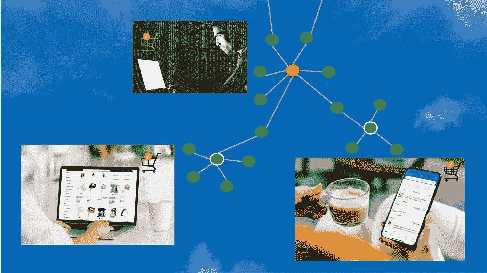
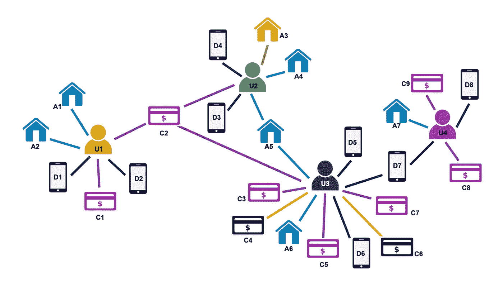
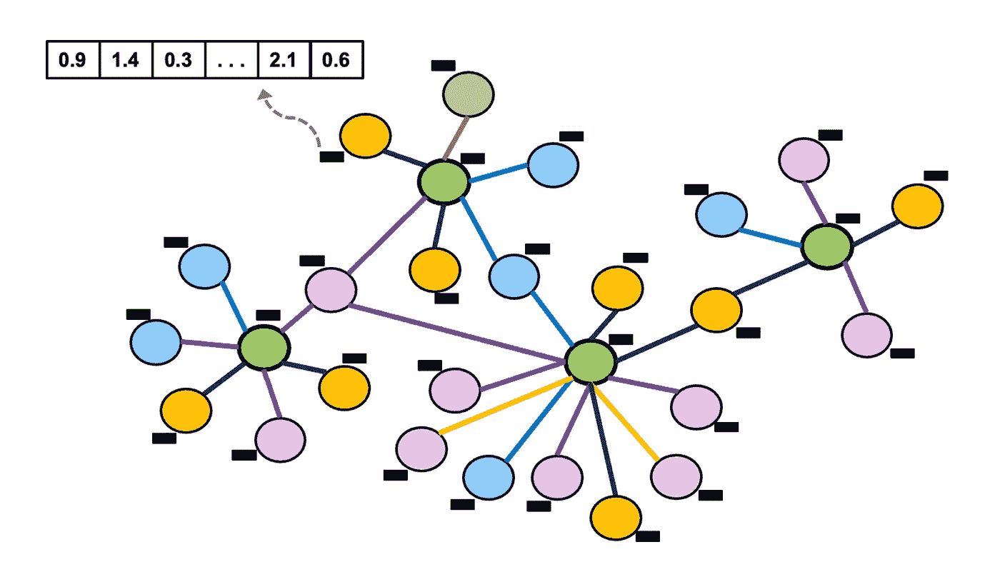

# 用于电子商务异常检测的图神经网络综述

> 原文：<https://medium.com/walmartglobaltech/an-overview-of-graph-neural-networks-for-anomaly-detection-in-e-commerce-87516931d38?source=collection_archive---------0----------------------->

## 第一部分。在电子商务交易中使用网络信息的介绍

本文中提到的图形和网络是实体(客户账户、设备、支付方式等)之间的关系或交互的表示。)涉及典型的网购或电子商务环境。除了输入用于各种任务的机器学习模型的交易特定特征之外，图表还有助于捕捉实体之间的**关联数据**。这对于异常检测特别有用，因为欺诈者或滥用者倾向于同时利用多个实体和客户账户。**图形神经网络(GNN)** 通过在图形学习和推理过程中应用神经网络和深度学习技术，增加了使用图形的好处。

在这篇博客文章的第 1 部分，我们概述了图和网络分析方法中使用的术语，并简要介绍了这些方法在电子商务中的应用。然后在 [**第 2 部分**](/walmartglobaltech/an-overview-of-graph-neural-networks-for-anomaly-detection-in-e-commerce-b4c165b8f08a) 中，我们回顾了几种流行的基于图的方法和 GNN 技术，它们可以用于各种应用，包括电子商务中的异常检测。

本文是对之前一篇名为“ [**深度学习用于零售交易中的欺诈检测**](/walmartglobaltech/deep-learning-for-fraud-detection-in-retail-transactions-564d31e5d1a3) ”的博客文章(作者)的补充，在这里我们打算讨论如何将图形和网络信息与深度学习技术相结合，以更丰富地探索隐藏在电子商务和零售交易中的信息。

# **电子商务中的图信息是什么？**

电子商务环境中涉及各种实体。用图形表示的交易由客户账户、用于购买的设备、支付方式、地址等之间的交互组成。

Figure 1\. A sample graph of interactions in an e-commerce environment. Note that in general, the node interactions have a time component. Therefore, each edge could represent multiple interactions between two nodes at various points in time. For simplicity, not all nodes or entities involved in an e-commerce are shown here.

一个客户账户可以连接到几个实体，客户账户和其他实体之间的关系，反过来又连接到一组不同的客户账户(见图 1)，对于异常检测非常有用，目的是减少由于欺诈和滥用造成的损失。图形表示和 GNN 推理通过有效地利用事务的本地(第 1 层或邻居)网络信息和进一步探索更全局的信息(更高层的连接和遥远的邻居)而有助于异常检测。

图由节点和边组成。当节点或实体属于同一类型时，称为**同构**图。另一方面，在它们之间有多种类型的节点和/或多种类型的边的图被称为**异构**图(或异构图)。电子商务交易图是一种异构图，其中交易可以用表示客户账户、支付方法、设备、地址等的各种节点之间的连接来表示。，这些节点之间的边各不相同，捕捉不同类型的信息。例如，客户账户和设备之间的关系不同于客户账户和支付方法之间的关系类型。

我们还需要考虑电子商务图中的时间维度。这是因为电子商务交易每次都是不同的，异常模式或 MO(操作方式)随着时间的推移而演变。因此，**动态图**(相对于静态图)更能把握不断变化的图拓扑、交互和节点属性。图表演变性质的一些例子如下:新客户进行购买，使用新设备，使用不同的支付方法、不同的设备或不同的地址。

在获取性能数据和反馈(包括异常检测的真实标签)方面存在固有的延迟。例如，合法客户需要花费时间来从他们的信用卡历史记录中识别并报告未经授权的交易。这种报告然后从银行发送给零售商。零售商被要求返还资金并收取费用，这导致了欺诈造成的损失。这种信息作为属性存储在特定的图节点中。

让我们考虑两种为构建图表或执行图表分析准备数据的方法:

*   图形大多可用。假设一个电子商务管理系统已经在跟踪交易中一组选定实体之间发生的交互。然后，我们可以使用整个图或在边上应用某种形式的随机采样(使用区域增长算法)来搜索相邻节点。这产生了有效的子图，然后我们需要生成图嵌入以供进一步分析。
*   当 graph 不容易用于图形分析时，可以使用可用的数据库(如关系表)来识别构建块(节点和边),从而构建图形。

# **图形分析中的问题定义**

假设大多数历史数据或过去的事务(每个都转换为图的节点和边)都有标签。图表形成后，图表分析的下一步是:

*   **节点分类**或“实体分类”:目的是找出给定图形的节点是否异常。
*   **链接分类**或“边分类”:找出节点之间的交互是否异常。
*   **链接预测**:作为图形分析的后续结果，我们可以为图形的每个节点或边分配预测或投影标签。我们也可以使用这样的预测来恢复丢失的事实或标签。在“链接预测”中，我们希望预测哪些节点可能被链接或连接。使用这种方法还可以发现或恢复节点之间丢失的连接。
*   **图分类:**确定一个电子商务交易的图或子图(包括节点及其达到某个邻域度的邻居集)是否属于某个类。为此，输出决策函数可以是例如神经网络分类器，其使用图形属性和节点嵌入作为输入。

# **相关主题和方法**

为了全面了解图形分析技术，我们将首先回顾其他相关术语和方法:

*   "**网络度量**和**图特征提取**":主题包括使用传统的图和网络属性或度量，如节点簇、特征路径长度、节点度、平均聚类系数、局部效率、PageRank 中心性。这些是有用的数字图形和网络特征，可以与其他属性一起用作传统机器学习模型的输入。(参见[这个](https://en.wikipedia.org/wiki/Graph_(discrete_mathematics))、[这个](https://en.wikipedia.org/wiki/Graph_theory)和[那个](https://en.wikipedia.org/wiki/Network_theory))
*   **图形挖掘**或“图形知识发现”:这是一个一般性的话题，可以指对图形数据进行各种数据分析、学习和推理的方法和过程，以提取有用的信息。图挖掘中的一种方法称为“标签传播”(类似于实体预测)，其中我们从已知的节点标签开始，然后使用图结构来识别尚未被检测为异常的可疑邻近节点。这个主题的另一个线索是寻找重复的子图和有用的模式。
*   图聚类:由于密集的聚类与异常活动高度相关，我们可以使用图“**密度聚类**进行异常检测。"**社区检测**"是一种类似的方法，用于将图形分组为密集连接的子集；换句话说，它用于识别密集链接的节点集群。
*   图相似性估计:对于给定的图，“相似性排序”是预测图中两个节点相似程度的问题。预测图中两个节点之间的链接是一种应用。同样，检测“**网络相似度**”就是发现两个子网络(或子图)有多相似。

# **拓扑与属性图**

除了我们之前介绍的显式图形节点和边之外，事务还具有其他对异常检测有用的数字特征。在图形分析中，这种信息也称为图形元数据、辅助信息或**图形属性**，不同于**图形拓扑**或结构。总的来说，并不是每个有用的图形属性都显示了与其他实体或其他事务的明确关系。例如，交易金额、交易标签、购买的物品或产品(其中每种产品都有唯一的 [UPC](https://en.wikipedia.org/wiki/Universal_Product_Code) 或 [GTIN](https://en.wikipedia.org/wiki/Global_Trade_Item_Number) 号)。让我们考虑三个简单的选项来处理这些属性:

*   处理这些属性的一种方法是，如果需要的话，将它们离散化，然后将它们视为附加的图形节点。然而，这种方法的一个缺点是，它会使图形结构变得非常大、复杂和计算昂贵。例如，在电子商务网站上通常有大量的商品或 UPC 出售，尽管 UPC 与图中其他实体的关系信息可能有用，但将它们视为额外的图节点会增加图的总大小。
*   另一种方法是将这些属性合并为节点特征，并应用完全异构的图形表示和分析，其中每个节点都有自己的属性。我们也可以将其中一些属性用作边缘特征。
*   第三种方法是在检测过程的最后使用这些属性(例如，当使用 GNN 进行图形分类时，我们可以将这些属性用作决策模型的附加输入，其中最终决策是基于节点特征做出的)。

# **图形嵌入，或称“图形表示学习”**

图形包含离散信息(节点和边)，但包括神经网络(NN)技术在内的大多数机器学习(ML)方法对连续值输入数据进行操作或更喜欢连续值输入数据。为了解决这个问题，更重要的是，为了允许跨图传播交互信息的合适方式，使用了“图嵌入”，其指的是结合节点属性的图信息的连续表示的生成。

让我们从几个术语和一个假设开始。首先节点的“ **k 跳邻域**或半径为 k 的邻域是距离小于等于 k 的相邻节点的集合，接下来我们来定义子图:节点的半径为 k 的**邻域子图是该节点半径为 k 的邻域与该节点本身诱导出的子图。图形表示中的主要假设是没有参考点和**没有节点排序**。**

通过图形嵌入，高维图形信息(结构以及包括节点属性在内的其他数字特征)被映射到低维空间。我们从一个图开始，G = (V，E)，其中集合 V 中的每个节点都有一些特征，E 是边的集合。基本上，我们首先可以将所有节点属性或特征连接成一个大的数字向量，然后使用映射或变换函数(如神经网络或 GNN)来找到一个低维的潜在向量，以编码节点和网络信息。通过表示学习，每个节点被映射到一个 *K* 维嵌入向量，使得图中的相似节点在 *K* 维嵌入空间中彼此接近。为了找到嵌入向量，我们在图中传播和聚集信息，其中最后每个节点的嵌入向量包含并编码其自己的信息以及来自其所有邻居节点的网络信息。

图嵌入方法可以分为几类，包括基于矩阵分解、基于图遍历和随机行走以及基于神经网络的方法。参见 [Perozzi 等人(2014)](https://arxiv.org/abs/1403.6652) ，以及 [Goyal 和 Ferrara (2017)](https://arxiv.org/pdf/1705.02801.pdf) 、[蔡等人(2018)](https://arxiv.org/abs/1709.07604) 、[、(2020)](https://arxiv.org/abs/2012.08019) 、[吴等人(2020)](https://arxiv.org/abs/1901.00596) 。

一旦我们有了分配给每个节点的数字特征向量，我们就使用每个节点的 k 跳邻域来执行聚合或变换(如平均)以创建上下文嵌入。聚合函数在一组相邻节点上操作，并且必须是**置换不变**(即，对节点排序不敏感)。

Figure 2\. Each node of the graph is represented by a feature vector or embedding vector.

# **第一部分概要**

使用图嵌入和 GNN 方法进行异常检测、滥用和欺诈检测，使我们能够提取和馈送有价值的交互网络和图数据，作为机器学习模型的输入。与传统方法相比，这种采用连接数据的 ML 方法有助于提高检测效率。在本文中，我们研究了电子商务网络数据如何携带用于执行异常检测任务的有用信息。在这篇博文 的第二部分 [**中，我们将继续讨论，简要介绍几种流行的图嵌入和 GNN 方法，并触及在现实世界问题中部署这些方法的挑战。**](/walmartglobaltech/an-overview-of-graph-neural-networks-for-anomaly-detection-in-e-commerce-b4c165b8f08a)

*我要感谢 Henry Chen、Priya Venkat 和 James Tang(沃尔玛的)提供了他们深思熟虑的评论，这有助于改进本文。*