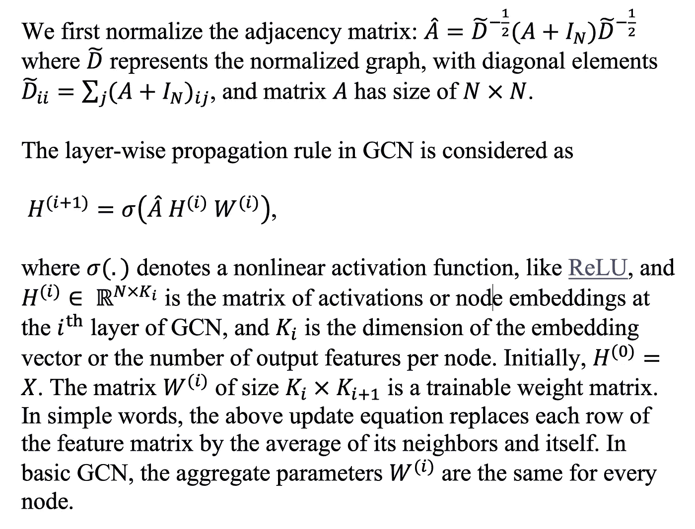
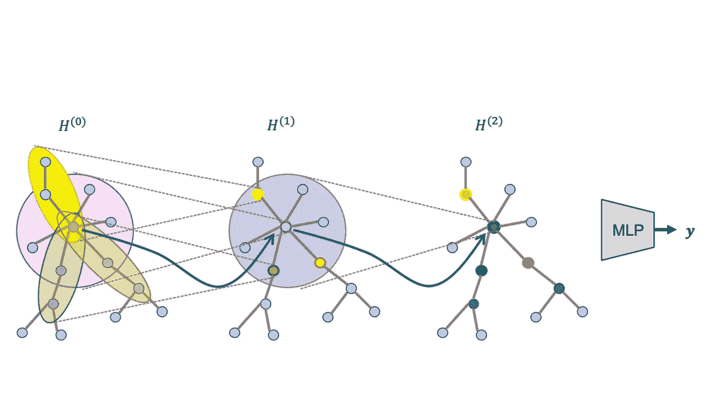
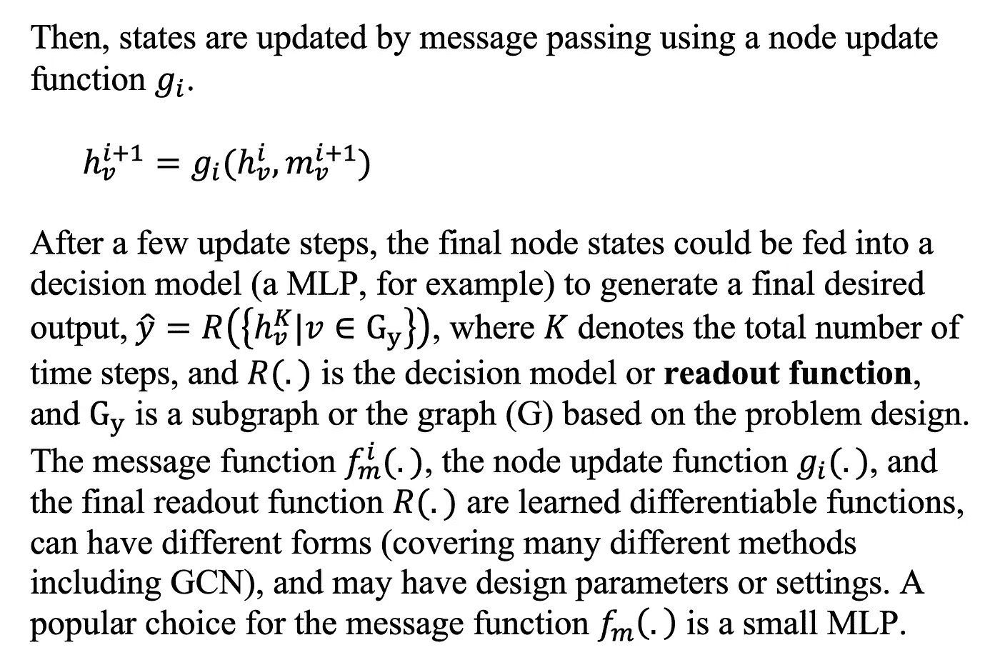

# 用于电子商务异常检测的图神经网络综述

> 原文：<https://medium.com/walmartglobaltech/an-overview-of-graph-neural-networks-for-anomaly-detection-in-e-commerce-b4c165b8f08a?source=collection_archive---------1----------------------->

## 第二部分。流行的 GNN 方法综述

在这篇博文 的第一部分 [**中，我们介绍了术语，并谈到了在电子商务中使用网络和图形信息进行更有效的异常检测的好处。**图形神经网络(GNN)** 方法采用了图形分析和深度学习技术的结合(在几个现实世界的应用中显示出非常有益)。在本文中，我们首先回顾一个简单的 GNN 方法，然后介绍几个更复杂的方法。最后，我们来看一下将 GNN 应用于动态环境以及将其扩展到大型图表时所面临的挑战。**](/walmartglobaltech/an-overview-of-graph-neural-networks-for-anomaly-detection-in-e-commerce-87516931d38)

# **图卷积网络(GCN)**

GCN 是卷积神经网络(CNN)的扩展(这是深度学习中流行的方法之一，已被证明在解决图像、视频和语音/语音处理应用中的复杂问题方面非常成功)。注意，在 CNN 中，我们通常对具有固定大小的输入数据进行操作(如 0.5 秒长度的语音序列，或 512×512 的图像)，并且具有规则的采样，如 1D 或 2D 网格，其中存在空间局部性和排序。然而，图或网络数据具有更复杂的结构，任意的节点邻域大小，并且没有固定的节点排序。GCN(参见 [Defferrard 等人，2016](https://arxiv.org/abs/1606.09375) 和 [Kipf 等人，2017](https://arxiv.org/abs/1609.02907) )是为 GNN 分析开发的首批方法之一。

传统的 gcn 通过将图的图结构或节点邻域/邻接信息转换成(稀疏和二进制)矩阵(称为[邻接矩阵](https://en.wikipedia.org/wiki/Adjacency_matrix)、 *A* )来操作，然后使用 *A* 作为收集或聚集操作来选择和平均一跳邻域。让我们假设图的每个节点由长度为 *M* 的数字特征向量来描述，并且所有节点特征向量(可以包括描述每个节点的各种属性)由矩阵 *X* 来概括和显示，矩阵的大小为 *N* × *M* ，其中 *N* 是图中节点的数量。

GCN 的主要局限性在于，该图被假设为同质的，这意味着图中的边类型被假设为相同的，而电子商务网络并非如此。

Figure 1\. A graph convolutional network. For simplicity, the only operation shown here beyond linear graph updates at each layer is the [ReLU](https://en.wikipedia.org/wiki/Activation_function) activation function, but between two layers we could have batch-normalization, dropout, activation, and aggregation blocks.

请注意，重复前面提到的几个步骤会导致网络信息在图节点间传播，最终会改变节点特征。一旦获得最终的网络嵌入(这意味着在 *i* 步骤或使用 *i* GCN 层之后，一旦节点嵌入 *H(i)* 被计算出来)，就可以用 ML 中的传统异常检测技术来检测节点或边缘中的异常(图 1 和 2)。我们可以在学习过的图形特征 *H(i)* 上应用一个全连接(FC)或[多层感知器](https://en.wikipedia.org/wiki/Multilayer_perceptron) (MLP)层，以生成最终决策。确定期望的邻域水平的步数 *i* 是选择的设计参数。

Figure 2\. As more steps or more GCN layers are employed for calculating an updated embedding of each node, we use information from a larger neighborhood size, touching more nodes in the graph.

GCN 有几个版本，包括简单图形卷积( [SGC](https://arxiv.org/abs/1902.07153) )、关系 GCN ( [R-GCN](https://arxiv.org/abs/1703.06103) )和图形注意力网络( [GAT](https://arxiv.org/abs/1710.10903) )。R-GCN 方法允许具有不同的节点关系，即，边可以具有不同的类型。

# **MixHop:聚合时应用多尺度邻域过滤器**

作为对 GCN 的扩展，在 Abu-El-Haija 等人(2019) 的 MixHop 方法中，通过在多个尺度上重复混合邻居的特征表示，将多尺度邻域合并到 GCN 滤波器中。对于 MixHop 中的每一层，我们使用 0，1，2，…， *N* 跳邻域，并允许该层学习同时聚合所有这些跳(参见图 3 和图 4)。

Figure 3\. Network feature propagation in a traditional graph convolution (shown on left) versus [MixHop](https://arxiv.org/abs/1905.00067) (shown on the right side). The **|** operator inside the parenthesis denotes column-wise concatenation.

Figure 4\. Vanilla or basic GCN layer is shown in (a) in which the adjacency matrix *A* is used. In a [MixHop](https://arxiv.org/abs/1905.00067) layer, shown in (b), powers of *A* are used. Orange denotes an input activation or embedding matrix, with one row per node; green denotes the trainable parameters; and red denotes the layer output.

# **消息传递神经网络(MPNN)**

MPNN ( [吉尔默等人，2017](https://arxiv.org/abs/1704.01212) )是对 GCN 的概括。它可以合并异构图，允许使用节点特征以及边特征，并且它提供了对何时以及如何传递消息的控制。

考虑到**消息传递**的概念，这是现在图分析中最流行的方法，我们认为 GNN 通过在图的节点之间传递消息来捕捉节点依赖性和图交互。

在 MPNN 中，每个节点都有一个嵌入或状态(或隐藏状态，用 *h* 表示)。从初始嵌入开始，为图中的每对边生成消息:

参见图 5。这里我们使用求和运算符作为聚合函数，但是也有其他选项。

注意读出功能 *R(。)*正如我们在这里所写的对节点顺序的排列必须是不变的。

Figure 5\. Information or message from neighboring nodes are passed to each node.

许多方法可以描述为 MPNN 模型的实现，例如，李等(2016) 的流行的门控图神经网络(GGNN)模型，该模型使用一个“**门控递归单元**”(GRU)作为更新函数。

# **大型图上的节点采样**

为了执行图嵌入或学习图表示，似乎有必要使用输入图的所有节点和边，然而，由于计算成本，这并不总是可行的选择。将图嵌入缩放到大型图的可行解决方案是通过执行“邻域采样”或“**邻域采样**”。基本思想是，对于每个节点，不是使用整个邻域信息(即，所有连接的 k 跳邻居)，而是选择或采样它们的子集来执行图嵌入中所需的聚合。例如， [Perozzi 等人(2014)](https://arxiv.org/abs/1403.6652) 的 DeepWalk 方法使用截断的**随机行走**，然后用神经网络对其进行编码，以获得节点嵌入。行走长度以及随机行走的次数是固定的和有限的，基本上探索每个节点周围的局部图形信息。在沿着遍历的每个节点处，该方法从邻居均匀地(即，以相等的概率)挑选下一步。建议进一步阅读由 [Hamilton 等人(2017)](https://arxiv.org/abs/1706.02216) 提出的 GraphSAGE 方法和由 [Mirrokni 等人(2020)](https://nips.cc/Conferences/2020/ScheduleMultitrack?event=20237) 提出的标题为“利用规模图进行挖掘和学习”的演示文稿(见图 6)。

Figure 6\. An illustration of [GraphSAGE](https://arxiv.org/abs/1706.02216) ‘sample’ and ‘aggregate’ method for learning the graph embedding vectors on large graphs.

另一种方法称为 LINE(由 [Tang 等人，2015](https://arxiv.org/abs/1503.03578) )，它不仅保留了一阶(观察到的纽带强度)关系，还保留了二阶关系(顶点的共享邻域结构)。 **Node2Vec** 方法(作者 [Grover 和 Leskovec，2016](https://arxiv.org/abs/1607.00653) )对顶点使用了两种不同的采样策略(广度优先采样和深度优先采样)。对于非常大的网络，也可以使用类似 Grale 的方法(由 [Halcrow 等人，2020](https://arxiv.org/abs/2007.12002) )来构建该图。

# **PPRGo(个性化页面排名):使用离线聚合计算加速大型图表**

随着图的大小增加，使用整个图的邻接矩阵容易遇到内存问题。有一些方法可以放大到现实生活中的图(可能是十亿个节点的数量级)，例如，通过查看近似邻域，以及通过对子图(即从主图中采样的图块)进行计算。

[**PageRank**](https://en.wikipedia.org/wiki/PageRank) 是一种利用网页的链接结构对网页的重要性进行评级的方法。它是基于网页在网络图结构中的位置的网页的全局排名。它的更新方法，称为个性化页面排序(或 PPR)，见 [Andersen 等人，(2016)](http://www.math.ucsd.edu/~fan/wp/localpartition.pdf) ，被证明是显式消息传递的一个很好的替代方案，它可以用于合并节点的多跳邻居信息。基于 PPR 的信息传播对应于许多邻居聚集层，其中每一层的节点影响指数衰减。但是，由于它执行的是高开销的幂迭代，因此不容易扩展到大型图形。

为了解决运行时计算量大的聚合问题，PPRGo 方法(由 [Bojchevski 等人，2020](https://arxiv.org/abs/2007.01570) )预先计算聚合(PPR 向量)，从而节省运行时的计算量(参见 [Mirrokni 等人(2020)](https://nips.cc/Conferences/2020/ScheduleMultitrack?event=20237) )。步骤是:

*   首先，我们离线计算大规模的 PPR 向量。
*   然后，我们训练一个简单的 MLP 模型，该模型吸收节点特征并输出逻辑。
*   我们使用 PPR 向量中前 *K* 个节点的“注意力”权重来聚集这些逻辑，并使用该聚集来计算损失。
*   在推理中，我们使用约 2-3 次迭代的“**幂迭代**来计算近似的 PPR 向量。
*   将近似的 PPR 与节点特征一起输入到模型中，以产生最终预测。

PPRGo 仅使用 1 跳的计算来聚集在 *N* 跳邻域中最重要的节点。

# **动态图形表示/嵌入**

在电子商务问题中，图的结构和属性会随着时间而变化。在事件如何随时间演变方面有一些有用的信息。如果我们忽略这样的时间信息，并且当我们想要在某个时间点进行学习/推断时，只查看图形的静态快照，我们可能会失去效率并表现出较差的性能，更不用说每次都重复整个计算了。

一般而言，动态模型可以通过顺序预测事件来帮助在任何时间点进行预测(如对节点的当前标签进行分类)，并且它们支持节点特征变化以及添加或删除节点或边。

关于动态图上的学习和推理方法，请参见[罗西等人(2020)](https://arxiv.org/abs/2006.10637) 的“动态图上深度学习的时态图网络(TGN)”,以及[卡泽米等人(2020)](https://jmlr.org/papers/v21/19-447.html) 的调查，其中他们从**编码器-解码器**的角度描述了各种方法。例如，编码器模型生成时间节点嵌入，解码器是任务相关模型，并且可以是例如使用相邻节点的时间嵌入作为输入来执行节点分类的 NN 模型。

还有其他几种方法可用于嵌入和使用动态图，包括[雷等人(2020)](https://arxiv.org/abs/2005.07427) 、 [Goyal 等人(2019)](https://arxiv.org/abs/1809.02657) 提出了 Dyngraph2vec 嵌入方法，该方法使用递归神经网络(RNN)来捕获时间信息，并使用自动编码器模型来学习嵌入，以及[于等人(2018)](https://www.kdd.org/kdd2018/accepted-papers/view/netwalk-a-flexible-deep-embedding-approach-for-anomaly-detection-in-dynamic) 提出了网络漫步嵌入方法。

# **欺诈和滥用检测相关文献**

对于欺诈或滥用检测，有几个相关的基于图的工作。[李等(2020)](https://www.semanticscholar.org/paper/Classifying-and-Understanding-Financial-Data-Using-Li-Sa%C3%BAde/021d0dd7db471d454eda4031c15abec49eaa3f3f) 发表了《利用对财务数据进行理解和分类》一文。[徐等(2021)](https://ojs.aaai.org/index.php/AAAI/article/view/16582) 的工作是关于利用进行消费贷款欺诈检测。 [Rao 等人(2020)](https://arxiv.org/abs/2011.12193) 提出了一种由欺诈检测器部分和解释器部分组成的方法，用于从异构图形数据以及检测器参数中生成图形可视化(以显示欺诈与合法交易)。[王等(2021)](https://snap.stanford.edu/bidyn/bidyn.pdf) 提出了大规模图的图和时间信息联合建模。使用 RNN 模型对每个节点的时间信息和顺序事件进行编码。然后，来自 RNN 的每节点输出通过使用 GNN 的图来传播，该采用图中的网络信息来最终做出滥用检测决定，或者为未标记的用户执行标记预测。

# **结论**

在这篇博文的第 1 和第 2 部分中，我们简要回顾了电子商务交易中涉及的实体之间的网络信息的价值，并解释了如何将它们建模为图形。接下来，我们介绍了几种流行的 GNN 和图嵌入方法。这些方法是用于从连接的数据中有效提取网络信息的新兴技术。然而，在实践中部署这样的方法存在几个挑战，包括如何在给定其动态结构和事件的基于时间的性质的情况下适当地设计和表示电子商务图，如何有效地对新节点或看不见的数据执行推断，以及如何利用这些方法将学习以及推断过程扩展到大规模的图。这些挑战需要进一步的研究和开发工作，这超出了本文的范围。

*我要感谢 Henry Chen、Priya Venkat 和 James Tang(沃尔玛的)阅读了草稿，并提供了他们深思熟虑的意见，这有助于改进本文。*