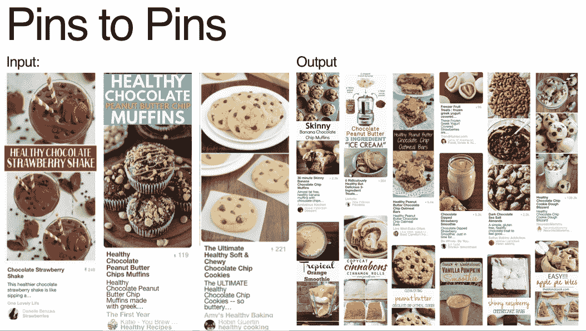
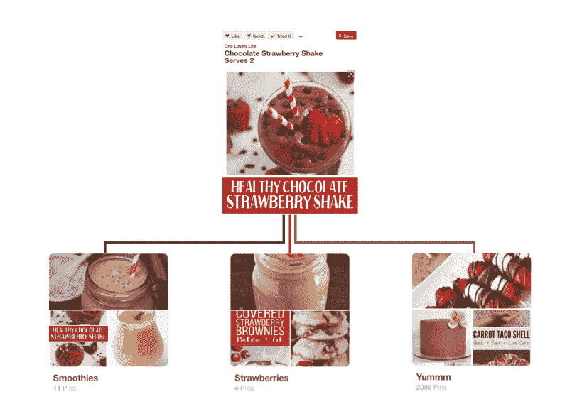
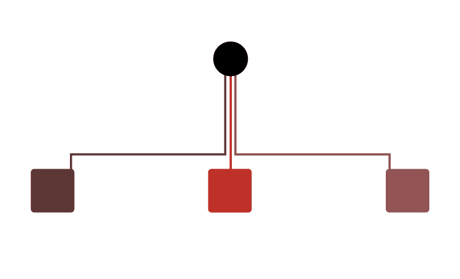
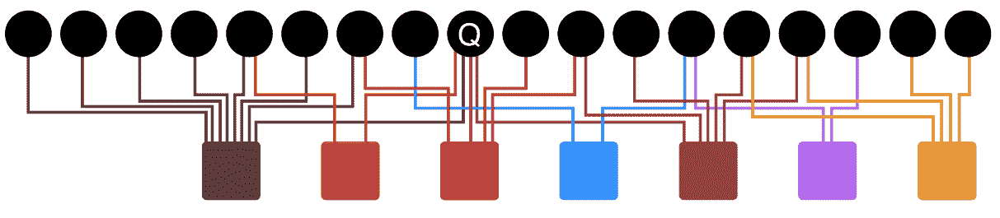
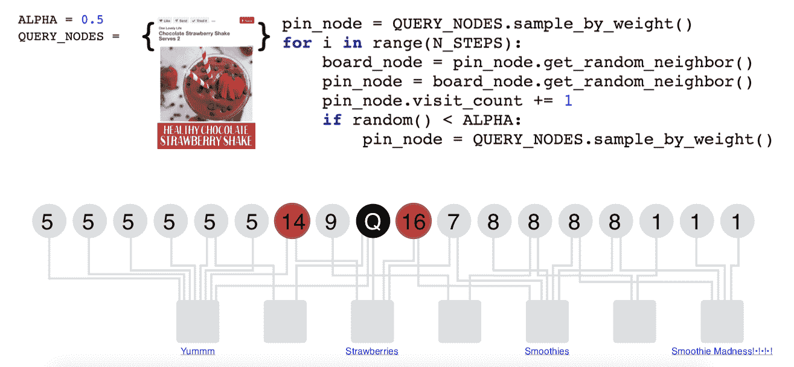
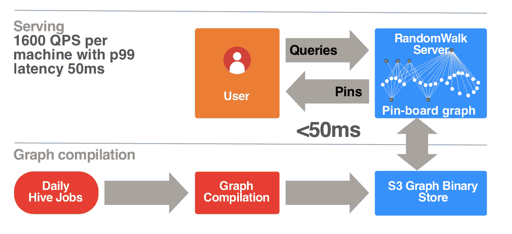

# Pinterest 推荐系统 Pixie 的更新

> 原文：<https://medium.com/pinterest-engineering/an-update-on-pixie-pinterests-recommendation-system-6f273f737e1b?source=collection_archive---------1----------------------->

Pong Eksombatchai |应用科学软件工程师

最近，我们欢迎工程师到我们的办公室参加我们的年度 Mad 科学博览会，在那里，我分享了 Pixie 的最新情况，这是一个基于图形的高级推荐系统。这是那次演讲的摘要，你可以在这里找到视频。

随着 Pinterest 发展到超过 2.5 亿人，我们不断扩大保存的 pin 数量，并将它们与兴趣重叠的人进行匹配，每天提供超过 100 亿条推荐。

为了尽可能提高这个过程的效率，我们构建了 Pixie。Pixie 是一个灵活的、基于图形的系统，用于实时提供个性化的推荐(当我们去年推出它的时候，你可能已经[听说过它](/@Pinterest_Engineering/introducing-pixie-an-advanced-graph-based-recommendation-system-e7b4229b664b))。当我们设计 Pixie 时，我们的目标是创建一个系统，当 Pinners 滚动浏览 home feed 时，该系统可以以 SOS 响应速度提供相关和狭窄的建议(这只是我们可以应用 Pixie 的许多产品表面中的一个)。

现在，我们将分享我们如何扩展 Pixie 来支持不断增长的用户数量。自从我们在网上部署了 Pixie，我们已经看到了概率上的巨大进步。在前 Pixie 时代，我们需要回收流行内容给 Pinners，因为他们可能也会喜欢。然而，一旦我们部署了我们发现的 Pixie，我们就更有效率，能够推荐更相关的内容，参与度提高了 37 倍。以前我们提供的球瓶平均救球次数为 90，000 次，现在我们提供的球瓶平均救球次数为 1，000 次。尽管推荐了所有内容，包括不太受欢迎的内容，我们还是看到了更高的参与度。

# 提供个性化服务

作为 Pinterest 的主要推荐系统，Pixie 应用于我们所有的产品表面。为了让你了解 Pixie 的推荐系统有多好，想象一下你把一瓶美味的“健康巧克力草莓奶昔”保存到你的一个板上。

利用视觉信号，Pixie 随后推荐了十种其他的奶昔或奶昔，都是基于“健康的巧克力草莓奶昔”，但它可能还不知道你想要什么样的奶昔。随着查询变得更加复杂，Pixie 将知道您还保存了以“健康巧克力松饼”和“终极健康巧克力曲奇”为特色的 pin。Pixie 然后将内容缩小到与巧克力、饼干、甜点奶昔相关的 pin，所有内容都专注于健康成分。

现在，当你回到你的主页时，你会看到你正在寻找的大头针，你可以把它们保存到你的“健康奶昔”板上。这是人们来到 Pinterest 的主要原因之一——获得他们喜欢但可能甚至不知道存在的东西的推荐。

# 让我们随便走走

如今，Pixie 为 Pinterest 上超过 60%的参与度提供了动力。这意味着+2 . 5 亿用户相信我们的推荐系统会成功。我们怎么做呢？

我们从 Pinterest 对象图(引脚和电路板之间的图形)开始。该数据集是高度独特的，因为它是根据人们描述和组织引脚和电路板的方式创建的，并且它导致无数引脚被添加了数十万次。从这个数据集中，我们知道了两件有价值的事情:这些 pin 是如何根据人们保存时添加的上下文和 Pinner 的兴趣来组织的。接下来的挑战是在几毫秒内，从数十亿个 pin 码中为这些数亿用户中的每一个人提供个性化推荐。

为了解开这个难题，让我们回到同一个“健康巧克力草莓奶昔”Pin，想象它被保存到三个不同的板上——“思慕雪”、“草莓”和“Yummm”。

This framework maps directly to Pixie — the black circle is the Pin, and the red squares are the boards.

系统中有超过 1750 亿个引脚，我们正在处理一个巨大的二分图。

我们的推荐问题的最大挑战之一是找出如何在最好的时间为最好的人缩小最好的 Pin。这就是基于图的推荐系统的用武之地:我们知道 Pinner 已经感兴趣的一组节点，所以我们从那里开始图遍历。

“Q” here is a single node, but this can be generalized to a set of query nodes as well.

Pixie 然后通过应用 100，000 步的随机行走算法找到与用户最相关的图钉。在每一步，它选择一个随机邻居并访问该节点，随着它访问更多随机邻居，节点访问计数递增。我们也有一个概率α，设置为 0.5，从节点 Q 重新开始，这样我们的行走就不会偏离太远。我们继续对相邻的板和节点随机采样 100，000 步。

被访问 14 次和 16 次的节点是与查询节点最相关的节点。

一旦随机行走完成，我们知道最频繁访问的节点是与查询节点最密切相关的节点。随着数据的增长，Pixie 不断实时重复这一过程，因此我们的用户总是能够不断缩小搜索范围，找到他们正在寻找的确切想法来实现他们的目标。

我们的“健康巧克力草莓奶昔”示例来自引脚到引脚的推荐，但是 Pixie 还支持其他两个主要集群(引脚到电路板和引脚到广告)。此外，Pixie 不只是一个起点，它还具有多个起点节点，我们可以根据用户对图钉的不同操作分配不同的权重，无论是放大、保存图钉还是其他操作。查询 pin 的程度也很重要。例如，对于具有一万度的查询引脚和具有五度的查询引脚之间的差异，我们将向具有一万度的引脚分配更多的随机行走步骤。

# 优化 Pixie

自从我们创建 Pixie 以来，我们已经开发了许多优化来满足我们的需求，例如提前停止。在理想情况下，我们只想检索前 1000 个被访问最多的节点，所以我们不需要每次都走完整的 100，000 步。为了实现这一点，我们一直走，直到排名 1000 的候选人得到至少 20 次访问。通过这种优化，我们能够获得 2 倍的性能提升。

我们创建的另一个优化是图形修剪。完整的 Pinterest 图有超过 1000 亿条边，这比我们实际使用的要多得多，但我们可以删除一些边，让 Pixie 满足我们的需要。为了修剪图形，我们通过实现一个函数来缩小流行引脚的影响，该函数为引脚可能拥有的邻居数量提供上限。我们也可以通过领先于那些可能会意外地将某些东西保存到错误的板上的用户来进行修剪(这在我们当中最容易发生)。如果我们能识别出这些边缘，我们就能移除它们。最后但同样重要的是，另一个优化是移除不同的电路板(那些带有来自多个不同想法的引脚的电路板)。

# 回望《建筑精灵》

现在你知道 Pixie 背后的理论了，让我们深入了解一下我们是如何构建它的。

最终目标是在内存中容纳整个 Pinterest 图。显然，我们无法在 RAM 中容纳整个 1000 亿条边，但是一旦我们精简到 200 亿条边，我们最终得到的是一个 150GB 的图。这仍然很大，但绝对是可控的。

我们使用 Hive 作业在一个简化的图形编译过程中提取数据，然后我们的图形编译机器获取原始数据并将其解析为一种更紧凑的服务格式。一旦数据在机器上，我们可以服务于随机漫步请求。

# 为什么 Pixie 很酷？

我们喜欢 Pixie，因为它易于使用，看起来很好，最重要的是能够实时实现彻底的个性化。每个来到 Pinterest 的人都指望个性化帮助他们更接近发现一个伟大的新想法。Pixie 对不同类型任务的简单概括使这成为可能，无论是创建多种类型的图表，推荐不同的对象，还是调整图表以捕捉绝对正确的内容。现在，随着 Pixie 和最近的优化，Pinterest 被简化为实时服务于 Pinners 相关的想法。

有兴趣加入 Pinterest 团队吗？点击此处查看我们的开放职位[!](https://careers.pinterest.com/careers/engineering)