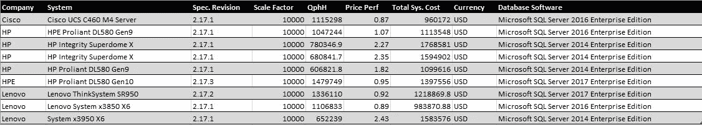
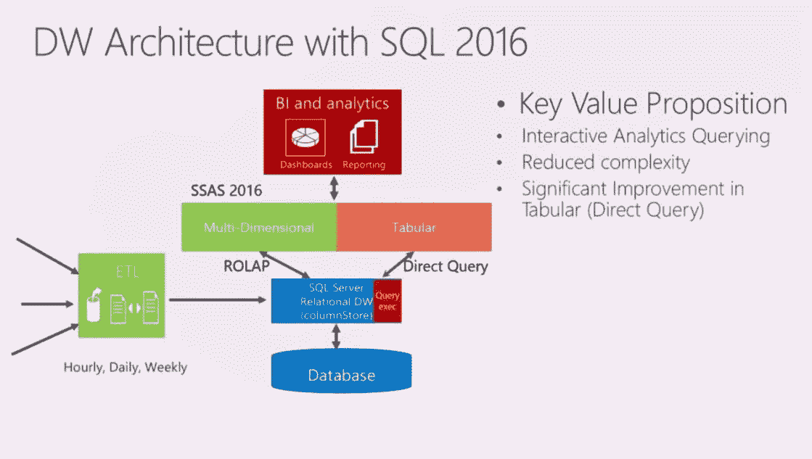

# Microsoft SQL Server 2016 的列存储索引分析(第 1 部分)

> 原文：<https://medium.com/quick-code/analysis-of-the-column-store-index-for-microsoft-sql-server-2016-part-1-556f0b4c8276?source=collection_archive---------4----------------------->

微软的专家提倡对数据仓库中的分析工作负载使用列存储索引。其中一个原因是聚集列存储索引大大压缩了行存储表，从而提高了空间节省和查询性能。

此外，提倡对 OLAP 工作负载使用列存储的原因是，由于与 OLTP 表相比，OLAP 表往往有更多的行，因此在分析工作负载上可以实现大约 3 倍的压缩，从而显著提高 I/O 和存储。此外，可以看到，当在 OLAP 工作负载上对具有大量列的事实表运行查询时，通常只选择列的子集。如果在选择数据时使用行存储，即使在选择查询中使用了列的子集，也必须扫描整行数据。但是，在列存储中，选择列的子集可以确保只选择相关的列，从而进一步减少 I/O 并提高查询性能。

微软声称他们的列存储引擎是业界领先的标准，因为它采用了压缩、选择列子集和批处理模式的方法。

TPC-H Benchmark for 10,000 GB Scale Factor as of 1st February 2018 — Courtesy of www.tpc.org

SQL Server 2016 中数据仓库(DW)体系结构的不同之处在于，在使用直接查询模式的 SQL Server Analysis Services (SSAS)时，可以访问列存储关系型 DW，从而允许在数据更新后立即访问数据。但是，应该注意的是，由于多维查询是在预聚集的多维数据集上进行的，虽然它们可以提供更快的查询性能，但表格模型提供更多最新数据的可能性很高。因此，应该注意的是，在决定使用多维数据集还是表格模式时，应该在速度和可用的最新数据版本之间取得平衡。

DW Architecture with SQL 2016 — Courtesy of “Review ColumnStore Index in SQL Server 2016 and Azure SQL Database” by Sunil Agarwal

以上是关于 Microsoft SQL Server 2016 中与列存储索引相关的高级功能的基本介绍。我计划在剩下的部分写更多关于详细工作的内容！敬请期待！

**请点击👏按钮下面几下，以示支持！⬇⬇谢谢！不要忘记遵循下面的快速代码。**

> 找到关于各种编程语言的[快速代码](http://www.quickcode.co/)的免费课程。获取 [Messenger](https://www.messenger.com/t/1493528657352302) 的新更新。