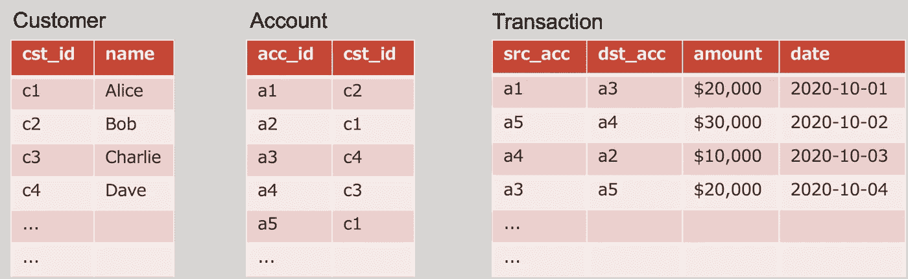
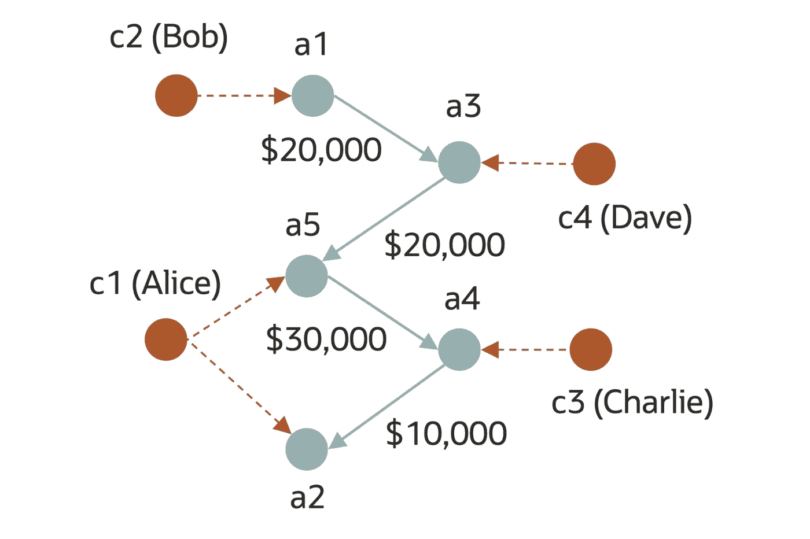
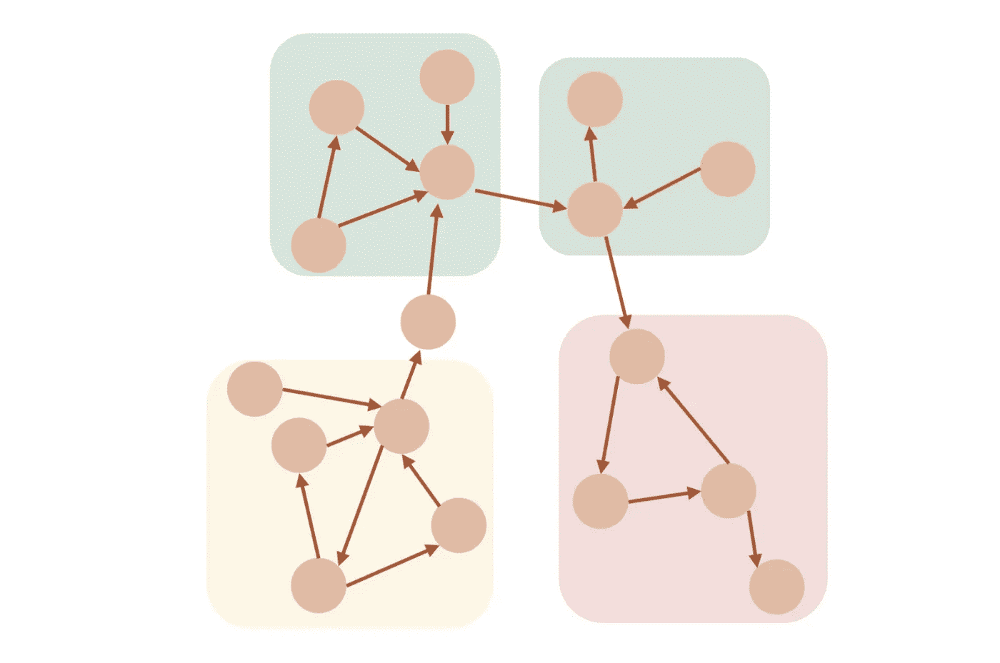

# 使用图表分析银行交易数据(第 1/3 部分)

> 原文：<https://medium.com/oracledevs/analyze-bank-transaction-data-using-graph-part-1-3-2088c6024f81?source=collection_archive---------1----------------------->


Photo by [Eduardo Soares](https://unsplash.com/@eduschadesoares?utm_source=unsplash&utm_medium=referral&utm_content=creditCopyText) on [Unsplash](https://unsplash.com/s/photos/atm?utm_source=unsplash&utm_medium=referral&utm_content=creditCopyText) (edited)

在本文中，作为使用 Oracle Graph 的第一步，我们将了解如何以图表的形式管理银行交易数据，以及可以进行何种分析。金融机构中的欺诈检测是图形数据库的主要用例之一。图形也有望用于反洗钱，因此这种用例应该继续扩展。

首先，我将讨论为什么把诸如银行转帐这样的交易看作图表是有帮助的。例如，假设我们有一个由客户表、帐户表和交易表组成的银行交易数据集。我们想回答以下(可能很常见)两个问题:

*   鲍勃和查理之间有资金往来吗？即使没有直接交易，你也可以说有通过其他账户的间接资金流动。
*   是否存在事务集群？也就是说，是否存在一些账户之间频繁交易而这些账户与其他账户之间不太频繁交易的模式？



假设我们使用 RDBMS，回答第一个问题自然需要表到表的连接和自连接。找到关系的跳数越多，需要的连接就越多。第二个问题更难回答，可能需要过程代码(比如 Oracle 的 PL/SQL)来构建图结构和确定集群。

现在让我们考虑把它当作一个图的情况。

图有两种结构:节点和边。因此，如果我们希望将表中的信息表示为图形，我们可以将帐户建模为节点，将交易建模为边。这种表示很直观，如下图所示，我们可以简单地沿着从账户 a1 到 a3、a5、a4 的边，来回答第一个问题。理想情况下，这样的数据库系统应该提供一种有效的方法来找到 a1 和 a4 之间的路径。



为了回答第二个问题，我们需要实现或使用一个现有的**图算法**来基于事务的网络结构找到集群。许多这样的算法已经被提出并用于社会网络分析中的社区检测。



在本文的第 1 部分中，我们将在 Oracle Graph 的两层部署中尝试数据输入和输出。这种配置不需要中间层的图形服务器组件。我们将假设 Oracle 数据库中已经启用了 Oracle Graph，并且 PGQL 插件已经添加到 SQLcl client 中。如果你还没有一个环境，请参见[这篇文章](/oracledevs/build-oracle-graph-on-docker-part-1-2-5fcacaca430e)中的设置说明。我们会用 **PGQL** (属性图查询语言)编码，和 SQL 很像，直观易用。

用 SQL 登录数据库，切换到 PGQL 模式。

```
PGQL AUTO ON
```

创建一个新图表。

```
CREATE PROPERTY GRAPH graph1;
```

使用 INSERT VERTEX 语句添加两种类型的节点:customers 和 accounts。

```
INSERT INTO graph1 VERTEX v LABELS (customer) PROPERTIES (v.cst_id = 'c1', v.first_name = 'Alice');
INSERT INTO graph1 VERTEX v LABELS (customer) PROPERTIES (v.cst_id = 'c2', v.first_name = 'Bob');
INSERT INTO graph1 VERTEX v LABELS (customer) PROPERTIES (v.cst_id = 'c3', v.first_name = 'Charlie');
INSERT INTO graph1 VERTEX v LABELS (customer) PROPERTIES (v.cst_id = 'c4', v.first_name = 'Dave');

INSERT INTO graph1 VERTEX v LABELS (account) PROPERTIES (v.acc_id = 'a1');
INSERT INTO graph1 VERTEX v LABELS (account) PROPERTIES (v.acc_id = 'a2');
INSERT INTO graph1 VERTEX v LABELS (account) PROPERTIES (v.acc_id = 'a3');
INSERT INTO graph1 VERTEX v LABELS (account) PROPERTIES (v.acc_id = 'a4');
INSERT INTO graph1 VERTEX v LABELS (account) PROPERTIES (v.acc_id = 'a5');

COMMIT;
```

然后，我们使用 INSERT EDGE 语句添加两种类型的边:帐户所有权(OWNS)和帐户间转帐(TRANSFERRED_TO)。在此过程中，您可以看到我们正在寻找作为每条边的起点和终点的节点，然后在它们之间添加一条边。为了获得更好的性能，有一种在单个 INSERT 语句中添加节点和边的方法，但是这里我们将只为每个节点和边发出一个 INSERT 语句。

```
INSERT INTO graph1 EDGE e BETWEEN src AND dst LABELS (OWNS)
  FROM MATCH ((src), (dst)) ON graph1
  WHERE src.cst_id = 'c1' AND dst.acc_id = 'a2';
INSERT INTO graph1 EDGE e BETWEEN src AND dst LABELS (OWNS)
  FROM MATCH ((src), (dst)) ON graph1
  WHERE src.cst_id = 'c1' AND dst.acc_id = 'a5';
INSERT INTO graph1 EDGE e BETWEEN src AND dst LABELS (OWNS)
  FROM MATCH ((src), (dst)) ON graph1
  WHERE src.cst_id = 'c2' AND dst.acc_id = 'a1';
INSERT INTO graph1 EDGE e BETWEEN src AND dst LABELS (OWNS)
  FROM MATCH ((src), (dst)) ON graph1
  WHERE src.cst_id = 'c3' AND dst.acc_id = 'a4';
INSERT INTO graph1 EDGE e BETWEEN src AND dst LABELS (OWNS)
  FROM MATCH ((src), (dst)) ON graph1
  WHERE src.cst_id = 'c4' AND dst.acc_id = 'a3';

INSERT INTO graph1 EDGE e BETWEEN src AND dst
  LABELS (transferred_to) PROPERTIES (e.amount = '20000')
  FROM MATCH ((src), (dst)) ON graph1
  WHERE src.acc_id = 'a1' AND dst.acc_id = 'a3';
INSERT INTO graph1 EDGE e BETWEEN src AND dst
  LABELS (transferred_to) PROPERTIES (e.amount = '20000')
  FROM MATCH ((src), (dst)) ON graph1
  WHERE src.acc_id = 'a3' AND dst.acc_id = 'a5';
INSERT INTO graph1 EDGE e BETWEEN src AND dst
  LABELS (transferred_to) PROPERTIES (e.amount = '30000')
  FROM MATCH ((src), (dst)) ON graph1
  WHERE src.acc_id = 'a5' AND dst.acc_id = 'a4';
INSERT INTO graph1 EDGE e BETWEEN src AND dst
  LABELS (transferred_to) PROPERTIES (e.amount = '10000')
  FROM MATCH ((src), (dst)) ON graph1
  WHERE src.acc_id = 'a4' AND dst.acc_id = 'a2';

COMMIT;
```

现在，让我们在这个图上运行一个 PGQL SELECT 查询。首先，我们会找到鲍勃拥有的银行账户。

```
SELECT c.first_name, a.acc_id
FROM MATCH (c:customer)-[:owns]->(a:account) ON graph1
WHERE c.first_name = 'Bob';

FIRST_NAME    ACC_ID 
_____________ _________ 
Bob           a1
```

接下来，我们将从上面 Bob 的帐户中找到要将钱转移到的帐户。

```
SELECT c.first_name, a.acc_id AS a1, t.amount, a2.acc_id AS a2
FROM MATCH (c:customer)-[:owns]->(a:account)-[t:transferred_to]->(a2:account) ON graph1
WHERE c.first_name = 'Bob';

FIRST_NAME    A1    AMOUNT    A2 
_____________ _____ _________ _____ 
Bob           a1    20000     a3
```

类似地，我们可以扩展模式来获取帐户的所有者。

```
SELECT
  c.first_name AS c1
, a.acc_id AS a1
, t.amount
, a2.acc_id AS a2
, c2.first_name AS c2
FROM MATCH (c:customer)-[:owns]->(a:account)-[t:transferred_to]->(a2:account)<-[:owns]-(c2:customer) ON graph1
WHERE c.first_name = 'Bob';

C1    A1    AMOUNT    A2      C2 
______ _____ _________ _____ _______ 
Bob    a1    20000     a3    Dave
```

此外，使用一个[可达性测试](https://pgql-lang.org/spec/1.4/#reachability)查询语法，我们可以将货币转移路径的最小和最大长度指定为 1 跳和 3 跳。然后我们可以看到 Bob 的帐户通过 3 跳连接到 Charlie 的帐户。

```
SELECT c.first_name AS c1, a.acc_id AS a1, a2.acc_id AS a2, c2.first_name AS c2
FROM MATCH (c:customer)-[:owns]->(a:account)-/:transferred_to{1,3}/->(a2:account)<-[:owns]-(c2:customer) ON graph1
WHERE c.first_name = 'Bob';

C1    A1    A2         C2 
______ _____ _____ __________ 
Bob    a1    a5    Alice      
Bob    a1    a3    Dave       
Bob    a1    a4    Charlie
```

到目前为止，我希望您已经掌握了数据库如何通过 PGQL API 将事务性数据集“视为图形”的基本思想。

在这个阶段，你可能会有一些疑问。要使用这个新的 API，我们必须开始创建或重新创建图形形式的数据集吗？此外，一旦我们有了这样的图，我们如何实现基于图的操作，如搜索路径或检测社区？

我们将在[第二部分](https://ryotayamanaka.medium.com/analyze-bank-transaction-data-using-graph-part-2-3-155516bb6349)和[第三部分](https://ryotayamanaka.medium.com/analyze-bank-transaction-data-using-graph-part-3-3-ab8ae1f68bd2)中讨论这些问题。

请从以下网址了解有关 **Oracle Graph** 的更多信息:

*   [中](/tag/oracle-graph) (=所有带有 Oracle Graph 标签的文章)
*   [堆栈溢出](https://stackoverflow.com/questions/tagged/oracle-graph) (=带有 oracle-graph 标记的问题)
*   [Slack AnDOUC](https://join.slack.com/t/andouc/shared_invite/zt-1a2hmiz6f-vLlblcQyv0t9FMraMMP5uQ) (=邀请链接，请访问#graph)
*   [Slack OracleDevRel](https://join.slack.com/t/oracledevrel/shared_invite/zt-uffjmwh3-ksmv2ii9YxSkc6IpbokL1g) (=邀请链接，请访问#oracle-db-graph)