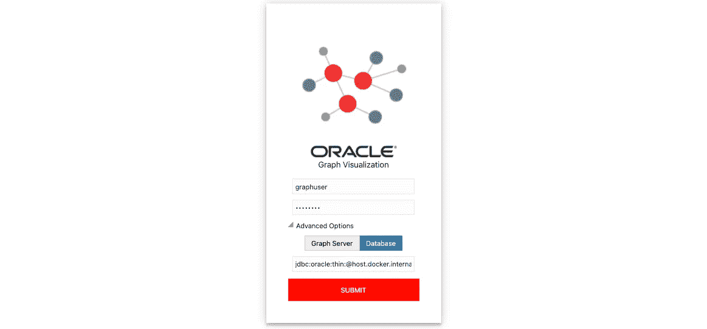
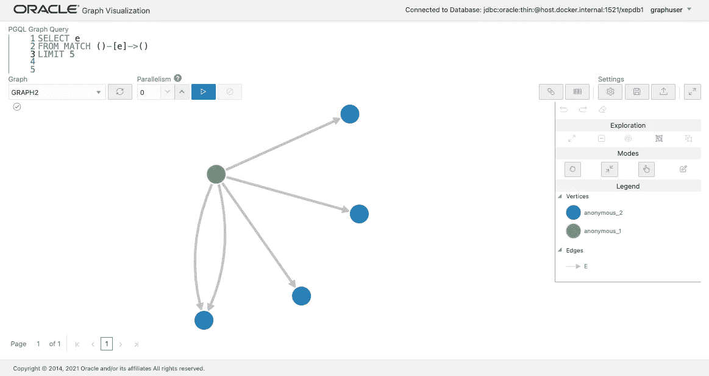
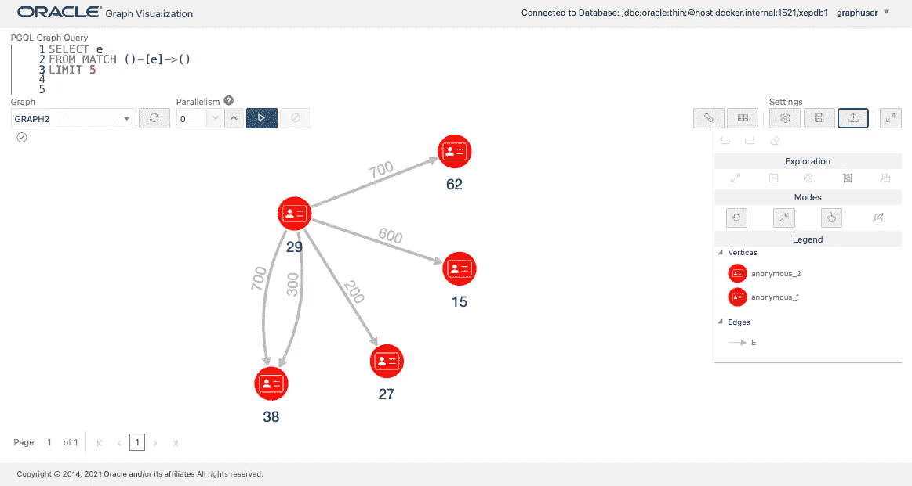
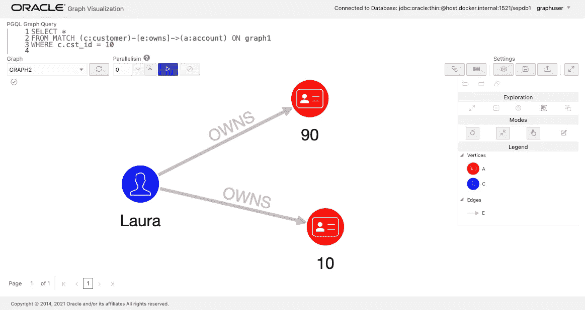
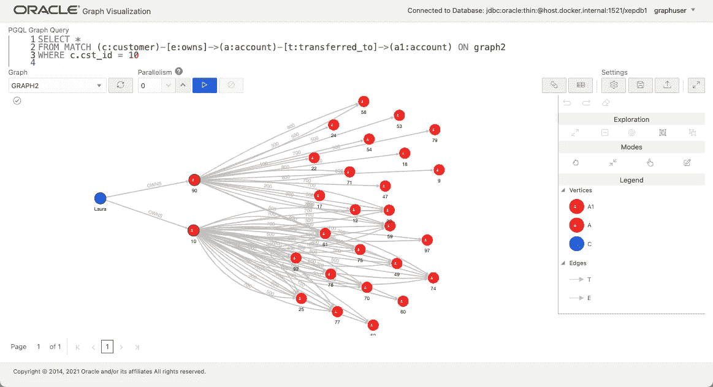
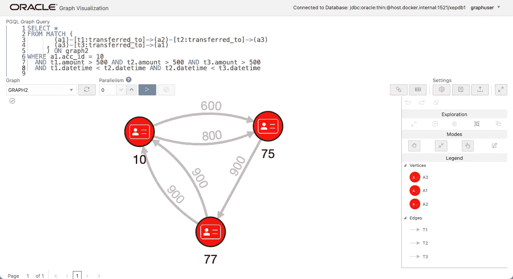
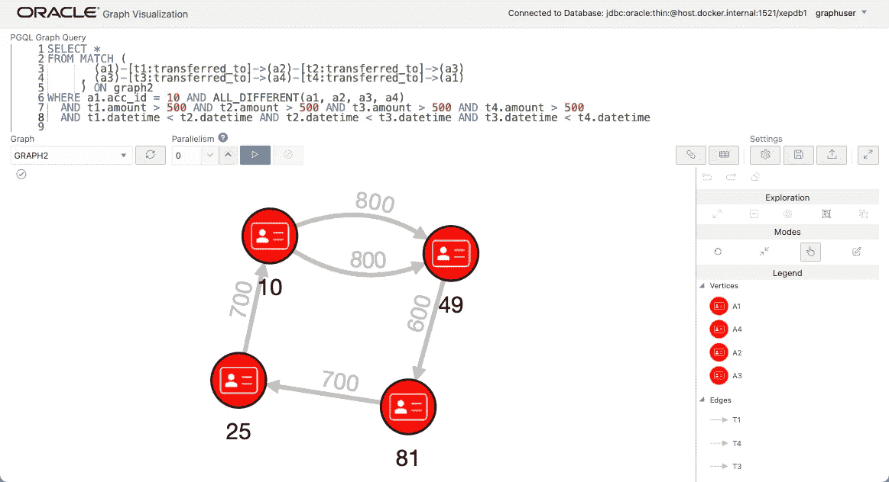
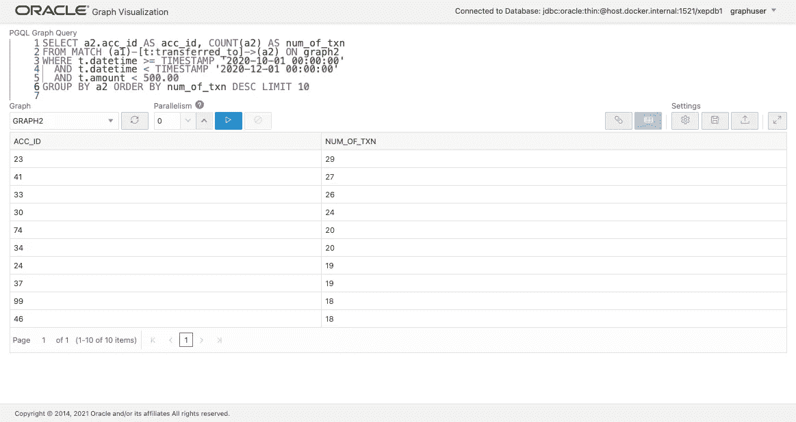
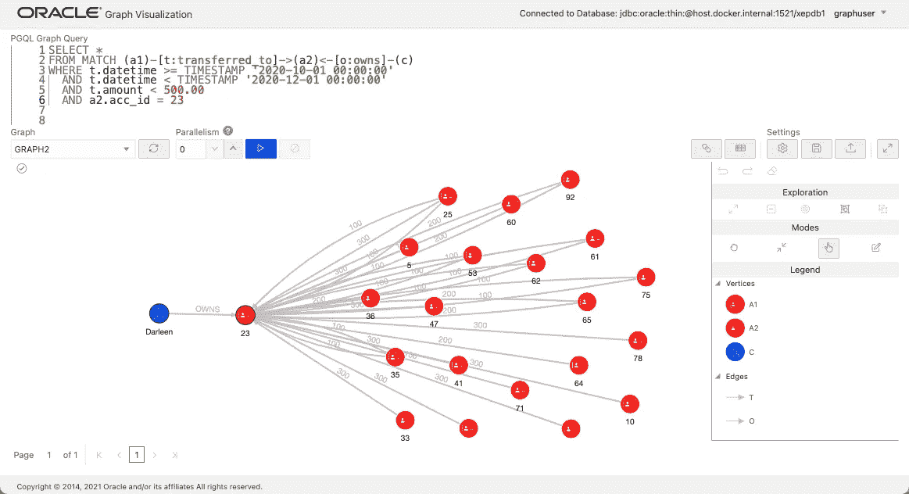

# 使用图表分析银行交易数据(第 2/3 部分)

> 原文：<https://medium.com/oracledevs/analyze-bank-transaction-data-using-graph-part-2-3-155516bb6349?source=collection_archive---------0----------------------->


Photo by [Eduardo Soares](https://unsplash.com/@eduschadesoares?utm_source=unsplash&utm_medium=referral&utm_content=creditCopyText) on [Unsplash](https://unsplash.com/s/photos/atm?utm_source=unsplash&utm_medium=referral&utm_content=creditCopyText) (edited)

在[第 1 部分](/oracledevs/analyze-bank-transaction-data-using-graph-part-1-3-2088c6024f81)中，我展示了如何使用图形数据库 API (PGQL 作为 SQL 的替代)将银行交易数据表示为图形，以及如何添加节点和边，并使用模式匹配对它们进行搜索。我们现在来看一种不同的方法:在现有的数据库表上创建一个图表作为视图。我们还将执行一些搜索并可视化结果。

**我们应该像图表一样管理数据吗？**

我们已经看到模式匹配语法可以简化查询，但是您可能还没有看到将数据作为节点和边添加到数据库中的好处。原因之一是，在这个用例中，节点和边的类型从一开始就是隐式确定的。我们不需要添加任何类型的节点和边的灵活性。

当我们讨论图数据库的应用时，这是一个常见的情况。有逻辑层的原因认为固定的数据库模式对于应用程序开发是可取的，也有物理层的原因认为表索引和扫描在聚合中更有效。

**创建一个图形作为视图(PG 视图)**

在这种情况下，利用图(主要用于搜索和分析)的最佳方式是将表和图一起使用，实际上，到目前为止，图数据库一直与 RDBMS 一起使用。因此，Oracle Graph 使用 [CREATE PROPERTY GRAPH](https://pgql-lang.org/spec/1.4/#creating-a-property-graph) 语句提供了从表到图的声明性映射，并且能够在表数据的基础上创建视图。有了这个想法，我们可以避免额外的 ETL 处理和数据复制。

所以我们来试试吧。首先，我们将创建标准表。

```
DROP TABLE bank_account;
DROP TABLE bank_customer;
DROP TABLE bank_transaction;

CREATE TABLE bank_account (
  acc_id NUMBER NOT NULL
, cst_id NUMBER NOT NULL
, CONSTRAINT account_pk PRIMARY KEY (acc_id)
);

CREATE TABLE bank_customer (
  cst_id NUMBER NOT NULL
, first_name VARCHAR2(255)
, last_name VARCHAR2(255)
, CONSTRAINT customer_pk PRIMARY KEY (cst_id)
);

CREATE TABLE bank_transaction (
  acc_id_src NUMBER
, acc_id_dst NUMBER
, txn_id NUMBER
, datetime TIMESTAMP
, amount NUMBER
, CONSTRAINT transaction_pk PRIMARY KEY (txn_id)
);
```

使用 INSERT 语句保存数据文件， [bank_account.sql](https://raw.githubusercontent.com/ryotayamanaka/oracle-graph/main/bank-transaction/data/scale-100/bank_account.sql) ， [bank_customer.sql](https://raw.githubusercontent.com/ryotayamanaka/oracle-graph/main/bank-transaction/data/scale-100/bank_customer.sql) ， [bank_transaction.sql](https://raw.githubusercontent.com/ryotayamanaka/oracle-graph/main/bank-transaction/data/scale-100/bank_transaction.sql) (右键单击并选择将链接另存为..)并将它们加载到数据库中。如果您希望加载 CSV 数据，请使用 [bank_account.csv](https://raw.githubusercontent.com/ryotayamanaka/oracle-graph/main/bank-transaction/data/scale-100/bank_account.csv) 、 [bank_customer.csv](https://raw.githubusercontent.com/ryotayamanaka/oracle-graph/main/bank-transaction/data/scale-100/bank_customer.csv) 、 [bank_transaction.csv](https://raw.githubusercontent.com/ryotayamanaka/oracle-graph/main/bank-transaction/data/scale-100/bank_transaction.csv) 。

```
SQL> @bank_account.sql
SQL> @bank_customer.sql
SQL> @bank_transaction.sql
```

用 SQL 登录数据库，切换到 PGQL 模式。

```
SQL> PGQL AUTO ON
```

现在是本文中最重要的一点:如何编写从表到图的映射。对于图，我们需要从表中识别和提取关于顶点、边和标签的信息。下面关于`VERTEX TABLES`和`EDGE TABLES`的段落分别指定哪些表格作为顶点和边的信息源，以及它们在新创建的图形中的标签。

这里，顶点描述很简单，因为它只是从客户表创建“客户”顶点，从帐户表创建“帐户”顶点。对于边，我们将事务表中保存的关系标记为“transferred _ to”。从 account 表中，我们提取并标记哪个客户“拥有”该帐户的关系。

```
CREATE PROPERTY GRAPH graph2
  VERTEX TABLES (
    bank_customer
      KEY (cst_id)
      LABEL customer
      PROPERTIES (cst_id, first_name, last_name)
  , bank_account
      KEY (acc_id)
      LABEL account
      PROPERTIES (acc_id)
  )
  EDGE TABLES (
    bank_transaction
      KEY (txn_id)
      SOURCE KEY(acc_id_src) REFERENCES bank_account
      DESTINATION KEY(acc_id_dst) REFERENCES bank_account
      LABEL transferred_to
      PROPERTIES (txn_id, datetime, amount)
  , bank_account
      KEY (acc_id)
      SOURCE KEY(cst_id) REFERENCES bank_customer
      DESTINATION KEY(acc_id) REFERENCES bank_account
      LABEL owns
  )
  OPTIONS (PG_VIEW)
;
```

最后，通过在末尾添加`OPTIONS (PG_VIEW)`,我们可以创建这个图作为视图。如果没有这个选项，将在一组表中创建一个新的图形，作为一个无模式的图形(在我们称为 PG 模式的结构中)，就像第 1 部分中创建的图形一样。但是，我建议使用视图，除非您需要以无模式的方式处理图表，因为它允许您在不复制数据的情况下维护图表。

让我们检查一下图形可视化工具是否可以访问这个图形。由于此视图对象存储在数据库中，因此从高级选项中选择数据库作为连接目的地。



让我们通过选择 GRAPH2 作为要查询的图来尝试一个 PGQL 查询。



保存 [settings.json](https://raw.githubusercontent.com/ryotayamanaka/oracle-graph/main/bank-transaction/settings.json) (右键选择链接另存为..)并从“加载设置”按钮上传，因此您可以按如下方式更改图标。



**使用 PGQL 进行搜索和可视化**

现在，让我们尝试一些 PGQL 查询来搜索和可视化结果。请注意，我们可以在使用图形可视化工具的查询中跳过`ON graph2`,因为已经指定了目标图形。

首先，我们将检查 cst_id = 10 的客户持有的账户。

```
SELECT *
FROM MATCH (c:customer)-[e:owns]->(a:account) ON graph2
WHERE c.cst_id = 10
```

我们可以看到，这位客户的名字是劳拉，她拥有两个帐户。



接下来，让我们展示 Laura 的所有转账。我们将在匹配模式中再增加一跳。由于模式中有两个账户，我们为它们分配不同的变量，比如`a`和`a1`。

```
SELECT *
FROM MATCH (c:customer)-[e:owns]->(a:account)-[t:transferred_to]->(a1:account) ON graph2
WHERE c.cst_id = 10
```

您可以看到 Laura 使用这两个帐户向一些帐户转账。



现在，只关注帐户之间的转帐，让我们寻找一种模式，从 acc_id = 10 的帐户开始，经过 3 次跳跃返回到同一个帐户。再者，我们可以加一个条件，这些转账在时间上是按这个顺序发生的，而且转账的金额必须始终在 500 以上。

```
SELECT *
FROM MATCH (
       (a1)-[t1:transferred_to]->(a2)-[t2:transferred_to]->(a3)
     , (a3)-[t3:transferred_to]->(a1)
     ) ON graph2
WHERE a1.acc_id = 10
  AND t1.amount > 500 AND t2.amount > 500 AND t3.amount > 500
  AND t1.datetime < t2.datetime AND t2.datetime < t3.datetime
```

在整个图形中，仅在包含 acc_id = 10、75 和 77 的帐户的路径中检测到这种模式。



同样，我们将尝试 4 跳。查询变得越来越长，但是它仍然比 SQL 中的要紧凑得多。

```
SELECT *
FROM MATCH (
       (a1)-[t1:transferred_to]->(a2)-[t2:transferred_to]->(a3)
     , (a3)-[t3:transferred_to]->(a4)-[t4:transferred_to]->(a1)
     ) ON graph2
WHERE a1.acc_id = 10 AND ALL_DIFFERENT(a1, a2, a3, a4)
  AND t1.amount > 500 AND t2.amount > 500
  AND t3.amount > 500 AND t4.amount > 500
  AND t1.datetime < t2.datetime AND t2.datetime < t3.datetime
  AND t3.datetime < t4.datetime
```

同样，在 4 跳的情况下，仅在一个组合中检测到该模式。



也可以使用 GROUP BY 进行聚合。例如，让我们寻找在 10 月 1 日到 12 月 1 日期间收到大量小额汇款(少于 500)的账户。

```
SELECT a2.acc_id AS acc_id, COUNT(a2) AS num_of_txn
FROM MATCH (a1)-[t:transferred_to]->(a2) ON graph2
WHERE t.datetime >= TIMESTAMP '2020-10-01 00:00:00'
  AND t.datetime < TIMESTAMP '2020-12-01 00:00:00'
  AND t.amount < 500.00
GROUP BY a2 ORDER BY num_of_txn DESC LIMIT 10
```

但是，聚合结果不能用图形表示，所以您必须在表格中显示它们。



acc_id = 23 的账号收到了 29 笔转账，我们来展示一下。

```
SELECT *
FROM MATCH (a1)-[t:transferred_to]->(a2)<-[o:owns]-(c) ON graph2
WHERE t.datetime >= TIMESTAMP '2020-10-01 00:00:00'
  AND t.datetime < TIMESTAMP '2020-12-01 00:00:00'
  AND t.amount < 500.00
  AND a2.acc_id = 23
```

你可以确认转账。



你怎么想呢?您可以看到，通过使用`CREATE PROPERTY GRAPH`语句创建一个视图，存储在表中的交易数据(如银行转帐)可以作为一个图形进行管理。使用这种方法，图定义使得表连接更加受限，因此我们可以保持 PGQL 查询的直观性和紧凑性。

另一方面，在 PG view 机制中，PGQL 被转换为 SQL 并被执行，因此我们不能期望使用 PGQL 会提高查询性能。在这种机制上运行图算法也是没有效率的。在[第 3 部分](https://ryotayamanaka.medium.com/analyze-bank-transaction-data-using-graph-part-3-3-ab8ae1f68bd2)中，我们将引入一个 3 层架构选项来克服这些挑战。

请从以下网址了解有关**甲骨文图**的更多信息:

*   [中](/tag/oracle-graph) (=所有带甲骨文图形标签的文章)
*   [堆栈溢出](https://stackoverflow.com/questions/tagged/oracle-graph) (=带有 oracle-graph 标记的问题)
*   [Slack AnDOUC](https://join.slack.com/t/andouc/shared_invite/zt-1a2hmiz6f-vLlblcQyv0t9FMraMMP5uQ) (=邀请链接，请访问#graph)
*   [Slack OracleDevRel](https://join.slack.com/t/oracledevrel/shared_invite/zt-uffjmwh3-ksmv2ii9YxSkc6IpbokL1g) (=邀请链接，请访问#oracle-db-graph)